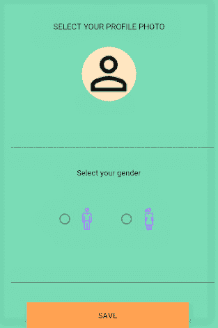

# 如何创建一个 Android 应用程序:改进设计

> 原文：<https://dev.to/edrome/how-to-create-an-android-app-improving-designs-epi>

### 我们还有一周时间，这是这个系列的最后一部分。

我们已经回顾了数据库连接、图像选择等重要主题。然而，仍然缺少一个重要的东西，缺少它会使我们的应用程序贬值，不管它有多么强大的功能。我说的是设计。

我要诚实地告诉你，我不是一个伟大的设计师。事实上，这最后一部分花了我很多时间来准备，当我在写这个系列的时候，我一直在练习和阅读网上的资源来写一篇好文章。

在这最后一篇文章中，我们将回顾一种材料成分，而不是全部，以及一种改进设计的工具。

首先，Android 允许我们使用组件调用材料。这种组件让我们在 UX 图案上有了新的体验，有了有趣的设计，如立面、阴影、动画和绘画。

考虑到前面提到的，让我们改变所有的文本视图和文本编辑，还有按钮。图像容器，据我所知是不支持材质的，我们就姑且当它是吧。

要修改文本编辑，我们将使用 TextInputLayout 和 TextInputEdit。布局被用作文本输入的容器，它可以包含一个提示和图像，以避免更多的组件。下面的代码显示了如何将 EditText 更改为新的组件。
注意带有“用户名”文本的提示标签，它就像一个装饰器，当你按下组件时，它会改变位置；和 boxStrokeColor 标签，允许我们改变笔画的颜色。

```
<com.google.android.material.textfield.TextInputLayout
    android:id="@+id/profile_username_edittext_layout"
    android:layout_width="match_parent"
    android:layout_height="50dp"
    android:layout_marginStart="20dp"
    android:layout_marginLeft="20dp"
    android:layout_marginTop="44dp"
    android:layout_marginEnd="8dp"
    android:layout_marginRight="8dp"
    android:ems="10"
    android:hint="Username"
    android:textColorHint="@android:color/black"
    app:layout_constraintEnd_toEndOf="parent"
    app:layout_constraintHorizontal_bias="1.0"
    app:layout_constraintStart_toEndOf="parent"
    app:layout_constraintTop_toBottomOf="@+id/profile_imageView">

    <com.google.android.material.textfield.TextInputEditText
        android:id="@+id/profile_username_edittext"
        android:layout_width="match_parent"
        android:layout_height="match_parent"
        android:inputType="textPersonName"
        android:maxLength="15"
        android:textColor="@android:color/black"
        android:singleLine="true" />

</com.google.android.material.textfield.TextInputLayout> 
```

因为组件的提示标签，我删除了多余的文本视图。

现在单选按钮将被更改为图像，一个可以找到免费 png 资源的伟大页面是 [icons8](https://icons8.com/) ，你可以在左侧或右侧添加 drawable，图标将会显示，如果你不喜欢 que 方向，也有可能将其添加到顶部或底部，隐藏圆形按钮。

```
<RadioGroup
    android:id="@+id/profile_gender_radiogroup"
    android:layout_width="wrap_content"
    android:layout_height="100dp"
    android:gravity="center"
    android:orientation="horizontal"
    app:layout_constraintBottom_toTopOf="@+id/profile_birthday_dateselect_layout"
    app:layout_constraintEnd_toEndOf="parent"
    app:layout_constraintHorizontal_bias="0.497"
    app:layout_constraintStart_toStartOf="parent"
    app:layout_constraintTop_toBottomOf="@+id/profile_gender_textview"
    app:layout_constraintVertical_bias="0.506">

    <androidx.appcompat.widget.AppCompatRadioButton
        android:id="@+id/profile_male_radiobutton"
        android:layout_width="wrap_content"
        android:layout_height="wrap_content"
        android:layout_gravity="center"
        android:layout_margin="16dp"
        android:drawableRight="@drawable/icons8_man_50" />

     <androidx.appcompat.widget.AppCompatRadioButton
        android:id="@+id/profile_female_raidobutton"
        android:layout_width="wrap_content"
        android:layout_height="wrap_content"
        android:layout_gravity="center"
        android:layout_margin="16dp"
        android:drawableRight="@drawable/icons8_woman_50" />
</RadioGroup> 
```

下一步是更改生日字段，就像我们对用户名字段所做的那样，本例中的变体是将输入类型更改为 none，以避免用户写入。一旦所有东西都被初始化，这最后一步就以编程方式执行。

```
<com.google.android.material.textfield.TextInputLayout
    android:id="@+id/profile_birthday_dateselect_layout"
    android:layout_width="match_parent"
    android:layout_height="50dp"
    android:layout_marginStart="20dp"
    android:layout_marginLeft="20dp"
    android:layout_marginTop="152dp"
    android:layout_marginEnd="8dp"
    android:layout_marginRight="8dp"
    android:ems="10"
    android:hint="Birthday"
    android:textColorHint="@android:color/black"
    app:layout_constraintEnd_toEndOf="parent"
    app:layout_constraintHorizontal_bias="0.0"
    app:layout_constraintStart_toStartOf="parent"
    app:layout_constraintTop_toBottomOf="@+id/profile_gender_textview">

    <com.google.android.material.textfield.TextInputEditText
        android:id="@+id/profile_birthday_dateselect"
        android:layout_width="match_parent"
        android:layout_height="match_parent"
        android:focusable="false"
        android:inputType="textPersonName"
        android:maxLength="15"
        android:singleLine="true" />

</com.google.android.material.textfield.TextInputLayout> 
```

```
birthday.setInputType(InputType.TYPE_NULL); 
```

然后，将所有内容放在屏幕中央，改变一种冷色调及其对比度，一个伟大的页面就是 [paletton](https://paletton.com/) 。我建议选择浅色，但不要太亮(想象一下你每次打开你的应用程序时都使用太阳镜，因为太亮了)。

将所有这些组合成一个样式到你的布局中，只需到`style.xml`文件并添加下面的

```
<style name="UsernameLabel" parent="Widget.MaterialComponents.TextInputLayout.OutlinedBox">
    <!-- Hint color and label color in FALSE state -->
    <item name="android:textColorHint">@color/ColorFalseState</item>
    <item name="android:textSize">20sp</item>
    <item name="hintTextAppearance">@color/boxStroke</item>
    <!-- Label color in TRUE state and bar color FALSE and TRUE State -->
    <item name="colorAccent">@color/boxStroke</item>
    <item name="colorControlNormal">@color/boxStroke</item>
    <item name="colorControlActivated">@color/boxStroke</item>
    <item name="boxStrokeColor">@color/boxStroke</item>
</style> 
```

不要忘记更改样式的名称，也就是`UsernameLabel`和颜色值，以适应你的应用程序。

要将该样式导入到组件中，只需添加一个样式标记，如下所示。

```
<com.google.android.material.textfield.TextInputLayout
    android:id="@+id/profile_birthday_dateselect_layout"
    style="@style/UsernameLabel"
    android:layout_width="match_parent"
    android:layout_height="50dp"
    android:layout_marginStart="20dp"
    android:layout_marginLeft="20dp"
    android:layout_marginTop="152dp"
    android:layout_marginEnd="8dp"
    android:layout_marginRight="8dp"
    android:ems="10"
    android:hint="Birthday"
    android:textColorHint="@android:color/black"
    app:layout_constraintEnd_toEndOf="parent"
    app:layout_constraintHorizontal_bias="0.0"
    app:layout_constraintStart_toStartOf="parent"
    app:layout_constraintTop_toBottomOf="@+id/profile_gender_textview">

    ...

</com.google.android.material.textfield.TextInputLayout> 
```

利用文本输入布局，让我们用错误消息来补充我们的功能。为此，在您的编辑文本上使用文本更改监听器；在更改后检查是否进行了更改，当文本字段更改为空时，设置一个错误；否则，将文本布局更改为原始状态。

```
username.addTextChangedListener(new TextWatcher() {
        @Override
        public void beforeTextChanged(CharSequence charSequence, int i, int i1, int i2) {

        }

        @Override
        public void onTextChanged(CharSequence charSequence, int i, int i1, int i2) {

        }

        @Override
        public void afterTextChanged(Editable editable) {
            if (editable.toString().isEmpty()) {
                username.setError(getResources().getString(R.string.username_error));
                username_layout.setBoxStrokeColor(Color.RED);
            } else if (!editable.toString().isEmpty()) {
                username_layout.setBoxStrokeColor(getResources().
                                                  getColor(R.color.boxStroke));
            }
        }
   }); 
```

对于每个想要显示错误的文本布局，都应该这样做。

最后，应用程序应该看起来像这样。

[](https://res.cloudinary.com/practicaldev/image/fetch/s--WYNGoDsD--/c_limit%2Cf_auto%2Cfl_progressive%2Cq_auto%2Cw_880/https://thepracticaldev.s3.amazonaws.com/i/xkrv4z6nobomekgq1zv4.png)

(少了橙色，我真的不知道为什么我拍照时图像变成了这个颜色)

但是有一个遗漏的问题，如果应用程序在一个小设备上使用会发生什么？一切看起来都很奇怪，我们只需将布局放入 ScrollView，问题就解决了。

```
<ScrollView
    android:layout_width="match_parent"
    android:layout_height="match_parent"
    app:layout_constraintBottom_toBottomOf="parent"
    app:layout_constraintEnd_toEndOf="parent"
    app:layout_constraintHorizontal_bias="0.0"
    app:layout_constraintStart_toStartOf="parent"
    app:layout_constraintTop_toTopOf="parent"
    app:layout_constraintVertical_bias="1.0">

    <include layout="@layout/content_main" />

</ScrollView> 
```

还有…就是这样。

感谢阅读，记住无论你想给它什么目的，这个项目都在 github(链接)上。