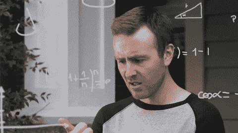

# 第四天

> 原文:[https://dev.to/ikiranpun/day-4-4mh0](https://dev.to/ikiranpun/day-4-4mh0)

我到达了 JS 在线课程的第五部分。该部分被称为高级 JS。

**到**

* Java 脚本中的对象
* OOP
*构造器和实例
*一般继承
* JS 中的继承——原型和原型链

我不得不反复看几遍相同的解释来理解原型属性的概念。
[T3】](https://res.cloudinary.com/practicaldev/image/fetch/s--DJyifsNe--/c_limit%2Cf_auto%2Cfl_progressive%2Cq_66%2Cw_880/https://media3.giphy.com/media/3o7btPCcdNniyf0ArS/giphy.gif)

当老师通过教我们如何创建一个函数构造器再次解释它时，它变得更加清晰。

解释清楚地表明，如果我们没有 prototype 属性，我们将在使用构造函数创建的每个实例中拥有构造函数的继承函数。但是，使用 prototype 属性，我们可以使用函数，而不会重复函数。(这是我的理解，如果我错了，请纠正我)

还解释了**新**操作符是如何工作的。