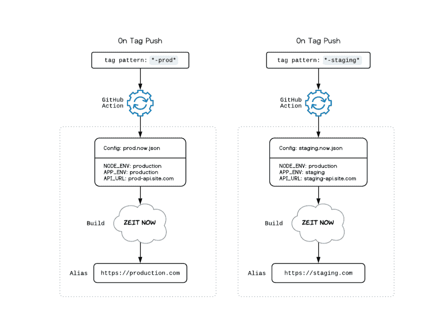

# 现在自动在上部署 Nuxt.js + Express 应用程序

> 原文:[https://dev . to/msurguy/automatically-deploying-nuxt-js-express-app-on-now-505g](https://dev.to/msurguy/automatically-deploying-nuxt-js-express-app-on-now-505g)

我发布了一个演示项目，可以帮助你理解 Now.sh 上的部署环境，以及如何使用 Github 动作自动推送到那些环境。

这是这个项目的链接:[https://github.com/msurguy/nuxt-express-now](https://github.com/msurguy/nuxt-express-now)

## 更多关于知识库:

该项目具有最小的结构，但是它实现了演示自动部署的目标。它:

*   使用 Nuxt 和 Express 的最新稳定版本(当前为 Nuxt 2.9.2)
*   使用 ENV 文件(或 Now.json 文件)中的 API 端点
*   当具有特定模式的标签被推送时，使用 Github 动作进行部署
*   在节点服务器代码中使用 ES6
*   使用通过 env 变量有条件启用/禁用的基本身份验证
*   每周自动整理一次旧部署(没有别名)

## 假设

*   默认分支是**暂存**。项目中的所有 PRs 都是针对该分支制定的
*   当测试在试运行阶段完成并获得批准后，请购单将根据主数据打开
*   当这个项目通过 Now + Github 集成(不是通过 Github Action)自动部署时，它使用 now.json 作为配置。

下图显示了将某些标签推送到 Github 存储库时会发生什么:

[T2】](https://res.cloudinary.com/practicaldev/image/fetch/s--swWxYjeY--/c_limit%2Cf_auto%2Cfl_progressive%2Cq_auto%2Cw_880/https://thepracticaldev.s3.amazonaws.com/i/cc0hqg3rg4p36bl3g9bu.png)

希望你喜欢并分享这个项目！