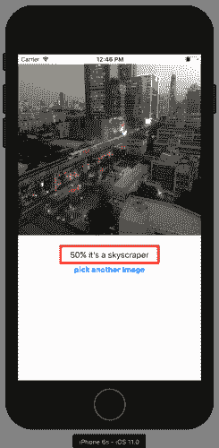
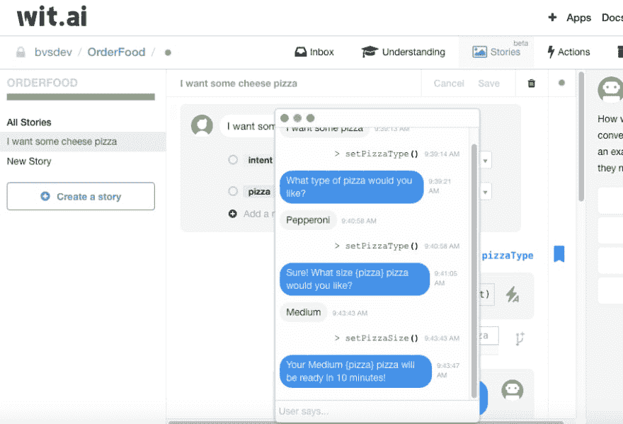

# 移动应用中的智能。

> 原文:[https://dev . to/sadman samee/intelligence-in-mobile-applications-4o2p](https://dev.to/sadmansamee/intelligence-in-mobile-applications-4o2p)

* * *

[T2】](https://res.cloudinary.com/practicaldev/image/fetch/s--bqTuHMsl--/c_limit%2Cf_auto%2Cfl_progressive%2Cq_auto%2Cw_880/https://cdn-images-1.medium.com/max/1200/1%2ArGJbTtEiXpg68goG2afoUw.png)

如今，机器学习是一个很酷的话题，人们对谷歌助手、苹果 Siri、微软 Cortana、亚马逊 Alexa、自动驾驶汽车、机器人，甚至像优步、Snapchat 这样的应用程序都在使用机器学习来增强体验，当然还有智能产品。
如果你有兴趣构建具有语音识别、人脸检测、自然语言处理、预测等功能的智能应用程序，那么对于任何独立开发者或中小型甚至大型团队来说，从头开发一个机器学习系统并不总是一个容易的选择，因为它的成本、时间(咖啡)消耗，因此，有许多开源机器学习平台，如 [Tensorflow Lite](https://www.tensorflow.org/lite) ， [Pytorch](https://pytorch.org) ， [Core ML](https://developer.apple.com/documentation/coreml) ，像 [Dialogflow](https://dialogflow.com) ， [Wit.ai](https://wit.ai) ， [Google Cloud 机器学习 API](https://cloud.google.com/products/ai/)，[微软认知服务](https://azure.microsoft.com/en-us/services/cognitive-services/)， [IBM Watson](https://www.ibm.com/watson) 这样的服务可供开发者以非常便捷的方式完成工作。
在这里，我们将探索各种机器学习库、API 和服务。

## [张量流建兴](https://www.tensorflow.org/lite)

TensorFlow 是一个使用数据流图进行数值计算的开源软件库。图中的节点表示数学运算，而图边表示它们之间通信的多维数据数组(张量), TensorFlow Lite 是 TensorFlow 针对移动和嵌入式设备的轻量级解决方案。它支持设备上的机器学习推理，具有低延迟和小二进制大小。
带 Tensorflow 的安卓 app。您可以使用 Tensorflow Lite 构建智能应用程序，甚至可以离线使用。这是一个用图像识别的初始模型构建的 Android 演示。这个应用程序可以识别简单的基本对象，如笔记本，鼠标，水瓶，电话，书籍，钢笔，桌椅等。看看照片顶部的文字描述的对象。
还有其他的[开源模型](https://github.com/tensorflow/models)用于自然语言处理、计算机视觉、图像字幕、生成单词、文本识别，或者您可以根据自己的需要训练和生成您的模型来使用 Tensorflow。

## [核心 ML](https://developer.apple.com/documentation/coreml)

Core ML 是一个新的基础机器学习框架，在苹果产品中使用，包括 Siri、Camera 和 QuickType。 [Core ML](https://developer.apple.com/documentation/coreml) 提供惊人的快速性能，轻松集成机器学习模型，让您只需几行代码即可构建具有智能新功能的应用。

[T2】](https://res.cloudinary.com/practicaldev/image/fetch/s--5vhOA1qx--/c_limit%2Cf_auto%2Cfl_progressive%2Cq_auto%2Cw_880/https://thepracticaldev.s3.amazonaws.com/i/xnqxhk4l9foarwr9y1bi.png)

有趣的是，您可以在 Tensorflow 中训练您的模型，并将其转换为 [Core ML](https://developer.apple.com/documentation/coreml) 格式，这样您就可以利用两个平台的优势。[这里有](https://github.com/likedan/Awesome-CoreML-Models)一份不错的[核心 ML](https://developer.apple.com/documentation/coreml) 预训练模型列表和一份[学习它的好教程](https://www.raywenderlich.com/577-core-ml-and-vision-machine-learning-in-ios-11-tutorial)。

## [【wit . ai】](https://wit.ai)

[Wit.ai](https://wit.ai) 是一个自然语言处理平台，它使开发人员能够为应用程序添加智能对话功能。开发人员可以使用 [Wit.ai](https://wit.ai) API 为家庭自动化、联网汽车、智能电视、机器人、智能手机、可穿戴设备和许多其他类型的应用程序添加智能语音或聊天界面，或者您可以构建一个智能机器人，并通过 API 将您的应用程序连接到机器人。用户可以在驾驶、健身、烹饪时享受免提移动体验。
将 [Wit.ai](https://wit.ai) 集成到你的移动应用的基本思想是通过像 node、python、ruby 这样的 API。有许多[食谱](https://wit.ai/docs/recipes)等着你。API 训练是围绕故事(特定领域的用例)进行的，其中引擎从用户输入的例子中学习对话流，并使用机器人响应。
 
这是一个简单的与 [Wit.ai](https://wit.ai) 连接的 android app，它以图像为输入，用自然语言描述里面的内容。你可以建一个能和你说话的 app。太好了！
 
这里再举一个[机智. ai](https://wit.ai) 的例子。用户可以订购比萨饼，它可以与用户进行智能对话。它可以是你的移动应用程序中的一个漂亮的功能。

## [IBM 沃森](https://www.ibm.com/watson)

[IBM Watson](https://www.ibm.com/watson) 是知名的认知计算机器学习平台。它提供了语音到文本、文本到语音、权衡分析、个性洞察、问答、音调分析器和视觉识别等 API。您可以使用这些 API 构建非常智能的应用程序，而无需绞尽脑汁！一切都准备好了。看看[“改变我们世界的 10 款 IBM Watson 应用”](https://www.cio.com/article/3400756/10-ibm-watson-powered-apps-that-are-changing-our-world.html)和[“你可以用 IBM 的 Watson 做的 5 件不寻常的事情”](https://www.techradar.com/news/world-of-tech/5-unusual-things-you-can-do-with-ibm-s-watson-1321443)。

## [谷歌云机器学习平台](https://cloud.google.com/products/ai/)

Google Cloud ML Platform 提供现代机器学习服务，包括预先训练的模型和生成定制模型的服务。主要的谷歌应用程序使用云机器学习，包括照片、谷歌应用程序、翻译和许多其他应用程序。谷歌自己也使用这项服务来开发其智能应用。他们的服务使用量很大，你可以用他们提供的服务在你的应用程序中做很多事情，他们的文档也很棒。

## [亚马逊 AI](https://aws.amazon.com/ai/)

[亚马逊 AI](https://aws.amazon.com/ai/) 是亚马逊提供的机器学习服务。在亚马逊人工智能的保护伞下，有一个 [Rekognition](https://aws.amazon.com/rekognition/?nc2=h_m1) ，这是一个可以很容易地将图像分析添加到你的应用程序中的服务。使用 [Rekognition](https://aws.amazon.com/rekognition/?nc2=h_m1) ，您可以检测图像中的物体、场景和人脸。您还可以搜索和比较面孔。Rekognition 的 API 使您能够快速将复杂的基于深度学习的视觉搜索和图像分类添加到您的应用程序中。

Rekognition 可以识别数以千计的物体，如车辆、宠物或家具，并提供置信度得分。Rekognition 还可以检测图像中的场景，如日落或海滩。这使得您可以轻松添加搜索、过滤和管理大型图像库的功能。它还具有面部分析等其他功能，例如，它可以在图像中定位面部并分析面部属性，如面部是否微笑或眼睛是否睁开，面部比较可以衡量两张图像中的面部是同一个人的可能性，以及面部识别。这项服务有许多使用案例，如可搜索的图像库、基于人脸的用户验证、情感分析。

亚马逊人工智能的另一项服务是 Polly，这是一项文本到语音的服务，它使用了大量的机器学习智能。亚马逊 Polly 是一项将文本转化为逼真语音的服务。Polly 允许您创建会说话的应用程序，使您能够构建全新类别的支持语音的产品。第三种也可能是最重要的新服务叫做 Lex。它本质上是推动亚马逊自己的 Alexa 服务的技术。它允许您构建能够进行多步对话的对话式应用程序。
你可以使用[亚马逊 Lex](https://aws.amazon.com/lex/?nc2=h_m1) 来构建聊天机器人和移动应用程序，支持引人入胜、栩栩如生的交互。它有许多有趣的用例，如信息机器人，应用程序机器人，如 Alexa。

你还可以探索其他服务，比如微软认知服务、AlchemyAPI。

在结束之前，我们都知道机器学习的东西真的很酷，但我们不应该仅仅因为它很酷就在我们的应用程序中实现它，如果场景真的需要它，那么我们应该去做它，就像你想做一个像优步这样的应用程序，现在你需要欺诈分析，然后你可以像优步这样做，或者像谷歌的 Allo 应用程序，他们广泛使用自然语言处理他们的谷歌助手。智能应用的趋势仍在继续，是时候跟上了。:)快乐学习。

* * *

你觉得这篇文章有用吗？你想尝试其中的哪项技术？留下评论讨论一下吧！如果你喜欢这些文章，那么请用下面的❤之心推荐这篇文章，让其他人也能看到。
我们通过 [LinkedIn](https://www.linkedin.com/in/sadmansamee/) 联系吧。