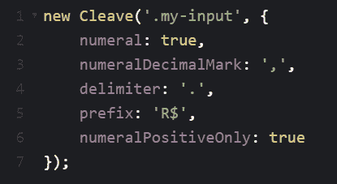

# 动态格式化你的输入域。

> 原文：<https://dev.to/csamywilliams_0/cleave-js-formatting-your-input-fields-on-the-fly-2lh7>

# Cleave.js

我最近遇到了一个叫做 [Cleave.js](https://nosir.github.io/cleave.js/) 的漂亮的 JavaScript 库，它可以实时格式化用户的输入。它在纯 JavaScript 中很棒，但也可以在 React 和 Angular 中使用。

在我的日常工作中，我经常有客户要求验证用户输入、输入的最大长度、格式化货币等等。我简直不敢相信它的实施速度如此之快，并希望与大家分享。

首先，在项目中包含这个库，假设您有一个想要格式化的输入，您创建一个新的 Cleave 实例。第一个参数是一个字符串，包含您想要定位的选择器，它可以处理以下内容:

*   ID 选择器
*   类别选择器
*   数据属性
*   名称属性
*   还有更多…

传入的第二个参数是一个可配置的对象，它指定了您希望如何格式化文本。您可以指定它是信用卡号、日期、电话、时间还是普通数字。

我最近实现的一个用法是格式化一个葡萄牙数字。货币格式使用句点“.”在我们应该用逗号'，'表示千位的地方。例如 124.545，00
实现这一点的一种传统方式是在输入中使用字符串模板和事件监听器，但是使用 Cleave.js，事情很简单:

关于 Cleave.js 最好的一点是，它是可读的、编写良好的文档并且非常灵活。另一个用例是格式化输入，一旦完成，就会出现一个继续按钮。幸运的是，有一个“onValueChanged”回调，它在输入改变时被触发，可以获得目标值。在这里，您可以验证值的长度，例如显示/隐藏按钮。

如果您必须用 JavaScript 格式化输入，我强烈建议研究一下这个库，看它是否适合您的使用。感谢你阅读这篇文章，希望这是有帮助的。