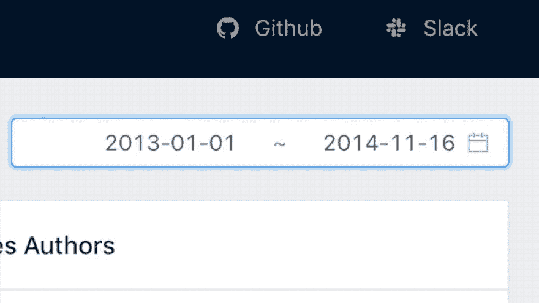
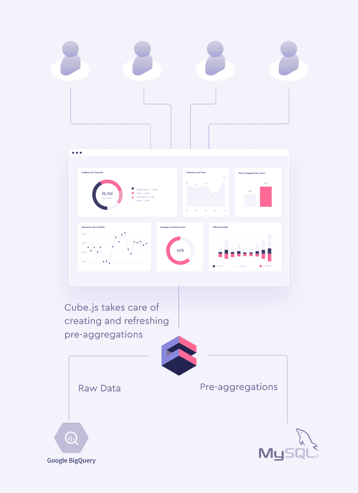
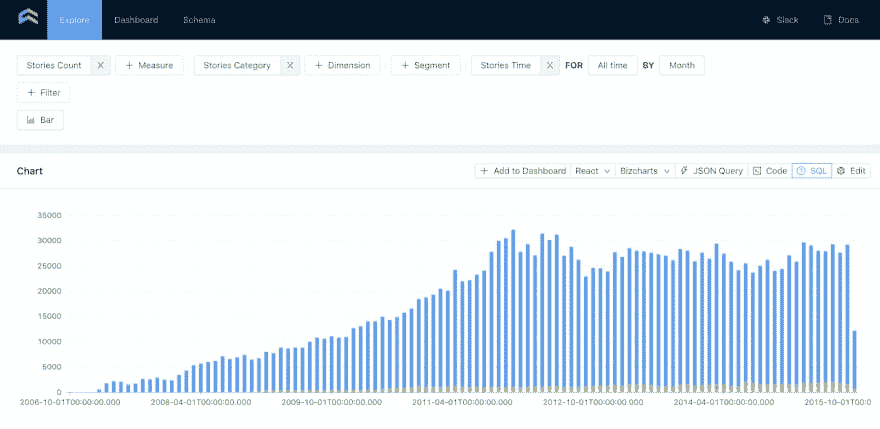

# 使用 MySQL 作为 BigQuery 的缓存层

> 原文:[https://dev . to/keydunov/using-MySQL-as-a-cache-layer-for-big query-37p 2](https://dev.to/keydunov/using-mysql-as-a-cache-layer-for-bigquery-37p2)

BigQuery 在处理大型数据集方面非常出色，但即使在小型数据集上，也永远不会给你亚秒级的响应。这会导致仪表板和图表上的等待时间，尤其是动态的，用户可以选择不同的日期范围或更改过滤器。对于内部 BIs 来说，这几乎总是可以的，但对于面向客户的分析来说就不行了。我们容忍很多事情，比如内部工具的 UI 和性能很差，但我们交付给客户的工具却不行。

但是我们仍然可以利用 BigQuery 廉价的数据存储和处理大型数据集的能力，同时不放弃性能。由于 BigQuery 充当单一的事实来源并存储所有的原始数据，MySQL 可以充当它上面的缓存层，只存储小的聚合表，并为我们提供所需的亚秒级响应。

你可以在这里查看演示，在 Github 上查看源代码。确保使用日期范围和开关—动态仪表板从预聚合中获益最大。

[T2】](https://res.cloudinary.com/practicaldev/image/fetch/s--wkX590j---/c_limit%2Cf_auto%2Cfl_progressive%2Cq_auto%2Cw_880/https://media.graphcms.com/7fvaHi7TymwSBb01Y3Zi)

Cube.js 利用预聚合层作为其[两级缓存系统](https://cube.dev/docs/caching)的一部分。我们最近发布了针对目标用例的外部预聚合支持，在这些用例中，用户可以组合多个数据库，并从两个世界中获得最佳效果。下面的模式显示了使用 BigQuery 和 MySQL 的 Cube.js 的典型设置。

[T2】](https://res.cloudinary.com/practicaldev/image/fetch/s--f7qYhVev--/c_limit%2Cf_auto%2Cfl_progressive%2Cq_auto%2Cw_880/https://thepracticaldev.s3.amazonaws.com/i/55qblyygj9q9vmruvf3f.png)

要使用外部汇总功能，我们需要配置 Cube.js 以连接到 BigQuery 和 MySQL，并指定我们希望在外部构建哪个预聚合。如果你是 Cube.js 的新手，我推荐你先看看这个 101 式教程，然后再回到这里。对于我们的示例应用程序，我们将使用来自 BigQuery 的公共黑客新闻数据集。

让我们首先安装 Cube.js CLI 并创建一个新的应用程序。

```
$ npm install -g cubejs-cli
$ cubejs create external-rollups -d bigquery 
```

我们设置`-d bigquery`使我们的主数据库成为一个大查询。接下来，将`cd`放入`bigquery-mysql`文件夹，并使用正确的凭证配置`.env`。

```
CUBEJS_DB_TYPE=bigquery
CUBEJS_DB_BQ_PROJECT_ID=<BIGQUERY PROJECT ID>
CUBEJS_DB_BQ_CREDENTIALS=<BIGQUERY BASE64-ENCODED KEY>
CUBEJS_EXT_DB_NAME=preags
CUBEJS_EXT_DB_HOST=localhost
CUBEJS_EXT_DB_USER=root
CUBEJS_EXT_DB_PASS=12345 
```

在这里，我们为主数据库(BigQuery)和预聚合的外部数据库(MySQL)设置凭证。你可以在 [Cube.js docs 这里](https://cube.dev/docs/connecting-to-the-database#notes-google-big-query)了解更多关于获取 BigQuery 凭证的信息。此外，为了在 MySQL 中构建预聚合，Cube.js 应该拥有对存储预聚合表的`stb_pre_aggregations`模式的写权限。

现在，让我们安装 Cube.js MySQL 驱动程序。

```
$ npm install @cubejs-backend/mysql-driver --save 
```

一旦我们有了它，最后的配置步骤是通过`externalDbType`和`externalDriverFactory`属性提供 MySQL 相关的选项。用以下内容替换`index.js`文件的内容。

```
const CubejsServer = require("@cubejs-backend/server");
const MySQLDriver = require('@cubejs-backend/mysql-driver');

const server = new CubejsServer({
  externalDbType: 'mysql',
  externalDriverFactory: () => new MySQLDriver({
    host: process.env.CUBEJS_EXT_DB_HOST,
    database: process.env.CUBEJS_EXT_DB_NAME,
    user: process.env.CUBEJS_EXT_DB_USER,
    password: process.env.CUBEJS_EXT_DB_PASS.toString()
  })
});

server.listen().then(({ port }) => {
  console.log(`🚀 Cube.js server is listening on ${port}`);
}); 
```

这就是我们让 Cube.js 连接到 BigQuery 和 MySQL 所需要的一切。现在，我们可以创建第一个 Cube.js 数据模式文件。Cube.js 使用数据模式生成 SQL 代码，该代码将在您的数据库中执行。

用以下内容创建`schema/Stories.js`文件。

```
cube(`Stories`, {
  sql: `select * from \`fh-bigquery.hackernews.full_partitioned\` WHERE type = 'story'`,

  measures: {
    count: {
      type: `count`,
    }
  },

  dimensions: {
    category: {
      type: `string`,
      case: {
        when: [
          { sql: `STARTS_WITH(title, "Show HN")`, label: `Show HN` },
          { sql: `STARTS_WITH(title, "Ask HN")`, label: `Ask HN` }
        ],
        else: { label: `Other` }
      }
    },

    time: {
      sql: `timestamp`,
      type: `time`
    }
  }
}); 
```

现在，通过运行`node index.js`启动 Cube.js 服务器，并导航到位于 [http://localhost:4000](http://localhost:4000) 的开发平台。

您可以选择 Stories count 度量和 category 维以及时间维来构建图表，如下所示。

[T2】](https://res.cloudinary.com/practicaldev/image/fetch/s--QYgaKewv--/c_limit%2Cf_auto%2Cfl_progressive%2Cq_auto%2Cw_880/https://thepracticaldev.s3.amazonaws.com/i/l4czj3fnsgpawxbq1n70.png)

如果我们通过单击一个 SQL 按钮来检查生成的 SQL，我们将看到以下内容。

```
SELECT
  CASE
    WHEN STARTS_WITH(title, "Show HN") THEN 'Show HN'
    WHEN STARTS_WITH(title, "Ask HN") THEN 'Ask HN'
    ELSE 'Other'
  END `stories__category`,
  DATETIME_TRUNC(DATETIME(`stories`.timestamp, 'UTC'), MONTH) `stories__time_month`,
  count(*) `stories__count`
FROM
  (
    select
      *
    from
      `fh-bigquery.hackernews.full_partitioned`
    WHERE
      type = 'story'
  ) AS `stories`
GROUP BY
  1,
  2
ORDER BY
  2 ASC
LIMIT
  10000 
```

这个 SQL 向我们展示了这个查询是针对 BigQuery 中的原始数据运行的。现在，让我们对 MySQL 中预先聚集的表运行它。为此，我们将定义一个预聚合。通常，这是在同一个多维数据集中完成的，但是为了本教程的目的，我们可以比较使用和不使用预聚合的性能，让我们创建一个新的多维数据集。我们可以在同一个文件中完成。将以下代码添加到`schema/Stories.js`文件中。

```
cube(`StoriesPreAgg`, {
  extends: Stories,
  preAggregations: {
    main: {
      type: `rollup`,
      measureReferences: [count],
      dimensionReferences: [category],
      granularity: `month`,
      timeDimensionReference: time,
      external: true
    }
  }
}); 
```

在上面的代码中，我们用一个`rollup`类型声明了一个预聚合，并指定在聚合表中包含哪些度量和维度。还要注意`external: true`；这一行告诉 Cube.js 将这个预聚合上传到 MySQL。

现在，转到开发平台，选择与之前相同的度量和维度:计数、类别和按月分组的时间，但是这次从 Stories PreAgg 多维数据集中选择它们。当第一次被请求时，Cube.js 将生成一个聚合表并上传到 MySQL。所有后续请求都将直接进入 MySQL 中的聚合表。您可以检查生成的 SQL，它应该如下所示。

```
SELECT
  `stories_pre_agg__category` `stories_pre_agg__category`,
  `stories_pre_agg__time_month` `stories_pre_agg__time_month`,
  sum(`stories_pre_agg__count`) `stories_pre_agg__count`
FROM
  stb_pre_aggregations.stories_pre_agg_main
GROUP BY
  1,
  2
ORDER BY
  2 ASC
LIMIT
  10000 
```

如您所见，它现在从 MySQL 中的`stb_pre_aggregations.stories_pre_agg_main`表中查询数据。您可以使用过滤器来查看聚合查询相对于原始查询的性能提升。

您还可以使用多个图表来检查[这个演示仪表板，并比较使用和不使用预聚合时的性能。](https://cubejs-external-rollups.herokuapp.com/)[Github 上提供了示例仪表板的源代码。](https://github.com/cube-js/cube.js/tree/master/examples/external-rollups)