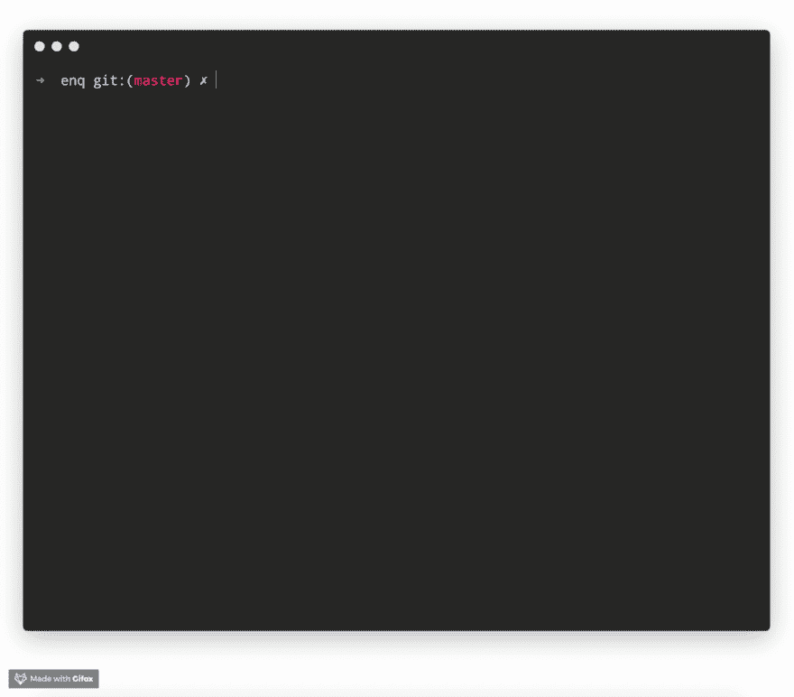
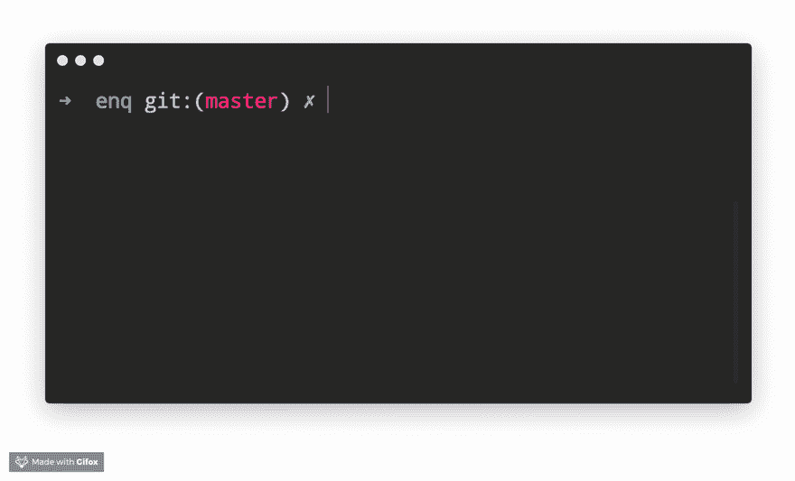
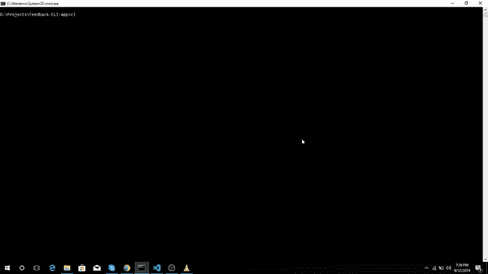

# 基于节点 CLI 的餐厅反馈应用程序，使用粉笔，清晰，小图和询问者

> 原文:[https://dev . to/rizwanjamal/node-CLI-based-restaurant-feedback-app-with-using-chalk-clear-figlet-enquirer-22jd](https://dev.to/rizwanjamal/node-cli-based-restaurant-feedback-app-with-using-chalk-clear-figlet-enquirer-22jd)

让我们谈一谈我们将要开发的东西。我们正在为一家餐馆制作一个基于 CLI 的反馈应用程序。使用这个应用程序，人们可以反馈他们对食物味道、质量的体验，也可以提供他们有价值的建议。

我们开始吧，

我们创建了 **Feedback-CLI-App** 文件夹，安装了`Enquirer`、`Chalk`、`Figlet`和`Clear` npm 模块。最终的`package.json`文件应该是这样的:

```
{
  "name": "feedback-cli-app",
  "version": "1.0.0",
  "description": "",
  "main": "index.js",
  "scripts": {
    "start": "node index.js",
    "test": "echo \"Error: no test specified\" && exit 1"
  },
  "keywords": [],
  "author": "",
  "license": "ISC",
  "dependencies": {
    "chalk": "^2.4.2",
    "clear": "^0.1.0",
    "enquirer": "^2.3.1",
    "figlet": "^1.2.1"
  }
} 
```

现在，在你的应用程序&的根目录下创建`index.js`文件需要我们之前安装的这些模块。我会让你逐一了解他们的用例

```
const clear = require("clear");
const chalk = require("chalk");
const figlet = require("figlet"); 
```

我们希望在应用程序运行时清除控制台，所以我们对那个
使用了`clear`模块

```
// Clearing Console On App Starts
clear(); 
```

现在我们想向用户展示一个精彩的标题&欢迎消息，所以我们使用了`figlet`和`chalk`模块来实现这个目的。

```
// Create Heading Using Chalk & Figlet
console.log(
  chalk.yellowBright(
    figlet.textSync("Feedback Form", { horizontalLayout: "full" })
  )
);
console.log(
  chalk.cyanBright(
    "\n\tA Simple CLI Based Restaurant Feedback Form Using NodeJS"
  )
);
console.log(
  chalk.cyanBright(
    `\tFor Commands Run ${chalk.greenBright(
      "Just Follow These Instruction\n"
    )} `
  )
); 
```

当前输出应该是这样的
[](https://res.cloudinary.com/practicaldev/image/fetch/s--76E2NYy7--/c_limit%2Cf_auto%2Cfl_progressive%2Cq_66%2Cw_880/https://thepracticaldev.s3.amazonaws.com/i/refn7nezknojmicdwb7k.gif)

现在让我们添加反馈问题，在根目录下创建一个`questions.js`文件。在该文件中，我们现在将使用`enquirer`，这是一个非常棒的模块，它有非常棒的&时尚的 CLI 提示，用户友好、直观且易于创建。这些提示的几个例子如下所示:
[ ](https://res.cloudinary.com/practicaldev/image/fetch/s--D9OP_YRg--/c_limit%2Cf_auto%2Cfl_progressive%2Cq_66%2Cw_880/https://raw.githubusercontent.com/enquirer/enquirer/master/media/survey-prompt.gif) [ ](https://res.cloudinary.com/practicaldev/image/fetch/s--HzoSQkwu--/c_limit%2Cf_auto%2Cfl_progressive%2Cq_66%2Cw_880/https://raw.githubusercontent.com/enquirer/enquirer/master/media/heartbeat.gif)

在`questions.js`文件中，在要求 enquirer 之后，创建一个函数，返回一个问题数组，如下所示:

```
const enquirer = require("enquirer");

const feedbackQuestions = () => {
  const questions = [
    {
      type: "input",
      name: "name",
      message: "What is your name ?"
    },
    {
      type: "autocomplete",
      name: "favourite",
      message: "Which dish you liked the most ?",
      limit: 10,
      choices: [
        "Biryani",
        "Butter Chicken",
        "Hamburger",
        "Blackberry",
        "Strawberry Cheesecake",
        "Italian Beef",
        "Red Valvet Cake"
      ]
    },
    {
      type: "multiselect",
      name: "improvement items",
      message: "Which of these dishes you want them to improve ?",
      limit: 7,
      choices: [
        "Biryani",
        "Butter Chicken",
        "Hamburger",
        "Blackberry",
        "Strawberry Cheesecake",
        "Italian Beef",
        "Red Valvet Cake"
      ]
    },
    {
      type: "input",
      name: "suggestion",
      message: "What would you like to suggest ?"
    },
    {
      type: "survey",
      name: "experience",
      message: "Please rate your experience",
      scale: [
        { name: "1", message: "Strongly Disagree" },
        { name: "2", message: "Disagree" },
        { name: "3", message: "Neutral" },
        { name: "4", message: "Agree" },
        { name: "5", message: "Strongly Agree" }
      ],
      margin: [0, 0, 2, 1],
      choices: [
        {
          name: "quality",
          message: "The food quality was well",
          initial: 3
        },
        {
          name: "taste",
          message: "The taste is outclass",
          initial: 3
        },
        {
          name: "environment",
          message: "The environment is wonderful too",
          initial: 3
        },
        {
          name: "service",
          message: "I like their service",
          initial: 3
        }
      ]
    }
  ]; 
```

在结束函数之前，我们需要调用 enquirer 的`prompt`方法(这是一个异步方法)并传递这些`questions`数组。它会回报这样一个承诺:

```
 enquirer.prompt(questions).then(ans => {
    clear();
    console.log(
      chalk.yellowBright(
        figlet.textSync("Feedback Form", { horizontalLayout: "full" })
      )
    );
    console.log(
      chalk.cyanBright("\n\t Thanks For Providing Us Your Feedback !\n")
    );
    console.log(ans);
  });
}; 
```

最后，我们只是从这个模块中导出`feedbackQuestions`函数。所以最终的`questions.js`文件应该是这样的:

```
const enquirer = require("enquirer");
const clear = require("clear");
const chalk = require("chalk");
const figlet = require("figlet");

const feedbackQuestions = () => {
  const questions = [
    {
      type: "input",
      name: "name",
      message: "What is your name ?"
    },
    {
      type: "autocomplete",
      name: "favourite",
      message: "Which dish you liked the most ?",
      limit: 10,
      choices: [
        "Biryani",
        "Butter Chicken",
        "Hamburger",
        "Blackberry",
        "Strawberry Cheesecake",
        "Italian Beef",
        "Red Valvet Cake"
      ]
    },
    {
      type: "multiselect",
      name: "improvement items",
      message: "Which of these dishes you want them to improve ?",
      limit: 7,
      choices: [
        "Biryani",
        "Butter Chicken",
        "Hamburger",
        "Blackberry",
        "Strawberry Cheesecake",
        "Italian Beef",
        "Red Valvet Cake"
      ]
    },
    {
      type: "input",
      name: "suggestion",
      message: "What would you like to suggest ?"
    },
    {
      type: "survey",
      name: "experience",
      message: "Please rate your experience",
      scale: [
        { name: "1", message: "Strongly Disagree" },
        { name: "2", message: "Disagree" },
        { name: "3", message: "Neutral" },
        { name: "4", message: "Agree" },
        { name: "5", message: "Strongly Agree" }
      ],
      margin: [0, 0, 2, 1],
      choices: [
        {
          name: "quality",
          message: "The food quality was well",
          initial: 3
        },
        {
          name: "taste",
          message: "The taste is outclass",
          initial: 3
        },
        {
          name: "environment",
          message: "The environment is wonderful too",
          initial: 3
        },
        {
          name: "service",
          message: "I like their service",
          initial: 3
        }
      ]
    }
  ];

  enquirer.prompt(questions).then(ans => {
    clear();
    console.log(
      chalk.yellowBright(
        figlet.textSync("Feedback Form", { horizontalLayout: "full" })
      )
    );
    console.log(
      chalk.cyanBright("\n\t Thanks For Providing Us Your Feedback !\n")
    );
    console.log(ans);
  });
};

module.exports = feedbackQuestions; 
```

现在我们只需要在我们的`index.js`文件&中导入那个函数，最后调用它。最终的`index.js`文件应该是这样的:

```
const clear = require("clear");
const chalk = require("chalk");
const figlet = require("figlet");

const feedbackQuestions = require("./questions");

// Clearing Console On App Starts
clear();

// Create Heading Using Chalk & Figlet
console.log(
  chalk.yellowBright(
    figlet.textSync("Feedback Form", { horizontalLayout: "full" })
  )
);
console.log(
  chalk.cyanBright(
    "\n\tA Simple CLI Based Restaurant Feedback Form Using NodeJS"
  )
);
console.log(
  chalk.cyanBright(
    `\tWelcome To The Feedback Form ${chalk.greenBright(
      "Please Answer The Below Questions\n"
    )} `
  )
);

// Feedback Question
feedbackQuestions(); 
```

仅此而已！下面是最终输出:
[](https://res.cloudinary.com/practicaldev/image/fetch/s--NlqVlTFo--/c_limit%2Cf_auto%2Cfl_progressive%2Cq_66%2Cw_880/https://thepracticaldev.s3.amazonaws.com/i/wmrbi4ua9jsyqgk9s8e8.gif)

干杯......！你做到了:)
[](https://i.giphy.com/media/5JL8b0R6ebRcY/giphy.gif)