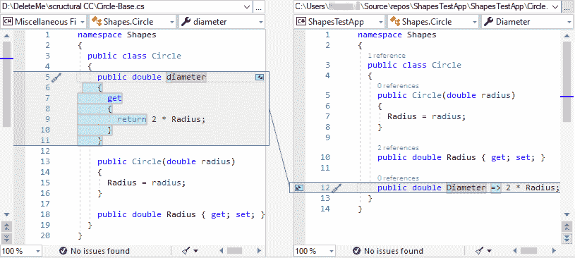
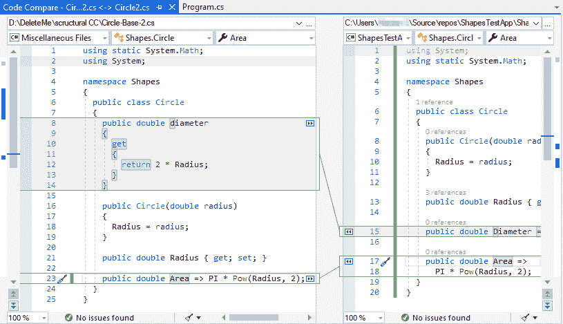
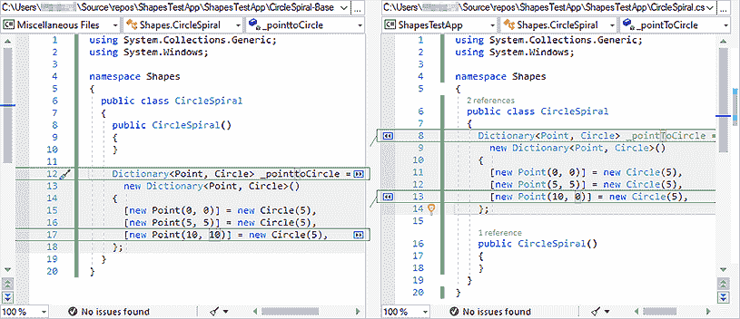
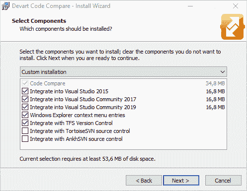

# 如何在 Visual Studio 2019 中比较和合并源代码

> 原文：<https://dev.to/devartsoftware/how-to-compare-and-merge-source-code-in-visual-studio-2019-2o51>

**总结:**在本文中，您将学习如何在 Visual Studio 2019 中使用[代码比较](https://www.devart.com/codecompare/)轻松地比较和合并源代码。在这篇文章中，我们将提供一些例子来展示代码比较的基本功能以及它帮助你有效解决的任务。

对于参与编程的人来说，比较两个高度重构代码的修订版是一项非常具有挑战性的任务。发现两个对象之间的差异和检测源代码变化必须一行一行地执行，这需要一些时间。

代码比较是一个易于使用的解决方案，用于比较和合并两个源代码文件。它允许开发人员减少编码时的错误数量，并通过高级代码比较功能增强源代码编辑，例如:

■结构比较模式
■ [主要编程语言的词法比较](https://www.devart.com/codecompare/lexicalcomparison.html)
■相似行检测

您可以将代码比较用作独立的代码比较工具和一个 [Visual Studio 扩展](https://www.devart.com/codecompare/visual-studio-integration.html)。它毫不费力地与多个[版本控制](https://www.devart.com/codecompare/integration.html)系统集成，并支持不同的编程语言。

# 与 Visual Studio 2019 集成

我们继续支持与 Visual Studio 2019 的现代代码编辑器集成，使代码比较过程更高效、更快速。这是因为所有新的编辑器功能，如命令、智能、语法高亮显示都完全可用，包括第三方扩展。

由于从 Visual Studio 2019 的代码比较扩展中删除了不推荐使用的 API，我们的插件的异步加载是可能的，因此，在 Visual Studio 上运行时，代码比较加载速度更快。

此外，Visual Studio 的代码比较中的可用语言列表还提供了 JavaScript 和 TypeScript 等流行语言。打开 comparison 时，根据文件扩展名自动定义正在使用的编程语言。我们还考虑了用户关于 JSON 文件打开不正确和弹出窗口奇怪闪烁的报告。现在 JavaScript 将用于它们。

# 结构化源代码对比

代码比较为定位源代码结构的变化提供了广泛的可能性，例如，匹配方法和相似的代码行，检测移动的代码块，以及[更多的](https://docs.devart.com/code-compare/file-comparison/structural-code-comparison.html)。

对于最新版本的с#和 VB 语言，我们已经显著改进了结构比较。在考虑了大量关于结构比较的评论后，我们决定切换到 Roslyn 编译器，这是 C#和 VB 代码分析的最佳选择。此外，我们改进了注释和处理器指令与代码中结构元素的绑定。

现在，代码比较支持所有新的 C#和 VB.NET 语句的结构标识，这对结构比较很重要。下面你会发现一些基本的例子。

**将只读属性移动并修改为表达式主体成员**

**使用静态语句移动**

**被移动和修改的字典被初始化**

在比较源代码时，我们建议您启用**忽略换行符**和**忽略空格**选项来忽略不存在的更改，并启用**符号到符号**选项来有效地检查代码行中的差异。

# 快速集成 TFS 和 GIT

代码比较可以自动集成到 TFS。您只需要在产品安装期间检查与 TFS 版本控制的集成。

在这种情况下，代码比较被设置为 TFS 的默认比较和合并工具。

如果您使用 Git 作为源代码仓库，那么您只需要在。gitconfig 文件。你可以通过访问[Code Compare Integration with GIT](https://www.devart.com/codecompare/integration_git.html)页面了解更多信息。

# 结论

代码比较是一个方便的 Visual Studio 加载项，它让您在比较和合并源代码时忘记任何问题。无论您使用哪种编程语言，代码比较都会考虑每种语言的特定功能。此外，该工具允许您使用流行的版本控制系统来跟踪和控制您的源代码变更。因此，[立即下载](https://www.devart.com/codecompare/download.html)，评估并[订购](https://www.devart.com/codecompare/ordering.html) Code Compare Pro，发现管理源代码变更的最佳方式！