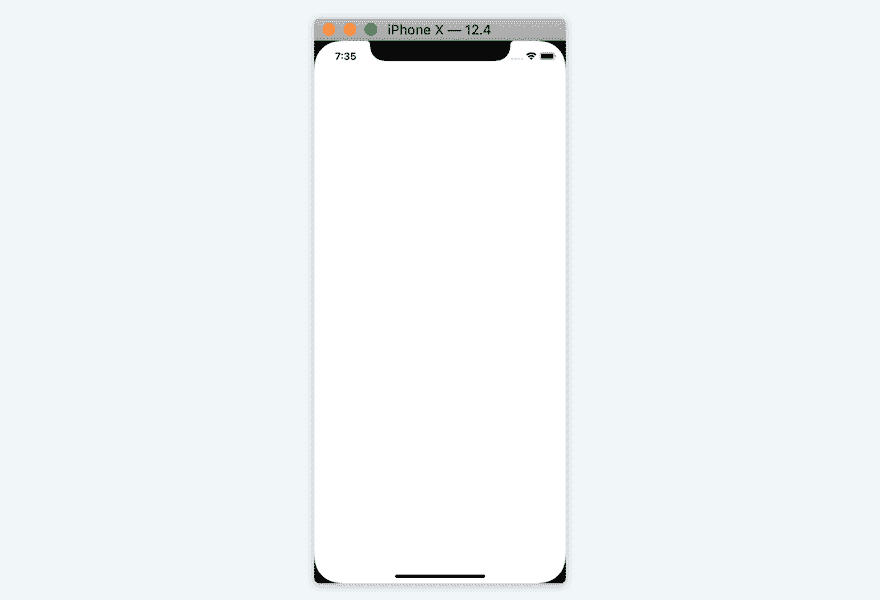
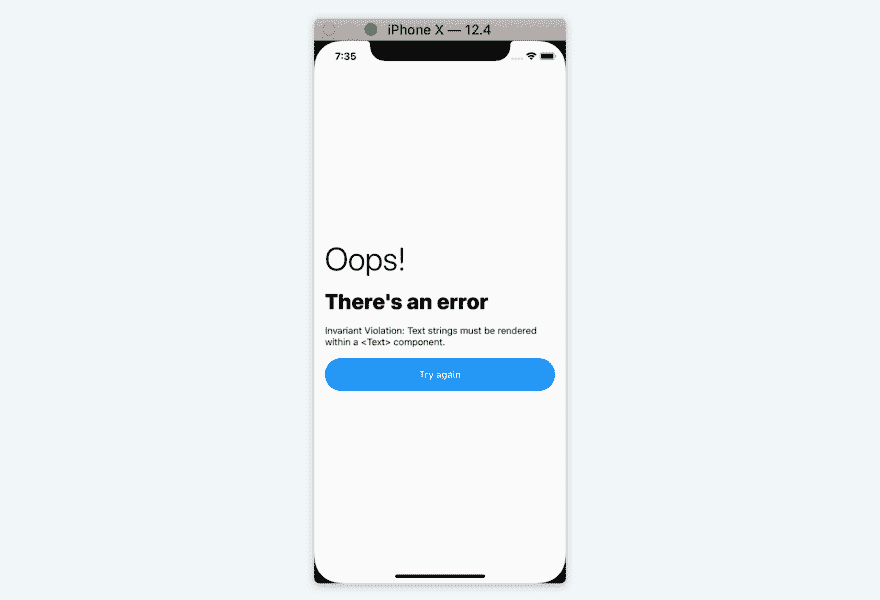

# 管理带有错误边界的 React-Native 崩溃

> 原文：<https://dev.to/carloscuesta/managing-react-native-crashes-with-error-boundaries-13k>

#### *原载于 [carloscuesta 的博客](https://carloscuesta.me/blog/managing-react-native-crashes-with-error-boundaries)*

[React 16](https://github.com/facebook/react/blob/master/CHANGELOG.md#1600-september-26-2017) 发布了一个新概念叫做 [**误差边界**](https://reactjs.org/docs/error-boundaries.html#introducing-error-boundaries) 。这个概念引入了一种新的方法来捕捉 JavaScript 错误🐛在 React 项目中。

在这篇文章中，我将解释为什么它很重要，以及如何在一个反应式应用程序中使用错误边界来提高错误恢复能力，所以让我们开始吧！👨‍💻

### 为什么要使用它们？

根据[官方反应文件](https://reactjs.org/docs/error-boundaries.html#new-behavior-for-uncaught-errors)📘：

> 截止到**反应 16** ，未被任何**错误边界**捕获的**错误**将**结果**在**卸载**整体**反应**组件树**😱。**

**卸载****整体**反应**组件**树，**表示**如果你根本没有捕捉到错误，**用户**将**看到**一个**空白白屏**💥。大多数时候没有任何反馈。这不是一个伟大的用户体验❌，幸运的是你可以通过使用错误边界✅.来解决这个问题

[](https://res.cloudinary.com/practicaldev/image/fetch/s--XfPS33V1--/c_limit%2Cf_auto%2Cfl_progressive%2Cq_auto%2Cw_880/https://res.cloudinary.com/carloscuesta/image/upload/react-native-error-unmounted-tree.png)

### 如何使用误差边界

为了从错误边界中获益，我们必须**创建**一个**有状态组件**，它将使用以下生命周期方法♻️:

*   [`getDerivedStateFromError`](https://reactjs.org/docs/react-component.html#static-getderivedstatefromerror) :该方法将更新组件状态以显示一个回退 UI。
*   [`componentDidCatch`](https://reactjs.org/docs/react-component.html#componentdidcatch) :应该使用此方法将错误记录到外部服务中。

因此，让我们创建一个组件来捕捉应用程序中的错误:

```
class ErrorBoundary extends React.Component {
  state = { hasError: false }

  static getDerivedStateFromError (error) {
    return { hasError: true }
  }

  componentDidCatch (error, info) {
    logErrorToService(error, info.componentStack)
  }

  render () {
    return this.state.hasError
      ? <FallbackComponent />
      : this.props.children
  }
} 
```

很简单，对吗？只需几行代码，您就可以捕获 React-Native 应用程序中的错误🎉

要使用它，你现在需要做的就是**将它包装在任何可能抛出错误**的组件周围。

```
const App = () => (
  <ErrorBoundary>
    <Children />
  </ErrorBoundary>
) 
```

这个组件将捕获**的**的**的**子节点**抛出的**所有错误。常见的是在应用程序的顶层使用它🔝捕捉任何东西，而不必在每个屏幕或路线上使用它👏

每当我们的应用程序抛出一个错误时，我们的`FallbackComponent`就是这个样子😍

[](https://res.cloudinary.com/practicaldev/image/fetch/s--9qXihKEz--/c_limit%2Cf_auto%2Cfl_progressive%2Cq_auto%2Cw_880/https://res.cloudinary.com/carloscuesta/image/upload/react-native-error-boundary.png)

⚠️ **错误边界只捕捉 JavaScript 错误**，你的应用程序可能出现的所有本地崩溃都不会被处理。

### 介绍 [`react-native-error-boundary`](https://github.com/carloscuesta/react-native-error-boundary)

几个月前，我创建了一个简单的、**灵活的**和**可重用的** React-Native **错误边界组件**。[看一看](https://github.com/carloscuesta/react-native-error-boundary)👀如果你正在考虑在你的应用程序中增加误差边界！