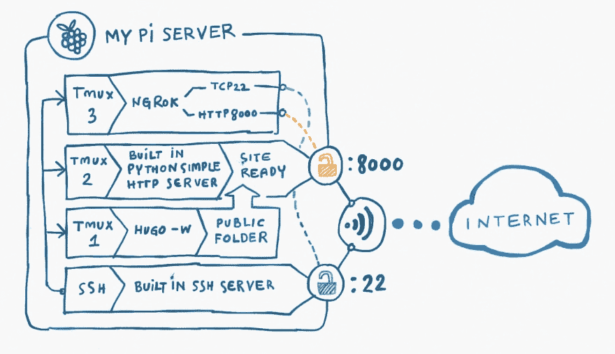

# 我如何在 pi 服务器上运行 hugo 站点

> 原文:[https://dev . to/xa beng/how-I-run-a-Hugo-site-on-pi-server-36l 9](https://dev.to/xabeng/how-i-run-a-hugo-site-on-pi-server-36l9)

只是为了好玩:)

[T2】](https://res.cloudinary.com/practicaldev/image/fetch/s--sqKnanit--/c_limit%2Cf_auto%2Cfl_progressive%2Cq_auto%2Cw_880/https://thepracticaldev.s3.amazonaws.com/i/k8leo5prmvozgw0edfli.jpeg)