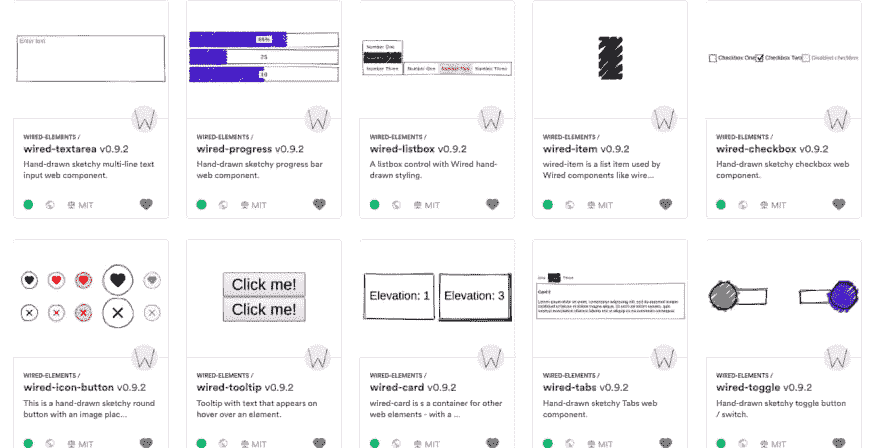
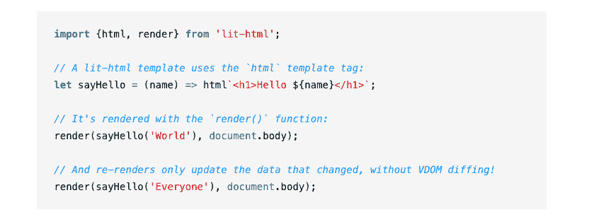
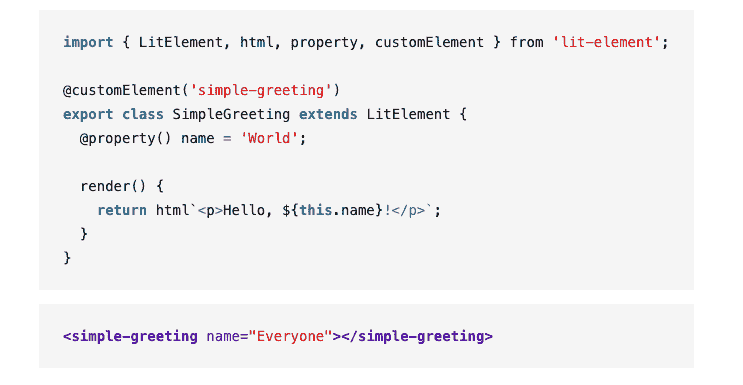
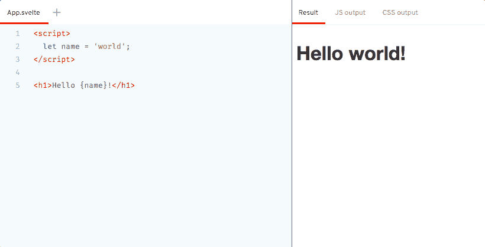
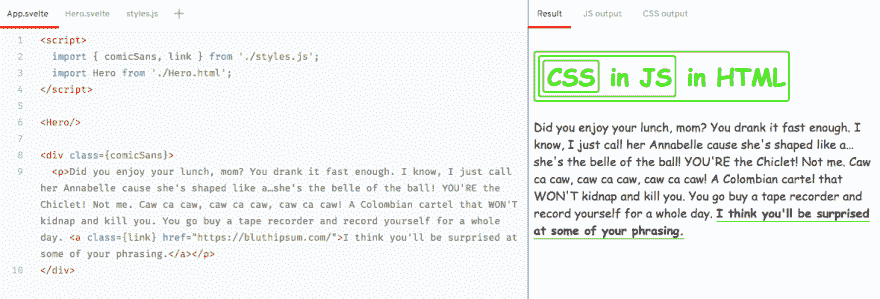
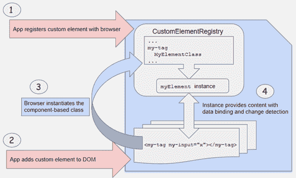

# 2019 年开发 Web 组件的 7 个工具

> 原文:[https://dev . to/gite den/7-tools-for-developing-we B- components-in-2019-1ld 6](https://dev.to/giteden/7-tools-for-developing-web-components-in-2019-1ld6)

### [](#web-components-in-the-wild-from-lithtml-to-stencil-svelete-and-beyond)荒野中的 Web 组件:从 lit-html 到 Stencil，Svelete 以及超越。

所以最近有很多关于网络组件的讨论。原因的要点是:基于 Web 组件标准构建的组件和小部件将跨现代浏览器工作，并且可以与任何支持 HTML 的 JavaScript 库或框架一起使用。

这意味着更多的重用、更好的稳定性、抽象和标准化、更少的工作以及伴随更好的模块化而来的几乎所有东西。当许多人还在坐等类似于[网络组装](https://webassembly.org/)的项目时，在过去的一年里，我们看到新的工具和技术正在崛起，带来今天的未来。

因此，在这篇文章中，我将回顾你应该知道的 5 个**未排名的**工具，如果你正在考虑在 2019 年使用一个 web 组件的话。这个列表只是一个开始，所以请随时评论和建议您自己的工具！

让我们开始吧。

## [](#1-bit)1。少量

[https://www.youtube.com/embed/E5lgoz6-nfs](https://www.youtube.com/embed/E5lgoz6-nfs)

[Bit](https://bit.dev) 是一个平台和一个[开源工具](https://github.com/teambit/bit)，旨在通过组件的开发和组合来帮助构建模块化应用。

Bit 具有一些创新的关键特性，可以实现更好的组件模块化和可重用性，这与 web 组件的不可知论和可重用性是天作之合。

首先，它自动定义组件的整个依赖图，无缝地将 if 从项目中隔离出来。您可以通过一个命令和零重构(！idspnonenote)从一个项目中单独发布多个组件。).

第二，这是真正酷的部分，除了用 NPM/Yarn 安装每个组件，你可以使用 Bit 将一个组件带入一个新项目-并在那里开发它以更改源代码，玩风格或根据需要更改任何其他东西。不再等待 PRs。

第三，Bit 跨项目管理组件的源代码和依赖图。这是一个重要的声明，也是在多个项目中以任何规模恢复组件的关键。您可以使用一个命令同步对整个代码库的组件的更改，并确切地知道哪些依赖项发生了更改以及在哪里发生了更改。这对于逐步重构非常有用，并且使维护变得不那么痛苦。

最后，repo 中的所有组件都可以共享到 bit.dev (Bit hub)中，在那里它们被组织成类似集合的可视“播放列表”,这样您的团队就可以快速共享、发现和重用组件。

这里有一个示例 [wired-elements web 组件](https://github.com/wiredjs/wired-elements)库。请注意，每个组件甚至可以在使用之前在一个真实的操场上玩。

[ ](https://res.cloudinary.com/practicaldev/image/fetch/s--cLWnPRoP--/c_limit%2Cf_auto%2Cfl_progressive%2Cq_auto%2Cw_880/https://cdn-images-1.medium.com/max/2678/1%2A-2-1d7QNyXmJePAfi3l4yQ.png) *带位的有线网络组件*

Bit 通过组件加速模块化应用程序开发，从而更容易维护您的代码库(例如，完全控制的渐进重构)，有助于增加测试覆盖率和提高代码可重用性，同时允许进化。

## [](#2-lithtml-and-litelement)2。html 和 lit 元素

[https://www.youtube.com/embed/ruql541T7gc](https://www.youtube.com/embed/ruql541T7gc)

Lit-html 基本上是一个可定制的 web 组件构建工具包。它是“一个高效的、富于表现力的、可扩展的 JavaScript HTML 模板库”。意思是，Lit-html 使用 JavaScript 模板字符串创建带有[模板文字](https://developer.mozilla.org/en-US/docs/Web/JavaScript/Reference/Template_literals) ( [示例](https://coryrylan.com/blog/building-web-components-with-lit-html))的动态模板。

lit-html 使用快速平台特性，如带有原生克隆的 HTML `<template>`元素来提高效率，并且只更新模板中实际发生变化的部分——它不会重新呈现整个视图。那相当快。

[T2】](https://res.cloudinary.com/practicaldev/image/fetch/s--jfm_ZlMF--/c_limit%2Cf_auto%2Cfl_progressive%2Cq_auto%2Cw_880/https://cdn-images-1.medium.com/max/2000/1%2A0PBdQh15FPXWkayQ_9cbmw.png)

模板是值(字符串、DOM 节点、异构列表、嵌套模板等)，可以计算、传递给函数或从函数中传递以及嵌套。表达式是 JavaScript，可以包含所需的内容。

指令自定义值的处理方式，允许异步值、有效的键控重复、错误边界等等。

Lit-element 是一个“用于创建快速、轻量级 web 组件的简单基类”。它使用 [lit-html](https://lit-html.polymer-project.org/) 渲染到元素的[阴影 DOM](https://developer.mozilla.org/en-US/docs/Web/Web_Components/Using_shadow_DOM) 中，并添加 API 来帮助管理元素属性。LitElement 对属性的变化做出反应，并使用 lit-html 以声明方式呈现。

[T2】](https://res.cloudinary.com/practicaldev/image/fetch/s--nVnuxtrh--/c_limit%2Cf_auto%2Cfl_progressive%2Cq_auto%2Cw_880/https://cdn-images-1.medium.com/max/2000/1%2AAUDzy_ZQHzmPur2UKh8lbA.png)

由于 LitElement 可以很容易地定义 Web 组件，以便在整个组织中共享元素或构建 UI 设计系统，因此它与 [Bit](https://bit.dev) 是一个非常强大的组合，可以轻松地创建、重用、管理和同步组件。Bit 的平台甚至将组件可视化，因此您的 bit 集合不仅仅是一组可重用的组件——它是一个组件的**可视化设计系统**，您可以在任何地方共享、使用和开发！

[聚合物/lit-html](https://github.com/Polymer/lit-html)

## [](#3-stenciljs)3。斯泰斯拉

[https://www.youtube.com/embed/ZmIMtgwyj90](https://www.youtube.com/embed/ZmIMtgwyj90)

由 Ionic 团队创建的 [Stencil](https://github.com/ionic-team/stencil) 是一个“用于构建快速、可重用的 UI 组件和渐进式 web 应用的 Web 组件编译器”。也就是说，它是一个用于生成 web 组件和渐进式 Web 应用程序(PWA)的编译器。

它使用 TypeScript，JSX，一个微小的虚拟 DOM 层，高效的单向数据绑定，一个异步渲染管道，以及惰性加载来生成基于标准的 Web 组件，这些组件可以在[现代和传统浏览器](https://github.com/ionic-team/stencil#browser-support)上运行。

Stencil 还释放了 Web 组件的新功能，例如无需运行无头浏览器的服务器端呈现、预呈现和对象作为属性(而不仅仅是字符串)。创建组件很容易，因为模板组件是普通的 ES6/TypeScript 类，带有一些装饰元数据。[看一看](https://github.com/ionic-team/stencil)

## [](#4-svelte-js)4。苗条的 JS

[https://www.youtube.com/embed/qqt6YxAZoOc](https://www.youtube.com/embed/qqt6YxAZoOc)

Svelte 是“一个编译器，当应用程序的状态改变时，它将你的声明性组件转换成高效的 JavaScript，并对 DOM 进行外科手术式的更新”。这意味着，您可以使用 CSS、HTML 和纯 JavaScript 构建无模板组件，Svelt 会将其编译成具有内置反应能力的小型轻量级 JS。

[T2】](https://res.cloudinary.com/practicaldev/image/fetch/s--uHfoSVqY--/c_limit%2Cf_auto%2Cfl_progressive%2Cq_auto%2Cw_880/https://cdn-images-1.medium.com/max/2000/1%2Am8HKVRmw3B2vrg1bb6zaSQ.png)

听起来既令人兴奋又简单，对吗？另一个有用的能力是对 JS 库中任何与框架无关的 CSS 的内置支持。

[T2】](https://res.cloudinary.com/practicaldev/image/fetch/s--66TOuJww--/c_limit%2Cf_auto%2Cfl_progressive%2Cq_auto%2Cw_880/https://cdn-images-1.medium.com/max/2358/1%2ABkL6FPv_LmfcWJXTx7wSCQ.png)

Svelte 是向框架无关的 web 组件迈出的重要一步，它的工作流支持渐进重构，这在这方面非常有用。将 Svelete 与 Bit 结合起来意味着拥有一个与框架无关的组件工具箱，您可以在任何地方轻松使用，甚至可以构建样式组件来样式化其他组件，将样式化转变为一种组合方式。

[纬向/纬向](https://github.com/sveltejs/svelte)

## [](#5-angular-elements)5。角度元素

<center>

[Angular elements](https://angular.io/guide/elements) 是 Angular 中的一个新包，帮助我们[将角度组件发布为自定义元素](https://blog.bitsrc.io/using-angular-elements-why-and-how-part-1-35f7fd4f0457)。它通过获取角度组件并将其编译成 web 组件来实现这一点。

这种从框架端跨越与框架无关的鸿沟的突出尝试非常有趣，因为@angular/elements 包导出了一个[createCustomElement](https://angular.io/api/elements/createCustomElement)()API，它提供了从 angular 的组件接口和变化检测到内置 DOM API 的桥梁。

实际上，您可以使用新的 [createCustomElement](https://angular.io/api/elements/createCustomElement) ()函数将一个组件转换为一个类，并在浏览器中将它注册为一个自定义元素。然后，您可以像在直接添加到 DOM 的内容中使用内置 HTML 元素一样使用新元素。这为您的 NG 工作流增加了新的功能，从更好的关注点分离和可重用性到 SSR！

[T2】](https://res.cloudinary.com/practicaldev/image/fetch/s--TgUhXCaV--/c_limit%2Cf_auto%2Cfl_progressive%2Cq_auto%2Cw_880/https://cdn-images-1.medium.com/max/2000/1%2AwI2wCqw0DIRvTzWqs2lDeQ.png)

## [](#6-hybrids)6。杂种

**Hybrids** 是一个“用于创建 [Web 组件](https://www.webcomponents.org/)的 UI 库，比起类和语法，它更喜欢简单的对象和纯粹的函数”。它为创建定制元素提供了简单而实用的 API。

它提供了一种创建自定义元素的声明性方式。它是功能性和面向对象架构的混合，具有定义定制元素的独特方法。这里有一个依赖于三个与财产相关的想法的例子:[描述符](https://github.com/hybridsjs/hybrids/blob/master/docs/core-concepts/descriptors.md)、[工厂](https://github.com/hybridsjs/hybrids/blob/master/docs/core-concepts/factories.md)和[翻译](https://github.com/hybridsjs/hybrids/blob/master/docs/core-concepts/translation.md)。该库使用变更检测和缓存机制来简化组件的生命周期。

```
import { define } from 'hybrids';

const MyElement = {
  count: 0,
  render: ({ count }) => {...},
};

define('my-element', MyElement); 
```

“额外的”特性包括基于标记模板文字的模板引擎和对快速开发的热模块替换支持。干净利落。
[**hybrids/hybrids**
*👾来自普通对象和纯函数的 Web 组件！—hybrids js/hybrids * github . com](https://github.com/hybridsjs/hybrids)

## [](#7-sigil)7。魔符

[Sigil](https://github.com/sigiljs/sigil) 是一个“功能性 web 组件库”。它具有使用 web 组件的可重用 html 元素，使用 [snabbadom](https://github.com/snabbdom/snabbdom) 进行超快速重新渲染的虚拟 dom，允许绑定到具有强大表达式的属性&的 html 模板语言，减少重新渲染的纯功能视图组件风格，支持不可变的基于 flux 的商店，如 [Redux](http://redux.js.org/) 和 [Kamea](https://github.com/sigiljs/kamea) 等等。在这里用 [JSFiddle 自己试试](https://jsfiddle.net/8hoddkb2/1/)。

</center>