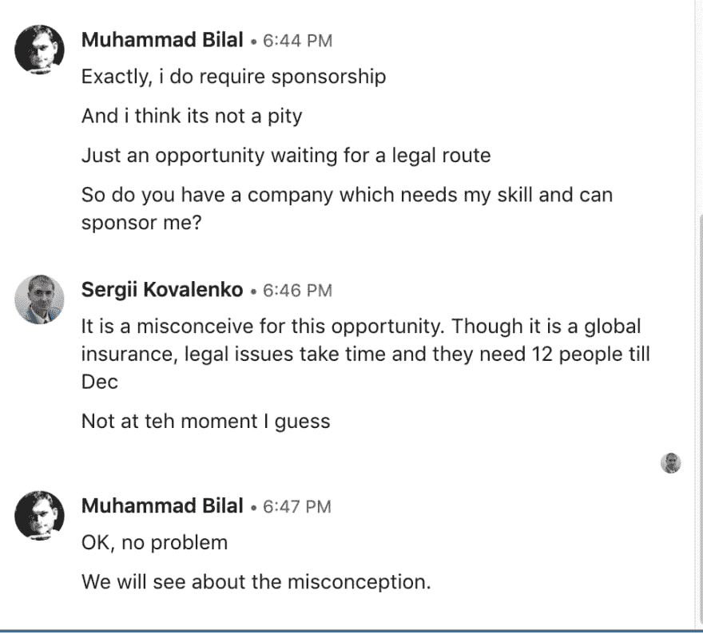

# 太可惜了！！，我怀疑我的人性

> 原文：<https://dev.to/th3n00bc0d3r/it-is-a-pity-i-wonder-my-humanity-1c3m>

只要你没有开始在 B1/B2 工作，在 B1/B2 找工作是合法的。为了让你工作，你必须担保 H1B，这样你的签证状态可以从 B1/B2 ->转换为 H1B。

差不多一个月了，我一直在申请那些不想赞助的工作和公司，一旦我开始和他们沟通，简单的说“抱歉现在我们不能，或者抱歉我们不寻求赞助”。我认为这是非常简单和礼貌的方式。

刚才，我在 LinkedIn 上和 Sergii Kovalenko 进行了一次对话。我认为他是一个招聘人员。

现在，我只是在想，不出生在美国或目前没有工作身份是多么遗憾。如你所见，这家伙认为，我有明显的误解。太好了。

我想知道这个世界是否正在失控，或者我们是否被根据我们出生的纬度或经度划分到不同的阶层。这清楚地表明，无论一个人多么努力或多么有帮助，你将永远被嘲笑为不是更高的第一世界国家的物种。我们是不同的物种还是和人类一样，这让我很失望。