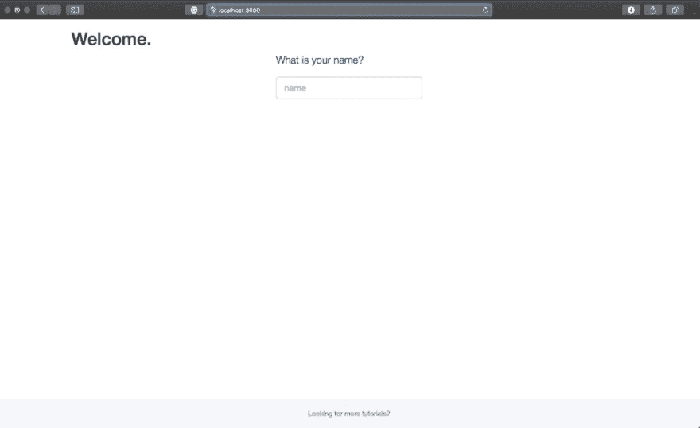
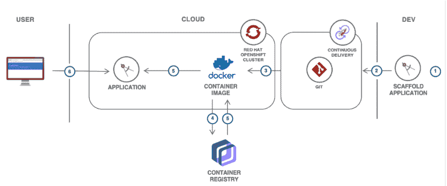

# 使用 S2I 从源代码构建一个容器映像，并将其推送到 PrivateRegistry

> 原文:[https://dev . to/vidyasagarmsc/build-a-container-image-from-source-code-using-s2i-and-push-it-to-a-private registry-250m](https://dev.to/vidyasagarmsc/build-a-container-image-from-source-code-using-s2i-and-push-it-to-a-privateregistry-250m)

### 使用 S2I 从源代码构建一个容器映像，并将其推送到私有注册中心

### [](#explore-the-capabilities-of-a-tool-called-s2i-sourcetoimage)探索一种名为 S2I(源到图像)的工具的功能。

最近，在起草一个 [**OpenShift 解决方案教程**](https://cloud.ibm.com/docs/tutorials?topic=solution-tutorials-scalable-webapp-openshift) 的时候，我探索了一个有趣的工具，叫做 S2I (Source-to-Image)。在本文中，您将学习如何直接从源代码创建容器映像，并将生成的容器映像推送到私有的 IBM Cloud 容器注册中心。

### [](#what-is-s2i-sourcetoimage)什么是 S2I(图片来源)？

[S2I](https://docs.openshift.com/container-platform/3.5/creating_images/s2i.html#creating-images-s2i) 是一个用于构建可复制的、Docker 格式的容器图像的工具。它通过将应用程序源注入到容器映像中并组装一个新映像来生成准备运行的映像。新的映像包含了基础映像(构建器)和构建的源代码，并准备好与 docker runcommand 一起使用。S2I 支持增量构建，即重用先前下载的依赖项、先前构建的工件等。

### [](#installation-and-setup)安装和设置

让我们从在你的机器上安装 S2I 开始。

您可以使用 go get 安装 s2i 二进制文件，这会将源代码到映像的代码下载到您的 GOPATH 中，构建 s2i 二进制文件，并将其安装到您的`$GOPATH/bin` :
中

```
$ go get github.com/openshift/source-to-image/cmd/s2i 
```

对于 Mac，你可以遵循 Linux 的安装说明(并使用 darwin-amd64 链接)或者你可以用 Homebrew 安装源代码到映像:

```
$ brew install source-to-image 
```

按照这里的[说明在其他操作系统上安装](https://opensource.com/article/19/5/creating-source-image-build-pipeline-okd)。

要确认安装，请在终端或命令提示符下运行以下命令:

按照这里的[链接中提到的说明](https://cloud.ibm.com/docs/services/Registry?topic=registry-registry_setup_cli_namespace)来设置 IBM Cloud Container Registry CLI 和您的注册表名称空间。

创建后，打开终端并导出指向注册表名称空间的 MYNAMESPACE 环境变量:

### [](#lets-build)让我们建造

s2i build 命令提供了两个选项来生成新的容器映像:

从远程 Git 存储库构建 Docker 映像:

```
$ s2i build [https://github.com/IBM-Cloud/get-started-node](https://github.com/IBM-Cloud/get-started-node) nodeshift/centos7-s2i-nodejs:latest us.icr.io/$MYNAMESPACE/webapp 
```

从本地目录构建。如果此目录是 git repo，将构建当前提交:

克隆入门节点 Git repo 并运行以下命令

```
$ s2i build . nodeshift/centos7-s2i-nodejs:latest us.icr.io/$MYNAMESPACE/webapplocal 
```

甚至在构建映像之前，您可以通过将- as-dockerfile Dockerfile 附加到您的构建命令来查看生成的 Dockerfile。

生成后，检查生成的 docker 文件的内容:

为了理解 S2I 需求和生成的 Dockerfile 的工件，[参见文档](https://docs.openshift.com/container-platform/3.11/creating_images/s2i.html#s2i-scripts)。

### [](#run-the-app-locally-and-push-it-to-private-registry)本地运行 app，推送到私有注册表

通过使用以下命令在本地运行生成的 Docker 映像来检查它:

```
$ docker run -p 3000:3000 -it us.icr.io/$MYNAMESPACE/webapp 
```

启动浏览器，指向 [http://localhost3000](http://localhost3000) 查看本地运行的应用程序:

[T2】](https://res.cloudinary.com/practicaldev/image/fetch/s--rGNiFJjw--/c_limit%2Cf_auto%2Cfl_progressive%2Cq_auto%2Cw_880/https://cdn-images-1.medium.com/max/1024/0%2A9sxifUtYWMNkMyaq.png)

将容器映像推送到私有的 [IBM Cloud 容器注册中心](https://www.ibm.com/cloud/container-registry)。不要忘记使用 ibmcloud cr 登录命令登录到容器注册中心:

```
$ docker push us.icr.io/$MYNAMESPACE/webapp 
```

您可以通过运行以下命令来检查容器映像:

```
$ ibmcloud cr images 
```

### [](#whats-next)接下来是什么？

*   按照[解决方案教程](https://cloud.ibm.com/docs/tutorials?topic=solution-tutorials-scalable-webapp-openshift)中提到的步骤，将生成的容器映像作为一个新的 app 部署在 OpenShift 上。此外，在本解决方案教程中，学习在 OpenShift [上创建一个可伸缩的 web 应用程序。](https://cloud.ibm.com/docs/tutorials?topic=solution-tutorials-scalable-webapp-openshift)

[T2】](https://res.cloudinary.com/practicaldev/image/fetch/s--AiGHuFTl--/c_limit%2Cf_auto%2Cfl_progressive%2Cq_auto%2Cw_880/https://cdn-images-1.medium.com/max/1024/1%2AYk7Nzgc0_8sVegvPccH7-g.png)

*   [了解如何创建 S2I 建设者形象](https://blog.openshift.com/create-s2i-builder-image/)。

*原载于 2019 年 9 月 12 日*[*【https://www.ibm.com】*](https://www.ibm.com/cloud/blog/build-a-container-image-from-source-code-using-s2i)*。*