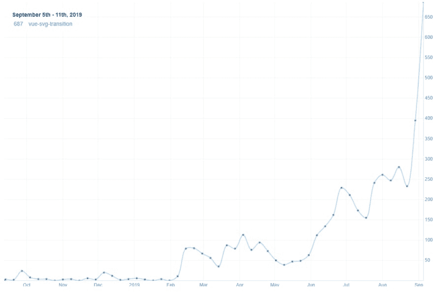

# 如何为你的开源库获得流量

> 原文:[https://dev . to/kaos/how-to-gain-traffic-for-your-open-source-library-20dg](https://dev.to/kaos/how-to-gain-traffic-for-your-open-source-library-20dg)

在这篇文章中，我将向你描述一个为你的开源库获取流量的过程。

## [](#introduction)简介

我做了我的第一个开源库，我知道它对其他人也有用。所以我创建了一个 npm-package，但是它没有找到很多流量。直到我得到我的第一颗随机 GitHub 星，才促使我传播我所构建的包。下面的步骤将描述我将每周下载量增加到 600+和将 GitHub stars 增加到 80+的过程。

## [](#create-amp-publish-the-package)创建&发布包

你要做的第一件事是创建一个可重用的库包，并将其发布到你的包所属的生态系统的公共注册中心。这里有一些比较流行的注册表的快速概述。

| 语言 | 登记处 |
| --- | --- |
| Java Script 语言 | [npm](//npmjs.com) |
| 。网 | [NuGet](https://www.nuget.org/) |
| 红宝石 | [Rubygems](https://rubygems.org) |
| 计算机编程语言 | [哔/哔](https://pypi.org/) |

如果你的语言没有列出来，不要担心，可能也有一个公共注册表。你可能会在谷歌上快速搜索:`{language} package registry`找到它。

## [](#good-readme-and-documentation)良好的自述和文档

将一个好的自述文件添加到您的存储库中，这样其他开发人员就可以快速开始使用您的库。一份好的自述文件至少应该包括:

*   包裹是关于什么的
*   如何安装软件包
*   如何使用该软件包的示例
*   如何定制软件包

如果你的包是用于 UI 的，你也应该包括一个可视化的演示。这可以是一张图片/Gif，甚至是一个完整的文档网站。

对于文档，您可以快速入门静态站点生成器，并在 GitHub 页面上免费托管它们。
GitHub 有一个不错的[条](https://help.github.com/en/articles/configuring-a-publishing-source-for-github-pages)的流程。

## [](#post-in-related-forums)在相关论坛发帖

查找与您的图书馆相关的论坛。你可以把链接提交到你的知识库，或者写一篇关于这个库解决了什么问题的博文。这种论坛的例子可以是:

*   新闻网站名
*   dev.to
*   黑客新闻
*   不调和

## [](#post-on-social-media)在社交媒体上发帖

在社交媒体上发布展示你图书馆的相关标签。

## [](#submit-it-to-a-newsletter)提交给简讯

如果你的图书馆生态系统有官方通讯，你可以在那里提交！通常情况下，你只需将链接提交给你的存储库。同样，你也可以就此写一篇完整的博文，然后将博文提交给时事通讯。

## [](#look-for-an-awesome-list)寻找牛逼榜单

Awesome 列表是针对特定生态系统的 awesome 工具列表。甚至还有一个[牛逼列表](https://github.com/sindresorhus/awesome)的牛逼列表。找到您的列表，并使用您添加的存储库创建一个拉式请求。

## [](#concluding)总结性的

然而，开源最重要的事情是为他人提供附加值。如果你提供附加值，你的包**将会被使用。**

出于好奇，这里有一些统计数据和我的知识库的链接。
[](https://res.cloudinary.com/practicaldev/image/fetch/s--STfX4Kac--/c_limit%2Cf_auto%2Cfl_progressive%2Cq_auto%2Cw_880/https://thepracticaldev.s3.amazonaws.com/i/np2lq7mrp7fuop0y0f9h.png)T4】

## [【kai-Oswald】](https://github.com/kai-oswald)/[视图 svg 过渡】](https://github.com/kai-oswald/vue-svg-transition)

### 创建双态 SVG 供电的转换

<article class="markdown-body entry-content p-5" itemprop="text">

# 视图 svg 过渡

> 创建双态、SVG 支持的动画图标

[T2】](https://raw.githubusercontent.com/kai-oswald/vue-svg-transition/master//assets/demo.gif)

[Codesandbox 演示](https://codesandbox.io/s/6v20q76xwr)

受[图标过渡生成器](https://blog.nucleoapp.com/create-2-state-svg-powered-animated-icons-76ed19160a7e)的启发

[T2】](https://camo.githubusercontent.com/3143e668c42a175ee67e24d23e0ceae1f05a7e7e/68747470733a2f2f696d672e736869656c64732e696f2f6e706d2f762f7675652d7376672d7472616e736974696f6e2e737667)

## 快速启动

```
npm install --save vue-svg-transition 
```

```
import Vue from 'vue'
import SvgTransition from 'vue-svg-transition'
Vue.use(SvgTransition);
```

## 模板示例

建议使用 [`vue-svg-loader`](https://www.npmjs.com/package/vue-svg-loader) ，这样我们可以从外部文件导入我们的 SVG，但是也可以使用内嵌 SVG。

```
<template>
    <svg-transition :size="size">
        <MyIcon slot="initial" />
        <MyOtherIcon />
    </svg-transition>
</template>

<script>
import MyIcon from "./assets/MyIcon.svg";
import MyOtherIcon from "./assets/MyOtherIcon.svg";

export default {
 components: {
 MyIcon,
 MyOtherIcon
 }
 data() {
 return {
 size: {
 width: 48,
 height: 48
 }
 }
 }
}
</script>
```

通过`ref`编程触发

```
<svg-transition ref="transition
```

…</article>

[View on GitHub](https://github.com/kai-oswald/vue-svg-transition)