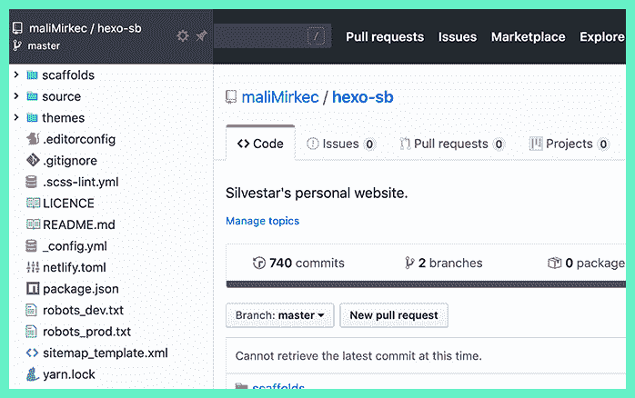
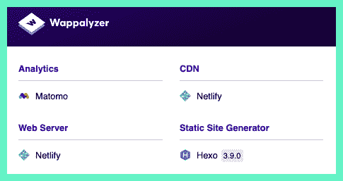
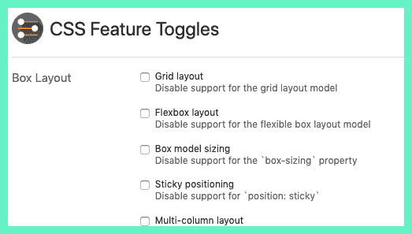
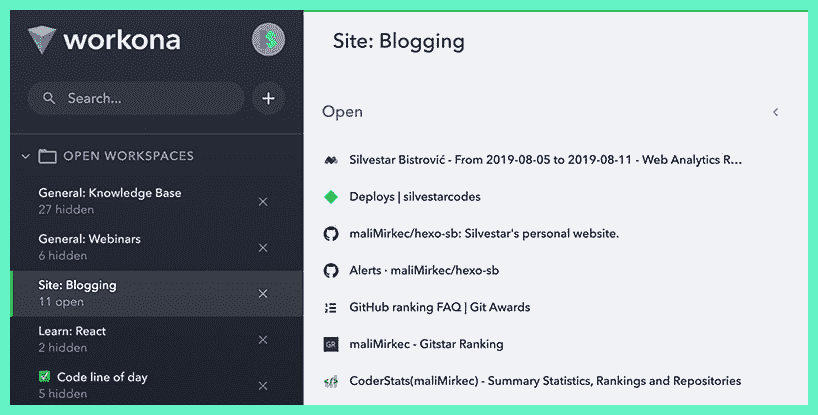
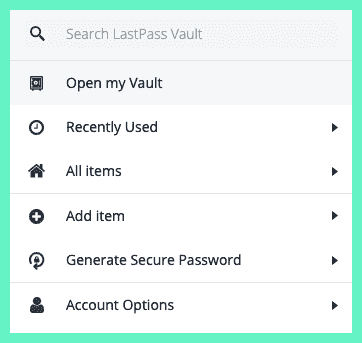
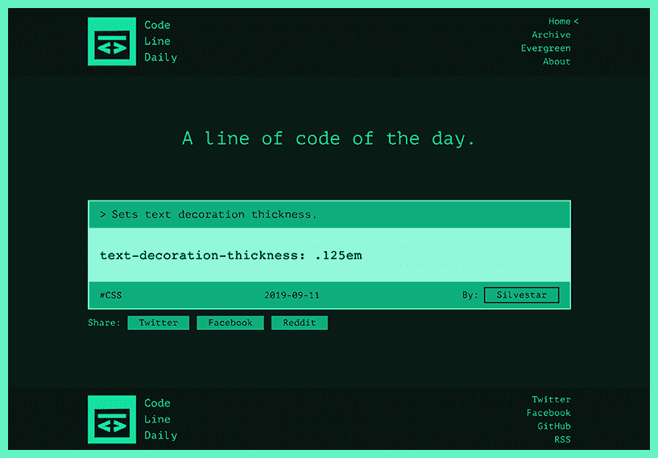

# 我最喜欢的用于 web 开发的 Chrome 扩展(大部分)

> 原文：<https://dev.to/starbist/my-favorite-chrome-extensions-for-web-development-mostly-3aj8>

*这篇文章最初发表于 [silvestar.codes](https://www.silvestar.codes/articles/my-favorite-chrome-extensions-for-web-development-mostly/) 。*

web 浏览器是 web 开发的基本工具之一。除了默认安装自带的强大开发工具，你可以考虑这些 Chrome 扩展来帮助你完成日常任务:

*   [八叉树](#Octotree)
*   [晶片化器](#Wappalizer)
*   [CSS 特性切换扩展](#CSS-Feature-Toggle-Extension)
*   [工作地点](#Workona)
*   [最后一遍](#LastPass)
*   [代码行每日](#Code-Line-Daily)
*   [代码页](https://chrome.google.com/webstore/detail/codopen/agnkphdgffianchpipdbkeaclfbobaak)
*   [关键词无处不在](https://chrome.google.com/webstore/detail/keywords-everywhere-keywo/hbapdpeemoojbophdfndmlgdhppljgmp)
*   [阻止自己进行分析](https://www.igorware.com/extensions/block-yourself-from-analytics)
*   [总是清除下载 2](https://chrome.google.com/webstore/detail/always-clear-downloads-2/jcajchndfkmnaefkhoaoiagemplbfffn)
*   [Chrome 语法](https://chrome.google.com/webstore/detail/grammarly-for-chrome/kbfnbcaeplbcioakkpcpgfkobkghlhen)
*   [去他妈的工作](https://chrome.google.com/webstore/detail/go-fucking-work/hibmkkpfegfiinilnlabbfnjcopdiiig?hl=en)
*   [缓冲器](https://chrome.google.com/webstore/detail/buffer/noojglkidnpfjbincgijbaiedldjfbhh?hl=en)
*   帕布罗
*   [表情键盘](https://chrome.google.com/webstore/detail/emoji-keyboard-emojis-for/fbcgkphadgmbalmlklhbdagcicajenei)

## [八叉树](https://www.octotree.io/)

Octotree 或“GitHub on steroids”是一个扩展，在 GitHub 页面上增加了一些额外的功能。最强大的特性是带有代码树的侧边栏，就像在 ide 中一样。当您试图在存储库中查找文件时，这很方便。

这是我的网站知识库 Octotree 侧边栏的预览。

## [晶片化器](https://chrome.google.com/webstore/detail/code-line-daily/jfgojeolhopchbgfdgodicnaimmkbpbg)

Wappalizer 识别当前站点中使用的技术。我发现这个扩展在审查新项目时很有帮助。我可以看到网站上使用的大多数技术，这让我可以决定是否接受一个项目，甚至做出评估。

例如，您可以看到我的网站使用 Matomo 进行分析，使用 Netlify 作为 web 服务器和 CDN，使用 Hexo 生成静态网站。

## [CSS 特性切换扩展](https://github.com/keithclark/css-feature-toggle-devtools-extension)

在不同的设备上测试网站可能是一项相当乏味但必须完成的任务。尽管网络正朝着正确的方向发展，但我们应该意识到不支持的 CSS 功能，如 CSS 网格或 CSS 变量。在你努力在不同的浏览器中测试你的网站之前，你可以先在 Chrome 中切换 CSS 功能来节省一些时间。CSS 功能切换扩展使您能够做到这一点—关闭 CSS 功能。

支持的功能包括:

*   布局特性——如 CSS 网格、Flex 和多列属性；
*   视觉渲染特性——如过渡、动画和遮罩；
*   尺寸特征-如`shape-inside`和`object-fit`属性；
*   其他特性——如 CSS 变量或`calc()`支持。

## [沃克纳](https://chrome.google.com/webstore/detail/workona/ailcmbgekjpnablpdkmaaccecekgdhlh?hl=en)

Workona 是一个我无法想象我的工作日不再没有的扩展。它就像一个项目经理，就在你的浏览器中，你可以在云端管理你所有的工作。这意味着我可以随时在不同的设备上打开我的标签页。我用它来组织我的工作空间，以便阅读文章、观看网络研讨会、学习和从事单独的项目。

你可以在仪表板上看到我工作的一部分。要打开特定工作区的选项卡，只需单击一下即可。

## [LastPass](https://chrome.google.com/webstore/detail/lastpass-free-password-ma/hdokiejnpimakedhajhdlcegeplioahd)

LastPass 是一个密码管理器。它可以存储密码，并且可以自动为您填充登录字段。当处理大量客户时，它可以节省你的时间和理智。我也在手机上使用它。它非常有效。

在测试表单时，LastPass 也可以为您节省大量时间。您可以用虚拟数据创建一个配置文件，然后使用“填充”选项来填充表单。我经常在注册表单中使用这个特性。

有趣的事实:我有超过 20 次的空闲登录。😵

## [代码行日报](https://chrome.google.com/webstore/detail/code-line-daily/jfgojeolhopchbgfdgodicnaimmkbpbg)

《每日代码行》是我上个月左右做的一个兼职项目。这是本月早些时候在产品搜索上推出的。

一个追随者建议它可以被用作浏览器插件。本周 Code Line Daily 在 Chrome 网上商店中作为扩展[提供。](https://chrome.google.com/webstore/detail/code-line-daily/jfgojeolhopchbgfdgodicnaimmkbpbg)

## 优秀奖

这些扩展安装在我的 Chrome 上，但我并不经常使用它，或者说我并不太关注它:

*   [变开](https://chrome.google.com/webstore/detail/codopen/agnkphdgffianchpipdbkeaclfbobaak)。显示的扩展允许在单独的窗口中预览 Codepen 代码段，以便在您喜欢的工具中更容易地调试。*有趣的事实:莎拉·德拉斯纳的丈夫做了这个扩展作为给她的礼物。*
*   [随处可见的关键词](https://chrome.google.com/webstore/detail/keywords-everywhere-keywo/hbapdpeemoojbophdfndmlgdhppljgmp)。用于搜索引擎优化研究的扩展。它显示网站中的关键词，如谷歌搜索、谷歌搜索控制台和谷歌分析。这对基础研究是有用的。
*   [阻止自己进行分析](https://www.igorware.com/extensions/block-yourself-from-analytics)。它可以防止记录你访问谷歌分析。这在处理低流量网站时非常有用。
*   [永远清除下载 2](https://chrome.google.com/webstore/detail/always-clear-downloads-2/jcajchndfkmnaefkhoaoiagemplbfffn) 。它在完成后自动清除下载列表，最重要的是，关闭下载栏。
*   [语法上为铬](https://chrome.google.com/webstore/detail/grammarly-for-chrome/kbfnbcaeplbcioakkpcpgfkobkghlhen)。是每个人必备的扩展。我使用的是付费版本，但它在免费层提供了许多引人注目的功能。
*   [去他妈的工作](https://chrome.google.com/webstore/detail/go-fucking-work/hibmkkpfegfiinilnlabbfnjcopdiiig?hl=en)。当你访问被你定义为浪费的网站时，它会用相当强烈的语言显示激励信息。这使得回去工作不止一次。
*   [缓冲器](https://chrome.google.com/webstore/detail/buffer/noojglkidnpfjbincgijbaiedldjfbhh?hl=en)。这是一个重要的工具，用于安排社交分享。我每天都在使用它。
*   巴勃罗。它用溢出的文本和自定义效果创建引人入胜的社交图像。
*   [表情符号键盘](https://chrome.google.com/webstore/detail/emoji-keyboard-emojis-for/fbcgkphadgmbalmlklhbdagcicajenei)。有时候你只需要搜索一个表情符号来表达自己。它按类别显示表情符号，并且有强大的搜索功能。