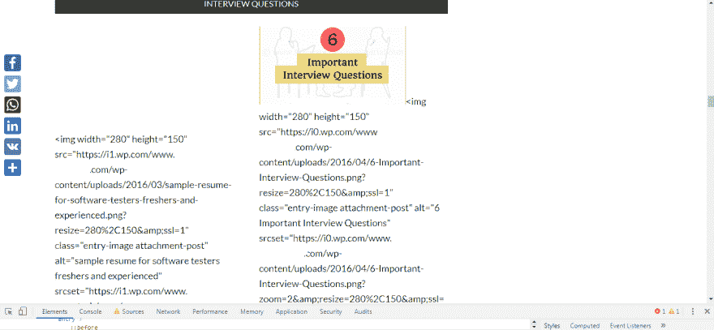
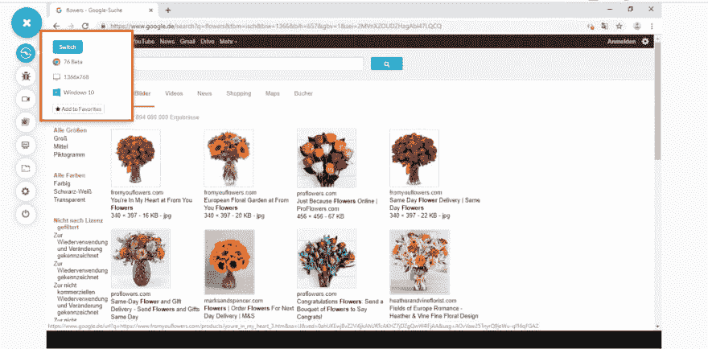
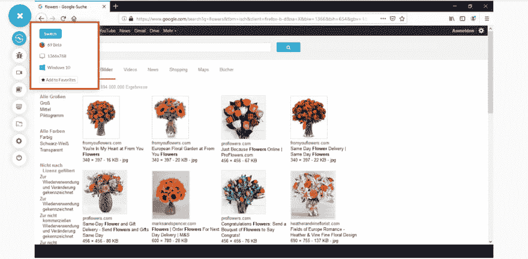

# 禁用 JavaScript 设置的 Selenium 自动化测试；值得你花时间吗？

> 原文：<https://dev.to/ramitd1995/selenium-automation-testing-with-disabled-javascript-settings-is-it-worth-your-time-3l8p>

Selenium 是自动化网站测试行业中开源软件的巅峰。自动化测试框架被测试社区广泛采用，以帮助他们自动化与桌面 web 应用程序的交互。

我已经做了几年的自动化测试员，自从我知道 Selenium 的能力之后，我就非常喜欢它。最近，我在思考几个问题！如果我禁用 JavaScript，然后用 Selenium 执行[自动化测试，会发生什么？那么网站会有什么反应呢？这可能吗？这是必须的吗？](https://www.lambdatest.com/selenium-automation?utm_source=dev&utm_medium=Blog&utm_campaign=Ramit-12092019&utm_term=Ramit)

知道这些问题答案的唯一方法是让我自己来测试。我得到了有趣的结果。这就是为什么我写这篇文章来与你分享这些结果。

## 用 JavaScript 能做的事情&不能做的事情！

我相信您一定很想知道在禁用 JavaScript 后是否有必要测试 web 应用程序？然而，在我回答这个问题之前，我们需要了解作为一名测试人员，你能用 JavaScript 做什么&你不能做什么！

### 用 JavaScript 可以做的事情

*   访问和修改网页上可见的所有内容，如文本、图像、视频或任何其他类型的私人数据。
*   访问 web 服务器发送的 cookies。
*   向其他服务器发出数据捕获请求。

### 用 JavaScript 做不到的事情

*   访问存储在本地系统中的文件，而不是上传到网页上的文件。
*   从在其他选项卡或不同浏览器上打开的其他网页中访问数据。
*   访问和控制系统的硬件功能。
*   访问任何与已经安装的扩展和插件相关的东西。

既然你已经知道了 JavaScript 的用途。您可能想知道最终用户在网上冲浪时禁用浏览器中的 JavaScript 的原因？

## 为什么用户会在禁用 JavaScript 的情况下访问您的网站？

信不信由你！我们中的一些人实际上更喜欢在浏览器中禁用 JavaScript 的情况下上网。为什么？嗯，通过禁用 JavaScript，我们旨在实现网站内容的中断式用户体验。这样做可以消除弹出窗口、广告、警告等。让我们通过一个场景来更好地理解这一点。

你认为迈克现在会有什么感觉？

嗯，他可能对网站的整体体验感到失望。这种弹出窗口在互联网上的任何网站上都很常见。这就是为什么，Mike 确保禁用 JavaScript，以确保他不会遇到更多的弹出窗口、警报、警告、广告等。从你的网站上。

然而，当 Mike 禁用 JavaScript 时，您的网站完全崩溃了！以荒谬的方式呈现的内容。你的网站图片中嵌入了相关文章的超链接，这些链接会崩溃，并开始单独显示。

[](https://res.cloudinary.com/practicaldev/image/fetch/s--It78AxCq--/c_limit%2Cf_auto%2Cfl_progressive%2Cq_auto%2Cw_880/https://cdn.lambdatest.com/blog/wp-content/uploads/2019/08/javascript.png)

看起来很可怕，不是吗？现在，你不可能阻止像 Mike 这样的用户在他们的浏览器中禁用 JavaScript。我同意，不会有很多人会像迈克一样上网。有一些网站完全依赖 JavaScript，这是一个很糟糕的做法，当 JavaScript 被禁用时，无法加载任何资源或使 UX 降级。

然而，这完全取决于你希望你的企业看起来有多好，更重要的是有多少。作为一种最佳实践，在禁用 JavaScript 的情况下测试您的网站是最有利的。最好的部分是，你不需要安装任何插件或任何其他第三方应用程序来禁用 JavaScript，你有这个选项在你的浏览器首选项本身。在接下来的章节中，我将向您展示如何在禁用 JavaScript 的情况下进行测试。然而，在我们这样做之前，有一些其他的原因让你在测试你的网站时考虑禁用 JavaScript。

## 为什么禁用 JavaScript 的测试应该是你的 QA 清单的一部分？

**提高测试速度:**由于 JavaScript 的主要目的是为网页带来交互模式，这需要更高的带宽来加载，当你有一个较低的带宽连接时，它要么加载非常慢，要么降低用户与网站的交互。因此，在禁用 JavaScript 之后进行测试，可以避免加载不必要的 JavaScript 资源，从而提高测试速度，并且不会因为网页加载失败而导致自动化测试脚本失败。

作为一个结论，你可以在很短的时间内得到你的测试结果，不会因为任何第三方资源而影响你的测试流程。

**易于访问:**许多最终用户在访问任何网站时都不希望看到任何类型的广告或弹出窗口，因为这类东西会让他们从想要的内容中分心。因此，很多时候，这些 JavaScript 资源在最终用户访问特定网站时会被关闭。这迫使网站所有者在禁用 JavaScript 后测试他们的网站，以验证他们的用户可以轻松访问他们的网站。

此外，请记住，一些网站完全依赖 JavaScript 来使他们的用户界面更具交互性，在禁用 JavaScript 后测试这样的 web 应用程序没有任何意义，如果你进行无头浏览器测试会更好。

**跨浏览器兼容性:**常见的[JavaScript](https://www.lambdatest.com/blog/fixing-javascript-cross-browser-compatibility-issues/?utm_source=dev&utm_medium=Blog&utm_campaign=Ramit-12092019&utm_term=Ramit)跨浏览器兼容性问题可以注意到，例如:

*   浏览器 JavaScript 解释器不能解析和执行 JavaScript 代码。
*   ECMAScript6 / ECMAScript Next 和 modern Web API 等新的 JavaScript 特性无法在旧版本的浏览器中运行。

处理这样的 JavaScript 问题会给 web 开发人员带来噩梦。因此，测试人员有必要[执行跨浏览器测试](https://www.lambdatest.com/blog/performing-cross-browser-testing-with-lambdatest/?utm_source=dev&utm_medium=Blog&utm_campaign=Ramit-12092019&utm_term=Ramit)，以验证他们的网站在没有 JavaScript 的情况下如何呈现，然后开发团队可以继续解决 JavaScript 问题。对于跨浏览器兼容性测试，一些开发人员更喜欢渐进增强技术，而一些开发人员更喜欢适度降级技术。

[**LambdaTest 是一个跨浏览器测试工具，拥有 2000+个真实浏览器，帮助你在云上测试你的 web 应用。免费报名！**T3】](https://www.lambdatest.com/landing-text-cta?utm_source=dev&utm_medium=Blog&utm_campaign=Ramit-12092019&utm_term=Ramit)

你可以在 LambdaTest 上用和不用 JavaScript 测试你的网站，了解你的网页在不同场景下的呈现方式。

**安全性:**如前所述，JavaScript 是网站的可执行代码，当我们访问网站时，它会被下载到您系统的本地浏览器中，然后运行。网页上可见的许多广告是黑客传播恶意软件的基本意图。这种在线广告通常被称为在用户的机器中植入僵尸 cookies。这迫使高度关注安全性的最终用户禁用网站 JavaScript 以进一步访问。

因此，现在有必要为那些喜欢不用 JavaScript 访问网站的最终用户测试一个 web 应用程序。

现在，我们将研究在网站测试中禁用 JavaScript 的过程。

## 如何禁用 JavaScript 进行手工测试

我将在两种浏览器中演示该过程，即 Google Chrome 和 Mozilla Firefox，以帮助您将该过程集成到跨浏览器测试清单中。我会使用 LambdaTest 来帮助我访问不同的浏览器，而不用经历安装它们的麻烦。

### 1。谷歌浏览器

在 Chrome 浏览器中测试一直是测试人员优先考虑的事情。以下是谷歌搜索默认情况下的表现方式。也就是说，启用 JavaScript 时。

[](https://res.cloudinary.com/practicaldev/image/fetch/s--W1artqNG--/c_limit%2Cf_auto%2Cfl_progressive%2Cq_auto%2Cw_880/https://cdn.lambdatest.com/blog/wp-content/uploads/2019/08/pasted-image-0-7.png)

*JavaScript 已启用*

以下步骤可以帮助你在 Chrome 中禁用 JavaScript:

*   启动需要禁用 JavaScript 的网页。
*   右键单击页面并指向检查元素。
*   打开开发工具后，按 CTRL+SHIFT+P。
*   键入“禁用 JavaScript ”,然后单击第一个选项“调试器”。

[](https://res.cloudinary.com/practicaldev/image/fetch/s--xaQxZPAH--/c_limit%2Cf_auto%2Cfl_progressive%2Cq_auto%2Cw_880/https://cdn.lambdatest.com/blog/wp-content/uploads/2019/08/Disable-JavaScript.png)

*JavaScript 被禁用*

### 2。Mozilla Firefox

与 Google Chrome 类似，下面是 Google search 默认情况下用启用的 JavaScript 表示自己的方式。

[](https://res.cloudinary.com/practicaldev/image/fetch/s--CfdHz88e--/c_limit%2Cf_auto%2Cfl_progressive%2Cq_auto%2Cw_880/https://cdn.lambdatest.com/blog/wp-content/uploads/2019/08/enabled-javascript.png)

*JavaScript 已启用*

按照以下步骤在 Mozilla Firefox 上禁用网站的 JavaScript:

*   启动浏览器，在 URL 地址栏输入“about:config”
*   点击“我接受风险！”要查看配置
*   在搜索栏中输入“javascript.enabled”
*   双击“javascript.enabled”可用条目，将布尔值设置为 false

[ ](https://res.cloudinary.com/practicaldev/image/fetch/s--Um5PsbFX--/c_limit%2Cf_auto%2Cfl_progressive%2Cq_auto%2Cw_880/https://cdn.lambdatest.com/blog/wp-content/uploads/2019/08/JavaScript-Disabled.png) * JavaScript 启用*

**注意:**您可以使用这个[网站](https://www.whatismybrowser.com/detect/is-javascript-enabled)来确认您的 JavaScript 是否被启用或禁用。

## 如何使用 Selenium 禁用 JavaScript 进行自动化测试

现在，我们开始用 Selenium 进行自动化测试。下面是帮助在 Chrome 和 Firefox 浏览器上禁用 JavaScript 的代码。我们已经使用了 **ChromeOptions** 和 **FirefoxOptions** 类来处理浏览器的偏好。这些类进一步帮助设置 **ChromeDriver** 和 **FireFoxDriver** 的特定功能，如浏览器版本、禁用扩展、最大化启动、无头启动和使浏览器默认。

在 Mozilla Firefox 中使用 Selenium 运行自动化测试的代码

```
package DemoAutomation;

import java.util.HashMap;
import java.util.Map;

import org.junit.Test;
import org.openqa.selenium.By;
import org.openqa.selenium.JavascriptExecutor;
import org.openqa.selenium.WebDriver;
import org.openqa.selenium.WebElement;
import org.openqa.selenium.firefox.FirefoxDriver;
import org.openqa.selenium.firefox.FirefoxOptions;

public class JSdisableFirefox {

    //Disabling JS in Firefox
    @Test()
    public void Firefox_javascript_disable() throws InterruptedException {

        System.setProperty("webdriver.firefox.driver", "C:\\geckodriver.exe");

        FirefoxOptions options = new FirefoxOptions();
        options.addPreference("javascript.enabled", false);

        WebDriver driver = new FirefoxDriver(options);

        driver.get("https://www.google.com/imghp");
        driver.findElement(By.name("q")).sendKeys("flowers");
        driver.findElement(By.className("Tg7LZd")).click();

        Thread.sleep(5000);
        driver.quit();

    }
} 
```

**在谷歌浏览器中用 Selenium 运行自动化测试的代码**

```
package DemoAutomation;

import java.util.HashMap;
import java.util.Map;

import org.junit.Test;
import org.openqa.selenium.By;
import org.openqa.selenium.JavascriptExecutor;
import org.openqa.selenium.WebDriver;
import org.openqa.selenium.WebElement;
import org.openqa.selenium.chrome.ChromeDriver;
import org.openqa.selenium.chrome.ChromeOptions;

public class JSdisableChrome {

           //Disabling JS in Chrome
          @Test()
    public void Chrome_javascript_disable() throws InterruptedException {

        System.setProperty("webdriver.chrome.driver", "C:\\Users\\Lenovo-I7\\Desktop\\Selenium\\chromedriver.exe");

        ChromeOptions options = new ChromeOptions();
        Map<String, Object> prefs = new HashMap<String, Object>();
        prefs.put("profile.managed_default_content_settings.javascript", 2);
        options.setExperimentalOption("prefs", prefs);

        WebDriver driver = new ChromeDriver(options);

        driver.get("https://www.google.com/imghp");
        driver.findElement(By.name("q")).sendKeys("flowers");
        driver.findElement(By.className("Tg7LZd")).click();
        Thread.sleep(5000);

        driver.quit();  

    }

} 
```

## 结论

JavaScript 已经成为 web 开发不可或缺的一部分，它无疑有助于为我们提供一个吸引眼球的网站。然而，重要的是我们要测试我们构建的东西。在我看来，从 UX 的角度来看，结果是有点毁灭性的。我测试过的网站很少有完全空白的。原因是，该网站完全依赖于 JavaScript 渲染。即使网站部分依赖于 JavaScript，测试人员也有责任从用户的角度测试他们的产品是否使用了 JavaScript。不要忘记禁用 JavaScript 的[浏览器兼容性测试](https://www.lambdatest.com/feature?utm_source=dev&utm_medium=Blog&utm_campaign=Ramit-12092019&utm_term=Ramit)将帮助您确保为更广泛的受众建立一个强大的网站。如果你使用的是基于云的跨浏览器测试工具，比如 LambdaTest，那么你可以在云上的 VM 托管的 2000 多个真实浏览器上进行测试。因此，您不必担心维护自己的浏览器库，因为我们会为您维护。测试愉快！🙂

[](https://accounts.lambdatest.com/register/?utm_source=dev&utm_medium=Blog&utm_campaign=Ramit-12092019&utm_term=Ramit)