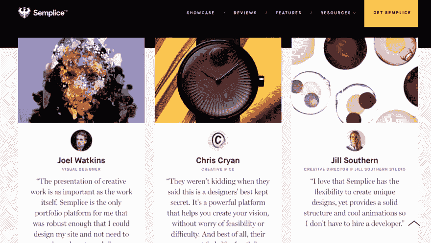
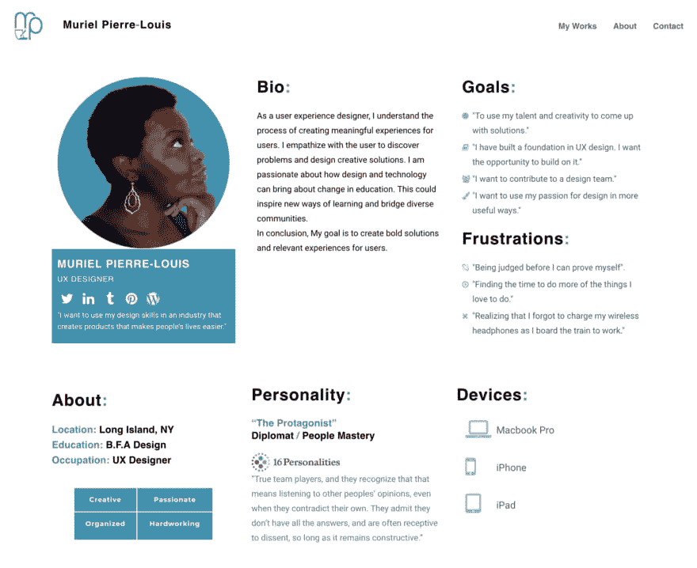
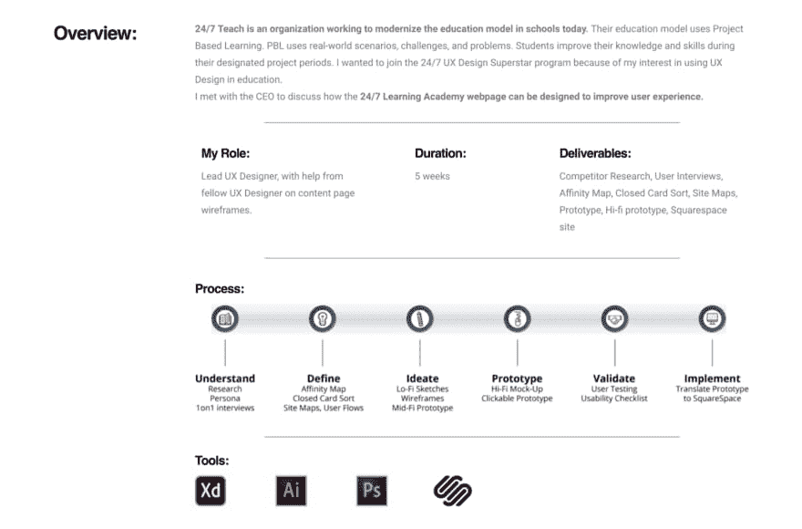
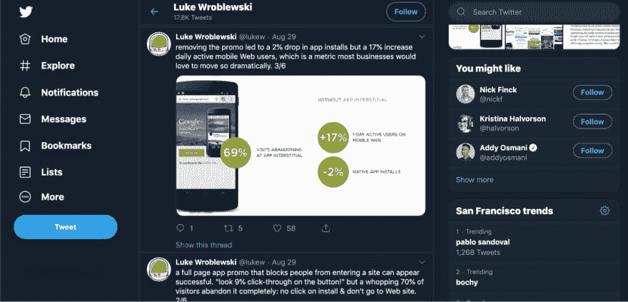

# 创建网页设计作品集-没有工作经验

> 原文：<https://dev.to/ramotiondev/creating-a-web-design-portfolio-without-work-experience-2ff5>

你想成为一名网页设计师，但你以前没有从事过网页设计，那么你该如何整理作品集呢？这不是一个独特的问题，我们所有人都经历过。不要害怕，这是可能的。我们可以帮忙。无论你是想为一个国家的[获奖网站专家](https://medium.com/theymakedesign/best-web-design-companies-3ecc85b32071)或一个特定的[机构](https://www.ramotion.com/agency/web-design)工作，还是直接为一家企业工作，这些建议可以让你朝着正确的方向前进。

## 入门指南

有什么地方比关于你的网站更好呢？一个独特的，个性化的作品集可以成为你展示你在网页设计中的技能和独特风格的最佳作品。随着经验的增长，如果计划得当，可以增加项目。

## 地点和方式

虽然你有设计技能，但你可能没有开发技能。没关系。大量的免费和付费平台可以帮助你主持和实现你的设计。无论你选择哪个网站建设者或网页设计软件都会提供模板和插件。看看 [WordPress](https://wordpress.com/) ， [Wix](https://www.wix.com/) ， [Dribble](https://dribbble.com/) ，[büHance](http://www.behance.net/)， [Coroflot](http://www.coroflot.com/people) ，或者其他工具，如果你已经习惯了别的东西。这些工具旨在帮助非设计者规划和设计他们的网站，但也足够灵活，允许你实现自己的设计。同时仍然帮助您编码和管理它。[运球战术手册](https://dribbble.com/playbook/info)举例来说，让你创建一个运球简介，将其转换成一个网站，并选择一个自定义的 URL。

为了获得更大的灵活性， [Semplice](https://www.semplice.com/) 是一个选项。它使用 WordPress 并提供大量的字体和图片，但不会强迫你使用固定的模板。它甚至允许你包含响应式的网页设计元素，这些元素可以平滑地加载和转换，你不需要成为一个开发者就可以实现。

###### semplice.com/reviews

如果你想要一个更个性化的 URL，或者有一些你想展示的开发技能，你可以购买一个域名。这使得招聘人员或联系人很容易记住 URL，并且不包括与主机或工具名称相关的额外单词。如果你在 URL 中使用你的名字，他们可以很容易地通过谷歌搜索找到你的投资组合。

## 内容

除了示例项目和过去的工作，您还需要提供关于您的其他相关信息。虽然 Muriel Pierre-Louis 是一名经验丰富的 UX 设计师，而不是一名新手网站设计师，但她的作品集网站有一些很棒的元素可以包含在你自己的网站中。

*   简历:制作一份视觉效果丰富的简历。当你申请工作时，你仍然需要一个或多个 Word / PDF /纯文本版本。大部分大公司用的简历解析器，读不出漂亮的，设计好的简历。这是制作时髦的信息图形风格页面的地方

*   联系方式:除了基本的电话和电子邮件，你可以链接到社交媒体上的个人资料或其他可以联系到你的链接，或者突出你对设计的观点/方法。
*   关于我:考虑为潜在的面试问题提供答案，比如“让我们从你告诉我们你自己开始吧。”抓住机会在你的网页设计文件夹中回答这样的问题。这将有助于你知道到时候如何当面回答他们。这也有助于你的网站访问者了解是什么让你成为独一无二的你，以及是什么让你成为他们组织的资产。你可以谈论你的激情，以及是什么让你兴奋。最棒的是，它给了他们一个开始提问的地方，但是要一直问下去

## 接下来呢？

好，太好了，这是一个项目。但是你可能仍然想知道一些事情。比如我在网站上还放了什么？在你开始推广你的网站之前，项目的正确数量是多少？以及每个项目应该如何呈现？记住，你在寻找初级职位，他们不希望有大量的工作。如果你展示得好，大约 3-5 个项目就足够了。

## 利用你的教育

许多博客和专家推荐设计作品集的案例研究风格。这可以让你围绕每个例子展开一个故事，围绕你的工作产品展开背景，并让潜在雇主了解你解决问题的方法。仅仅包括一些截图和一个链接并不能很好地解释你的工作以及你为什么选择这些元素。另外，这是另一个面试准备的机会；你提醒自己这些细节，或者解释你尝试过的东西(不管是否有效)。坚持一致的格式，包括诸如总结、问题描述、过程、什么可行或不可行以及为什么。

学校项目是做到这一点的好方法。如果你忘记了任何细节，你可以回头看看作业细节和教师反馈。你有机会从各种侧重于特定技能和展示你所学的课程中获得样本。因为课程和作业的目的是教你过程和技术，它们通常要求你用一种可以很容易转化为案例研究的方式来说明你所学到的东西。

## 不断学习

但是你还是不能拿出三件作品？仅仅因为你完成了学业并不意味着你应该完成学习。大多数课程包括基础教育要求和少数学位特定课程。查看一些在线资源，比如 LinkedIn Learning(之前的 Lynda.com)或 T2 SkillShare(T3 ),寻找你在过去的课程工作中没有涉及的领域，无论是网页设计课程还是其他相关领域。这有助于完善你的教育，表明你对不断提高技能感兴趣，并促成一两个项目。一些需要考虑的方面:

*   编程；编排
*   响应式网页设计
*   工具教程
*   3D 平面设计
*   网页设计趋势

## 自由职业者和公益工作

如果你仍然没有足够的钱，考虑为你阿姨的日托所、你的教堂或者一个社区非营利组织设计一个网站。你不会得到报酬，但你会获得宝贵的经验，为你的投资组合添砖加瓦，并为别人做一些美好的事情。

另一个选择是加入一个自由职业网站，找一些低收入的工作。自由网页设计是开始你职业生涯的好地方。如果你寻找入门级的上市公司，找到工作的门槛会很低，而且除了投资组合之外，你还会获得一些与客户合作的宝贵经验。允许你寻找客户和管理收入的网站包括 Upwork、Elance 和 Fiverr。

## 出去吧

制作作品集最重要的部分是让人们访问你的网站。这不是“如果你建造了它，他们就会来”的情况。像 Dribble 和 Behance 这样的网站，作为你网站的主机，也是推广这种巧妙的新投资组合的绝佳平台。查看 CreativBloq 的“让你的作品在行为上受到关注的最佳方法”,获得赢得关注者的建议，并学习如何在策划的内容页面上获得特色。

将您网站的 URL 添加到社交媒体档案中，包括 LinkedIn 和 Twitter。但是不要只是链接，也要说说。上面我们提到包括你的社交媒体的链接。你还必须积极参与社交媒体。你欣赏的朋友设计师，喜欢并转发有趣的文章，谈论你发现的想法或新技术。活跃会带来更多的社交机会和引起注意。Twitter、Instagram 和 LinkedIn 都是不错的起点。卢克·乌鲁布莱夫斯基就是一个很好的例子。他的个人资料包括对他的(职业)兴趣领域的简短描述，以及到他的作品集网站的链接，他会重新发布感兴趣的文章和最近的事件。

## 更新，更新，更新

当你开始找工作，继续你的教育，或者增加你的工作，保持更新和刷新你的网站。你可能只开始了一个项目，但很快你就会有很多工作的例子来充实你的作品集。即使你已经获得了第一份“真正的”工作，也要保持你的作品集与时俱进。机会总是会突然出现，你会想要准备好抓住它们。随时更新你的网页设计作品集会让你在机会出现时充满自信。

记录每个项目的每一步，无论大小。捕捉你早期设计的截屏，扫描早期的纸上作品，如草图，并从你的雇主或客户那里获得使用这些作品的许可。定期安排一段时间来反思你的成就，并添加你最喜欢的设计。当你在一次活动中遇到一位潜在的招聘经理时，你就万事俱备了，你将深入了解创意过程，看看你已经成长了多少，重新点燃你的激情，并有可能在未来的项目中尝试一些不同的东西。

## 摘要

不要等着开始你的作品集或推广它。即使你现在只有一个课程项目。你可以也应该不断地添加和改进你的网站。这不仅是获得第一份工作的一种方式，也是在你开始和继续职业生涯时成长、反思和重新聚焦的一种宝贵方式。祝你好运！

**阅读更多:**

[网页设计机构:世界级网站的原则](https://5dd6d7c29f479.site123.me/blog/web-design-agency-principles-of-a-world-class-website)
[网页设计者必须了解这些网页设计趋势](https://web-development-design.cabanova.com/web-design-company.html)
[网页设计流程——当你时间或金钱紧张的时候](http://theymakedesign.mystrikingly.com/blog/web-design-process)
[网页设计机构:4 个提高转化率的最佳技巧](http://theymakedesignreal.tilda.ws/web-design-agency-tips-to-have-higher-conversion-rate)
[网页设计公司:一个可衡量的网站是成功的关键](https://www.notion.so/Web-Design-Companies-A-Measurable-Website-Is-Key-To-Success-20739c0fa36643b7a80711250f30ae87)
[之前要回答的 5 个问题 设计机构](http://theymakedesign.wikidot.com/web-design-agency-questions)
[网站设计师:一个伟大网站的特点讲解](https://web-development-journal-28.webself.net/web-design-company)
[网站设计机构:创建一个转化型网站的技巧](https://www.bloglovin.com/@110186/web-design-agency-tips-to-create-a-converting)