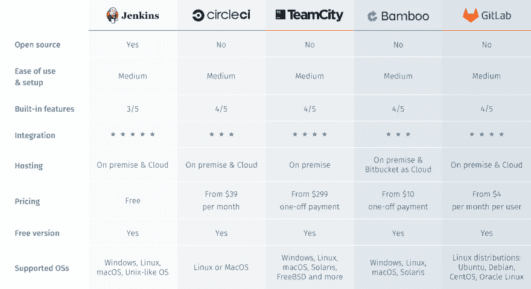

# 你必须知道的 14 个最佳 CI/CD 工具| 2021 年更新

> 原文:[https://dev . to/katalon/best-14-ci-CD-tools-you-must-know-updated-for-2019-3023](https://dev.to/katalon/best-14-ci-cd-tools-you-must-know-updated-for-2019-3023)

“质量速度”是软件开发的新准则。

企业正朝着 DevOps 方法和敏捷文化前进，以加快交付速度并确保产品质量。在 DevOps 中，连续的自动化交付周期是实现快速可靠交付的基础。

这导致了对适当的持续集成和持续交付(CI/CD)工具的需求。一个“好的”CI/CD 工具可以利用团队当前的工作流程，最好地利用自动化特性，创建一个可靠的 CI/CD 管道，并给团队提供他们成长所需的动力。如果你是 CI/CD 的新手，请看看[这个博客](https://www.katalon.com/resources-center/blog/ci-cd-introduction/)。

随着市场上可用的 CI/CD 工具越来越多，团队可能很难做出艰难的决定来挑选正确的工具。该列表包含“市场上最好的 14 个 CI/CD 工具”，以及它们的主要特性，使您和您的团队的选择过程更容易。

[T2】](https://res.cloudinary.com/practicaldev/image/fetch/s--pu0DP_kv--/c_limit%2Cf_auto%2Cfl_progressive%2Cq_auto%2Cw_880/https://d1h3p5fzmizjvp.cloudfront.net/wp-content/uploads/2019/09/12133213/Best-15-CICD-Tools%25402x1.png)

*2021 年五大 CI/CD 工具*

质量 CI/CD 工具的另一个重要标准是它与持续测试软件集成的能力。[**Katalon Studio**](https://www.katalon.com)——一个自动化的、持续的测试解决方案——可以与业界最常见的 CI/CD 工具集成。通过本机内置集成，您可以使用 Katalon Studio 创建、计划、执行自动化测试、分析报告，并与您想要的 CI/CD 管道集成。

[T2】](https://www.katalon.com/)

## **1。詹金斯**

[T2】](https://res.cloudinary.com/practicaldev/image/fetch/s--Nmhlsg-e--/c_limit%2Cf_auto%2Cfl_progressive%2Cq_auto%2Cw_880/https://d1h3p5fzmizjvp.cloudfront.net/wp-content/uploads/2019/09/12120512/Best-15_Jenkins.png)

Jenkins 是一个开源自动化服务器，在其中进行集中构建和持续集成过程。它是一个独立的基于 Java 的程序，带有用于 Windows、macOS 和其他类似 Unix 的操作系统的软件包。Jenkins 拥有数百个可用的插件，支持软件开发项目的构建、部署和自动化。

**詹金斯关键特性:**

*   在各种操作系统上轻松安装和升级
*   简单和用户友好的界面
*   可扩展的巨大社区贡献的插件资源
*   用户界面中简单的环境配置
*   支持主从架构的分布式构建
*   基于表达式构建计划
*   支持在预构建步骤中执行 shells 和 Windows 命令
*   支持关于构建状态的通知

**许可证**:免费。Jenkins 是一个开源工具，有一个活跃的社区。

**首页:**[**【https://jenkins.io/】**T5】](https://jenkins.io/)

## **2。CircleCI**

[T2】](https://res.cloudinary.com/practicaldev/image/fetch/s--FWdMYlp3--/c_limit%2Cf_auto%2Cfl_progressive%2Cq_auto%2Cw_880/https://d1h3p5fzmizjvp.cloudfront.net/wp-content/uploads/2019/09/12130305/Best-15_Circleci.png)

CircleCI 是一个 CI/CD 工具，支持快速软件开发和发布。CircleCI 允许跨用户管道的自动化，从代码构建、测试到部署。

您可以将 CircleCI 与 GitHub、GitHub Enterprise 和 Bitbucket 集成，以便在提交新代码行时创建构建。CircleCI 还在云管理选项下托管持续集成，或者在私有基础设施上的防火墙后运行。

**CircleCI 主要特性:**

*   与 Bitbucket、GitHub 和 GitHub Enterprise 集成
*   使用容器或虚拟机运行构建
*   易于调试
*   自动并行化
*   快速测试
*   个性化电子邮件和即时消息通知
*   持续和分支特定的部署
*   高度可定制
*   用于包上传的自动合并和定制命令
*   快速设置和无限构建

**许可** : Linux 计划从免费运行一个没有并行性的作业开始。开源项目获得三个额外的免费容器。在注册过程中，您将看到价格，以决定您需要哪些计划。

**首页:**[**【https://circleci.com/】**T5】](https://circleci.com/)

## **3。第三小队**

[T2】](https://res.cloudinary.com/practicaldev/image/fetch/s--9-S_csk2--/c_limit%2Cf_auto%2Cfl_progressive%2Cq_auto%2Cw_880/https://d1h3p5fzmizjvp.cloudfront.net/wp-content/uploads/2019/09/12130952/Best-15_Teamcity.png)

TeamCity 是 JetBrains 的构建管理和持续集成服务器。

TeamCity 是一个持续的集成工具，可以帮助构建和部署不同类型的项目。TeamCity 运行在 Java 环境中，并与 Visual Studio 和 IDEs 集成。该工具可以安装在 Windows 和 Linux 服务器上，支持。NET 和开放堆栈项目。

TeamCity 2021.1 提供了新的 UI 和原生 GitLab 集成。它还支持 GitLab 和 Bitbucket 服务器拉请求。该版本包括基于令牌的身份验证、检测、Go 测试报告和 AWS Spot 车队请求。

**TeamCity 键** **功能:**

*   提供多种方式将父项目的设置和配置重新用于子项目
*   在不同的环境中同时运行并行构建
*   支持运行历史生成、查看测试历史报告、锁定、标记生成以及将生成添加到收藏夹
*   易于定制、交互和扩展服务器
*   保持 CI 服务器的功能和稳定性
*   灵活的用户管理、用户角色分配、用户分组、不同的用户身份验证方式，以及包含所有用户操作的日志，以实现服务器上所有活动的透明性

**许可**:它是一个商业工具，并获得了专有许可。

**首页**:【https://www.jetbrains.com/teamcity/ T2】

## **4。竹子**

[T2】](https://res.cloudinary.com/practicaldev/image/fetch/s--ySm-N94Y--/c_limit%2Cf_auto%2Cfl_progressive%2Cq_auto%2Cw_880/https://d1h3p5fzmizjvp.cloudfront.net/wp-content/uploads/2019/09/12114436/Best-15_Bamboo.png)

Bamboo 是一个持续集成服务器，它自动管理软件应用程序的发布，从而创建一个持续的交付管道。Bamboo 涵盖了构建和功能测试、分配版本、标记发布、在生产中部署和激活新版本。

**竹键特征:**

*   支持多达 100 个远程构建代理
*   并行运行多批测试，并快速获得反馈
*   创建图像并推入注册表
*   基于环境的权限，允许开发人员和测试人员按需部署到他们的环境中，而产品保持锁定状态
*   检测 Git、Mercurial 和 SVN Repos 中的新分支，并自动对其应用主线的 CI 方案
*   触发器基于在存储库中检测到的更改来构建。推送来自 Bitbucket、设定的时间表、另一个构建的完成或其任意组合的通知。

**许可证** : Bamboo 定价等级是基于代理商或“建奴”而非用户。代理越多，可以同时运行的进程就越多——无论是在同一个版本中还是在不同的版本中。

**首页**:【https://www.atlassian.com/software/bamboo T2】

## **5。GitLab**

[T2】](https://res.cloudinary.com/practicaldev/image/fetch/s--3nWdtTRT--/c_limit%2Cf_auto%2Cfl_progressive%2Cq_auto%2Cw_880/https://d1h3p5fzmizjvp.cloudfront.net/wp-content/uploads/2019/09/12131145/Best-15_Gitlab.png)

GitLab 是一套工具，用于管理软件开发生命周期的不同方面。核心产品是一个基于 web 的 Git 存储库管理器，具有问题跟踪、分析和 Wiki 等功能。

GitLab 允许您在每次提交或推送时触发构建、运行测试和部署代码。您可以在虚拟机、Docker 容器或其他服务器上构建作业。

**GitLab 键** **功能:**

*   通过分支工具查看、创建和管理代码和项目数据
*   从单个分布式版本控制系统中设计、开发和管理代码和项目数据，实现快速迭代和业务价值的交付
*   为项目和代码协作提供真实和可伸缩性的单一来源
*   通过自动化源代码的构建、集成和验证，帮助交付团队完全接受 CI
*   提供容器扫描、静态应用程序安全测试(SAST)、动态应用程序安全测试(DAST)和依赖性扫描，以提供安全的应用程序和许可证合规性
*   帮助自动化和缩短应用程序的发布和交付

**License** : GitLab 是一个商业工具，免费包。它提供在 GitLab 或您的本地实例和/或公共云上托管 SaaS。

**首页**:【https://about.gitlab.com/ T2】

## **6。好友**

[T2】](https://res.cloudinary.com/practicaldev/image/fetch/s--gOko-Gs2--/c_limit%2Cf_auto%2Cfl_progressive%2Cq_auto%2Cw_880/https://d1h3p5fzmizjvp.cloudfront.net/wp-content/uploads/2019/09/12131251/Best-15_Buddy.png)

Buddy 是一款 CI/CD 软件，使用来自 GitHub、Bitbucket 和 GitLab 的代码构建、测试、部署网站和应用程序。它使用预装了语言和框架的 Docker 容器，与 DevOps 一起监控和通知操作。

**好友键** **功能:**

*   易于定制基于 Docker 的映像作为测试环境
*   智能变更检测、一流的缓存、并行性和全方位优化
*   创建、定制和重用构建和测试环境
*   普通和加密、固定和可设置的范围:工作空间、项目、管道、操作
*   与 Elastic、MariaDB、Memcached、Mongo、PostgreSQL、RabbitMQ、Redis、Selenium Chrome 和 Firefox 的可附加服务
*   监控实时进度和日志，无限的历史
*   使用模板克隆、导出和导入管道的工作流管理
*   一流的 Git 支持和集成

**许可:** Buddy 是一个免费的商业工具。

**首页**:【https://buddy.works/ T2】

## **7。特拉维斯 CI**

[T2】](https://res.cloudinary.com/practicaldev/image/fetch/s--7wVCQfWo--/c_limit%2Cf_auto%2Cfl_progressive%2Cq_auto%2Cw_880/https://d1h3p5fzmizjvp.cloudfront.net/wp-content/uploads/2019/09/12131344/Best-15_Travisci.png)

Travis CI 是一种用于构建和测试项目的 CI 服务。Travis CI 自动检测新提交并将其推送到 GitHub 存储库。每次提交新代码后，Travis CI 都会相应地构建项目并运行测试。

该工具支持许多构建配置和语言，如 Node、PHP、Python、Java、Perl 等。

**特拉维斯 CI 关键特性:**

*   快速设置
*   GitHub 项目监控的实时构建视图
*   拉请求支持
*   部署到多个云服务
*   预安装的数据库服务
*   通过构建时自动部署
*   为每个版本清理虚拟机
*   支持 macOS、Linux 和 iOS
*   支持多种语言，比如 Android，C，C#，C++，Java，JavaScript(带 Node.js)，Perl，PHP，Python，R，Ruby 等等。

**执照**:

Travis CI 是一项托管 CI/CD 服务。私人项目可以在收费的基础上在 travis-ci.com 上测试。开源项目可以在 travis-ci.org 上免费应用。

**首页**:【https://travis-ci.com T2】

## **8。代号**

[T2】](https://res.cloudinary.com/practicaldev/image/fetch/s--syleA4ki--/c_limit%2Cf_auto%2Cfl_progressive%2Cq_auto%2Cw_880/https://d1h3p5fzmizjvp.cloudfront.net/wp-content/uploads/2019/09/12131433/Best-15_Codeship.png)

Codeship 是一个托管平台，支持多次早期和自动软件发布。它通过优化测试和发布过程，帮助软件公司更快地开发出更好的产品。

**Codeship 主要特性:**

*   与选择的任何工具、服务和云环境集成
*   好用。提供快速和全面的开发人员支持。
*   借助 CodeShip 的全包式环境和简单的用户界面，加快构建和部署工作
*   选择 AWS 实例大小、CPU 和内存的选项
*   使用通知中心为组织和团队成员设置团队和权限
*   无缝的第三方集成、智能通知管理和项目仪表盘，提供项目及其运行状况的高级概述。

**执照**

每月最多免费使用 100 个构建，无限构建起价为每月 49 美元。对于更大的实例大小，您可以为更多的并发构建或更多的并行管道付费。

**首页**:【https://codeship.com/ T2】

## **9。GoCD**

[T2】](https://res.cloudinary.com/practicaldev/image/fetch/s--iXbALt38--/c_limit%2Cf_auto%2Cfl_progressive%2Cq_auto%2Cw_880/https://d1h3p5fzmizjvp.cloudfront.net/wp-content/uploads/2019/09/12131526/Best-15_Gocd.png)

来自 ThoughtWorks 的 GoCD 是一个开源工具，用于构建和发布支持 CI/CD 上的现代基础设施的软件。

**GoCD 主要特性:**

*   轻松配置依赖关系，实现快速反馈和按需部署
*   提升受信任的工件:每个管道实例都锚定到一个特定的变更集
*   提供对端到端工作流的控制，从提交到部署一目了然地跟踪变更
*   容易看到上游和下游
*   随时部署任何版本
*   允许将您的应用程序的任何已知的好版本部署到您喜欢的任何地方
*   通过比较构建功能获取任何部署的简单材料清单
*   通过 GoCD 的模板系统重用管道配置，保持配置整洁
*   许多插件已经可用

许可:免费和开源

**首页:**[**【https://www.gocd.org/】**T5】](https://www.gocd.org/)

## **10。文格尔**

[T2】](https://res.cloudinary.com/practicaldev/image/fetch/s--CEiM4gHy--/c_limit%2Cf_auto%2Cfl_progressive%2Cq_auto%2Cw_880/https://d1h3p5fzmizjvp.cloudfront.net/wp-content/uploads/2019/09/12131610/Best-15_Wercker.png)

对于正在使用或考虑开始一个基于 Docker 的新项目的开发人员来说，Wercker 可能是一个合适的选择。Wercker 支持组织及其开发团队使用 CI/CD、微服务和 Docker。

2017 年 4 月 17 日，甲骨文宣布已签署收购 Wercker 的最终协议。

**Wercker 主要特性:**

*   Git 集成，包括 GitHub、Bitbucket、GitLab 和版本控制
*   使用 Wercker CLI 在本地复制 SaaS 环境，这有助于在部署之前调试和测试管道
*   支持 Wercker 的 Docker 集成，以构建最小的容器并保持大小可控
*   Walter bot——wer cker 中的聊天机器人——允许您与通知交互以更新构建状态
*   环境变量有助于使敏感信息远离存储库
*   Wercker 利用关键的安全特性，包括源代码保护、关闭测试日志、受保护的环境变量以及用户和项目的可定制权限

**许可:**甲骨文在收购 Wercker 后并未提供其定价信息。

**首页**:【https://app.wercker.com T2】

## **11。信号量**

[T2】](https://res.cloudinary.com/practicaldev/image/fetch/s--p-ywllbn--/c_limit%2Cf_auto%2Cfl_progressive%2Cq_auto%2Cw_880/https://d1h3p5fzmizjvp.cloudfront.net/wp-content/uploads/2019/09/12131653/Best-15_Semaphore.png)

Semaphore 是一个托管的 CI/CD 服务，用于测试和部署软件项目。Semaphore 通过基于拉请求的开发过程建立了 CI/CD 标准。

**信号量关键特性:**

*   与 GitHub 集成
*   自动化任何连续的交付渠道
*   在最快的 CI/CD 平台上运行
*   自动缩放您的项目，因此您只需为您使用的内容付费
*   原生 Docker 支持。测试和部署基于 Docker 的应用程序
*   provides Boosters——通过自动并行化 Ruby 项目的构建来减少测试套件运行时间的特性

**执照:**灵活。对于传统的 CI 服务，您会受到计划容量的限制。同时，Semaphore 2.0 将根据您团队的实际需求进行扩展，这样您在不使用该工具时就不必付费。

**首页:**[**【https://semaphoreci.com/】**T5】](https://semaphoreci.com/)

## **12。Nevercode**

[T2】](https://res.cloudinary.com/practicaldev/image/fetch/s--XIEpSTyo--/c_limit%2Cf_auto%2Cfl_progressive%2Cq_auto%2Cw_880/https://d1h3p5fzmizjvp.cloudfront.net/wp-content/uploads/2019/09/12131753/Best-15_Nevercode.png)

Nevercode 支持移动应用的 CI/CD。它有助于更快地构建、测试和发布本地和跨平台应用。

**Nevercode 关键特性:**

*   自动配置和设置
*   测试自动化:单元和 UI 测试、代码分析、真实设备测试、测试并行化
*   自动发布:iTunes Connect，Google Play，Crashlytics，TestFairy，HockeyApp
*   您的构建和测试状态的详细概述

**牌照**:灵活。针对持续集成的不同需求制定不同的计划。您可以从标准计划中选择，也可以申请根据您的需求定制的计划。

**首页:**[**【https://nevercode.io/】**T5】](https://nevercode.io/)

## **13。三角帆**

[T2】](https://res.cloudinary.com/practicaldev/image/fetch/s--d02fz9K5--/c_limit%2Cf_auto%2Cfl_progressive%2Cq_auto%2Cw_880/https://d1h3p5fzmizjvp.cloudfront.net/wp-content/uploads/2019/09/12131858/Best-15_Spinnaker.png)

Spinnaker 是一个多云连续交付平台，支持跨不同云提供商发布和部署软件变更，包括 AWS EC2、Kubernetes、Google Compute Engine、Google Kubernetes Engine、Google App Engine 等。

**大三角帆主要特性:**

*   创建部署管道，运行集成和系统测试，加速和减速服务器组，并监视部署。通过 Git 事件、Jenkins、Travis CI、Docker、cron 或其他 Spinnaker 管道触发管道
*   创建和部署不可变的映像，以实现更快的推出、更轻松的回滚，并消除难以调试的配置漂移问题
*   将您的发布绑定到监控服务，如 Datadog、Prometheus、Stackdriver 或 SignalFx，使用它们的指标进行金丝雀分析
*   使用 Halyard-Spinnaker 的 CLI 管理工具安装、配置和更新您的 Spinnaker 实例
*   为电子邮件、Slack、HipChat 或 SMS 设置事件通知(通过 Twilio)

许可:开源

**首页**:【https://www.spinnaker.io/ T2】

## **14。Buildbot**

[T2】](https://res.cloudinary.com/practicaldev/image/fetch/s--fcJjAH_f--/c_limit%2Cf_auto%2Cfl_progressive%2Cq_auto%2Cw_880/https://d1h3p5fzmizjvp.cloudfront.net/wp-content/uploads/2019/09/12132024/Best-15_Buildbot-1.png)

Buildbot 是一个“基于 Python 的 CI 框架”,它自动执行编译和测试周期来验证代码更改，然后在每次更改后自动重建和测试树。因此，构建问题很快就会被发现。

**Buildbot 主要特性:**

*   自动化构建系统、应用程序部署和复杂软件发布流程的管理
*   支持跨多个平台的分布式并行执行，与版本控制系统的灵活集成，广泛的状态报告
*   在各种从属平台上运行构建
*   任意构建过程，并使用 C 和 Python 处理项目
*   最低主机要求:Python 和 Twisted

*注意:* *Buildbot 将停止支持 Python 2.7，要求迁移到 Python 3。*

许可:开源

**首页**:【https://buildbot.net/ T2】

## **结论**

该列表包括目前市场上最流行的 14 个最佳 CI/CD 工具。我们希望这个列表已经提供了足够的信息，您需要选择最适合您的规格的软件。这个列表中提到的 CI/CD 工具是成熟的工具，具有您的项目所必需的功能。您的需求、现有基础设施以及未来潜力和改进空间是影响您最终选择的因素。

CI/CD 和 DevOps 趋势将继续发展，为市场的增长和改进留下空间。景观将会改变，这个列表将会更新以确保信息对你来说是真实的。

延伸阅读: **[前 30+ DevOps 面试问题【终极清单】](https://www.katalon.com/resources-center/blog/devops-interview-questions/)**

帖子[你必须知道的 14 个最好的 CI/CD 工具| 2021 年更新](https://www.katalon.com/resources-center/blog/ci-cd-tools/)首先出现在 [Katalon 工作室](https://www.katalon.com)。