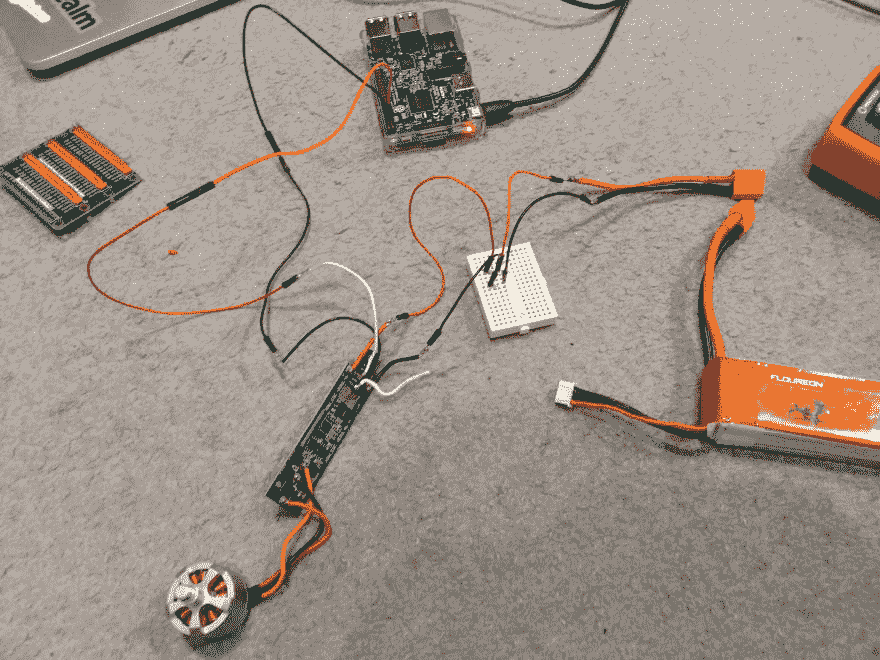
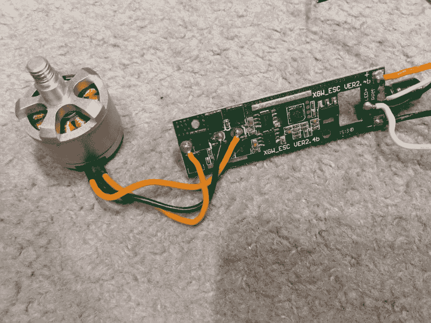
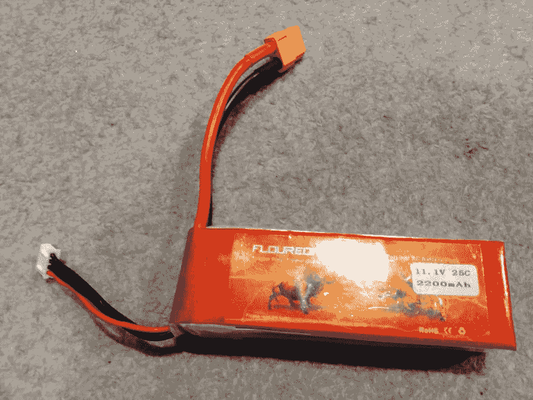
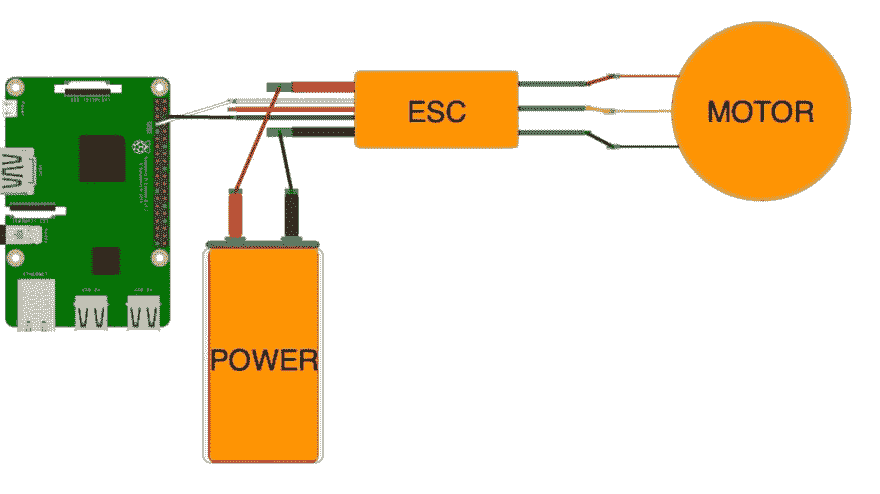

# 🔥🔥🔥如何使用电子速度控制器(ESC)将无人机的大功率无刷电机连接到树莓 PI🔥🔥🔥

> 原文:[https://dev . to/nicki tax/how-to-connect-a-powerful-brushy-pi-using-electronic-speed-controller-ESC-3h 42](https://dev.to/nickitax/how-to-connect-a-powerful-brushless-motor-from-drone-to-raspberry-pi-using-electronic-speed-controller-esc-3h42)

大家好！

在这篇短文中，我将展示我如何成功地将无刷电机与 ESC(电子速度控制器)从无人机集成到 Raspberry PI。

[T2】](https://res.cloudinary.com/practicaldev/image/fetch/s--b_cVEl7J--/c_limit%2Cf_auto%2Cfl_progressive%2Cq_auto%2Cw_880/https://thepracticaldev.s3.amazonaws.com/i/cebw1r9671t31vu06pyx.jpg)

不久前，我收到了一架坏掉的 Cheerson 无人机，其中一架 ESC 烧毁了(难以置信的游泳池浮潜)。我的第一个想法是将无刷电机连接到 Raspberry PI，并有可能建造一架飞机/无人机。

我的无人机焊接了 XGW_ESC VER2.4B 控制器和电机:

[T2】](https://res.cloudinary.com/practicaldev/image/fetch/s--hj6yKBRs--/c_limit%2Cf_auto%2Cfl_progressive%2Cq_auto%2Cw_880/https://thepracticaldev.s3.amazonaws.com/i/p0f3qx8d06fpe1bkfkah.jpg)

无刷电机有三根线:红色表示电源，黑色表示接地，黄色表示信号传输。

作为无刷电机的电源，我使用 11.1V 2200mAh 25C LiPo 电池，带引脚和端子输出:

[T2】](https://res.cloudinary.com/practicaldev/image/fetch/s--5zhUt_7j--/c_limit%2Cf_auto%2Cfl_progressive%2Cq_auto%2Cw_880/https://thepracticaldev.s3.amazonaws.com/i/fs6ka4btid37j8fl2ei2.jpg)

再看 ESC，它有三条主线我们要在意:红色为外接电源，黑色为地，白色标有 PPM(我的情况)。

I 将引脚线焊接到 ESC 中的电源输入和连接

这是一个简单的连接图:

[T2】](https://res.cloudinary.com/practicaldev/image/fetch/s--uka4oUzN--/c_limit%2Cf_auto%2Cfl_progressive%2Cq_auto%2Cw_880/https://thepracticaldev.s3.amazonaws.com/i/nn04k6agloccqz23by0q.jpg)

我们将使用 GPIO4 作为信号和接地引脚。

一旦一切准备就绪，我们就可以开始编码了！

```
import time
import RPi.GPIO as GPIO
GPIO.setwarnings(False)
GPIO.setmode(GPIO.BOARD)

GPIO.setup(7, GPIO.OUT)

t1 = GPIO.PWM(7, 50)

t1.start(0)

t1.ChangeDutyCycle(7.5)
time.sleep(3)

t1.stop()

GPIO.cleanup()
quit() 
```

该代码使用 PMW( [脉宽调制](https://en.wikipedia.org/wiki/Pulse-width_modulation))以 50Hz 频率初始化 ESC 引脚，并将占空比更改为 7.5%，休眠 3 秒并停止。这将足以旋转你的马达真正快速，然后完全停止。

恭喜你！我们做到了！🎉

现在技术上可以尝试自己造无人机或者飞机了！✈️

[T2】](https://i.giphy.com/media/g9582DNuQppxC/giphy.gif)