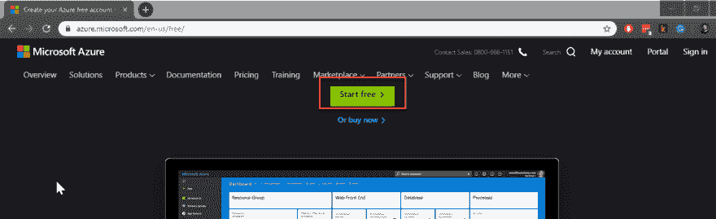
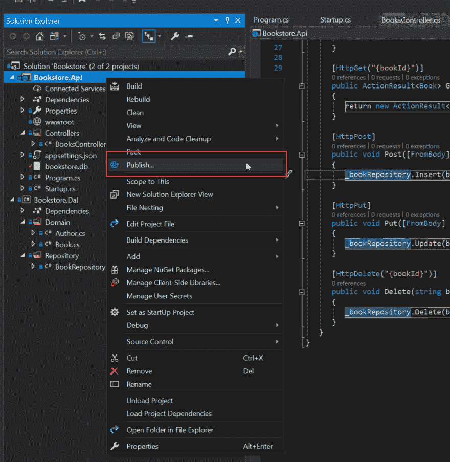
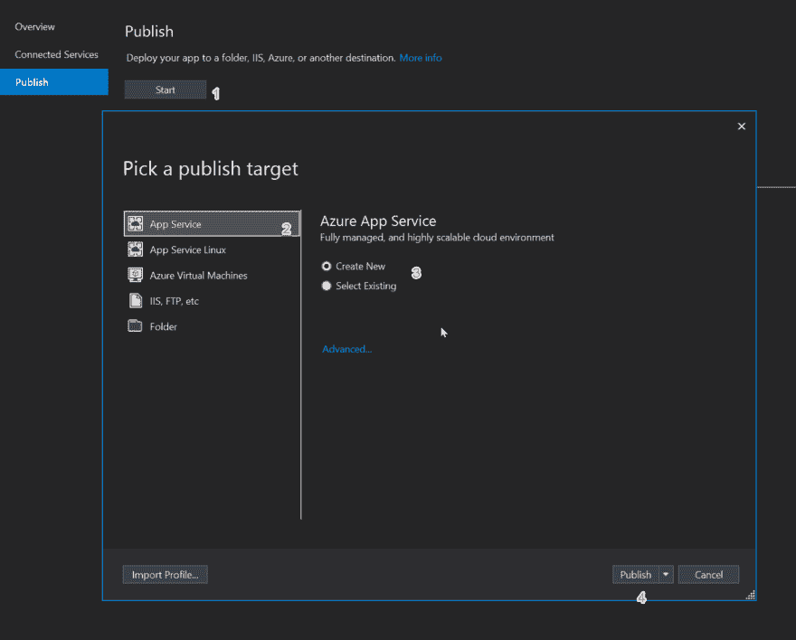
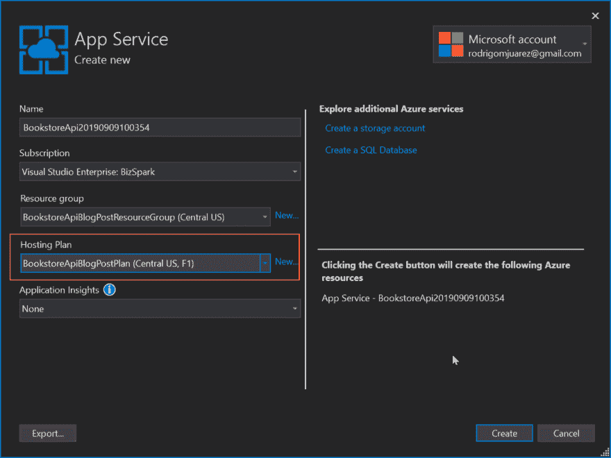

# 高级 Xamarin。表格第 1 部分–API

> 原文：<https://dev.to/codingcoach/advanced-xamarin-forms-part-1-the-api-3k6p>

这篇文章是我和 [@jesseliberty](https://dev.to/jesseliberty) 正在撰写的系列文章的一部分。[原帖在他的网站](https://jliberty.me/XFAPI)上，西班牙文版的[在我的](https://blog.rodrigojuarez.com/xamarin.forms/api/asp.netcore/2019/09/11/bookstore-api.html)上。

在这个系列中，我们将探讨一些关于高级 Xamarin 的主题。在我们为客户工作的过程中，或者在我作为 IFS Core 首席移动开发人员的工作中出现的表单。

然而，在我们开始之前，我们需要构建一个可以用来编程的 API。理想情况下，这个 API 将支持所有 CRUD 操作，并将驻留在 Azure 上。

# 构建 API

从 Visual Studio 开始，创建一个 API 核心应用程序，我们称之为书店。
将值控制器的名称更改为 BookController。
创建一个名为 Bookstore 的新项目。Dal(数据访问层)，在其中您将创建两个文件夹:Domain 和 [Repository](http://jesseliberty.com/2018/01/07/building-a-generic-sqlite-repository/) 。

安装 Nuget 包 LiteDB a NoSql 数据库。在 BookRepository 文件夹中，创建一个 BookRepository.cs 文件。在该文件中，您将初始化 LiteDB 并创建一个收藏来保存我们的书籍。

```
 public class BookRepository
    {
        private readonly LiteDatabase _db;
        public BookRepository()
        {
            _db = new LiteDatabase("bookstore.db");
            Books.EnsureIndex(x => x.BookId);
        } 
```

如果 bookstore.db 不存在，将会创建它。同样，如果索引不存在，它也会被创建。

转到 API 项目，右键单击 Dependencies，添加对我们的 Bookstore.dal 项目的引用。打开 BookstoreController 文件。为书店添加 using 语句。域和 Bookstore.Dal.Repository。

在控制器中创建一个 BookRepository 实例，并初始化它。

```
 public class BooksController : ControllerBase
   {
      private BookRepository _bookRepository;

      public BooksController()
      {
         _bookRepository = new BookRepository();
      } 
```

## 创建图书对象

我们将需要一个简单的图书对象(目前)来发送和检索我们的存储库和数据库。首先创建 book 对象(随意添加更多字段)

```
 public class Book
   {
      public Book()
      {
         BookId = Guid.NewGuid().ToString();
      }

      public string BookId { get; set; }
      public string ISBN { get; set; }
      public string Title { get; set; }
      public List<Author> Authors { get; set; }
      public double ListPrice { get; set; }
   } 
```

请注意，这本书有一个作者对象列表。让我们现在创建这个类，同样保持简单，

```
 public class Author
   {
      public string AuthorId { get; set; }
      public string Name { get; set; }
      public string Notes { get; set; }
   } 
```

## 储存库

让我们回到知识库。前面我们初始化了数据库。现在我们需要的是创建方法。

我们首先创建本地图书列表到数据库表的连接:

```
 public LiteCollection<Book> Books => _db.GetCollection<Book>(); 
```

接下来是我们的基本方法:获取、插入、更新、删除:

```
 public IEnumerable<Book> GetBooks()
    {
        return Books.FindAll();
    }

    public void Insert(Book book)
    {
        Books.Insert(book);
    }

    public void Update(Book book)
    {
        Books.Update(book);
    }

    public void Delete(Book book)
    {
        Books.Delete(book.BookId);
    } 
```

## 连接到 API

我们准备在 API 中创建 CRUD 方法，并将它们连接到 repo 中的方法。

```
 [HttpGet]
      public ActionResult<IEnumerable<Book>> Get()
      {
         var books = _bookRepository.GetBooks();
         return new 
              ActionResult<IEnumerable<Book>>(books);
      } 
```

这将把检索到的数据返回给调用方法。请注意，这将检索所有的书籍。

使用 HTTP 语法，让我们创建 Post 方法:

```
 [HttpPost]
      public void Post([FromBody] Book book)
      {
         _bookRepository.Insert(book);
      } 
```

## 测试

为了检查我们现在是否可以添加和检索数据，我们将创建一个 [Postman 集合](https://www.getpostman.com/downloads/)。调出 Postman 桌面应用(Chrome 扩展已弃用)，查看或创建书店收藏。在这个集合中有你的 post 和 get 方法。

为了简单起见，让我们用 JSON 添加一本书。单击 Headers 并将授权设置为 application in/JSON。然后点击 body，输入 Json 语句:

```
 {"Title":"Ulyses"} 
```

按发送将此发送到我们的本地数据库。为了确保它到达那里，切换到邮差得到，输入网址，并按下发送。你应该拿回你的书。

```
 [
        {
            "bookId": "d4f8fa63-1418-4e06-8c64-e8408c365b13",
            "isbn": null,
            "title": "Ulyses",
            "authors": null,
            "listPrice": 0
        }
    ] 
```

下一步是将这个迁移到 Azure。这比听起来容易。

首先去 [Azure 站点](https://azure.microsoft.com/en-us/free/)。选择开始免费按钮。

[](https://res.cloudinary.com/practicaldev/image/fetch/s--ndOa4KKT--/c_limit%2Cf_auto%2Cfl_progressive%2Cq_auto%2Cw_880/https://i.imgur.com/X4G84w2.png)

使用您的电子邮件地址创建一个帐户，在确认您的电子邮件地址后，您就可以在 Visual Studio 中使用帐户窗体了。

我们的下一步是发布 API。选择发布选项并选择以下步骤:

[](https://res.cloudinary.com/practicaldev/image/fetch/s--U7hVv5EP--/c_limit%2Cf_auto%2Cfl_progressive%2Cq_auto%2Cw_880/https://i.imgur.com/5x6nOKA.png)

[](https://res.cloudinary.com/practicaldev/image/fetch/s--wICp1hfg--/c_limit%2Cf_auto%2Cfl_progressive%2Cq_auto%2Cw_880/https://i.imgur.com/udiVbkc.png)

当您创建要在托管计划中使用的应用服务时，您可以选择免费层。

[](https://res.cloudinary.com/practicaldev/image/fetch/s--ui6M1gN3--/c_limit%2Cf_auto%2Cfl_progressive%2Cq_auto%2Cw_880/https://i.imgur.com/6tmGyT3.png)

发布完成后，您将可以访问刚刚创建的端点中的 API。在我们的例子中，端点是[https://bookstoreapiblogpost.azurewebsites.net/](https://bookstoreapiblogpost.azurewebsites.net/)
你可以在 Postman 中测试你的新端点，然后在你的项目中使用它。

[源代码库](https://github.com/XamEsp/bookstore)

杰西·利伯蒂(美国马萨诸塞州)和罗德里戈·华雷斯(阿根廷门多萨)

* * *

[](https://res.cloudinary.com/practicaldev/image/fetch/s--aI2wlV6j--/c_limit%2Cf_auto%2Cfl_progressive%2Cq_auto%2Cw_880/https://i.imgur.com/nIinu3c.png)

*关于杰西·利伯蒂*

Jesse Liberty 是 IFS Core 的首席移动开发者。他有三十年编写和交付软件项目的经验。他是 24 本书和 24 门 Pluralsight & LinkedIn 学习课程的作者，并且是微软的高级技术传道者、美国电话电报公司的杰出软件工程师、花旗银行的信息服务副总裁和 PBS 的软件架构师。他是 Xamarin 认证的移动开发人员，也是 Xamarin MVP 和 Microsoft MVP。