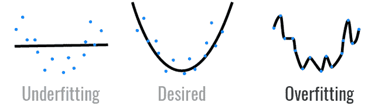

# 你在数据科学项目中的常规是什么？- fastai 第一课

> 原文:[https://dev . to/oya ne 806/what-is-your-routine-in-a-data-science-project-fastai-lesson 1-10dh](https://dev.to/oyane806/what-is-your-routine-in-a-data-science-project-fastai-lesson1-10dh)

你好，

目前在跟 [fast.ai](http://course18.fast.ai/ml.html) 学习机器学习。

我将第一课的笔记分为三类:过程总结、使用的代码和视频中看到的概念。最好的学习方法是能够重新解释所有这些，并将这些新知识应用到 Kaggle 比赛中。

# [](#1-process-summary)1。流程总结

1.  **设置 jupyter 笔记本和环境**
2.  **从 kaggle 下载数据**
3.  **将所有数据转换成数字或布尔值**:从日期(年、月)中提取新特征，并将字符串分类数据映射成数字
4.  **处理缺失数据**:连续缺失数据用中位数替换，并创建一个新的特征列 _na 用布尔值，缺失分类变量由 pandas 处理并自动设置为-1
5.  **分离训练和验证集**:模型在训练集上进行训练，以检查它是否运行良好，然后在验证集上使用
6.  **训练模型**
7.  **打印准确度分数**

# [](#2-code)2。密码

```
%load_ext autoreload
%autoreload 2
%matplotlib inline

from fastai.imports import *
from fastai.structured import *
from pandas_summary import DataFrameSummary
from sklearn.ensemble import RandomForestRegressor, RandomForestClassifier
from IPython.display import display
from sklearn import metrics

PATH = "data/bulldozers/"

df_raw = pd.read_csv(f'{PATH}Train.csv', low_memory=False, parse_dates=["saledate"])

display_all(df_raw.tail().T)

df_raw.SalePrice = np.log(df_raw.SalePrice)

add_datepart(df_raw, 'saledate')
df_raw.saleYear.head()

train_cats(df_raw)
df_raw.UsageBand.cat.set_categories(['High', 'Medium', 'Low'], ordered=True, inplace=True)
df_raw.UsageBand = df_raw.UsageBand.cat.codes

display_all(df_raw.isnull().sum().sort_index()/len(df_raw))

os.makedirs('tmp', exist_ok=True)
df_raw.to_feather('tmp/bulldozers-raw')
df_raw = pd.read_feather('tmp/bulldozers-raw')

df, y, nas = proc_df(df_raw, 'SalePrice')

m = RandomForestRegressor(n_jobs=-1)
m.fit(df, y)
m.score(df,y)

n_valid = 12000  # same as Kaggle's test set size n_trn = len(df)-n_valid
raw_train, raw_valid = split_vals(df_raw, n_trn)
X_train, X_valid = split_vals(df, n_trn)
y_train, y_valid = split_vals(y, n_trn)

X_train.shape, y_train.shape, X_valid.shape 
```

有几个助手功能:

*   创建 display_all()是为了在行中而不是在列中显示所有特征的名称
*   split_vals()将数据集分成一个训练集和一个验证集
*   print_score()

```
def display_all(df):
    with pd.option_context("display.max_rows", 1000, "display.max_columns", 1000): 
        display(df)

def split_vals(a,n): return a[:n].copy(), a[n:].copy()

def rmse(x,y): return math.sqrt(((x-y)**2).mean())

def print_score(m):
    res = [rmse(m.predict(X_train), y_train), rmse(m.predict(X_valid), y_valid),
                m.score(X_train, y_train), m.score(X_valid, y_valid)]
    if hasattr(m, 'oob_score_'): res.append(m.oob_score_)
    print(res) 
```

fast.ai 库中包含以下函数:

*   add_datepart()从日期(年、月)生成新的数字特征，并删除以前的列日期
*   train_cats()将字符串映射到整数(例如:红色:1，蓝色:2，等等)
*   proc_df()用数字代码替换类别，处理缺失的连续值(用中间值替换它，并创建一个新的特性 column _na ),并将因变量拆分成一个单独的变量

# [](#3-concepts)3。概念

*   **结构化数据/非结构化数据**:结构化数据是表格数据，非结构化数据的一个例子是图像
*   维度的诅咒:你拥有的维度越多，所有点就越多
*   **没有免费的午餐理论**:理论上，没有一种模型可以适用于任何类型的随机数据集
*   **回归/分类**:回归是连续变量预测(例如:价格预测)，分类是多个类别的真/假分类或识别(例如:水果分类)
*   **过度拟合**:当一个模型过于特定于一个数据集时，它将不能用一个新的数据集很好地概括，一个验证集帮助诊断这个问题

[T2】](https://res.cloudinary.com/practicaldev/image/fetch/s--hYWaqcOD--/c_limit%2Cf_auto%2Cfl_progressive%2Cq_auto%2Cw_880/https://thepracticaldev.s3.amazonaws.com/i/d36w7uxb2vrwoi7vwmgh.png)

* * *

这是第一课！

别忘了回忆。你能解释开始写数据科学笔记本的基本流程吗？你如何处理丢失的值？什么是回归和分类？什么是过度拟合？

和 Kaggle 一起练习，让这种新知识成为第二天性！

**注意**:我认为开始写数据科学笔记本更简单的方法是使用 Google Colab。

```
!pip install fastai==0.7.0
from google.colab import files
uploaded = files.upload()
import pandas as pd
import io
df_raw = pd.read_csv(io.BytesIO(uploaded['train.csv'])) 
```

*可以在 Instagram 上关注我 [@oyane806](https://www.instagram.com/oyane806/) ！*