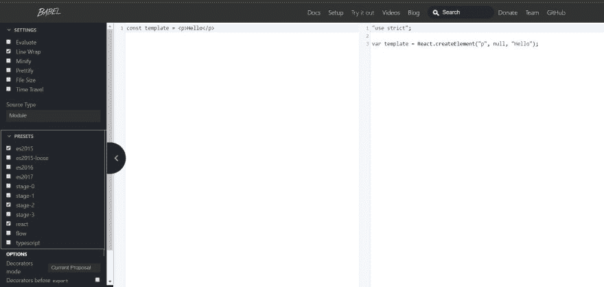
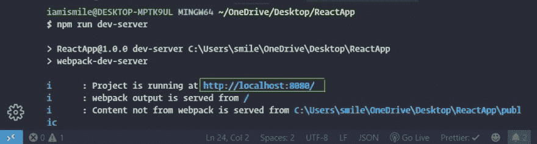

# 如何为 React 设置 Webpack 和 Babel

> 原文：<https://dev.to/iamismile/how-to-setup-webpack-and-babel-for-react-59ph>

当我们和 react 一起工作时，我们都用过 CRA。这是一个很棒的工具。它让我们专注于反应，让我们负责配置。今天我们将学习如何为我们的 React 应用程序设置 Webpack 和 Babel。

首先，我们来了解一下 Webpack 和 Babel。

## ✔Webpack:

它是一个模块捆绑器，可以让我们将项目文件捆绑成一个文件。

> 模块是一个包含定义的文件——包括变量和函数，一旦导入就可以使用。

它要求根文件夹中有一个 **webpack.config.js** 文件。其中我们通过给出入口点信息和输出信息来告诉我们的 webpack 如何使用我们的应用程序。

```
const path = require('path');

module.exports = {
  entry: './src/app.js', // relative path
  output: {
    path: path.join(__dirname, 'public'), // absolute path
    filename: 'bundle.js' // file name
  }
}; 
```

<svg width="20px" height="20px" viewBox="0 0 24 24" class="highlight-action crayons-icon highlight-action--fullscreen-on"><title>Enter fullscreen mode</title></svg> <svg width="20px" height="20px" viewBox="0 0 24 24" class="highlight-action crayons-icon highlight-action--fullscreen-off"><title>Exit fullscreen mode</title></svg>

“入口”点是我们的应用程序开始的地方，我们通过给定相对路径值来设置它。output 属性告诉 webpack 在哪里发出它创建的输出以及如何命名这些文件。我们必须在输出路径属性中给出绝对路径值。

## ✔Babel:

这是一个 JavaScript 编译器。巴别塔本身实际上没有任何功能。是的，它是一个编译器，但是默认情况下它不会编译任何东西。我们必须添加各种插件和预置来增加对特定语言功能的支持。你可以通过访问 [Babel](https://babeljs.io/) 网站来验证这一点。在巴别塔网站的导航栏部分，你会发现**试用**。点击它，你会得到一个新的窗口。
[](https://res.cloudinary.com/practicaldev/image/fetch/s--WfZNLL3P--/c_limit%2Cf_auto%2Cfl_progressive%2Cq_auto%2Cw_880/https://thepracticaldev.s3.amazonaws.com/i/w4cio5bsnxf1uxyil0ge.jpg) 
在左侧窗口你可以写你的代码，在右侧窗口你会得到你编译好的代码。现在让我们在左侧窗口写一些 JSX。

```
const template = <p>Hello</p>; 
```

<svg width="20px" height="20px" viewBox="0 0 24 24" class="highlight-action crayons-icon highlight-action--fullscreen-on"><title>Enter fullscreen mode</title></svg> <svg width="20px" height="20px" viewBox="0 0 24 24" class="highlight-action crayons-icon highlight-action--fullscreen-off"><title>Exit fullscreen mode</title></svg>

在右边的窗口中，您将看到 JavaScript 可理解的编译代码，这些代码总是在 React 应用程序的后台运行。在左侧，您可以看到一些**预设**选项，其中一些选项已经被勾选。如果你现在取消勾选**反应**预设选项，你会看到一个错误，这个**反应**预设负责将我们的 JSX 语法转换成 JavaScript 可理解的代码。

在我们的教程中，我们将使用两个预设:

1.  ***[@ babel](https://dev.to/babel)/preset-env***:-帮助 babel 将 ES6、ES7、ES8 代码转换为 ES5。
2.  ***[@ babel](https://dev.to/babel)/preset-react***:-将 JSX 转换为 JavaScript。

## ✔ **入门:**

现在我们对 webpack 和 babel 有了一点了解。让我们进入 React 设置。

*   使用这些命令创建目录:

`mkdir react-setup-tutorial
cd react-setup-tutorial
mkdir public src
touch public/index.html src/app.js`

在 index.html 文件中添加以下代码。

```
 <!DOCTYPE html>
    <html>
      <head>
        <meta charset="UTF-8" />
        <meta name="viewport" content="width=device-width, initial-scale=1.0" />
        <meta http-equiv="X-UA-Compatible" content="ie=edge" />
        <title>React App</title>
      </head>

      <body>
        <div id="root"></div>

        <script src="./bundle.js"></script>
      </body>
    </html> 
```

<svg width="20px" height="20px" viewBox="0 0 24 24" class="highlight-action crayons-icon highlight-action--fullscreen-on"><title>Enter fullscreen mode</title></svg> <svg width="20px" height="20px" viewBox="0 0 24 24" class="highlight-action crayons-icon highlight-action--fullscreen-off"><title>Exit fullscreen mode</title></svg>

*   **通过运行**初始化项目

`npm init -y`

## **【安装网页包】&反应:**

`npm install webpack webpack-cli --save-dev`

我们安装了 **webpack-cli** ，这样我们就可以在命令行中使用 webpack。

我们已经知道 webpack 需要 **webpack.config.js** 在项目目录的根目录下归档。所以让我们用下面的代码创建 **webpack.config.js** 文件。

```
const path = require('path');

module.exports = {
  entry: './src/app.js',
  output: {
    path: path.join(__dirname, 'public'),
    filename: 'bundle.js'
  }
}; 
```

<svg width="20px" height="20px" viewBox="0 0 24 24" class="highlight-action crayons-icon highlight-action--fullscreen-on"><title>Enter fullscreen mode</title></svg> <svg width="20px" height="20px" viewBox="0 0 24 24" class="highlight-action crayons-icon highlight-action--fullscreen-off"><title>Exit fullscreen mode</title></svg>

接下来，在 package.json:
中添加 webpack 命令

```
"scripts": {
    "start": "webpack --mode=development",
    "build": "webpack --mode=production"
  } 
```

<svg width="20px" height="20px" viewBox="0 0 24 24" class="highlight-action crayons-icon highlight-action--fullscreen-on"><title>Enter fullscreen mode</title></svg> <svg width="20px" height="20px" viewBox="0 0 24 24" class="highlight-action crayons-icon highlight-action--fullscreen-off"><title>Exit fullscreen mode</title></svg>

Webpack 有两种模式，**开发**和**生产**。我们可以通过**模式**标志进行设置。生产模式生成可用于生产的优化文件。

*   **安装 React:**

`npm install react react-dom`

现在，在我们的 **app.js** 文件中导入 react 和 react-dom，并添加一些 react 代码。

```
import React from 'react';
import ReactDOM from 'react-dom';

const template = React.createElement('p', {}, 'Hello from react');

ReactDOM.render(template, document.getElementById('root')); 
```

<svg width="20px" height="20px" viewBox="0 0 24 24" class="highlight-action crayons-icon highlight-action--fullscreen-on"><title>Enter fullscreen mode</title></svg> <svg width="20px" height="20px" viewBox="0 0 24 24" class="highlight-action crayons-icon highlight-action--fullscreen-off"><title>Exit fullscreen mode</title></svg>

现在在你的终端中使用下面的命令，在浏览器中打开你的**index.html**文件。

`npm start`

你的应用运行良好。但是你有一个问题，为什么我们不用 JSX。这一次，让我们在我们的 **app.js** 文件中尝试一些 JSX 代码。

```
import React from 'react';
import ReactDOM from 'react-dom';

const template = <p>Hello from react</p>; 
ReactDOM.render(template, document.getElementById('root')); 
```

<svg width="20px" height="20px" viewBox="0 0 24 24" class="highlight-action crayons-icon highlight-action--fullscreen-on"><title>Enter fullscreen mode</title></svg> <svg width="20px" height="20px" viewBox="0 0 24 24" class="highlight-action crayons-icon highlight-action--fullscreen-off"><title>Exit fullscreen mode</title></svg>

现在再次运行我们之前的命令。

`npm start`

这一次你会得到一个错误。那是因为我们使用 JSX，而 JavaScript 不支持 JSX。因此，如果我们想在我们的应用程序中使用 JSX，我们需要编译它。我们可以通过巴别塔做到。

## ✔ **安装&配置通天塔:**

`npm install @babel/core @babel/preset-env @babel/preset-react babel-loader --save-dev`

我们已经知道了 [@babel](https://dev.to/babel) /preset-env 和 [@babel](https://dev.to/babel) /preset-react。现在，什么是[@巴别塔](https://dev.to/babel) /core 和 babel-loader？

1.  ***[@ babel](https://dev.to/babel)/core***:-它允许我们从 webpack 这样的工具运行 babel。
2.  *:-它是一个 webpack 插件。它允许我们在 webpack 看到某些文件时教会 webpack 如何运行 babel。*

 *让我们通过创建一个**来配置 babel。项目目录根目录下的 babelrc** 文件，其中包含以下内容。

```
{
  "presets": ["@babel/preset-env", "@babel/preset-react"]
} 
```

<svg width="20px" height="20px" viewBox="0 0 24 24" class="highlight-action crayons-icon highlight-action--fullscreen-on"><title>Enter fullscreen mode</title></svg> <svg width="20px" height="20px" viewBox="0 0 24 24" class="highlight-action crayons-icon highlight-action--fullscreen-off"><title>Exit fullscreen mode</title></svg>

这个文件将告诉 babel 使用哪些预置来编译代码。

*   现在是时候教 webpack 如何将 JSX 编译成 JavaScript 代码了。为此，我们需要使用 loader。加载器允许我们定制 webpack 在加载某个文件时的行为。它将通过巴别塔运行某些文件。为此，我们需要通过对象上的**模块**属性在 **webpack.config.js** 文件中设置一个加载器。**模块**属性需要一组规则，一个让我们定义如何使用我们的加载器的规则。现在我们有一个规则，用巴别塔把 JSX 转换成 JavaScript。

```
const path = require('path');

module.exports = {
  entry: './src/app.js',
  output: {
    path: path.join(__dirname, 'public'),
    filename: 'bundle.js'
  },
  module: {
    rules: [
      {
        test: /\.js$/,
        exclude: /node_modules/,
        loader: 'babel-loader'
      }
    ]
  }
}; 
```

<svg width="20px" height="20px" viewBox="0 0 24 24" class="highlight-action crayons-icon highlight-action--fullscreen-on"><title>Enter fullscreen mode</title></svg> <svg width="20px" height="20px" viewBox="0 0 24 24" class="highlight-action crayons-icon highlight-action--fullscreen-off"><title>Exit fullscreen mode</title></svg>

这里我们设置了一个对象规则，其中 **loader** 属性告诉我们想要使用哪个加载器，我们使用 **babel-loader** 。**测试**属性，看看我们实际上想要在什么文件上运行这个加载器，以及我们想要在以**结尾的文件上运行它。js** 。 **exclude** 属性排除一组文件，我们使用 **/node_modules/** 因为我们不想在这些库中运行 babel。现在我们可以在反应中使用 JSX。让我们再次运行我们的应用程序。

`npm start`

这次我们没有任何错误。在浏览器中打开你的**index.html**文件，是的，它工作了。

## ✔ **配置源地图:**

让我们在我们的 **webpack.config.js** 文件中添加一些额外的配置设置。

```
const path = require('path');

module.exports = {
  entry: './src/app.js',
  output: {
    path: path.join(__dirname, 'public'),
    filename: 'bundle.js'
  },
  module: {
    rules: [
      {
        test: /\.js$/,
        exclude: /node_modules/,
        loader: 'babel-loader'
      }
    ]
  },
  devtool: 'cheap-module-eval-source-map'
}; 
```

<svg width="20px" height="20px" viewBox="0 0 24 24" class="highlight-action crayons-icon highlight-action--fullscreen-on"><title>Enter fullscreen mode</title></svg> <svg width="20px" height="20px" viewBox="0 0 24 24" class="highlight-action crayons-icon highlight-action--fullscreen-off"><title>Exit fullscreen mode</title></svg>

这里我们通过使用 **devtool** 属性来设置源地图。它增强了我们的调试过程。它用于在调试时显示我们的原始 JavaScript，这比缩小的代码更容易查看。

## **安装 DevServer:**

在终端中运行以下命令。

`npm install webpack-dev-server --save-dev`

在 **webpack.config.js** 文件中添加以下代码。

```
const path = require('path');

module.exports = {
  entry: './src/app.js',
  output: {
    path: path.join(__dirname, 'public'),
    filename: 'bundle.js'
  },
  module: {
    rules: [
      {
        test: /\.js$/,
        exclude: /node_modules/,
        loader: 'babel-loader'
      }
    ]
  },
  devtool: 'cheap-module-eval-source-map',
  // changed line
  devServer: {
    contentBase: path.join(__dirname, 'public')
  }
}; 
```

<svg width="20px" height="20px" viewBox="0 0 24 24" class="highlight-action crayons-icon highlight-action--fullscreen-on"><title>Enter fullscreen mode</title></svg> <svg width="20px" height="20px" viewBox="0 0 24 24" class="highlight-action crayons-icon highlight-action--fullscreen-off"><title>Exit fullscreen mode</title></svg>

接下来在 package.json:
中添加 **webpack-dev-server** 命令

```
"scripts": {
    "start": "webpack --mode=development",
    "build": "webpack --mode=production",
    "dev-server": "webpack-dev-server"
  } 
```

<svg width="20px" height="20px" viewBox="0 0 24 24" class="highlight-action crayons-icon highlight-action--fullscreen-on"><title>Enter fullscreen mode</title></svg> <svg width="20px" height="20px" viewBox="0 0 24 24" class="highlight-action crayons-icon highlight-action--fullscreen-off"><title>Exit fullscreen mode</title></svg>

现在运行这个命令。

`npm run dev-server`

它将启动开发服务器。它在我们可以访问的地方给我们输出。现在我们已经将这两个工具集成为一个，开发服务器是我们的服务器，它也为我们运行 webpack。
[](https://res.cloudinary.com/practicaldev/image/fetch/s--FnstfE4B--/c_limit%2Cf_auto%2Cfl_progressive%2Cq_auto%2Cw_880/https://thepracticaldev.s3.amazonaws.com/i/bh8ypcrk6zgh31f554at.jpg) 
现在，我们可以访问突出显示的网址，并获得我们的应用程序。

## ✔ **装载款式:**

让我们在 **src** 目录中创建新的文件和文件夹。

使用以下命令创建文件和文件夹。

`mkdir src/styles
touch src/styles/styles.css`

现在在 **styles.css** 文件中添加以下样式。

```
* {
  color: blue;
} 
```

<svg width="20px" height="20px" viewBox="0 0 24 24" class="highlight-action crayons-icon highlight-action--fullscreen-on"><title>Enter fullscreen mode</title></svg> <svg width="20px" height="20px" viewBox="0 0 24 24" class="highlight-action crayons-icon highlight-action--fullscreen-off"><title>Exit fullscreen mode</title></svg>

为了加载我们的 **style.css** 文件，我们需要在 **webpack.config.js** 文件中设置新的规则。

在那之前，我们需要安装一些新的装载机。

`npm install css-loader style-loader --save-dev`

1.  ***css-loader:*** 允许 webpack 加载我们的 css 资产。
2.  ***样式加载器:*** 获取 CSS 并通过注入一个`<style>`标签将其添加到 DOM 中。

现在在我们的 **webpack.config.js** 文件中添加新规则。

```
const path = require('path');

module.exports = {
  entry: './src/app.js',
  output: {
    path: path.join(__dirname, 'public'),
    filename: 'bundle.js'
  },
  module: {
    rules: [
      {
        test: /\.js$/,
        exclude: /node_modules/,
        loader: 'babel-loader'
      },
      // New rules to load css
      {
        test: /\.css$/,
        use: ['style-loader', 'css-loader']
      }
    ]
  },
  devtool: 'cheap-module-eval-source-map',
  devServer: {
    contentBase: path.join(__dirname, 'public')
  }
}; 
```

<svg width="20px" height="20px" viewBox="0 0 24 24" class="highlight-action crayons-icon highlight-action--fullscreen-on"><title>Enter fullscreen mode</title></svg> <svg width="20px" height="20px" viewBox="0 0 24 24" class="highlight-action crayons-icon highlight-action--fullscreen-off"><title>Exit fullscreen mode</title></svg>

***导入*** **style.css** 到我们的 app.js 文件里面，运行 dev-server 看看效果。

```
import React from 'react';
import ReactDOM from 'react-dom';
import './styles/styles.css';

const template = <p>Hello from react</p>; 
ReactDOM.render(template, document.getElementById('root')); 
```

<svg width="20px" height="20px" viewBox="0 0 24 24" class="highlight-action crayons-icon highlight-action--fullscreen-on"><title>Enter fullscreen mode</title></svg> <svg width="20px" height="20px" viewBox="0 0 24 24" class="highlight-action crayons-icon highlight-action--fullscreen-off"><title>Exit fullscreen mode</title></svg>

如果我们想使用 SCSS，那么我们需要安装 ***sass-loader*** 来帮助 webpack 将 sass 编译成 CSS。 ***sass-loader*** 依赖于另一个包 ***node-sass*** 。

`npm install sass-loader node-sass --save-dev`

现在，通过将 ***sass-loader*** 与 ***css-loader*** 和 ***样式-loader*** 链接起来，再次为 SASS 配置 **webpack.config.js** 文件。

```
const path = require('path');

module.exports = {
  entry: './src/app.js',
  output: {
    path: path.join(__dirname, 'public'),
    filename: 'bundle.js'
  },
  module: {
    rules: [
      {
        test: /\.js$/,
        exclude: /node_modules/,
        loader: 'babel-loader'
      },
      // Rules to load scss
      {
      // Some change here
        test: /\.scss$/,
        use: ['style-loader', 'css-loader', 'sass-loader']
      }
    ]
  },
  devtool: 'cheap-module-eval-source-map',
  devServer: {
    contentBase: path.join(__dirname, 'public')
  }
}; 
```

<svg width="20px" height="20px" viewBox="0 0 24 24" class="highlight-action crayons-icon highlight-action--fullscreen-on"><title>Enter fullscreen mode</title></svg> <svg width="20px" height="20px" viewBox="0 0 24 24" class="highlight-action crayons-icon highlight-action--fullscreen-off"><title>Exit fullscreen mode</title></svg>

现在更改我们的 **style.css** 文件扩展名**。css** 到**。scss** 即**风格**

同样将 app.js 中的 css 导入改为:

```
import './styles/styles.scss'; 
```

<svg width="20px" height="20px" viewBox="0 0 24 24" class="highlight-action crayons-icon highlight-action--fullscreen-on"><title>Enter fullscreen mode</title></svg> <svg width="20px" height="20px" viewBox="0 0 24 24" class="highlight-action crayons-icon highlight-action--fullscreen-off"><title>Exit fullscreen mode</title></svg>

并添加以下样式来查看我们的 wepback 对于 SASS 是否工作正常。

```
$brand-color: blue;

* {
  color: $brand-color;
} 
```

<svg width="20px" height="20px" viewBox="0 0 24 24" class="highlight-action crayons-icon highlight-action--fullscreen-on"><title>Enter fullscreen mode</title></svg> <svg width="20px" height="20px" viewBox="0 0 24 24" class="highlight-action crayons-icon highlight-action--fullscreen-off"><title>Exit fullscreen mode</title></svg>

现在使用下面的命令再次运行 dev-server。

`npm run dev-server`

我们为 SASS 配置了我们的 webpack。

就是这样。现在我们已经为 React 配置了 Webpack 和 Babel，我们可以使用它们来创建 React 项目。感谢阅读，敬请关注。*