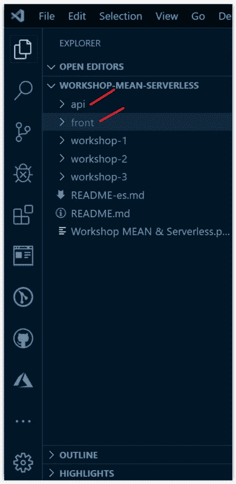
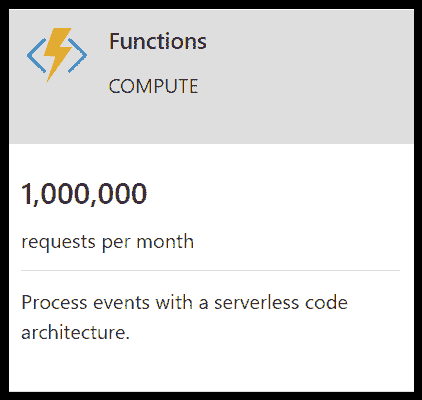
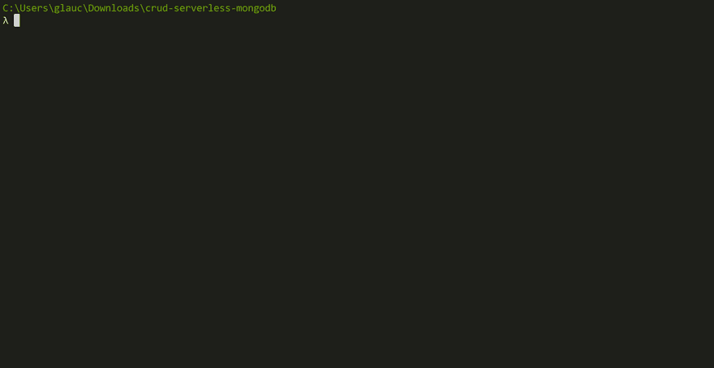
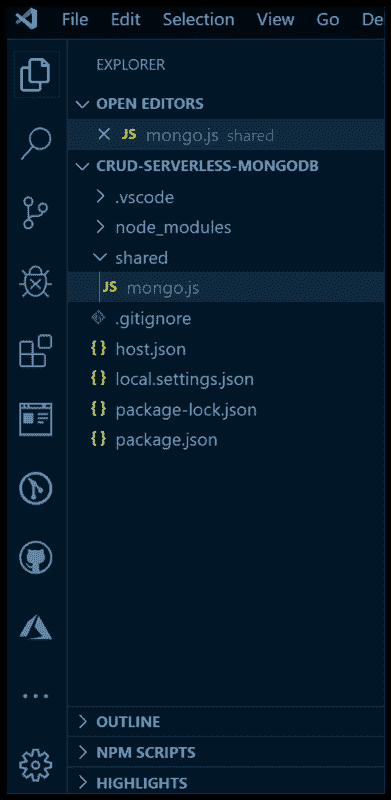
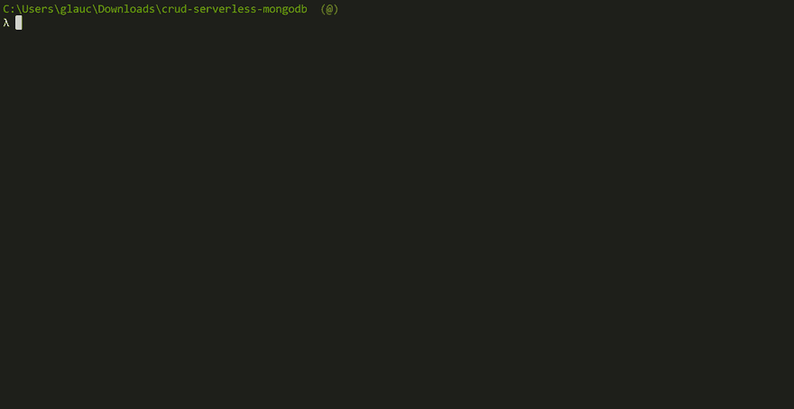
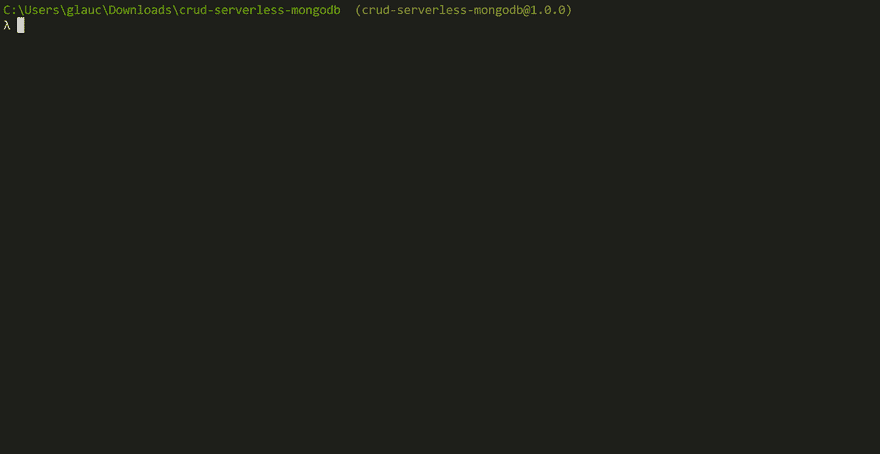
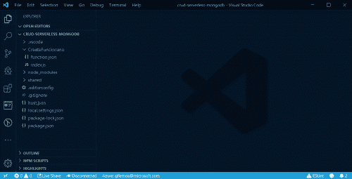
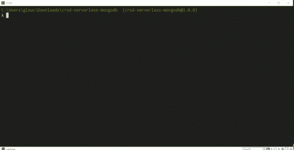
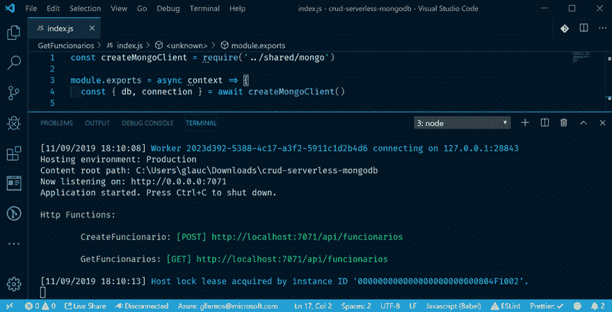
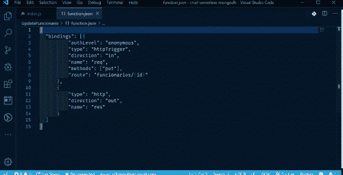

# 将 MEAN 应用程序迁移到 Serverless & Azure Functions 体系结构

> [https://dev . to/azure/migrating-uma-app-means-to-architecture-server less-azure-1 DP 7](https://dev.to/azure/migrando-uma-aplicacao-mean-para-arquitetura-serverless-azure-functions-1dp7)功能

本文是[# server esssetember](https://dev.to/azure/serverless-september-content-collection-2fhb)内容集的一部分。您将在此找到 2019 年 9 月期间发表的所有文章。

在本文中，您将学习如何使用 Azure Functions 轻松、快速、动态地将 MEAN 应用程序迁移到无服务器体系结构！

项目意思是已经准备好了，您可以制作 git 克隆或下载

如果你们想看有关上述主题的演讲，只需看看 2019 年在巴西 Js 上发表的演讲下面的视频，我在演讲中正好谈到 Azul functions+node . js+server less architecture(非常感谢巴西 js 邀请并提供视频):

YouTube: [https://www.youtube.com/embed/S14Y-kXxvEs](https://www.youtube.com/embed/S14Y-kXxvEs)

我们开始吧？！

## 了解项目结构意思

在本项目中，我们将重点关注两个文件夹:API 和 **front** 。如下图所示:

[](https://postimg.cc/RJKKF34d)

如果您运行此应用程序，您将看到我们在 MongoDb 上继续使用此应用程序，并使用后端，在本例中，我们使用 Node.js

持久数据包括:

**分类:Funcionario**

*   **idFuncionario:** (编号- guid gerado pelo MongoDb)
*   公务员姓名:字符串
*   **货物:**字符串
*   号码识别元:号码

如果要在本地运行此项目，只需遵循项目存储库 README.md 中的步骤即可。

好吧，既然你们已经掌握了 MEAN 项目，我们是否要开始迁移到 Azure Functions？！

但首先，让我们来了解一下蓝色函数是什么！

## O que é Azure 函数？！⚡️

**[【azure functions】](https://azure.microsoft.com/services/functions/?WT.mc_id=servsept_devto-blog-gllemos)**是一项无服务器计算服务，使您无需调配或管理基础架构，即可根据需要轻松执行少量代码片段或云功能。

蓝色功能支持多种语言，包括:

*   **c#**
*   **[JavaScript](https://docs.microsoft.com/azure/azure-functions/functions-reference-node?WT.mc_id=servsept_devto-blog-gllemos)**
*   **[F#](https://docs.microsoft.com/azure/azure-functions/functions-reference-fsharp?WT.mc_id=servsept_devto-blog-gllemos)**
*   **[Java](https://docs.microsoft.com/azure/azure-functions/functions-reference-java?WT.mc_id=servsept_devto-blog-gllemos)**
*   **[PowerShell](https://docs.microsoft.com/azure/azure-functions/functions-reference-powershell?WT.mc_id=servsept_devto-blog-gllemos)**
*   **[Python](https://docs.microsoft.com/azure/azure-functions/functions-reference-python?WT.mc_id=servsept_devto-blog-gllemos)**
*   **[打字稿](https://docs.microsoft.com/azure/azure-functions/functions-reference-node?WT.mc_id=servsept_devto-blog-gllemos#typescript)**

以下语言已受支持，但在您的 preview 版本中:

*   **痛击**
*   **PHP**

如果您想进一步了解支援蓝色功能的语言，只要存取此处的连结。

但是，对于这篇文章，我们将重点讨论 JavaScript！😉

## 模板重要无 Azure 功能

在开始迁移之前，必须指出的是，“[【蓝色功能】](https://azure.microsoft.com/services/functions/?WT.mc_id=servsept_devto-blog-gllemos) ”已经准备好了许多模板，现在才开始使用。其中包括:

*   **[HTTPTrigger](https://docs.microsoft.com/azure/azure-functions/functions-create-first-azure-function?WT.mc_id=servsept_devto-blog-gllemos)**
*   **[TimerTrigger](https://docs.microsoft.com/azure/azure-functions/functions-create-scheduled-function?WT.mc_id=servsept_devto-blog-gllemos)**
*   **[CosmosDBTrigger](https://docs.microsoft.com/azure/azure-functions/functions-bindings-cosmosdb-v2?WT.mc_id=servsept_devto-blog-gllemos)**

*   **[队列触发器](https://docs.microsoft.com/azure/azure-functions/functions-bindings-storage-queue?WT.mc_id=servsept_devto-blog-gllemos)**
*   **[EventGridTrigger](https://docs.microsoft.com/azure/event-grid/resize-images-on-storage-blob-upload-event?tabs=dotnet&WT.mc_id=servsept_devto-blog-gllemos)**
*   **[事件触发](https://docs.microsoft.com/azure/azure-functions/functions-bindings-event-hubs?WT.mc_id=servsept_devto-blog-gllemos)**
*   **[ServiceBusQueueTrigger](https://docs.microsoft.com/azure/azure-functions/functions-bindings-service-bus?WT.mc_id=servsept_devto-blog-gllemos)**
*   **[ServiceBusTopicTrigger](https://docs.microsoft.com/azure/azure-functions/functions-bindings-service-bus?WT.mc_id=servsept_devto-blog-gllemos)T3】**

我不会逐一详述，否则这篇文章会变得很大。但是，如果您想进一步了解每个模板及其在特定应用中的最佳用途，我建议您阅读文档。

对于此帖子，我们将使用模板:**[【HTTP trigger】](https://docs.microsoft.com/azure/azure-functions/functions-create-first-azure-function?WT.mc_id=servsept_devto-blog-gllemos)**)，因为此模板将触发使用 http 请求执行您的代码。这正是我们进行迁移所需要的！

如果您是某高校某教育机构或大学的学生，可以在[学生蓝色](https://azure.microsoft.com/pt-br/free/students/?WT.mc_id=servsept_devto-blog-gllemos) 开立账户。此帐户将为您提供 100.00 美元的信用，让您无需信用卡即可免费使用服务。要激活此帐户，只需访问旁边的链接:。有了这个账号，你就可以利用**每月 1，000，000 份免费申请来处理蓝色功能事件！**

[](https://postimg.cc/5HCTSV5r)

好吧，在这份蓝色功能概述之后，我们终于可以开始迁移了！走吧！

## Instalando o pacote Azure 功能核心工具

**[【蓝色功能核心工具】](https://docs.microsoft.com/azure/azure-functions/functions-run-local?WT.mc_id=servsept_devto-blog-gllemos)** 将使我们能够从终端或命令提示在本机上开发和测试功能。

以下是继续本教程所需的程序和软件包:

*   **[Visual Studio 代码](https://code.visualstudio.com/?WT.mc_id=servsept_devto-blog-gllemos)**
*   **[node . js-LTS](https://nodejs.org/en/)T3】**
*   **[Azure 功能核心工具](https://www.npmjs.com/package/azure-functions-core-tools)**
*   **[蒙哥罗盘](https://www.mongodb.com/products/compass)**

在计算机上安装 Node.js 后，只需键入以下命令:

*   **窗户**

```
npm install -g azure-functions-core-tools 
```

Enter fullscreen mode Exit fullscreen mode

*   **苹果电脑**

```
brew tap azure/functions
brew install azure-functions-core-tools 
```

Enter fullscreen mode Exit fullscreen mode

*   **Linux(Ubuntu/Debian)com APT**

```
curl https://packages.microsoft.com/keys/microsoft.asc | gpg --dearmor > microsoft.gpg
sudo mv microsoft.gpg /etc/apt/trusted.gpg.d/microsoft.gpg 
```

Enter fullscreen mode Exit fullscreen mode

有关如何正确安装蓝色功能核心工具的更多信息，只需访问此处的链接

我如何知道我的蓝色功能核心工具是否正确安装在我的机器上？！只需在终端中键入以下命令:

```
> func 
```

Enter fullscreen mode Exit fullscreen mode

如果在下面的 gif 中出现这种情况，则说明软件包已成功安装！

[](https://gifyu.com/image/hYvM)

太好了。现在我们可以创造我们的功能。为此，请在您的计算机上创建本地文件夹，然后我们开始！

## 创建蓝色函数的新应用

既然已经安装了软件包，我们就创建一个新的应用程序。为此，只需按照下面的 gif 步骤操作:

[](https://gifyu.com/image/hYqP)

请注意，打开 Visual Studio 代码时，我们需要单击右下角的“`YES`”按钮以启用项目中的某些重要文件。

## 建立与蒙戈布的连接

现在，让我们对我们新创建的项目进行一些必要的更改。为此，我们将在我们的项目中本地安装‘t0’[【monodb】](https://www.npmjs.com/package/mongodb)。键入以下命令:

```
> npm install mongodb 
```

Enter fullscreen mode Exit fullscreen mode

在项目中安装 mongodb 时，请注意文件“`package.json`”已更改。最后，文件应如下所示:

*   **档案:package.json**

```
{  "name":  "crud-serverless-mongodb",  "version":  "1.0.0",  "description":  "Projeto azure functions com persistencia com o mongoDb",  "scripts":  {  "test":  "echo \"No tests yet...\""  },  "author":  "",  "dependencies":  {  "mongodb":  "^3.3.2"  }  } 
```

Enter fullscreen mode Exit fullscreen mode

现在，我们创建一个名为:“T0”的文件夹，并在其中创建文件:“T1”。项目结构现在将如下所示:

[](https://postimg.cc/CRVryLtH)

我们现在更改文件`mongo.js`。为此，请包括以下代码块:

*   **档案:shared/mongo.js**

```
/**
 * Arquivo: mongo.js
 * Data: 10/11/2019
 * Descrição: arquivo responsável por tratar a conexão da Base de Dados localmente
 * Author: Glaucia Lemos
 */

const { MongoClient } = require("mongodb");

const config = {
  url: "mongodb://localhost:27017/crud-serverless-mongodb",
  dbName: "crud-serverless-mongodb"
};

async function createConnection() {
  const connection = await MongoClient.connect(config.url, {
    useNewUrlParser: true
  });
  const db = connection.db(config.dbName);
  return {
    connection,
    db
  };
}

module.exports = createConnection; 
```

Enter fullscreen mode Exit fullscreen mode

我们在这里建立了与蒙戈布的本地联系！和我们在 Node.js 的后端所做的非常相似，不是吗？！

并且我们还将更改文件`local.settings.json`。此文件负责“保存”我们不想在提交时暴露的所有密钥。请注意，此文件位于“`.gitignore`”文件列表中。

打开文件“`local.settings.json`”并进行以下更改:

*   **档案:local.settings.json**

```
{  "IsEncrypted":  false,  "Values":  {  "FUNCTIONS_WORKER_RUNTIME":  "node",  "AzureWebJobsStorage":  "{AzureWebJobsStorage}"  },  "Host":  {  "LocalHttpPort":  7071,  "CORS":  "*"  }  } 
```

Enter fullscreen mode Exit fullscreen mode

请注意上面的代码块，我们已经启用了“`CORS`”。因为没有他，我们无法在前线执行 CRUD 行动！如果您想进一步了解颜色，我推荐阅读。

第一部分已经准备好了！现在，让我们在蓝色函数中创建我们的 CRUD！

## 创建‘create official’功能

要创建新函数，只需键入以下命令:

```
func new 
```

Enter fullscreen mode Exit fullscreen mode

键入此命令将提供 Azure Functions 提供的各种模板选项。就我们而言，如上所述，我们将选择模板:`HttpTrigger`。按照下面的 gif 步骤操作:

[](https://gifyu.com/image/hYI8)

请注意，已创建了一个文件夹“`CreateFuncionario`”和两个文件:

*   **function.json** :这里我们将定义我们终点的路线和方法。

*   **index.json** :在这里，我们将发展端点固有的逻辑。

我们开始修改这些文件。从`function.json`开始

*   **arquivo:CreateFuncionario/function . JSON**

```
{  "bindings":  [{  "authLevel":  "anonymous",  "type":  "httpTrigger",  "direction":  "in",  "name":  "req",  "methods":  ["post"],  "route":  "funcionarios"  },  {  "type":  "http",  "direction":  "out",  "name":  "res"  }  ]  } 
```

Enter fullscreen mode Exit fullscreen mode

现在我们来修改文件`index.js`:

*   **档案:create official/index . js**

```
/**
 * Arquivo: CreateFuncionario/index.js
 * Data: 10/11/2019
 * Descrição: arquivo responsável por criar um novo 'Funcionário'
 * Author: Glaucia Lemos
 */

const createMongoClient = require('../shared/mongo')

module.exports = async function (context, req) {
  const funcionario = req.body || {}

  if (funcionario) {
    context.res = {
      status: 400,
      body: 'Os dados do(a) Funcionário(a) é obrigatório!'
    }
  }

  const { db, connection } = await createMongoClient()

  const Funcionarios = db.collection('funcionarios')

  try {
    const funcionarios = await Funcionarios.insert(funcionario)
    connection.close()

    context.res = {
      status: 201,
      body: funcionarios.ops[0]
    }
  } catch (error) {
    context.res = {
      status: 500,
      body: 'Error ao criar um novo Funcionário(a)'
    }
  }
} 
```

Enter fullscreen mode Exit fullscreen mode

这里我们基本上是在定义`Criar um novo Funcionário`的路线，发展`Criar um novo Funcionário`的逻辑。

我们要运行这个端点吗？！要运行，只需键入以下命令:

```
> func host start 
```

Enter fullscreen mode Exit fullscreen mode

他会列出我们创建的端点！请看 gif:

[](https://gifyu.com/image/hYI5)

他为我们列出了以下端点:`[POST] http://localhost:7071/api/funcionario`

端口`7071`是蓝色功能的默认端口。这正是我们需要的！

好吧，现在我们走这条路线，在前端加！为此，我们需要对`Front`项目作一些修改。转到位于:`front -> src -> app -> funcionario.service.ts`的文件夹`front`，然后更改以下文件`funcionario.service.ts`

*   **arquivo:funcionario . service . ts**

```
import { Injectable } from '@angular/core';
import { HttpClient } from '@angular/common/http';

@Injectable({
  providedIn: 'root'
})
export class FuncionarioService {

  // ==> Uri da api (Back-End)
  uri = 'http://localhost:7071/api';

  constructor(private http: HttpClient) { }

(...) 
```

Enter fullscreen mode Exit fullscreen mode

我们只需要更改角部服务中定义的`uri`。

此时，我们需要处决孔波桑和前线。在 gif 中，请注意新员工将如何继续工作，并且我们不再需要该项目的“`api`”文件夹！

**(点击下图观看 gif)**

[](https://gifyu.com/image/hYuM)

你坚持得很好！😍

现在，让我们列出来！

## 创建‘get officers’功能

与上面所做的假设相同，我们将创建一个带有命令的新函数:`func new`，命名函数`GetFuncionarios`，并修改文件:`function.json`和`index.js`

**(点击下图观看 gif)**

[](https://gifyu.com/image/hYuz)

*   **get officers/function . JSON**

```
{  "bindings":  [{  "authLevel":  "anonymous",  "type":  "httpTrigger",  "direction":  "in",  "name":  "req",  "methods":  ["get"],  "route":  "funcionarios"  },  {  "type":  "http",  "direction":  "out",  "name":  "res"  }  ]  } 
```

Enter fullscreen mode Exit fullscreen mode

*   **GetFuncionarios/index.js**

```
/**
 * Arquivo: GetFuncionarios/index.js
 * Data: 10/11/2019
 * Descrição: arquivo responsável por listar todos os 'Funcionários'
 * Author: Glaucia Lemos
 */

const createMongoClient = require('../shared/mongo')

module.exports = async context => {
  const { db, connection } = await createMongoClient()

  const Funcionarios = db.collection('funcionarios')
  const res = await Funcionarios.find({})
  const body = await res.toArray()

  connection.close()

  context.res = {
    status: 200,
    body
  }
} 
```

Enter fullscreen mode Exit fullscreen mode

让我们再试一次！再看看下面的 gif！

[](https://gifyu.com/image/hYdI)

再一次运作得很顺利。你有没有注意到用蓝色函数创建一个 CRUD 是很容易的，不是吗？you ' ve ever noticed that it ' s easy to create a crud with blue functions，isn ' t you？！现在只需按照相同的步骤创建下一个角色！

## Criando a fun ao ' GetFuncionarioById '

现在这里的每个人都很清楚，用蓝色函数创建 CRUD 是多么容易，我将开始加快创建过程，只需在‘t0’和‘t1’文件中报告更改内容即可

*   **get 官员 ById/index.js**

```
{  "bindings":  [{  "authLevel":  "anonymous",  "type":  "httpTrigger",  "direction":  "in",  "name":  "req",  "methods":  ["get"],  "route":  "funcionarios/{id}"  },  {  "type":  "http",  "direction":  "out",  "name":  "res"  }  ]  } 
```

Enter fullscreen mode Exit fullscreen mode

*   **GetFuncionarioById/function . JSON**

```
// @ts-nocheck
/**
 * Arquivo: GetFuncionarioById/index.js
 * Data: 10/11/2019
 * Descrição: arquivo responsável por listar Funcionário pelo Id
 * Author: Glaucia Lemos
 */

const { ObjectID } = require('mongodb')
const createMongoClient = require('../shared/mongo')

module.exports = async function (context, req) {
  const { id } = req.params

  if (!id) {
    context.res = {
      status: 400,
      body: 'Por favor, passe o número correto do Id do Funcionário!'
    }

    return
  }

  const { db, connection } = await createMongoClient()

  const Funcionarios = db.collection('funcionarios')

  try {
    const body = await Funcionarios.findOne({ _id: ObjectID(id) })

    connection.close()
    context.res = {
      status: 200,
      body
    }
  } catch (error) {
    context.res = {
      status: 500,
      body: 'Erro ao listar o Funcionário pelo Id.'
    }
  }
} 
```

Enter fullscreen mode Exit fullscreen mode

我们现在不测试。我们将开发最后两个功能:`Delete`和`Delete`。

## 创建角色:'更新官员'

再次，我们将创建一个新函数并更改文件`function.json`和`index.js`:

*   **UpdateFuncionario/index . js**

```
{  "bindings":  [{  "authLevel":  "anonymous",  "type":  "httpTrigger",  "direction":  "in",  "name":  "req",  "methods":  ["put"],  "route":  "funcionarios/{id}"  },  {  "type":  "http",  "direction":  "out",  "name":  "res"  }  ]  } 
```

Enter fullscreen mode Exit fullscreen mode

*   **UpdateFuncionario/index . js**

```
// @ts-nocheck
/**
 * Arquivo: UpdateFuncionario/index.js
 * Data: 10/11/2019
 * Descrição: arquivo responsável por atualizar 'Funcionário' por Id
 * Author: Glaucia Lemos
 */

const { ObjectID } = require('mongodb')
const createMongoClient = require('../shared/mongo')

module.exports = async function (context, req) {
  const { id } = req.params
  const funcionario = req.body || {}

  if (!id || !funcionario) {
    context.res = {
      status: 400,
      body: 'Os campos são obrigatórios'
    }

    return
  }

  const { db, connection } = await createMongoClient()
  const Funcionarios = db.collection('funcionarios')

  try {
    const funcionarios = await Funcionarios.findOneAndUpdate(
      { _id: ObjectID(id) },
      { set: funcionario }
    )

    connection.close()

    context.res = {
      status: 200,
      body: funcionarios
    }
  } catch (error) {
    context.res = {
      status: 500,
      body: 'Erro ao atualizar o Funcionário'
    }
  }
} 
```

Enter fullscreen mode Exit fullscreen mode

秀出来！现在让我们发展我们最后的功能:`Delete`！

## 创建角色:【删除工作人员】

再次，只需创建一个新函数，选择选项:`DeleteFuncionario`，命名函数`DeleteFuncionario`，然后更改文件`function.json`和`index.js`:

*   **删除公务员/职能。json**

```
{  "bindings":  [{  "authLevel":  "anonymous",  "type":  "httpTrigger",  "direction":  "in",  "name":  "req",  "methods":  ["delete"],  "route":  "funcionarios/{id}"  },  {  "type":  "http",  "direction":  "out",  "name":  "res"  }  ]  } 
```

Enter fullscreen mode Exit fullscreen mode

*   **DeleteFuncionario/index . js**

```
// @ts-nocheck
/**
 * Arquivo: DeleteFuncionario/index.js
 * Data: 10/11/2019
 * Descrição: arquivo responsável excluir um 'Funcionário' pelo Id
 * Author: Glaucia Lemos
 */

const { ObjectID } = require('mongodb')
const createMongoClient = require('../shared/mongo')

module.exports = async function (context, req) {
  const { id } = req.params

  if (!id) {
    context.res = {
      status: 400,
      body: 'Os campos são obrigatórios!'
    }

    return
  }

  const { db, connection } = await createMongoClient()

  const Funcionarios = db.collection('funcionarios')

  try {
    await Funcionarios.findOneAndDelete({ _id: ObjectID(id) })
    connection.close()
    context.res = {
      status: 204,
      body: 'Funcionário excluído com sucesso!'
    }
  } catch (error) {
    context.res = {
      status: 500,
      body: 'Erro ao excluir Funcionário' + id
    }
  }
} 
```

Enter fullscreen mode Exit fullscreen mode

我们的生料准备好了！我们要测试所有端点吗？！看看下面的 gif！

**(点击下图观看 gif)**

[](https://gifyu.com/image/hYnX)

更漂亮的东西，不是吗？！再一次请注意，有大量文件的那个`api`文件夹将不再需要！我们几乎可以删除整个文件夹！！！

所有开发的源代码都在这里:

**[前端工程](https://github.com/glaucia86/workshop-mean-serverless)**

👉 **[Projeto Api -无服务器](https://github.com/glaucia86/crud-serverless-mongodb)**

## 结语

今天，我们学习了如何将 MEAN 应用程序迁移到 Azure Functions，但在本地保留这些数据并在本地执行这些功能。如果我们需要在云中托管该应用程序呢？我们的后端会是什么样子？

在下一篇文章中，我将向您介绍如何将 mongodb 迁移到 cosmosdb，以及如何在 Visual Studio 代码本身中使用 Azure Tools 扩展来部署这些功能。

如果您想了解有关 Azure Functions 的更多信息，我建议您学习以下完全免费的 Serverless & Azure Functions 课程以及其他一些重要功能:

**[免费课程-蓝色功能](https://docs.microsoft.com/pt-br/learn/paths/create-serverless-applications/?WT.mc_id=servsept_devto-blog-gllemos)**

✅**t1】azure para devs JavaScript&node . jsT3】**

**[蓝皮书功能](https://docs.microsoft.com/pt-br/azure/azure-functions/?WT.mc_id=servsept_devto-blog-gllemos)**

**[在 Visual Studio 代码](https://docs.microsoft.com/pt-br/azure/azure-functions/functions-create-first-function-vs-code?WT.mc_id=servsept_devto-blog-gllemos)** 中创建其第一个功能

✅ **[扩展与代码——azure 函数](https://marketplace.visualstudio.com/items?itemName=ms-azuretools.vscode-azurefunctions&WT.mc_id=servsept_devto-blog-gllemos)**

✅ **[电子书 Grátis - Azure 无服务器计算食谱](https://azure.microsoft.com/pt-br/resources/azure-serverless-computing-cookbook/?WT.mc_id=servsept_devto-blog-gllemos)**

而且为了跟上最新的更新，不要忘了在 Twitter 上跟踪我！😃

[](https://twitter.com/glaucia_lemos86)

下次见！❤️ ❤️ ❤️