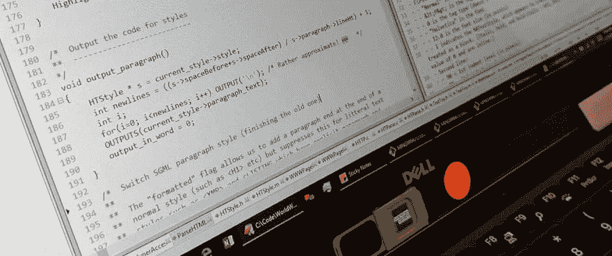

# (为什么)有些 HTML 是“可选的”

> 原文:[https://dev.to/remy/why-some-html-is-optional-2e11](https://dev.to/remy/why-some-html-is-optional-2e11)

克里斯·科伊尔[最近在*怪异的 HTML*T5 上写了博客。这是一篇很好的短文，我认为了解这些可选特性(可能被称为默认值)是值得的。我最喜欢的可选属性是`<script>`,不需要包含`type`属性。](https://css-tricks.com/some-html-is-optional/)

但是 Chris 的第一个例子是最常见的，可选的结束标记`</p>`。(我认为)有意思的问题是:*为什么？*

## [](#the-easy-answer)简单的回答

HTML 有一个惊人的特性:它是超级向后兼容的。这就是为什么我们有 HTML5 而没有 XHTML2。

这种向后兼容性意味着设备和浏览器可以一直追溯到第一个浏览器，仍然能够呈现 HTML(只是第一个*会产生一些未知元素，但这更多的是一个例外)。*

因此，如果你发现自己在问*为什么*，答案几乎总是在过去和最初的功能中。

同样的推理也解释了为什么你永远找不到一个新引入的元素放在`<head>`元素里面——但是我会把这个留给其他人写博客…

## [](#performance-and-optimisation)性能和优化？

不看现代浏览器的 HTML 解析算法，我猜 perf 的成本是难以置信的微小。如此之小，以至于我们凡人用户可能体验不到任何差别。

压缩也是一个有争议的问题，这是一个微小的优化，*可以*节省一两个字节，但是由于重复序列是如何压缩的，结束`</p>`不会有影响。

但是，这个`<p>`标签到底是什么呢？

## [](#back-to-1989)回到 1989 年

世界上第一个浏览器是由蒂姆·伯纳斯·李爵士编写的。

没有参考实现，当然也没有解析规范这样的东西。

第一个浏览器是 [WorldWideWeb.app](https://worldwideweb.cern.ch) ，它一个字符一个字符地解析 HTML，同时应用样式。与今天的方法相反，在今天的方法中，文档对象模型被建立，然后被呈现。

当他们挖掘出标签的解析算法时，我非常幸运地坐在了金伯利祝福 T2 的旁边。

事实上，Chris 之前的段落文本示例应该重新格式化，以真正了解该段落的预期用途:

```
<P>
Paragraph one.
<P>
Paragraph two.
<P>
Paragraph three. 
```

段落标签(是的，大写)的目的是*分隔*个段落，而不是换行。

这就是为什么你不需要一个结束标签，来支持这种原始的用法，并支持网络上现有的文档。

这里有一张我拍的金伯利屏幕的照片，显示了来源:

[T2】](https://res.cloudinary.com/practicaldev/image/fetch/s--jcLxbsCd--/c_limit%2Cf_auto%2Cfl_progressive%2Cq_auto%2Cw_880/https://remysharp.cimg/p-tag.jpg)

相当古怪，出于某种原因，我喜欢这些历史细节。

*原载于[雷米夏普的 b:log](https://remysharp.com/2019/09/12/why-some-html-is-optional)T3】*