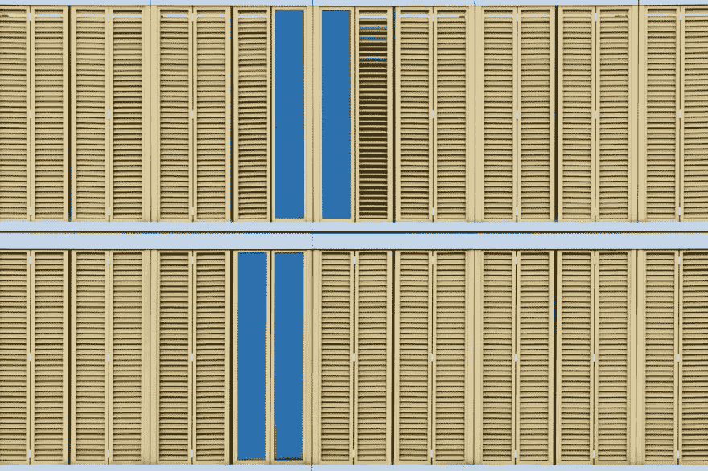
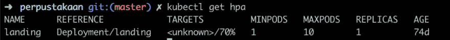

# 今天我学到了:在 Kubernetes 中启用水平 Pod 自动缩放器(HPA)

> 原文：<https://dev.to/bxcodec/today-i-learned-enabling-horizontal-pod-autoscalerhpa-in-kubernetes-4mmm>

#### 求解 HPA 目标中“未知”的当前资源值，以允许 Kubernetes 中的水平自动缩放。

<figure>[](https://res.cloudinary.com/practicaldev/image/fetch/s--in0JzhGW--/c_limit%2Cf_auto%2Cfl_progressive%2Cq_auto%2Cw_880/https://cdn-images-1.medium.com/max/1024/0%2AKmYKiSJlee713jGB) 

<figcaption>照片由[波维切维斯基](https://unsplash.com/@pawel_czerwinski?utm_source=medium&utm_medium=referral)上 [Unsplash](https://unsplash.com?utm_source=medium&utm_medium=referral)</figcaption>

</figure>

有一段时间我没有发布任何更新。最近太忙了，在过去的几周里很难找到空闲时间写一篇文章。所以，在这个难得的机会里，我想写一些我今天学到的东西。

作为介绍，所以，目前，我正在为我的副业项目尝试 Kubernetes。这是一个移动应用程序的附带项目。登陆页面可以在 [https://mabar.id](https://mabar.id) 中看到，目前它只支持 android 应用，可以从 play store [这里](https://play.google.com/store/apps/details?id=id.mabar)下载。

我已经为这个项目工作了几个月，我和我的朋友一起做这个。我在后端，API 和基础设施方面工作，我在这个项目中使用 Kubernetes。

所以今天，我在尝试用 Kubernetes 实现水平伸缩时学到了一些新东西。

之前 Kubernetes 其实有一个对象叫 HPA(Horizontal Pod auto caller)。关于这个 HPA 的细节可以在官方[文档](https://kubernetes.io/docs/tasks/run-application/horizontal-pod-autoscale/)中看到。

一开始我觉得这个应该很容易实现。只是在部署脚本中添加对象，它应该由 Kubernetes 集群来处理。

#### 问题

但是，没那么容易。所以，为了模拟真实案例，我会写实际问题在解决之前是怎样的，以及我是怎样解决的。

所以说，我想在 Kubernetes 中部署 [https://mabar.id](https://mabar.id) 的登陆页面。我还想加上颐康保障户口。这样做的原因是:

*   想知道如何实现 HPA
*   即使是登陆页面仍然是如此之新，我相信没有人会访问它，但以防它有一个巨大的请求，只是准备它无论如何:D

起初，在看到许多 Kubernetes 的博客文章和官方文档后，我发现了如何在 Kubernetes 中为 pod 创建 HPA。

```
apiVersion: autoscaling/v2beta1
kind: HorizontalPodAutoscaler
metadata:
  name: landing
  namespace: landing-page
spec:
  scaleTargetRef:
    apiVersion: apps/v1beta1
    kind: Deployment
    name: landing
  minReplicas: 1
  maxReplicas: 10
  metrics:
  - type: Resource
    resource:
      name: cpu
      targetAverageUtilization: 70 
```

<svg width="20px" height="20px" viewBox="0 0 24 24" class="highlight-action crayons-icon highlight-action--fullscreen-on"><title>Enter fullscreen mode</title></svg> <svg width="20px" height="20px" viewBox="0 0 24 24" class="highlight-action crayons-icon highlight-action--fullscreen-off"><title>Exit fullscreen mode</title></svg>

就用这个简单的脚本，它应该会自动运行。这是我的第一个想法。

所以，然后，我试着去测试它。我对服务器做了一个负载测试。

```
$ hey -c 50 -z 5m https://mabar.id 
```

<svg width="20px" height="20px" viewBox="0 0 24 24" class="highlight-action crayons-icon highlight-action--fullscreen-on"><title>Enter fullscreen mode</title></svg> <svg width="20px" height="20px" viewBox="0 0 24 24" class="highlight-action crayons-icon highlight-action--fullscreen-off"><title>Exit fullscreen mode</title></svg>

我使用[嘿](https://github.com/rakyll/hey)作为我的负载测试工具。我创建了一个对登录页面的 50 分钟并发呼叫。

通常，当请求变得越来越大时，应该部署一个新的 pod 副本。

但我看到的是，我的吊舱正在崩溃和重启。我很好奇为什么会这样。

后来，在寻找 HPA 的细节后，我看到了一件奇怪的事情。

```
$ kubectl get hpa

NAME REFERENCE TARGETS MINPODS MAXPODS REPLICAS AGE
landing Deployment/landing <unknown>/70% 1 10 1 74d 
```

<svg width="20px" height="20px" viewBox="0 0 24 24" class="highlight-action crayons-icon highlight-action--fullscreen-on"><title>Enter fullscreen mode</title></svg> <svg width="20px" height="20px" viewBox="0 0 24 24" class="highlight-action crayons-icon highlight-action--fullscreen-off"><title>Exit fullscreen mode</title></svg>

<figure>[](https://res.cloudinary.com/practicaldev/image/fetch/s--gZ4ifJWO--/c_limit%2Cf_auto%2Cfl_progressive%2Cq_auto%2Cw_880/https://cdn-images-1.medium.com/max/1024/1%2AuFniFBiVUyKjDmNHGNSuMA.png)

<figcaption>HPA 中目标不明</figcaption>

</figure>

或者在详细版本中，使用描述命令。

```
$ kubectl describe hpa landing 
```

<svg width="20px" height="20px" viewBox="0 0 24 24" class="highlight-action crayons-icon highlight-action--fullscreen-on"><title>Enter fullscreen mode</title></svg> <svg width="20px" height="20px" viewBox="0 0 24 24" class="highlight-action crayons-icon highlight-action--fullscreen-off"><title>Exit fullscreen mode</title></svg>