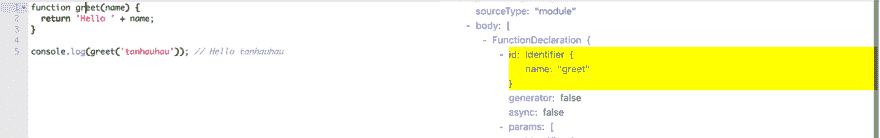
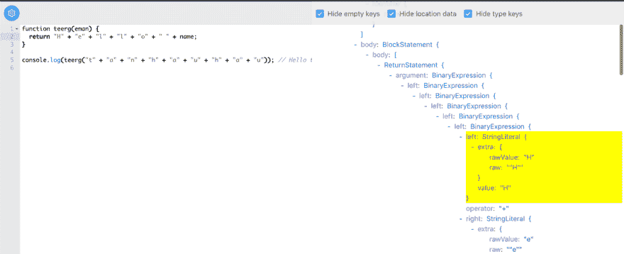
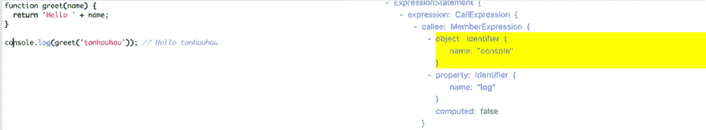

# 编写自定义 babel 转换的分步指南

> 原文：<https://dev.to/tanhauhau/step-by-step-guide-for-writing-a-custom-babel-transformation-257g>

今天，我将分享一个编写自定义 [babel](https://babeljs.io/docs/en/babel-core) 转换的分步指南。您可以使用这种技术来编写自己的自动化代码修改、重构和代码生成。

## 什么是巴别塔？

[Babel](https://babeljs.io/docs/en/) 是一款 JavaScript 编译器，主要用于将 ECMAScript 2015+代码转换为当前及更老版本浏览器或环境下的 JavaScript 向后兼容版本。巴别塔使用一个[插件系统](https://babeljs.io/docs/en/plugins)来做代码转换，所以任何人都可以为巴别塔编写自己的转换插件。

在开始为 babel 编写转换插件之前，您需要知道什么是[抽象语法树(AST)](https://en.wikipedia.org/wiki/Abstract_syntax_tree) 。

### 什么是抽象语法树(AST)？

我不确定我能比网上那些惊人的文章解释得更好:

*   [通过](https://medium.com/basecs/leveling-up-ones-parsing-game-with-asts-d7a6fc2400ff) [Vaidehi Joshi](https://twitter.com/vaidehijoshi) * *的 ASTs 提升自己的解析游戏(强烈推荐这款！👍)*
*   维基百科的[抽象语法树](https://en.wikipedia.org/wiki/Abstract_syntax_tree)
*   [什么是抽象语法树](https://blog.bitsrc.io/what-is-an-abstract-syntax-tree-7502b71bde27)作者 [Chidume Nnamdi](https://twitter.com/ngArchangel)

总而言之，AST 是代码的树形表示。在 JavaScript 的情况下，JavaScript AST 遵循 [estree 规范](https://github.com/estree/estree)。

AST 代表你的代码，代码的结构和含义。因此，它允许编译器像 [babel](https://babeljs.io) 理解代码，并对其进行特定的有意义的转换。

现在你知道了什么是 AST，让我们编写一个定制的 babel 转换来使用 AST 修改你的代码。

## 如何用巴别塔转化代码

以下是使用 babel 做代码转换的通用模板:

```
import { parse } from '@babel/parser';
import traverse from '@babel/traverse';
import generate from '@babel/generator';

const code = 'const n = 1';

// parse the code -> ast
const ast = parse(code);

// transform the ast
traverse(ast, {
  enter(path) {
    // in this example change all the variable `n` to `x`
    if (path.isIdentifier({ name: 'n' })) {
      path.node.name = 'x';
    }
  },
});

// generate code <- ast
const output = generate(ast, code);
console.log(output.code); // 'const x = 1;' 
```

Enter fullscreen mode Exit fullscreen mode

> 你需要安装 [@babel/core](https://www.npmjs.com/package/@babel/core) 来运行它。`@babel/parser`、`@babel/traverse`、`@babel/generator`都是`@babel/core`的依赖，安装`@babel/core`就够了。

所以一般的想法是将您的代码解析为 AST，转换 AST，然后从转换后的 AST 生成代码。

```
code -> AST -> transformed AST -> transformed code 
```

Enter fullscreen mode Exit fullscreen mode

然而，我们可以使用另一个来自`babel`的 API 来做上面所有的事情:

```
import babel from '@babel/core';

const code = 'const n = 1';

const output = babel.transformSync(code, {
  plugins: [
    // your first babel plugin 😎😎
    function myCustomPlugin() {
      return {
        visitor: {
          Identifier(path) {
            // in this example change all the variable `n` to `x`
            if (path.isIdentifier({ name: 'n' })) {
              path.node.name = 'x';
            }
          },
        },
      };
    },
  ],
});

console.log(output.code); // 'const x = 1;' 
```

Enter fullscreen mode Exit fullscreen mode

现在，你已经编写了你第一个[巴别转换插件](https://babeljs.io/docs/en/plugins)，它替换了所有名为`n`到`x`的变量，这有多酷？！

> 将函数`myCustomPlugin`提取到一个新文件并导出。将你的文件打包发布为 npm 包，你可以自豪地说你已经发布了一个巴别塔插件！🎉🎉

此时，你一定在想:*“是的，我刚刚写了一个巴别塔插件，但是我不知道它是如何工作的……”因此，不要烦恼，让我们深入了解如何自己编写巴别塔转换插件！*

因此，下面是一步一步的指南:

### 1。记住你想转变成什么样的人

在这个例子中，我想通过创建一个 babel 插件来捉弄我的同事，这个插件将:

*   反转所有变量和函数的名称
*   将字符串拆分成单个字符

```
function greet(name) {
  return 'Hello ' + name;
}

console.log(greet('tanhauhau')); // Hello tanhauhau 
```

Enter fullscreen mode Exit fullscreen mode

进入

```
function teerg(eman) {
  return 'H' + 'e' + 'l' + 'l' + 'o' + '  ' + name;
}

console.log(teerg('t' + 'a' + 'n' + 'h' + 'a' + 'u' + 'h' + 'a' + 'u')); // Hello tanhauhau 
```

Enter fullscreen mode Exit fullscreen mode

嗯，我们必须保留`console.log`，这样即使代码难以阅读，它仍然可以正常工作。*(我可不想破坏生产代码！)*

### 2。知道 AST 的目标是什么

前往 [babel AST explorer](https://lihautan.com/babel-ast-explorer/#?eyJiYWJlbFNldHRpbmdzIjp7InZlcnNpb24iOiI3LjQuNSJ9LCJ0cmVlU2V0dGluZ3MiOnsiaGlkZUVtcHR5Ijp0cnVlLCJoaWRlTG9jYXRpb24iOnRydWUsImhpZGVUeXBlIjp0cnVlfSwiY29kZSI6ImZ1bmN0aW9uIGdyZWV0KG5hbWUpIHtcbiAgcmV0dXJuICdIZWxsbyAnICsgbmFtZTtcbn1cblxuY29uc29sZS5sb2coZ3JlZXQoJ3RhbmhhdWhhdScpKTsgLy8gSGVsbG8gdGFuaGF1aGF1In0=) ，点击代码的不同部分，查看它在 AST 上的位置/方式:

[](https://res.cloudinary.com/practicaldev/image/fetch/s--JgUij05S--/c_limit%2Cf_auto%2Cfl_progressive%2Cq_auto%2Cw_880/https://lihautan.com/static/0cf3ccd0d3c0a243103feadfdf5c1dd9/7a439/targeting.png)

*‘选择左边的代码，看到右边 AST 的相应部分亮起’*

如果这是您第一次看到 AST，那么就用它玩一会儿，感受一下它的样子，并了解 AST 上与您的代码相关的节点的名称。

所以，现在我们知道我们需要瞄准:

*   **变量和函数名的标识符**
*   **string**为字符串。

### 3。了解转换后的 AST 是什么样子

再次前往 [babel AST explorer](https://lihautan.com/babel-ast-explorer/#?eyJiYWJlbFNldHRpbmdzIjp7InZlcnNpb24iOiI3LjQuNSJ9LCJ0cmVlU2V0dGluZ3MiOnsiaGlkZUVtcHR5Ijp0cnVlLCJoaWRlTG9jYXRpb24iOnRydWUsImhpZGVUeXBlIjp0cnVlfSwiY29kZSI6ImZ1bmN0aW9uIHRlZXJnKGVtYW4pIHtcbiAgcmV0dXJuIFwiSFwiICsgXCJlXCIgKyBcImxcIiArIFwibFwiICsgXCJvXCIgKyBcIiBcIiArIG5hbWU7XG59XG5cbmNvbnNvbGUubG9nKHRlZXJnKFwidFwiICsgXCJhXCIgKyBcIm5cIiArIFwiaFwiICsgXCJhXCIgKyBcInVcIiArIFwiaFwiICsgXCJhXCIgKyBcInVcIikpOyAvLyBIZWxsbyB0YW5oYXVoYXVcbiJ9) ，但这次是您想要生成的输出代码。

[](https://res.cloudinary.com/practicaldev/image/fetch/s--Xg7w6kXn--/c_limit%2Cf_auto%2Cfl_progressive%2Cq_auto%2Cw_880/https://lihautan.com/static/088670a60cdd8a18da5d8ec1b1cfb316/7a439/output.png)

*‘你可以看到以前的`StringLiteral`现在是嵌套的`BinaryExpression`’*

试着想想如何从以前的 AST 转变为现在的 AST。

比如你可以看到`'H' + 'e' + 'l' + 'l' + 'o' + ' ' + name`是由`BinaryExpression`和`StringLiteral`嵌套而成。

### 4。写代码

现在再看看我们的代码:

```
function myCustomPlugin() {
  return {
    // highlight-start
    visitor: {
      Identifier(path) {
        // ...
      },
    },
    // highlight-end
  };
} 
```

Enter fullscreen mode Exit fullscreen mode

转换使用访问者模式。

在遍历阶段，babel 将进行[深度优先搜索遍历](https://en.wikipedia.org/wiki/Depth-first_search)，并访问 AST 中的每个节点。您可以在 visitor 中指定一个回调方法，这样在访问节点时，babel 将调用当前正在访问的节点的回调方法。

在 visitor 对象中，您可以指定您希望被`callback` ed 的节点的名称:

```
function myCustomPlugin() {
  return {
    visitor: {
      Identifier(path) {
        console.log('identifier');
      },
      StringLiteral(path) {
        console.log('string literal');
      },
    },
  };
} 
```

Enter fullscreen mode Exit fullscreen mode

运行它，你会看到每当 babel 遇到它时，就会调用“字符串文字”和“标识符”:

```
identifier
identifier
string literal
identifier
identifier
identifier
identifier
string literal 
```

Enter fullscreen mode Exit fullscreen mode

* * *

在继续之前，我们先来看看`Identifer(path) {}`的参数。上面写的是`path`而不是`node`，`path`和`node`有什么区别？🤷‍

在巴别塔中，`path`是`node`之上的抽象，它提供了节点之间的链接，即节点的`parent`，以及`scope`、`context`等信息。此外，`path`提供了`replaceWith`、`insertBefore`、`remove`等方法，这些方法将更新并反映到底层的 AST 节点上。

> 你可以在杰米·凯尔的[巴别塔手册](https://github.com/jamiebuilds/babel-handbook/blob/master/translations/en/plugin-handbook.md#paths)中读到更多关于`path`的细节

* * *

所以让我们继续写我们的巴别塔插件。

#### 变换变量名

从 [AST explorer](https://lihautan.com/babel-ast-explorer/#?eyJiYWJlbFNldHRpbmdzIjp7InZlcnNpb24iOiI3LjQuNSJ9LCJ0cmVlU2V0dGluZ3MiOnsiaGlkZUVtcHR5Ijp0cnVlLCJoaWRlTG9jYXRpb24iOnRydWUsImhpZGVUeXBlIjp0cnVlfSwiY29kZSI6ImZ1bmN0aW9uIGdyZWV0KG5hbWUpIHtcbiAgcmV0dXJuICdIZWxsbyAnICsgbmFtZTtcbn1cblxuY29uc29sZS5sb2coZ3JlZXQoJ3RhbmhhdWhhdScpKTsgLy8gSGVsbG8gdGFuaGF1aGF1In0=) 中我们可以看到，`Identifier`的名字存储在名为`name`的属性中，所以我们要做的是反转`name`。

```
Identifier(path) {
  path.node.name = path.node.name
    .split('')
    .reverse()
    .join('');
} 
```

Enter fullscreen mode Exit fullscreen mode

运行它，你会看到:

```
function teerg(eman) {
  return 'Hello ' + name;
}

elosnoc.gol(teerg('tanhauhau')); // Hello tanhauhau 
```

Enter fullscreen mode Exit fullscreen mode

我们几乎就要成功了，除了我们还意外地逆转了`console.log`。我们如何防止这种情况发生？

再看一下 AST:

[](https://res.cloudinary.com/practicaldev/image/fetch/s--sd393R2I--/c_limit%2Cf_auto%2Cfl_progressive%2Cq_auto%2Cw_880/https://lihautan.com/static/487252cc6b3641879b1a606c5f7e6263/7a439/member-expression.png)

`console.log`是`MemberExpression`的一部分，`object`为`"console"`,`property`为`"log"`。

因此，让我们检查一下，如果我们当前的`Identifier`在这个`MemberExpression`内，并且我们不会颠倒名称:

```
Identifier(path) {
  if (
    !(
      path.parentPath.isMemberExpression() &&
      path.parentPath
        .get('object')
        .isIdentifier({ name: 'console' }) &&
      path.parentPath.get('property').isIdentifier({ name: 'log' })
    )
  ) {
   path.node.name = path.node.name
     .split('')
     .reverse()
     .join('');
 }
} 
```

Enter fullscreen mode Exit fullscreen mode

是的，现在你做对了！

```
function teerg(eman) {
  return 'Hello ' + name;
}

console.log(teerg('tanhauhau')); // Hello tanhauhau 
```

Enter fullscreen mode Exit fullscreen mode

那么，为什么我们要检查`Identifier`的父节点是否不是`console.log` `MemberExpression`？不如我们就对比一下现在的`Identifier.name === 'console' || Identifier.name === 'log'`是否？

你可以这样做，除了如果变量名为`console`或`log` :
，它不会反转变量名

```
const log = 1; 
```

Enter fullscreen mode Exit fullscreen mode

> 那么，我怎么知道方法`isMemberExpression`和`isIdentifier`？嗯， [@babel/types](https://babeljs.io/docs/en/babel-types) 中指定的所有节点类型都有`isXxxx`验证器函数对应，例如:`anyTypeAnnotation`函数将有一个`isAnyTypeAnnotation`验证器。如果你想知道验证器函数的详尽列表，你可以越过[到实际的源代码](https://github.com/babel/babel/blob/master/packages/babel-types/src/validators/generated/index.js)。

#### 变换字符串

下一步是从`StringLiteral`中生成一个嵌套的`BinaryExpression`。

要创建一个 AST 节点，可以使用 [`@babel/types`](https://babeljs.io/docs/en/babel-types) 中的效用函数。`@babel/types`也可从`@babel/core`通过`babel.types`获得。

```
StringLiteral(path) {
  const newNode = path.node.value
    .split('')
    .map(c => babel.types.stringLiteral(c))
    .reduce((prev, curr) => {
      return babel.types.binaryExpression('+', prev, curr);
    });
  path.replaceWith(newNode);
} 
```

Enter fullscreen mode Exit fullscreen mode

所以，我们把`path.node.value`里的`StringLiteral`的内容拆分出来，让每个角色都成为一个`StringLiteral`，然后和`BinaryExpression`组合在一起。最后，我们用新创建的节点替换`StringLiteral`。

...就是这样！除此之外，我们遇到了堆栈溢出😅:

```
RangeError: Maximum call stack size exceeded 
```

Enter fullscreen mode Exit fullscreen mode

为什么🤷‍ ?

嗯，那是因为对于每一个`StringLiteral`，我们创造了更多的`StringLiteral`，而在每一个`StringLiteral`，我们都在“创造”更多的`StringLiteral`。虽然我们会用另一个`StringLiteral`替换一个`StringLiteral`，但是 babel 会把它当作一个新的节点，会访问新创建的`StringLiteral`，这样就出现了无限递归和堆栈溢出。

那么，我们如何告诉 babel，一旦我们用`newNode`替换了`StringLiteral`，babel 就可以停下来，不必再下去访问新创建的节点了？

我们可以使用`path.skip()`来跳过当前路径的子路径:

```
StringLiteral(path) {
  const newNode = path.node.value
    .split('')
    .map(c => babel.types.stringLiteral(c))
    .reduce((prev, curr) => {
      return babel.types.binaryExpression('+', prev, curr);
    });
  path.replaceWith(newNode);
  // highlight-next-line
  path.skip();
} 
```

Enter fullscreen mode Exit fullscreen mode

...是的，它现在可以处理堆栈溢出了！

## 总结

所以，现在我们有了它，我们第一次用巴别塔进行代码转换:

```
const babel = require('@babel/core');
const code = `
function greet(name) {
  return 'Hello ' + name;
}
console.log(greet('tanhauhau')); // Hello tanhauhau
`;
const output = babel.transformSync(code, {
  plugins: [
    function myCustomPlugin() {
      return {
        visitor: {
          StringLiteral(path) {
            const concat = path.node.value
              .split('')
              .map(c => babel.types.stringLiteral(c))
              .reduce((prev, curr) => {
                return babel.types.binaryExpression('+', prev, curr);
              });
            path.replaceWith(concat);
            path.skip();
          },
          Identifier(path) {
            if (
              !(
                path.parentPath.isMemberExpression() &&
                path.parentPath
                  .get('object')
                  .isIdentifier({ name: 'console' }) &&
                path.parentPath.get('property').isIdentifier({ name: 'log' })
              )
            ) {
              path.node.name = path.node.name
                .split('')
                .reverse()
                .join('');
            }
          },
        },
      };
    },
  ],
});
console.log(output.code); 
```

Enter fullscreen mode Exit fullscreen mode

我们如何实现这一目标的步骤概述:

1.  记住你想转变成什么样的人
2.  知道 AST 的目标是什么
3.  了解转换后的 AST 是什么样子
4.  写代码

## 进一步资源

如果您有兴趣了解更多信息，babel 的 Github repo 永远是找到更多编写 babel 转换的代码示例的最佳地方。

前往 https://github.com/babel/babel 的[，寻找`babel-plugin-transform-*`或`babel-plugin-proposal-*`文件夹，它们都是巴别塔转换插件，在那里你可以找到关于巴别塔](https://github.com/babel/babel/tree/master/packages)[如何转换 nullish 合并运算符](https://github.com/babel/babel/tree/master/packages/babel-plugin-proposal-nullish-coalescing-operator)、[可选链接](https://github.com/babel/babel/tree/master/packages/babel-plugin-proposal-optional-chaining)以及更多的代码。

## 引用

*   [巴别塔文件](https://babeljs.io/docs/en/) & [Github 回购](https://github.com/babel/babel)
*   [巴别塔手册](https://github.com/jamiebuilds/babel-handbook)作者[杰米·凯尔](https://jamie.build/)
*   [通过](https://medium.com/basecs/leveling-up-ones-parsing-game-with-asts-d7a6fc2400ff) [Vaidehi Joshi](https://twitter.com/vaidehijoshi) 的 ASTs 提升自己的解析游戏

* * *

如果你喜欢这篇文章，并希望阅读更多类似的文章，请在 Twitter 上关注我