# JSitor，CodePen，JSBin 和 JSFiddle 的替代

> 原文：<https://dev.to/ashvin777/jsitor-an-alternative-of-codepen-jsbin-and-jsfiddle-1l98>

JSitor 是一个在线免费工具，用于编写、执行和共享 web 和 NodeJS 代码片段。这是一个没有任何广告的非盈利产品，给了更多的编辑窗口来编写代码。

[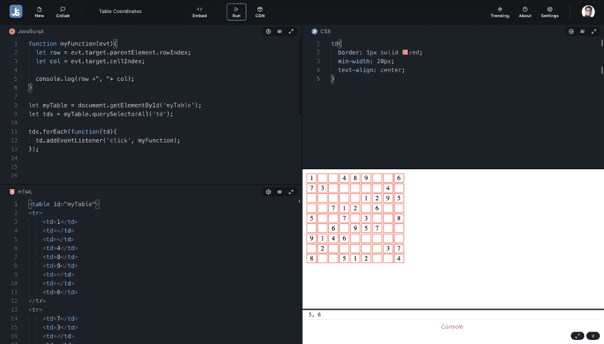](https://res.cloudinary.com/practicaldev/image/fetch/s--kJnSj4H_--/c_limit%2Cf_auto%2Cfl_progressive%2Cq_auto%2Cw_880/https://github.com/jsitor/jsitor/rimg/Screenshot%25202019-09-12%2520at%252012.11.20%2520PM.png)

### 关键特征

## NodeJS 与 Shell 终端交互

JSitor 为编写/共享 NodeJS 脚本提供了 NodeJS 环境，并安装了 NPM 模块。也是免费的。

[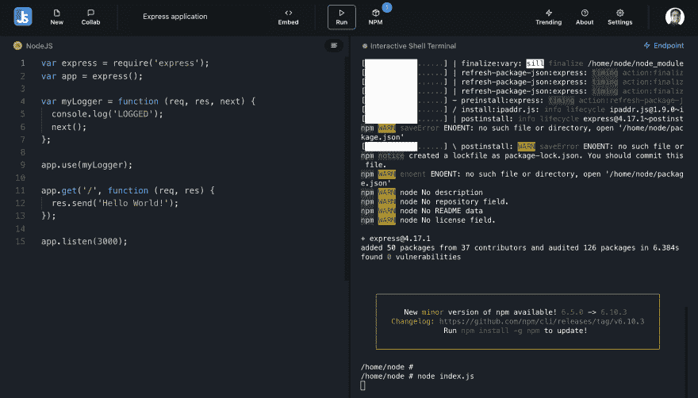](https://res.cloudinary.com/practicaldev/image/fetch/s--PGY1YvOa--/c_limit%2Cf_auto%2Cfl_progressive%2Cq_auto%2Cw_880/https://github.com/jsitor/jsitor/rimg/Screenshot%25202019-09-12%2520at%252012.08.26%2520PM.png)

## 摩纳哥编辑

JSitor 使用 Monaco 编辑器，该编辑器由微软开发，也用于 VSCode。如果我们将其与其他替代方案进行比较，他们使用的是 CodeMirror，CodeMirror 有其自身的稳定性和可用性问题。相比之下，摩纳哥编辑器是更令人满意和稳定的编辑器。

看一看，在摩纳哥编辑器中自动完成看起来有多漂亮，不是更好吗？
[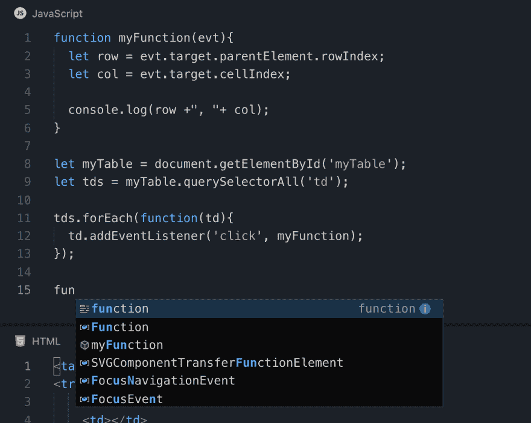T3】](https://res.cloudinary.com/practicaldev/image/fetch/s--dsDC_b6Z--/c_limit%2Cf_auto%2Cfl_progressive%2Cq_auto%2Cw_880/https://github.com/jsitor/jsitor/rimg/Screenshot%25202019-09-12%2520at%252011.56.13%2520AM.png)

比较代码镜像自动完成
[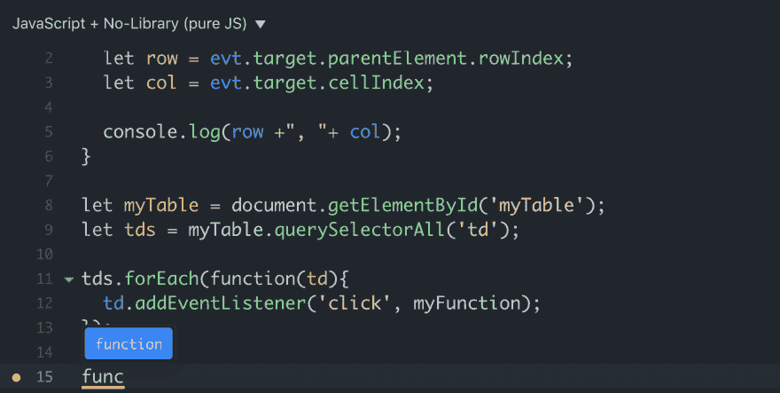](https://res.cloudinary.com/practicaldev/image/fetch/s--flZZz5OV--/c_limit%2Cf_auto%2Cfl_progressive%2Cq_auto%2Cw_880/https://github.com/jsitor/jsitor/rimg/Screenshot%25202019-09-12%2520at%252011.59.31%2520AM.png)

## 控制台视图

JSitor 在编辑器中显示控制台日志，而不需要打开 DevTools。当我们想在不打开 DevTools 的情况下快速检查日志时，这有时非常有用，因为 dev tools 会占用编辑器一半的空间。

## 全屏标签视图

JSitor 提供了一个全屏标签视图，为编写/查看大量源代码提供了足够的空间。除此之外，它还提供了基本的看法，如并排的看法，结果在底部等。

[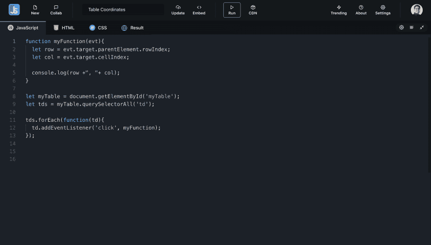](https://res.cloudinary.com/practicaldev/image/fetch/s--0S4FXqsV--/c_limit%2Cf_auto%2Cfl_progressive%2Cq_auto%2Cw_880/https://github.com/jsitor/jsitor/rimg/Screenshot%25202019-09-12%2520at%252012.06.08%2520PM.png)

## 协作

JSitor 借助 TogetherJS 支持协同工作环境。这个特性通常对于进行远程采访或者邀请其他人参与同一个片段非常有用。

[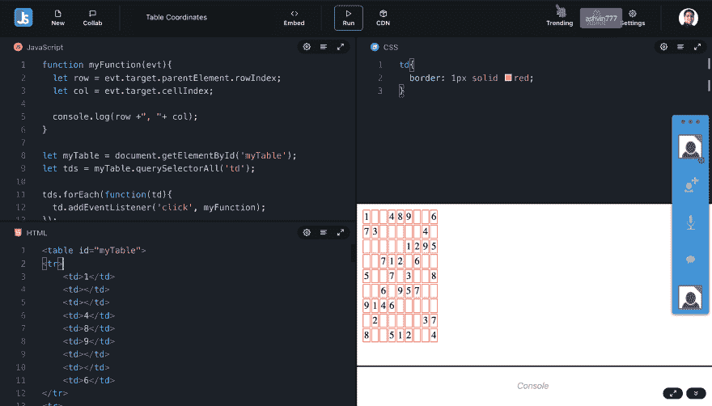](https://res.cloudinary.com/practicaldev/image/fetch/s---Quz10wj--/c_limit%2Cf_auto%2Cfl_progressive%2Cq_auto%2Cw_880/https://github.com/jsitor/jsitor/rimg/Screenshot%25202019-09-12%2520at%252012.06.53%2520PM.png)

## 巴别塔，JSX，脚本模块和打字稿

JSitor 支持所有不同类型的 transpiler，这有助于我们为任何框架编写代码，如 ReactJS、Angular 等

[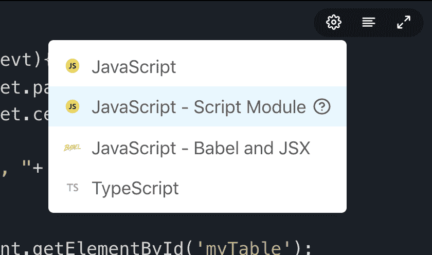](https://res.cloudinary.com/practicaldev/image/fetch/s---XvY5RaR--/c_limit%2Cf_auto%2Cfl_progressive%2Cq_auto%2Cw_880/https://github.com/jsitor/jsitor/rimg/Screenshot%25202019-09-12%2520at%252012.07.05%2520PM.png)

## PostCSS，少，SCSS

JSitor 支持所有不同的 CSS 预处理程序

[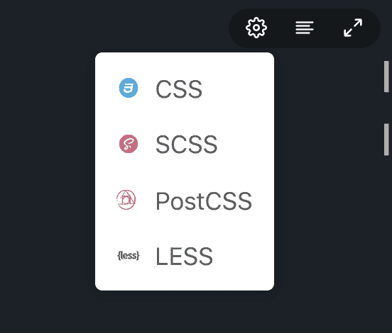](https://res.cloudinary.com/practicaldev/image/fetch/s--JivhV_nr--/c_limit%2Cf_auto%2Cfl_progressive%2Cq_auto%2Cw_880/https://github.com/jsitor/jsitor/rimg/Screenshot%25202019-09-12%2520at%252012.07.18%2520PM.png)

## 哈巴狗

JSitor 也支持 Pug HTML 格式
[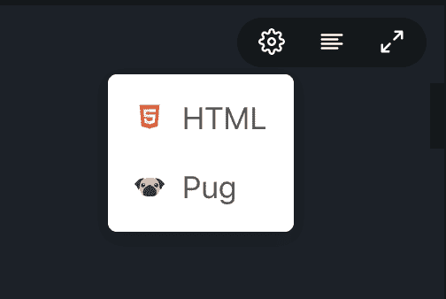](https://res.cloudinary.com/practicaldev/image/fetch/s--iQz4GyDB--/c_limit%2Cf_auto%2Cfl_progressive%2Cq_auto%2Cw_880/https://github.com/jsitor/jsitor/rimg/Screenshot%25202019-09-12%2520at%252012.07.10%2520PM.png)

## 可选链接

## 无效合并

## 所有片段

您可以查看您的所有片段
[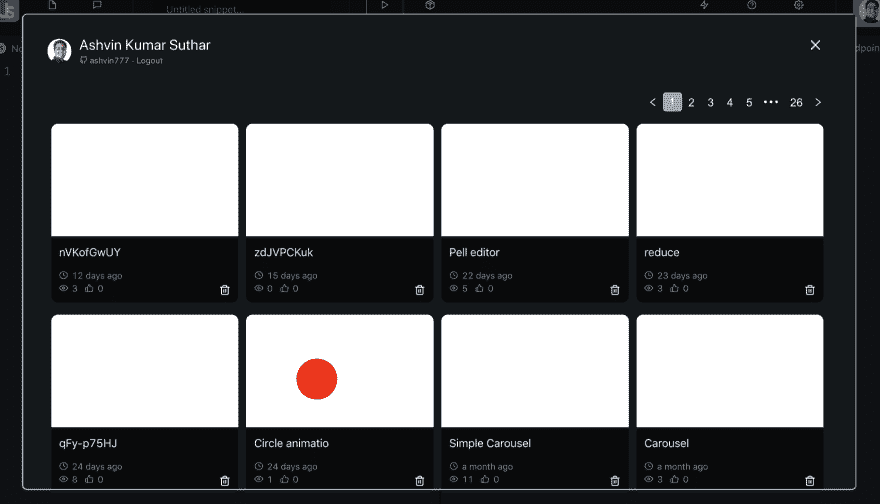](https://res.cloudinary.com/practicaldev/image/fetch/s--Jy3Zgy8V--/c_limit%2Cf_auto%2Cfl_progressive%2Cq_auto%2Cw_880/https://github.com/jsitor/jsitor/rimg/Screenshot%25202019-09-12%2520at%252012.07.41%2520PM.png)

## 趋势、最多视图和最近片段

您可以在趋势选项卡
[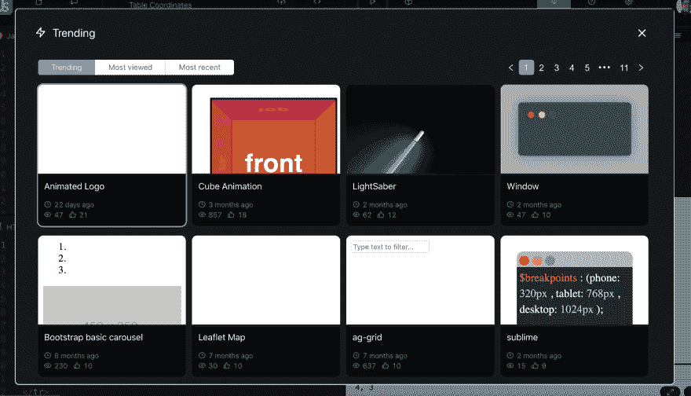](https://res.cloudinary.com/practicaldev/image/fetch/s--ao01Q9Qp--/c_limit%2Cf_auto%2Cfl_progressive%2Cq_auto%2Cw_880/https://github.com/jsitor/jsitor/rimg/Screenshot%25202019-09-12%2520at%252012.05.50%2520PM.png) 下查看一些趋势、最常查看的和最近的片段

## 可嵌入

您可以将片段嵌入到另一个博客/文章网站
[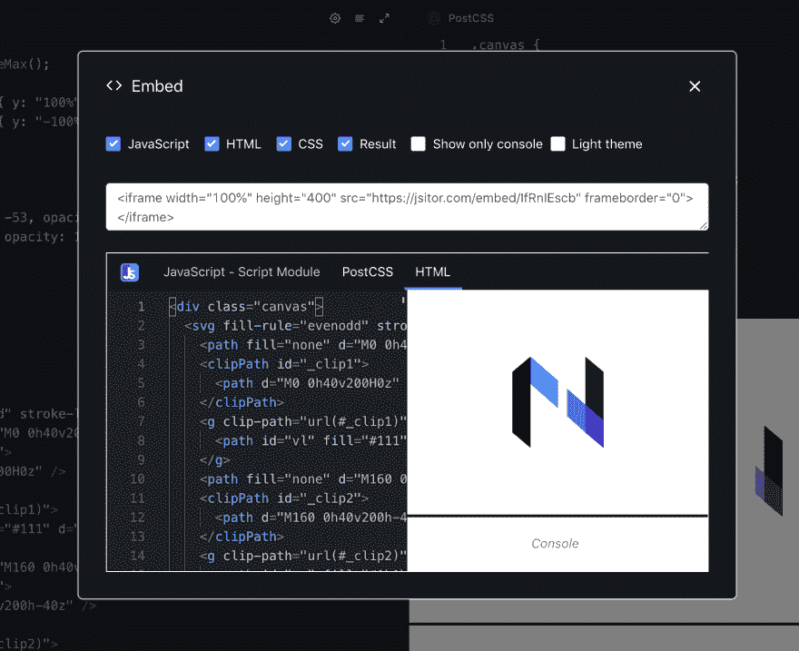](https://res.cloudinary.com/practicaldev/image/fetch/s--1vcp6HB7--/c_limit%2Cf_auto%2Cfl_progressive%2Cq_auto%2Cw_880/https://github.com/jsitor/jsitor/rimg/Screenshot%25202019-09-12%2520at%252012.09.05%2520PM.png)

## iOS 和 Android 应用

JSitor 还为您提供了在移动应用程序中编写/共享或查看代码的好处。当我们离开电脑，想要快速测试一些东西时，这真的很有帮助。

[下载 iOS 应用](https://apps.apple.com/us/app/jsitor/id1455784773)【https://play.google.com/store/apps/details?】下载安卓应用[id = com . ash vin 777 . apps . jsitor](https://play.google.com/store/apps/details?id=com.ashvin777.apps.jsitor)Android 还没有升级，我正在努力升级 Android 应用程序，很快你就会听到一些消息。

[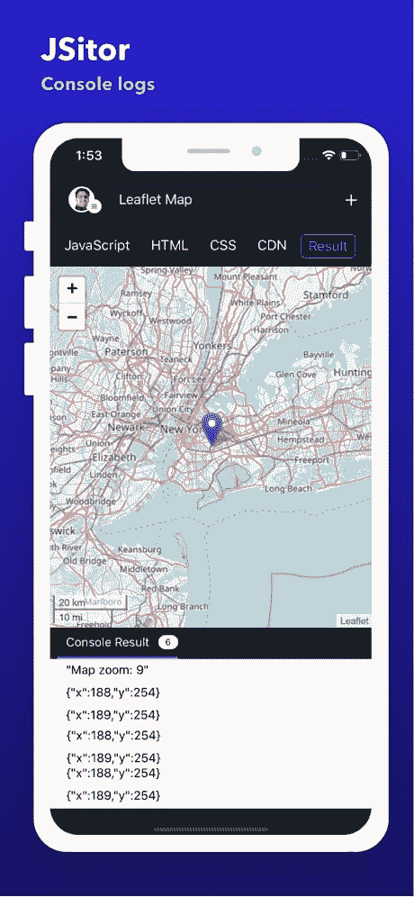](https://res.cloudinary.com/practicaldev/image/fetch/s--keAJwqAh--/c_limit%2Cf_auto%2Cfl_progressive%2Cq_auto%2Cw_880/https://is5-ssl.mzstatic.com/image/thumb/Purple123/v4/43/21/0e/43210e87-0983-989a-b99c-8de543215bab/mzl.ohbittpa.jpg/460x0w.jpg)

# 了解更多手机 app

 [## 谁说移动编程很难？

### ashvin Kumar Suthar 1916 年 9 月 16 日 2 分钟阅读

#javascript #css #html #react](/ashvin777/hassle-free-javascript-css-and-html-programming-in-mobile-app-using-jsitor-app-1c78)

我不会说 JSitor 将是最好的工具，但肯定是值得探索的。尝试一下并分享您的反馈。我们很想听听你们的意见。

*   阿什温·苏塔尔(JSitor.com 的创造者)

在推特上关注我们-[https://twitter.com/JSitorEditor](https://twitter.com/JSitorEditor)