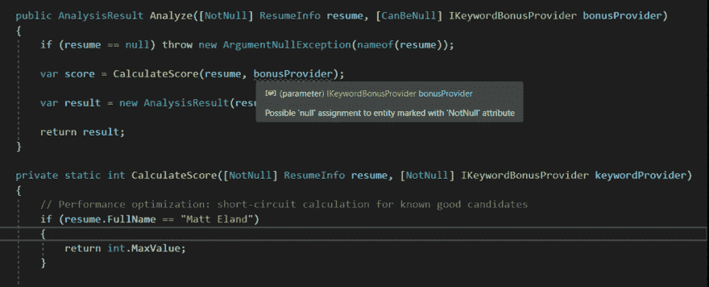

# 在 C#中注释空值

> 原文:[https://dev.to/integerman/annotating-nulls-in-c-118c](https://dev.to/integerman/annotating-nulls-in-c-118c)

在我之前的文章中，我谈到了使用函数式编程的空处理特性。虽然这是一种有效的方法，但也是一种需要大量代码更改才能实现的方法。如果你不想做出如此剧烈的改变，还有一些其他的选择可以考虑。

自从我发现 ReSharper 之后，我最喜欢的是一个免费的 NuGet 包，名为 [JetBrains。注释](https://www.nuget.org/packages/JetBrains.Annotations)。

这个库包含一些属性，您可以用它们来注释您的类、方法、属性、字段和参数。虽然这些工具旨在由 ReSharper Visual Studio 插件或新兴的 Rider IDE 进行分析，但即使您不使用这些工具，它们本身也有价值。

# [](#notnull-canbenull)NotNull / CanBeNull

通常你可能会有一个类似这样的例程:

```
public AnalysisResult Analyze(ResumeInfo resume, IContainer container)
{
    if (resume == null) throw new ArgumentNullException(nameof(resume));

    IKeywordBonusProvider bonusProvider;
    if (container != null) {
       bonusProvider = container.Resolve<IKeywordBonusProvider>();
    } else {
       bonusProvider = new EntityFrameworkKeywordProvider();
    }

    return CalculateScore(resume, bonusProvider);
} 
```

<svg width="20px" height="20px" viewBox="0 0 24 24" class="highlight-action crayons-icon highlight-action--fullscreen-on"><title>Enter fullscreen mode</title></svg> <svg width="20px" height="20px" viewBox="0 0 24 24" class="highlight-action crayons-icon highlight-action--fullscreen-off"><title>Exit fullscreen mode</title></svg>

看到这里，您必须扫描方法，以确定在调用方法或向方法添加新代码时是否可以传入空值`resume`或`container`。

喷气大脑。注解通过`NotNull`和`CanBeNull`属性解决了这个问题。

```
[NotNull]
public AnalysisResult Analyze([NotNull] ResumeInfo resume, 
                              [CanBeNull] IContainer container)
{
    if (resume == null) throw new ArgumentNullException(nameof(resume));

    IKeywordBonusProvider bonusProvider;
    if (container != null) {
       bonusProvider = container.Resolve<IKeywordBonusProvider>();
    } else {
       bonusProvider = new EntityFrameworkKeywordProvider();
    }

    return CalculateScore(resume, bonusProvider);
} 
```

<svg width="20px" height="20px" viewBox="0 0 24 24" class="highlight-action crayons-icon highlight-action--fullscreen-on"><title>Enter fullscreen mode</title></svg> <svg width="20px" height="20px" viewBox="0 0 24 24" class="highlight-action crayons-icon highlight-action--fullscreen-off"><title>Exit fullscreen mode</title></svg>

在这里，我们向两个参数添加了属性，表明我们所期望的，它们是否可以为空。此外，我们用`NotNull`注释了`Analyze`方法的返回类型，以表明它从不返回空值。

这些属性不是由编译器或运行时强制执行的，而是通过 Rider 和 ReSharper 解释的。

[T2】](https://res.cloudinary.com/practicaldev/image/fetch/s--seOxrjwx--/c_limit%2Cf_auto%2Cfl_progressive%2Cq_auto%2Cw_880/https://thepracticaldev.s3.amazonaws.com/i/481twgrc5uujnn74ham4.png)

上面，ReSharper 警告可能将一个可能为空的值作为修饰为`NotNull`的参数传递给一个方法。

# ItemNotNull/itemnabenull

与`NotNull`和`CanBeNull`类似，您可以用`ItemNotNull`和`ItemCanBeNull`来注释集合，以指示集合内部是否可能存在空值。

```
[NotNull, ItemCanBeNull]
public IEnumerable<string> GetTestingStrings()
{
    return new List<string> {"NUnit", "XUnit", null, "MSTest V2"};
} 
```

<svg width="20px" height="20px" viewBox="0 0 24 24" class="highlight-action crayons-icon highlight-action--fullscreen-on"><title>Enter fullscreen mode</title></svg> <svg width="20px" height="20px" viewBox="0 0 24 24" class="highlight-action crayons-icon highlight-action--fullscreen-off"><title>Exit fullscreen mode</title></svg>

这里我们注意到，通过`NotNull`，集合本身不是 null，但是集合可以有 null 条目，如`ItemCanBeNull`所注释的。

# [](#pure)纯粹

纯方法是在方法本身之外或在传递给方法的对象上没有副作用的方法。因此，可以用相同的参数无限地调用纯方法，并获得相同的输出，而无需对其他对象或系统进行任何修改。

下面是一个极其简单的纯方法:

```
[Pure]
public static int AddNumbers(int x, int y) => x + y; 
```

<svg width="20px" height="20px" viewBox="0 0 24 24" class="highlight-action crayons-icon highlight-action--fullscreen-on"><title>Enter fullscreen mode</title></svg> <svg width="20px" height="20px" viewBox="0 0 24 24" class="highlight-action crayons-icon highlight-action--fullscreen-off"><title>Exit fullscreen mode</title></svg>

这里的`Pure`属性是另一段语法，帮助 ReSharper 和 Rider 在返回值未被使用时提供警告(意味着方法调用是无意义的)，但它也可以用作您的团队的文档，以表明该方法永远不应该被修改以产生任何可观察到的副作用。

# [](#publicapi)PublicAPI

公共 API 是另一个简单的例子。它本质上是将一个方法标记为由项目之外的东西使用，并且该类或方法不应该被认为是未使用的/死的代码。

例如，如果您正在构建一个类库，那么您的代码通常不会调用外部应用程序所使用的类或方法(尽管希望仍然由测试代码调用)。

您可以像这样通过`PublicAPI`属性注释这些成员:

```
[PublicAPI]
public void NothingLooksLikeItUsesThis() {
   // Do something important
} 
```

<svg width="20px" height="20px" viewBox="0 0 24 24" class="highlight-action crayons-icon highlight-action--fullscreen-on"><title>Enter fullscreen mode</title></svg> <svg width="20px" height="20px" viewBox="0 0 24 24" class="highlight-action crayons-icon highlight-action--fullscreen-off"><title>Exit fullscreen mode</title></svg>

这个属性也有助于在重构应用程序时约束自己。如果您想更改一个由项目外部调用的公共方法的签名，您可能不会意识到这一点，除非为它分配了一个`PublicAPI`属性——这会导致潜在的崩溃或以后的开发问题。

# [](#other-attributes)其他属性

JetBrains 还有许多其他属性用于显示和高级代码完成，但如果没有这些工具，这些属性不一定会增加多少价值。有关可用属性的更大列表，请参见[在线文档](https://blog.jetbrains.com/dotnet/2018/05/04/better-null-checks-string-formatting-path-completion-jetbrains-annotations/)。

* * *

虽然不是对每个人都适用，也没有被编译器明确检查，但是 Jetbrains。如果您碰巧使用 JetBrains 产品，注释是内联空安全文档和高级 IDE 支持的有趣混合体。如果这可能对您有所帮助，我建议尝试一下，作为明确空值的低风险方法。

如果你正在寻找更多编译时执行的东西，看看我的关于消除 C#代码中的空值的函数式编程技术的文章。

[](/integerman) [## 用函数式编程消除 C#中的空值

### matt Eland Sep 12 ' 194min read

#functional #csharp #dotnet #codequality](/integerman/eliminating-nulls-in-c-with-functional-programming-iaa)