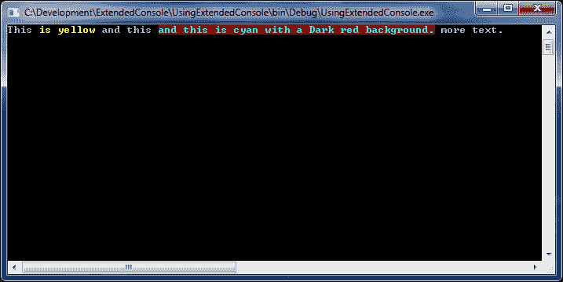

# 你还写控制台应用吗？

> 原文：<https://dev.to/peledzohar/do-you-still-write-console-applications-1did>

我知道。

大多数时候只是作为一个 POC(概念验证),来测试一个算法的实现，来自动化一些内部操作。诚然，我不记得上次为客户编写控制台应用程序是什么时候了。

我的观点是，当你需要快速完成某件事时，我发现控制台应用程序是一个非常有用的工具。

**TL；dr；**帖子底部有一个链接...

然而，我发现游戏机本身非常有限。例如，如果我想在屏幕上写一行，并突出显示里面的一两个单词，我必须为此编写至少 5 行代码:

```
Console.Write("First part of the line ");
Console.ForegroundColor = ConsoleColor.Yellow;
Console.Write("Highlighted in yellow ");
Console.ResetColor();
Console.WriteLine("The rest of the line."); 
```

<svg width="20px" height="20px" viewBox="0 0 24 24" class="highlight-action crayons-icon highlight-action--fullscreen-on"><title>Enter fullscreen mode</title></svg> <svg width="20px" height="20px" viewBox="0 0 24 24" class="highlight-action crayons-icon highlight-action--fullscreen-off"><title>Exit fullscreen mode</title></svg>

如果当前的控制台颜色不是它的默认颜色，我将不得不添加更多的代码来存储原始颜色，这只是一个单一的突出，只有一种颜色！如果我还想改变背景颜色，我就必须至少再添加一行代码，如果我想突出显示文本的两个不同部分呢？

如果可以用一个简单的标记来实现这一点，不是很好吗？

好吧，现在你可以了！

在写了太多的控制台应用程序后，我收集了一些方法，写了一些新的，并提出了一个 GitHub 项目，我称之为扩展控制台。
它使你能够使用一个简单的标记，由一个标签- `c`和两个可选属性组成:`f`用于前景，`b`用于背景。这些属性的值需要是`Console.Color`枚举成员的名称，但是该名称不区分大小写(标签和属性不区分大小写！).
因此，代替上面例子中的大量代码，您可以简单地编写如下代码:

```
var exConsole = new ExConsole();
exConsole.WriteLine("This <c f='yellow'>is yellow</c> and this <c f='cyan' b='darkred'>and this is cyan with a Dark red background.</c> more text."); 
```

<svg width="20px" height="20px" viewBox="0 0 24 24" class="highlight-action crayons-icon highlight-action--fullscreen-on"><title>Enter fullscreen mode</title></svg> <svg width="20px" height="20px" viewBox="0 0 24 24" class="highlight-action crayons-icon highlight-action--fullscreen-off"><title>Exit fullscreen mode</title></svg>

这是它看起来的样子:

[](https://res.cloudinary.com/practicaldev/image/fetch/s--SjKrfY-I--/c_limit%2Cf_auto%2Cfl_progressive%2Cq_auto%2Cw_880/https://thepracticaldev.s3.amazonaws.com/i/3egu7ej0gmj02guwv272.png)

它还包含读取和解析用户输入的方法，两个重载的菜单方法，我认为最好的部分——它超级容易扩展——只需添加自己的扩展方法。

总结一下，如果像我一样，您仍然编写控制台应用程序，并且您想轻松地为它们添加一些颜色、菜单或用户输入功能，那么这个项目非常适合您！

这是麻省理工学院的许可，所以它是完全免费和开源的。

在 GitHub 上查看。

[在我的博客上了解更多信息](https://zoharpeled.wordpress.com/2019/09/07/easy-way-to-customize-your-console-apps/)

这个项目在 Nuget.Org 上可以作为[扩展控制台](https://www.nuget.org/packages/ExtendedConsole)获得。