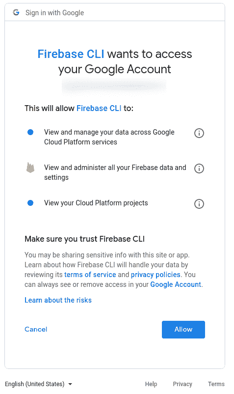
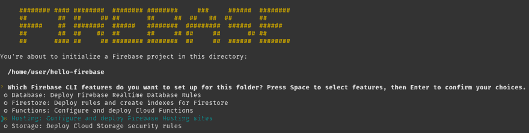
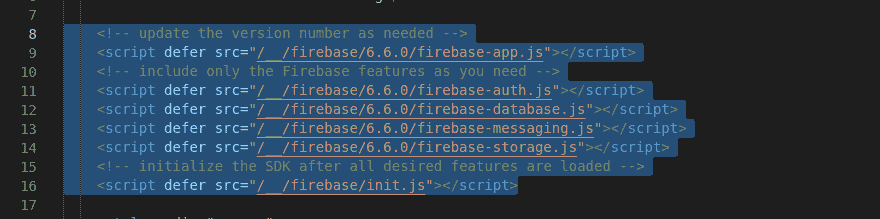
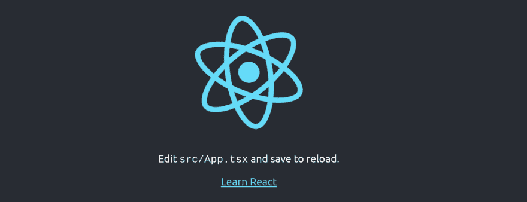
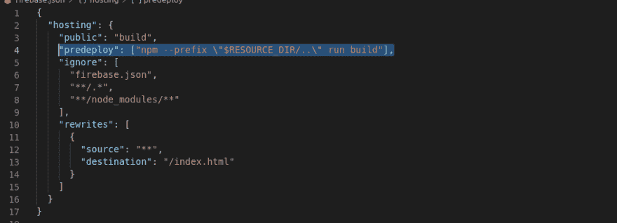

# 为多个 Firebase 环境开发和部署 create-react-app

> 原文:[https://dev . to/capt emulation/developing-and-deployment-create-react-app-to-multiple-fire base-environments-4e8h](https://dev.to/captemulation/developing-and-deploying-create-react-app-to-multiple-firebase-environments-4e8h)

# [](#introduction)简介

create-react-app 让快速上手 react 变得简单。Firebase 使快速开始 web 部署变得容易。本文将展示如何在 Firebase 中为多个环境配置、构建和部署 React 应用程序。另外，我们将让它与 Typescript 一起很好地工作。

# [](#getting-started)入门

首先我们需要安装一些工具。这些指令采用 unix 终端提示符。对于 windows，从 Windows 应用商店安装 WSL(Linux 的 Windows 子系统)

## [](#install-nodejs)安装 NodeJS

如果您已经安装了 NodeJS，可以直接跳过。如果没有，请前往[nodejs.org](https://nodejs.org)下载一个安装程序，或者使用 [nvm](https://github.com/nvm-sh/nvm) 来保证您的 NodeJS 安装不会过时。

使用 nvm:

```
curl -o- https://raw.githubusercontent.com/nvm-sh/nvm/v0.34.0/install.sh | bash 
```

重新启动终端或按照终端上的说明操作。然后安装节点:

```
nvm install 12 
```

## [](#run-createreactapp)运行创建-反应-应用

如果你已经有了一个应用程序，那么你可以跳过这些，直接安装 Firebase。

为了简化一些步骤，让我们为我们的新应用程序选择一个名称，我们将把它保存为一个环境变量以便重用。

```
export REACT_APP=hello-firebase; # replace with your application's name 
```

使用 npx 和 create-react-app 来复制一个新的 react 应用程序。我建议使用 Typescript 来启用类型检查

```
npx create-react-app ${REACT_APP} --typescript 
```

请稍等片刻，让 create-react-app 准备就绪。完成后进入应用目录:

```
cd ${REACT_APP} 
```

## [](#install-firebasetools)安装 firebase-tools

为了使用 firebase，你需要`firebase`命令行工具。最简单的方法是用 npm 进行全局安装:

```
npm i -g firebase-tools 
```

# 创建您的 firebase 应用程序

前往[console.firebase.google.com](https://console.firebase.google.com/)为你的谷歌账户激活 Firebase。如果您选择 *Spark* 计划，那么对于中等规模的应用程序，没有成本。

激活 firebase 后，返回终端并登录:

```
firebase login 
```

您将在浏览器中看到登录提示。点击*允许*完成登录

[T2】](https://res.cloudinary.com/practicaldev/image/fetch/s--nwFM3KtG--/c_limit%2Cf_auto%2Cfl_progressive%2Cq_auto%2Cw_880/https://thepracticaldev.s3.amazonaws.com/i/23jfjzxj22eijoz00jpt.png)

## [](#firebase-environments)燃烧基环境

如果你只是玩玩，那么你可以跳过这一步。当你开始认真开发一个真正的应用程序时，你会想要创建多个 Firebase 环境。首先，让我们创建两个 firebase 环境——一个开发和生产环境。开发环境将是可用于试验新特性的默认环境，而生产环境将是“稳定的”面向客户的环境。

```
firebase projects:create ${REACT_APP}-production
firebase projects:create ${REACT_APP}-development 
```

Firebase 环境名称必须是唯一的，因此如果您想要的名称不可用，请尝试不同的名称。

## [](#initialize-firebase)初始化 Firebase

现在我们准备在 create-react-app 内部初始化 firebase。Firebase 为此提供了一个交互式应用:

```
firebase init 
```

现在，让我们只选择*主持*，因为这是我将要报道的全部内容。您随时可以在以后重新运行此命令来添加功能

[T2】](https://res.cloudinary.com/practicaldev/image/fetch/s--9JBG-h9y--/c_limit%2Cf_auto%2Cfl_progressive%2Cq_auto%2Cw_880/https://thepracticaldev.s3.amazonaws.com/i/l9l79j2g2dorjwx530q5.png)

我们将使用我们之前创建的现有项目。如果使用多个环境，我建议选择您的开发环境作为默认环境。

[T2】](https://res.cloudinary.com/practicaldev/image/fetch/s--WE3X3X_e--/c_limit%2Cf_auto%2Cfl_progressive%2Cq_auto%2Cw_880/https://thepracticaldev.s3.amazonaws.com/i/c7spubd6xlnlb89oad2p.png)

将托管位置更改为*构建*。如果应用程序是 SPA(单页应用程序)，回答*是*。

[T2】](https://res.cloudinary.com/practicaldev/image/fetch/s--zldbI6sJ--/c_limit%2Cf_auto%2Cfl_progressive%2Cq_auto%2Cw_880/https://thepracticaldev.s3.amazonaws.com/i/vug8fazl1fr1wbugqe8x.png)

如果您要部署到多个环境，那么现在就添加您的辅助环境:

```
firebase use --alias production ${REACT-APP}-production; # or whatever name you ended up picking
firebase use default; # switch back to development 
```

## [](#firebase-implicit-initialization-scripts)Firebase 隐式初始化脚本

隐式初始化是一种不用配置文件就能初始化 Firebase 的好方法。当支持单个项目的多种配置时，这是支持多种配置的唯一简单方法。我们真的不想有下面的代码，因为在生产应用程序中泄露非生产环境的细节不是一个好主意:

```
if (process.env.REACT_APP_DEPLOY_ENV='production') {
  firebase.initializeApp(productionConfig)
} else {
  firebase.initializeApp(developmentConfig) 
} 
```

*隐式初始化*的工作原理是从一个特殊的`/__/`文件夹中加载 Firebase javascript。我们部署我们的应用程序 Firebase 这条路线将为我们存在，但在本地，我们需要做更多的工作来设置它。

在你最喜欢的代码编辑器中打开由`firebase init`创建的 *build/index.html* 。在 body 标签的顶部，您会看到一系列与 Firebase 相关的脚本标签。选择并复制这些标签:

[T2】](https://res.cloudinary.com/practicaldev/image/fetch/s--2o0_N1LL--/c_limit%2Cf_auto%2Cfl_progressive%2Cq_auto%2Cw_880/https://thepracticaldev.s3.amazonaws.com/i/dcqvw1asw0hyej8968lv.png)

将它们粘贴到 body 标签顶部的 *public/index.html* 文件中。请随意删除您不使用的功能。

## [](#firebase-serve-for-local-development)火基地为地方发展服务

firebase-tools 附带了一个支持隐式初始化的服务器，但是首先我们需要在 create-react-app 中设置一些东西。

首先让我们安装`run-p`，这是一个并行运行多个 npm 脚本的便利工具。此外，我们将需要配置一个 http 代理。

```
npm i -D npm-run-all http-proxy-middleware 
```

在您的 *package.json* 中，将`start`脚本从`react-scripts start`更改为:

```
 "start": "run-p --race dev:firebase dev:react",
    "dev:firebase": "firebase serve -p 4000",
    "dev:react": "react-scripts start", 
```

现在创建 *src/setupProxy.js* 文件并键入:

```
const proxy = require('http-proxy-middleware')

module.exports = function(app) {
  app.use(
    '/__',
    proxy({
      target: 'http://localhost:4000'
    })
  )
} 
```

现在我们已经为本地发展做好了准备。在您的终端运行:

```
npm start 
```

如果一切正常，您应该会看到:

[T2】](https://res.cloudinary.com/practicaldev/image/fetch/s--aDyv9JW7--/c_limit%2Cf_auto%2Cfl_progressive%2Cq_auto%2Cw_880/https://thepracticaldev.s3.amazonaws.com/i/cvoxiht95eo09h187rxr.png)

检查开发人员工具和终端控制台，您应该看到 Firebase javascript 正在加载，并且没有出现错误。热重载的工作原理是，你可以对代码进行修改，这些修改会立即反映出来。

## [](#deploying-firebase-hosting)部署 Firebase 托管

我们已经准备好将 react 应用程序部署到 Firebase 主机上。首先，我们需要在 *firebase.json* 中添加一行代码，以便在部署之前自动构建我们的应用程序。否则你会忘记做这件事。将下面一行添加到`hosting`部分:

```
"predeploy": ["npm --prefix \"$RESOURCE_DIR/..\" run build"] 
```

[T2】](https://res.cloudinary.com/practicaldev/image/fetch/s--tdsnta0H--/c_limit%2Cf_auto%2Cfl_progressive%2Cq_auto%2Cw_880/https://thepracticaldev.s3.amazonaws.com/i/k9943qsfpuafc6bxgn5p.png)

现在我们可以部署:

```
firebase deploy 
```

React 将构建，控制台中将提供一个链接。您应该能够点击 React 应用程序将加载链接！

## [](#switching-environments)切换环境

当您准备好部署到生产环境时，只需进行环境切换。

```
firebase use production; # switches all future firebase commands to production
firebase deploy 
```

或者使用`-P`标志

```
firebase -P ${REACT_APP}-production deploy; # Does not switch default environment but still deploys to production 
```

## [](#typescript-typings)打字稿打字

如果您开始在您的 Typescript 应用程序中使用 Firebase，您需要让 Typescript 知道您知道可以访问的这个全局`firebase`变量。首先安装`firebase`不是为了导入，而是为了访问包含在
中的类型

```
npm i -D firebase 
```

现在创建一个 *src/firebase.d.ts* 文件，并复制以下内容:

```
import firebase from 'firebase'

declare global {
  export const firebase = firebase
} 
```

现在您已经有了完整的 typescripts 绑定。

# [](#conclusion)结论

我希望这篇指南能让你更容易地将 create-react-app 与 Firebase 结合起来，用于现代 web 应用程序开发和免费应用程序托管。