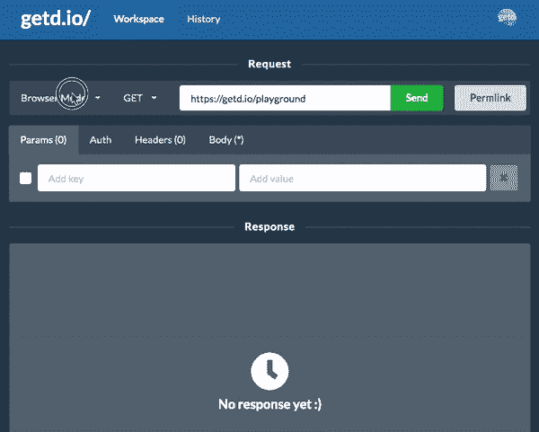
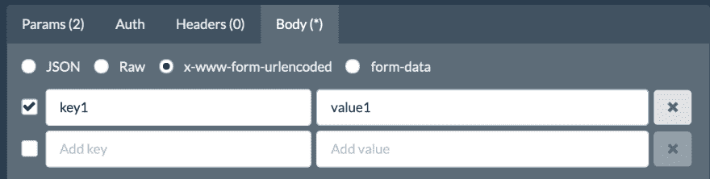
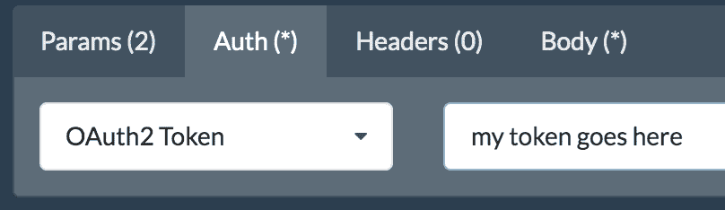
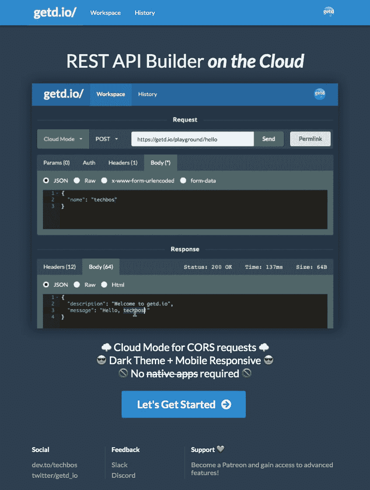
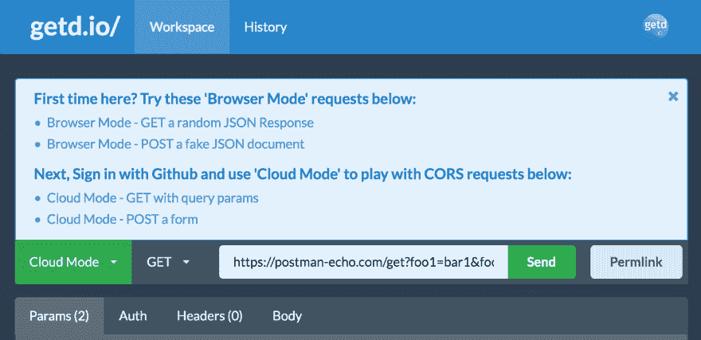

# [更新] getd.io🚀-一个免费的在线 REST API 生成器

> 原文:[https://dev . to/getd/update-getd-io-a-free-online-rest-API-builder-1d 80](https://dev.to/getd/update-getd-io-a-free-online-rest-api-builder-1d80)

getd.io 是一个免费的在线 API 构建器，是我作为邮递员创建的，没有自带应用。试一试，让我知道你的想法。你也可以在本帖中阅读更多[。](https://dev.to/getd/getd-io-an-online-api-request-tester-builder-with-cors-support-3d3m)

自从我发布了 getd.io🚀两周前，该产品发生了许多变化:

[T2】](https://res.cloudinary.com/practicaldev/image/fetch/s--gL0a1m2R--/c_limit%2Cf_auto%2Cfl_progressive%2Cq_66%2Cw_880/https://thepracticaldev.s3.amazonaws.com/i/vsq8q9l23ef78jhz347d.gif)

# 新增功能

*   支持移动响应用户界面。这里看区别[。](https://dev.to/getd/i-added-mobile-responsiveness-to-getd-io-in-just-one-hour-here-is-how-62b)

*   支持新的请求体格式，如`x-www-form-urlencoded`和`form-data`。如果你不确定它们是什么，请阅读[我的帖子](https://dev.to/getd/x-www-form-urlencoded-or-form-data-explained-in-2-mins-5hk6)。

[T2】](https://res.cloudinary.com/practicaldev/image/fetch/s--H-NEUJLd--/c_limit%2Cf_auto%2Cfl_progressive%2Cq_auto%2Cw_880/https://thepracticaldev.s3.amazonaws.com/i/k98khm345ezjc5lxlrpg.png)

*   支持请求头中的 OAuth2 承载令牌

[T2】](https://res.cloudinary.com/practicaldev/image/fetch/s--9qGhShER--/c_limit%2Cf_auto%2Cfl_progressive%2Cq_auto%2Cw_880/https://thepracticaldev.s3.amazonaws.com/i/ryzr6taumcrru06omjeu.png)

*   请求历史记录现在使用模糊搜索。

# 可用性改进

*   请求和响应主体编辑器现在都将通过检测`content-type`头自动切换到正确的格式(例如 JSON、raw text、HTML)。

似乎许多登陆该网站的用户不知道该做什么。为了改善这一点:

*   添加了一个新的登录页面来展示快速产品演示。

[T2】](https://res.cloudinary.com/practicaldev/image/fetch/s--oaMqfwjT--/c_limit%2Cf_auto%2Cfl_progressive%2Cq_auto%2Cw_880/https://thepracticaldev.s3.amazonaws.com/i/bxbnb0sltmncu451zwot.png)

*   向新用户显示示例请求列表，以帮助他们入门。

[T2】](https://res.cloudinary.com/practicaldev/image/fetch/s--v9DWNVfC--/c_limit%2Cf_auto%2Cfl_progressive%2Cq_auto%2Cw_880/https://thepracticaldev.s3.amazonaws.com/i/5a8s805gjb94wuysez0j.png)

# 接下来是什么

*   我计划开源这个项目。如果你想看到这个项目开源，或者有建议，请在这个帖子上留下评论[。](https://dev.to/getd/looking-for-best-practice-for-open-sourcing-getd-io-s-back-end-4mhc)
*   我正在构建一个 API explorer 作为公共 API 的游乐场。例如，你可以立即获得一个令牌来调用 Spotify APIs，并让它播放一些音乐，同时了解 API 的工作原理。
*   我计划建立一个功能，允许用户创建/保存工作区。

请随时留下评论，因为我❤️反馈！