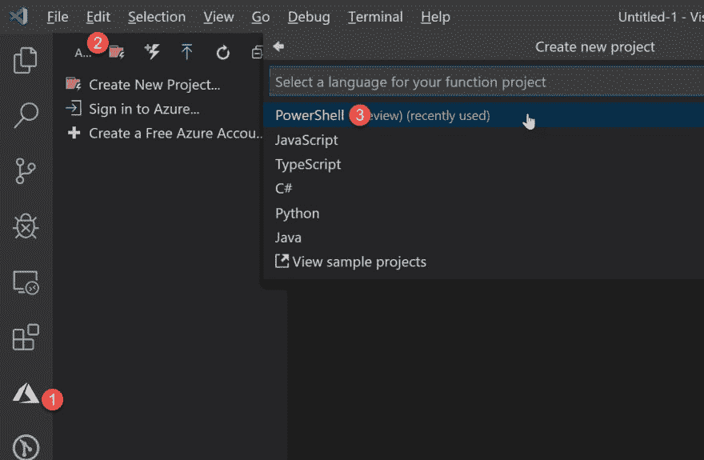
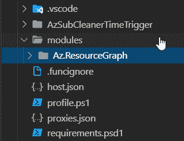
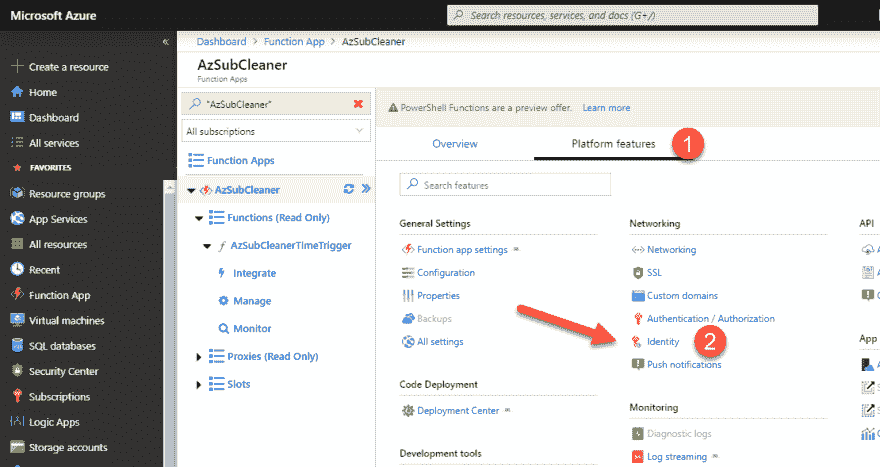
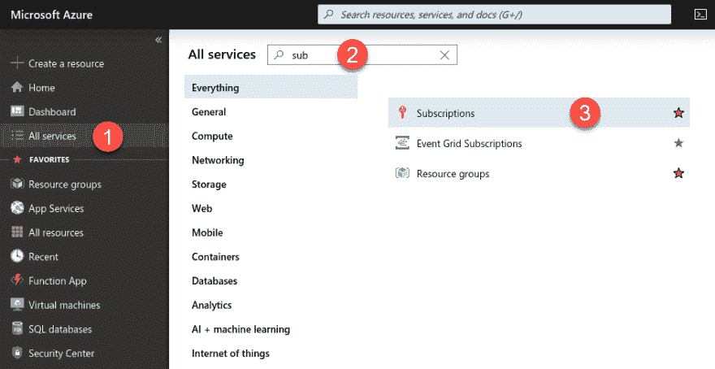
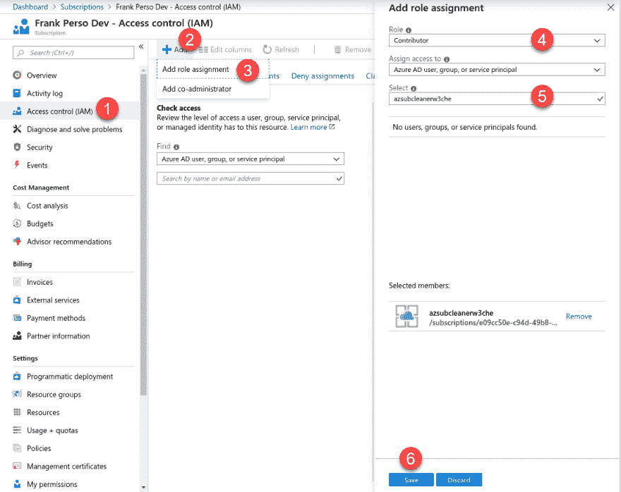

# 使用 Azure 功能自动清理你的混乱

> 原文：<https://dev.to/azure/use-azure-function-to-clean-up-your-mess-automatically-3h29>

> 本文是 [#ServerlessSeptember](https://dev.to/azure/serverless-september-content-collection-2fhb) 的一部分。在这个无服务器的内容集合中，您可以找到其他有用的文章、详细的教程和视频。9 月份，每天都有来自社区成员和云倡导者的新文章发布，没错，每天都有。
> 
> 在[https://docs.microsoft.com/azure/azure-functions](https://docs.microsoft.com/azure/azure-functions/?WT.mc_id=servsept_devto-blog-cxa)了解更多关于微软 Azure 如何实现你的无服务器功能。

在之前的[帖子](https://dev.to/azure/keep-your-azure-subscription-clean-automatically-mmi)中，我解释了如何创建 Azure 自动化来执行删除所有过期资源的 PowerShell 脚本。这一次，我们将使用无服务器的力量来清理我们的混乱。

## 目标

根据计划，我们希望删除所有“过期”的资源。当资源首先作为标记`expireOn`出现，然后该标记的值在当天之前时，该资源将被视为过期。

所有代码都可以在我的 [GitHub repo](https://github.com/FBoucher/AzSubcriptionCleaner) 中获得。在您的 Azure 订阅中还有一个一键部署解决方案的按钮！

## 蔚蓝资源图

Azure 资源图查询非常高效。你可以阅读一篇来自夏羽·拉普安特(微软 Azure MVP)的精彩帖子，它展示了一些性能比较。简而言之，我们不是检索资源并遍历它们，而是只检索我们正在寻找的东西；记录越少越快。

在我们的例子中，所有资源的标签`expireOn`都小于`now()`。

```
$expResources=  Search-AzGraph  -Query  'where todatetime(tags.expireOn) < now() | project id'  foreach  ($r  in  $expResources)  {  Remove-AzResource  -ResourceId  $r.id  -Force  }  $rgs  =  Get-AzResourceGroup;  foreach($resourceGroup  in  $rgs){  $name=  $resourceGroup.ResourceGroupName;  $count  =  (Get-AzResource  |  Where-Object{  $_.ResourceGroupName  -match  $name  }).Count;  if($count  -eq  0){  Write-Output  "==> $name is empty. Deleting it...";  Remove-AzResourceGroup  -Name  $name  -Force  -WhatIf  }  } 
```

Enter fullscreen mode Exit fullscreen mode

然后我们需要删除空的资源组，因为这些不能用资源图来搜索，所以我们使用通常的`Get-AzResourceGroup`来获得所有的组，并用`Remove-AzResourceGroup`删除空的组。

> 要了解 Azure Resource Graph 的所有功能，请查看这个优秀的[文档](https://docs.microsoft.com/en-us/azure/governance/resource-graph/first-query-powershell?WT.mc_id=servsept_devto-blog-frbouche)，里面有很多示例。我还做了一个 5 分钟的视频[像老板一样用 Azure Graph 查询](https://youtu.be/0iOwUkOg6_c)搜索，在那里我解释了它是如何工作的。

## PowerShell Azure 功能

在这篇文章中，我将使用 Visual Studio Code 扩展的 Azure 函数来创建我的函数。

从 VSCode 扩展中，点击第一个选项**创建新项目**。选择本地文件夹和语言；对于这个演示，我将使用 PowerShell。这将创建一些文件和文件夹。

现在让我们创建我们的函数。从扩展菜单中选择第二个选项**创建功能**。创建一个名为**的时间触发器 AzSubCleanerTimeTrigger** 。最后一个问题是使用 [cron 表达式](https://en.wikipedia.org/wiki/Cron#CRON_expression)提供一个时间表。要在每天早上 5 点触发该功能，请输入`0 0 5 * * *`。您可以通过编辑文件`function.json`随时更改这一点。

[](https://res.cloudinary.com/practicaldev/image/fetch/s--sub2p7rz--/c_limit%2Cf_auto%2Cfl_progressive%2Cq_auto%2Cw_880/https://thepracticaldev.s3.amazonaws.com/i/rm3rmp4qh78dhl5m099z.jpg)

将之前显示的 PowerShell 添加到 run.ps1 文件的末尾。这样我们的代码就完成了。该函数将接收参数中的时间，您可以使用它，比如说用于日志目的。

## 必填模块

如果您可以等待，并且已经尝试执行这个函数，您可能会得到一个关于丢失模块的错误。这是因为为了处理命令`Search-AzGraph`，我们需要添加模块`Az.ResourceGraph`。

要将 PowerShell 模块添加到我们的 FunctionApp，请在根目录下创建一个名为“modules”的文件夹。如果您已经在本地安装了模块，您可以通过执行以下命令找到模块文件夹的位置:

```
Get-Module  -ListAvailable  Az.ResourceGraph 
```

Enter fullscreen mode Exit fullscreen mode

您需要将文件夹`Az.ResourceGraph`复制到您刚刚创建的文件夹模块中。应该是这样的。

[](https://res.cloudinary.com/practicaldev/image/fetch/s--0JLF4Sx8--/c_limit%2Cf_auto%2Cfl_progressive%2Cq_auto%2Cw_880/https://thepracticaldev.s3.amazonaws.com/i/hugguzrhenmm1lbu3vwv.png)

如果您没有在本地安装该模块，您可以使用下面的命令安装它，或者在这里查看更多的[完整文档](https://docs.microsoft.com/en-us/azure/governance/resource-graph/first-query-powershell?WT.mc_id=servsept_devto-blog-frbouche)。

```
Install-Module  -Name  Az.ResourceGraph 
```

Enter fullscreen mode Exit fullscreen mode

## 部署

用 VSCode 扩展部署 Azure 功能，非常简单。在扩展中，点击第三个按钮*部署到功能应用*。选择当前文件夹(您应该在我们的函数文件夹的根目录下)，以及目标订阅。当提示选择 Web App 时，选择 *+新建 WebApp* ，输入 **AzSubscriptionCleaner** 作为名称。应该需要一分钟时间，部署将会完成。

大部分已经完成，现在我们需要授权 Azure 函数来管理订阅。部署完成后，进入 Azure 门户，打开刚刚部署的 Azure Function App。打开**平台特性**选项卡，在联网部分选择*身份*。

[](https://res.cloudinary.com/practicaldev/image/fetch/s--uOTLYJVc--/c_limit%2Cf_auto%2Cfl_progressive%2Cq_auto%2Cw_880/https://thepracticaldev.s3.amazonaws.com/i/on6857ug01necq77c8dw.png)

现在将状态更改为“开”，并保存。这将创建一个新的主体，并将其分配给函数 App。

要将贡献者角色分配给这个主体，我们需要进入订阅。从左侧菜单中选择*所有服务*，并在搜索栏中键入“订阅”。点击**订阅**查看可用订阅列表。单击您刚刚部署 AzSubscriptionCleaner 的订阅。

[](https://res.cloudinary.com/practicaldev/image/fetch/s--Xx5B1B6f--/c_limit%2Cf_auto%2Cfl_progressive%2Cq_auto%2Cw_880/https://thepracticaldev.s3.amazonaws.com/i/3nol2f9e8wb2vj87pyd1.png)

从左侧选项中选择*访问控制(IAM)* 。点击*添加*，选择*添加角色分配*。从左侧的新面板中，选择 *Contributor* 作为角色，并在*选择*文本框中输入您的资源的名称(例如:azsubscriptioncleaner)。

[](https://res.cloudinary.com/practicaldev/image/fetch/s--Ka5GztVP--/c_limit%2Cf_auto%2Cfl_progressive%2Cq_auto%2Cw_880/https://thepracticaldev.s3.amazonaws.com/i/vfiysyx5mnpd0kfpf2mq.png)

选择*选择*蓝色按钮，就大功告成了！

## 然后呢？

第二天早上，Azure 功能将被触发，并删除所有过期的资源。进入 Azure 门户并添加一些标签。从任何资源中，单击**标签**选项，输入`expireOn`作为名称，并按照格式`YYYY-MM-dd`输入您希望该资源到期的日期。

还可以通过 PowerShell、Azure CLI 和 Azure Resource Manager (ARM)模板添加标签。

如果你喜欢，我也有这篇文章的视频版本。

[https://www.youtube.com/embed/kbM8zwvUpkg](https://www.youtube.com/embed/kbM8zwvUpkg)

大扫除快乐！

*感谢: [@iboonox](https://twitter.com/iboonox) 惊人的头球图像！谢谢你。*