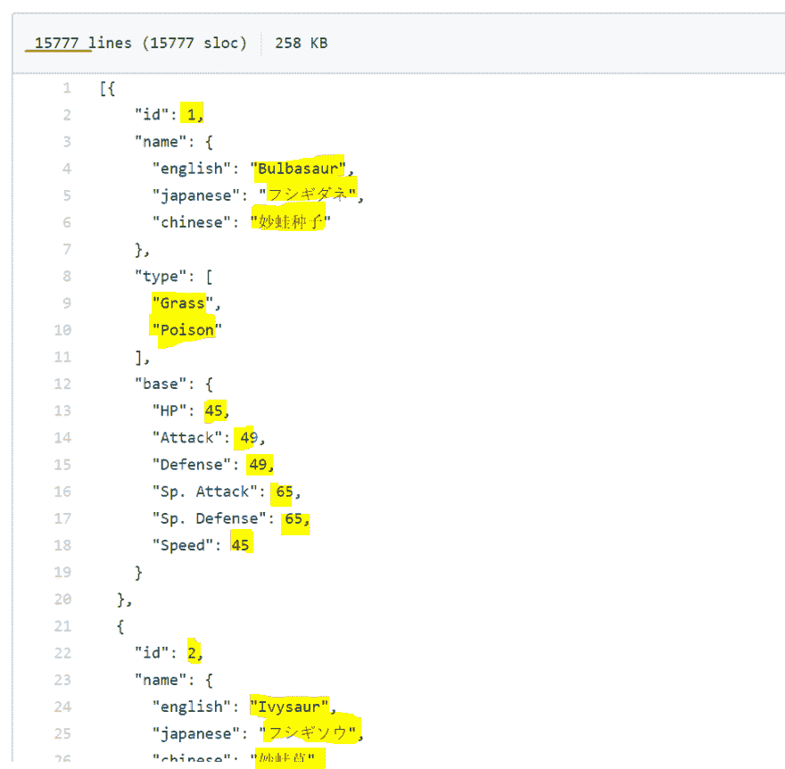
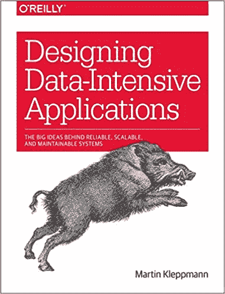

# 为什么是 Avro？

> 原文:[https://dev.to/_codingblocks/why-avro-4dkc](https://dev.to/_codingblocks/why-avro-4dkc)

Apache Avro 是一个开源的数据序列化系统，可以让你发送信息。它经常与“大数据”和分布式系统联系在一起，因为它比竞争对手有一些明显的优势。

下面列出了主要优势，但请继续阅读了解更多信息:

*   消息[高效](https://labs.criteo.com/2017/05/serialization/)
*   [强大的模式支持](https://docs.oracle.com/database/nosql-12.1.3.0/GettingStartedGuide/avroschemas.html)
    *   模式版本化
    *   动态模式支持
    *   允许不同但兼容的阅读器和编写器版本
    *   [工会类型](https://avro.apache.org/docs/1.8.2/spec.html#Unions)
*   [对象容器文件](https://avro.apache.org/docs/1.8.1/spec.html#Object+Container+Files)可以包括模式以及编码记录

## 为什么不是人类可读的格式？

有许多不同的序列化和反序列化数据的方法，它们各有优势。JSON 可能是当今开发人员处理的最常见的格式，但是 XML 仍然是一些技术栈中的王者。这些格式的主要好处是易于阅读，使得开发和调试更加容易。

然而，使 JSON 和 XML 等格式可读的东西(如每个元素或属性的标签)也是使其非常低效的东西。

不相信我？这里有一个 json 格式的 Pokemon [pokedex](https://github.com/fanzeyi/pokemon.json/blob/master/pokedex.json) 的链接。标签(“id”、“名称”、“攻击”、“Sp。攻击》)编造的数据比数据做的多！

<figure> 

<figcaption>是的，您可以压缩 json 和 xml，但是它[昂贵](http://highscalability.com/blog/2016/3/21/to-compress-or-not-to-compress-that-was-ubers-question.html)并且您的数据不再是人类可读的…那么为什么不选择一种更好的格式呢？</figcaption>

</figure>

**优点**:

*   人类可读/可写
*   [可选模式](https://json-schema.org/)
*   受到广泛支持
*   非常适合轻松的任务

**缺点**:

*   计算效率低下

## 协议缓冲区/节俭呢？

像[协议缓冲区](https://developers.google.com/protocol-buffers/)或[节俭](https://thrift.apache.org/)这样的格式不是人类可读的，但是它们非常有效。这个想法是你可以创建一个定义数据形状的模式，并且你可以与任何需要解码你的数据的人共享这个模式。

这使得我们可以大大减少每封邮件的空间。该模式也是基于 id 的，它提供了一种有限的[模式演化，您可以添加或删除(只要它们不是必需的)新字段](https://capnproto.org/language.html)而不会破坏任何东西。

**优点:**

*   高效
*   大多数主要语言都有 3p 库支持它
*   对模式进化的有限支持
*   所需的模式可以作为文档

**缺点:**

*   模式必须在序列化程序和反序列化程序之间共享
*   无法添加或删除必填字段
*   模式没有直接版本化
*   对于轻松的任务来说很复杂

## 为什么是 Avro？

我在上面列出了所有的原因，我将在下面再次列出，但最终归结为拥有令人敬畏的模式支持。

拥有一个独立的版本化模式允许 Avro 在其消息中保留最少量的信息，使其高度紧凑。模式支持还允许不同的读者和作者就他们支持的模式进行协商，这在最低级别上增加了很多灵活性。

还有一些额外的好处，比如使支持动态模式变得更容易，而不是在代码中编译它们，并且必须找出如何在项目间共享模式。当然，您可以在另一种格式的基础上构建这种格式，并且将这种支持构建到您支持的所有工具中，但是当您可以使用一种流行的、公认的标准时，为什么要这样做呢？

**优点**:

*   消息[高效](https://labs.criteo.com/2017/05/serialization/)
*   [强大的模式支持](https://docs.oracle.com/database/nosql-12.1.3.0/GettingStartedGuide/avroschemas.html)
    *   模式版本化
    *   动态模式支持
    *   允许不同但兼容的阅读器和编写器版本
    *   [工会类型](https://avro.apache.org/docs/1.8.2/spec.html#Unions)
*   [对象容器文件](https://avro.apache.org/docs/1.8.1/spec.html#Object+Container+Files)可以包括模式以及编码记录

**缺点:**

*   支持不像其他格式那样广泛
*   对于轻松的任务来说很复杂

在这里阅读更好的对比:[https://Martin . kleppmann . com/2012/12/05/schema-evolution-in-avro-protocol-buffers-thrift . html](https://martin.kleppmann.com/2012/12/05/schema-evolution-in-avro-protocol-buffers-thrift.html)

那个帖子的作者还写了这本很棒的[书](https://www.codingblocks.net/designing-data-intensive)！

 ，如果你对这个帖子感兴趣，我打赌你会喜欢它。