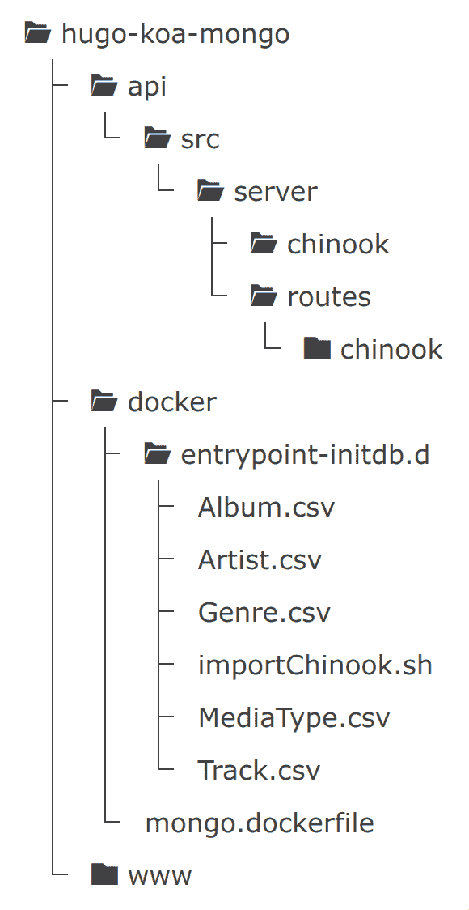
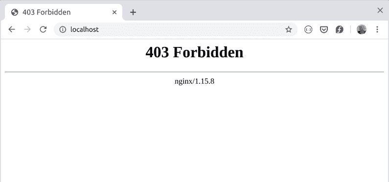

# Hugo + Node.js Koa App 连接 MongoDB

> 原文:[https://dev . to/jimfrenette/Hugo-node-js-KOA-app-connected-to-MongoDB-5905](https://dev.to/jimfrenette/hugo-node-js-koa-app-connected-to-mongodb-5905)

这个项目演示了如何利用 Nginx 的 Docker 栈来创建一个开发环境，为静态网站提供服务，为 api 应用程序提供 Nodejs，为 api 数据提供 MongoDB，为反向代理提供 Traefik。该堆栈适合部署到试运行和生产环境。

#### [](#prerequisites)先决条件

要完成本教程，需要安装这些产品。

*   [码头工人](https://docs.docker.com/)
*   [坞站组成](https://docs.docker.com/compose/)
*   [雨果](https://gohugo.io)
*   [Node.js](https://nodejs.org/en/)

### [](#project-setup)项目设置

为整个项目创建一个目录，例如`hugo-koa-mongo`。所有项目文件都将放在这个文件夹中。这个文件夹将被称为项目根目录。

### [](#hugo-static-website-generator)雨果静态网站生成器

首先，在项目根目录中打开一个终端，在名为`www`的文件夹中创建一个新的 Hugo 站点，如下所示。

```
hugo new site www 
```

#### [](#add-a-theme)添加主题

在 [themes.gohugo.io](https://themes.gohugo.io/) 有很多主题可供选择。你可以安装其中的一个，如果你喜欢或使用这个例子来安装我的[雨果启动器](https://github.com/jimfrenette/hugo-starter)主题。下载并解压主题到`www/themes/starter`文件夹，或者使用 [Git](https://git-scm.com/) 并从它的 Git 存储库中克隆主题。举个例子，

```
git init
cd www
git submodule add https://github.com/jimfrenette/hugo-starter.git themes/starter 
```

主题安装完成后，更新`config.toml`站点配置文件以使用该主题。举个例子，

##### [](#configtoml)config.toml

```
theme = "starter" 
```

在 hugo dev 服务器上预览网站

```
cd www

hugo server 
```

如果站点加载完毕，我们就可以进入下一步了。

### [](#mongodb)MongoDB

我们将为`api`数据库构建一个 MongoDB Docker 容器。为了演示，我们需要用一些数据填充它。为此，我将表从 [Chinook](https://github.com/jimfrenette/chinook-database) 数据库导出到`csv`文件中，然后可以使用`mongoimport`导入这些文件。

您可以下载这个项目的[源代码](https://github.com/jimfrenette/hugo-koa-mongo/tree/part-1/docker/entrypoint-initdb.d)中的`csv`文件，或者自己完成如下过程。

1.  下载 [Chinook_Sqlite.sqlite](https://github.com/jimfrenette/chinook-database/blob/master/ChinookDatabase/DataSources/Chinook_Sqlite.sqlite) 数据库。

2.  用用于 SQLite 的 [DB 浏览器](https://sqlitebrowser.org/)打开它

3.  将这些表格导出到 csv 文件:

    *   `Album.csv`
    *   `Artist.csv`
    *   `Genre.csv`
    *   `MediaType.csv`
    *   `Track.csv`

我们将复制一个带有 shell 脚本的 entrypoint 文件夹和所有导出到 MongoDB Docker 映像中的`csv`文件，以便填充数据库。在项目根目录下，创建一个名为`docker`的新文件夹，其中包含一个`entrypoint-initdb.d`文件夹，如下所示。

```
mkdir -p docker/entrypoint-initdb.d 
```

将所有导出的`csv`文件复制或移动到`docker/entrypoint-initdb.d`文件夹中。

在`docker`文件夹中，创建一个`mongo.dockerfile`，它将从 mongo 创建一个映像，并将`entrypoint-initdb.d`中的文件复制到新映像的`docker-entrypoint-initdb.d`文件夹中。

##### [](#mongodockerfile)莽哥。码头风格

```
FROM mongo

COPY ./entrypoint-initdb.d/* /docker-entrypoint-initdb.d/ 
```

在`docker/entrypoint-initdb.d`文件夹中，创建这个`importChinook.sh`脚本。这个脚本将在使用`csv`文件创建映像来填充 MongoDB 时运行。

##### [](#importchinooksh)importChinook.sh

```
mongoimport --db chinook --collection Album --type csv -f AlbumId,Title,ArtistId --file /docker-entrypoint-initdb.d/Album.csv
mongoimport --db chinook --collection Artist --type csv -f ArtistId,Name --file /docker-entrypoint-initdb.d/Artist.csv
mongoimport --db chinook --collection Genre --type csv -f GenreId,Name --file /docker-entrypoint-initdb.d/Genre.csv
mongoimport --db chinook --collection MediaType --type csv -f MediaTypeId,Name --file /docker-entrypoint-initdb.d/MediaType.csv
mongoimport --db chinook --collection Track --type csv -f TrackId,Name,AlbumId,MediaTypeId,GenreId,Composer,Milliseconds,Bytes,UnitPrice --file /docker-entrypoint-initdb.d/Track.csvnpm i nodemon -D 
```

### [](#nodejs-koa-api)Node.js Koa API

API 是使用 [Koa.js](http://koajs.com) 下一代 web 框架为 [Node.js](https://nodejs.com/) 构建的。这个应用程序将接受对`/api`的请求，并从 MongoDB Docker 容器返回`json`数据。

在项目根目录下，创建一个名为`api`的文件夹，其中包含`src/server/chinook`和`src/server/routes`文件夹。举个例子，

```
mkdir -p api/src/server/{chinook,routes} 
```

在`api/src/server/routes`文件夹中，为各个路线创建一个`chinook`文件夹。

项目结构

[T2】](https://res.cloudinary.com/practicaldev/image/fetch/s--UZqT3PS9--/c_limit%2Cf_auto%2Cfl_progressive%2Cq_auto%2Cw_880/https://thepracticaldev.s3.amazonaws.com/i/c3x2j533c6gm0vbtwo03.png)

用`npm init`初始化 Node.js 应用程序，以创建`package.json`清单文件，该文件将包含所有应用程序依赖项定义和用于启动和构建应用程序的 npm 脚本命令。举个例子，

```
cd api

npm init -y 
```

> 以下`npm i`或`npm install`命令从`api`目录运行。当安装命令运行时，`package.json`文件用相应的包版本信息更新。

安装 MongoDB Node.js 驱动，`mongodb`。

```
npm i mongodb 
```

为基于模式的解决方案安装[mongose](https://mongoosejs.com/)来建模应用程序数据。它还包括内置的类型转换、验证、查询构建、业务逻辑挂钩等等。

```
npm i mongoose 
```

#### [](#models)型号

在`src/server/chinook`文件夹中，创建数据模型。举个例子，

##### [T1】album . js](#albumjs)

```
const mongoose = require('mongoose');
const Schema = mongoose.Schema;

const AlbumSchema = new Schema({
    AlbumId: Number,
    Name: String,
    ArtistId: Number
},{ 
    collection: 'Album'
});

const chinook = mongoose.connection.useDb('chinook');

module.exports = chinook.model('Album', AlbumSchema); 
```

##### [T1】artist . js](#artistjs)

```
const mongoose = require('mongoose');
const Schema = mongoose.Schema;

/*
 notice there is no ID. That's because Mongoose will assign
 an ID by default to all schemas

 by default, Mongoose produces a collection name by passing the model name to
 the utils.toCollectionName method.
 This method pluralizes the name Artist to Artists.
 Set this option if you need a different name for your collection.
*/

const ArtistSchema = new Schema({
    ArtistId: Number,
    Name: String
},{ 
    collection: 'Artist'
});

const chinook = mongoose.connection.useDb('chinook');

module.exports = chinook.model('Artist', ArtistSchema); 
```

##### [](#trackjs)track.js

```
const mongoose = require('mongoose');
const Schema = mongoose.Schema;

const TrackSchema = new Schema({
    TrackId: Number,
    Name: String,
    AlbumId: Number,
    MediaTypeId: Number,
    GenreId: Number,
    Composer: String,
    Milliseconds: Number,
    Bytes: Number,
    UnitPrice: String
},{ 
    collection: 'Track'
});

const chinook = mongoose.connection.useDb('chinook');

module.exports = chinook.model('Track', TrackSchema); 
```

#### [](#koa)Koa

安装`koa`和`koa-router`。

```
npm i koa koa-router 
```

#### [](#routes)路线

在`src/server/routes`文件夹中，创建默认的`api`路线。举个例子，

##### [](#indexjs)index.js

```
const Router = require('koa-router');
const router = new Router();

router.get('/api/', async (ctx) => {
  ctx.body = {
    status: 'success',
    message: 'hello, world!'
  };
})

module.exports = router; 
```

在`src/server/routes/chinook`文件夹中，创建`api/chinook`路线。举个例子，

##### [T1】album . js](#albumjs)

```
const Router = require('koa-router');

const connect = require('../../chinook/connect');

connect();

const router = new Router();
const BASE_URL = `/api/chinook`;

const Album = require('../../chinook/album');

function getAlbums(artist) {
    return new Promise((resolve, reject) => {
        var query = Album.find({ 'ArtistId': artist });
        query.exec((err, results) => {
            if (err) return handleError(err);
            resolve(results);
        });
    });
}

router.get(BASE_URL + '/albums/:artist', async (ctx) => {
    try {
        ctx.body = await getAlbums(ctx.params.artist);
    } catch (err) {
        console.log(err)
    }
})

module.exports = router; 
```

##### [T1】artist . js](#artistjs)

```
const Router = require('koa-router');

const connect = require('../../chinook/connect');

connect();

const router = new Router();
const BASE_URL = `/api/chinook`;

const Artist = require('../../chinook/artist');

function getArtists() {
    return new Promise((resolve, reject) => {
        var query = Artist.find();
        query.exec((err, results) => {
            if (err) return handleError(err);
            resolve(results);
        });
    });
}

router.get(BASE_URL + '/artists', async (ctx) => {
    try {
        ctx.body = await getArtists();
    } catch (err) {
        console.log(err)
    }
})

module.exports = router; 
```

##### [](#trackjs)track.js

```
const Router = require('koa-router');

const connect = require('../../chinook/connect');

connect();

const router = new Router();
const BASE_URL = `/api/chinook`;

const Track = require('../../chinook/track');

function getTracks(album) {
    return new Promise((resolve, reject) => {
        var query = Track.find({ 'AlbumId': album });
        query.exec((err, results) => {
            if (err) return handleError(err);
            resolve(results);
        });
    });
}

router.get(BASE_URL + '/tracks/:album', async (ctx) => {
    try {
        ctx.body = await getTracks(ctx.params.album);
    } catch (err) {
        console.log(err)
    }
})

module.exports = router; 
```

#### [](#app-entrypoint)App Entrypoint

如下创建一个`src/server/index.js`应用程序入口点文件，以启动应用程序、路由和配置 MongoDB 连接。

##### [](#indexjs)index.js

```
const Koa = require('koa');
const mongoose = require('mongoose');
const indexRoutes = require('./routes/index');
const artistRoutes = require('./routes/chinook/artist');
const albumRoutes = require('./routes/chinook/album');
const trackRoutes = require('./routes/chinook/track');

/**
 * Koa app */
const app = new Koa();
const PORT = process.env.PORT || 1337;
const server = app.listen(PORT, () => {
    console.log(`Server listening on port: ${PORT}`);
});

/**
 * MongoDB connection */
const connStr =  'mongodb://mongo:27017/default';
mongoose.connect(connStr);
const db = mongoose.connection;
db.on('error', console.error.bind(console, 'connection error:'));
db.once('open', () => {
    console.log('connected');
});

app.use(indexRoutes.routes());
app.use(artistRoutes.routes());
app.use(albumRoutes.routes());
app.use(trackRoutes.routes());

module.exports = server; 
```

### [NPM-运行-脚本](https://docs.npmjs.com/cli/run-script)

为了构建 api 服务器各自的`dev`或`prod`版本，在`scripts`下的`package.json`文件中，定义`dev`和`start`命令。这些命令在 Docker 容器根据`docker-compose.yml`中的设置启动时执行。

##### [](#packagejson)package.json

```
...

"scripts": {
    "dev": "nodemon ./src/server/index.js",
    "start": "node ./src/server/index.js",
    "test": "echo \"Error: no test specified\" && exit 1"
  },
} 
```

因为在`dev`模式下需要`nodemon`来观察和重建我们的 api 应用程序，所以让我们安装它并将其保存为一个开发依赖项。

```
npm i nodemon -D 
```

### [](#docker-compose)[坞站组成](https://docs.docker.com/compose/)

要安装 docker 映像，创建我们的容器并启动我们的环境，将这个`docker-compose.yml`文件添加到项目根目录。请注意，卷路径将项目文件映射到它们在 Docker 容器中的路径。例如，Hugo publish 目录`www/public`映射到 html 的 nginx 服务器路径`/usr/share/nginx/html`。

```
version: "3"

services:

  app:
    image: node:alpine
    container_name: "${DEV_PROJECT_NAME}_node"
    user: "node"
    working_dir: /home/node/app
    labels:
      - 'traefik.backend=${DEV_PROJECT_NAME}_node'
      - 'traefik.frontend.rule=Host: ${DEV_PROJECT_HOST}; PathPrefix: /api'
    environment:
      - NODE_ENV=production
    volumes:
      - ./api:/home/node/app
      - ./api/node_modules:/home/node/node_modules
    expose:
      - "1337"
    # command: "node ./src/server/index.js"
    command: "npm run dev"
    depends_on:
      - mongo

  mongo:
    build:
      context: ./docker
      dockerfile: mongo.dockerfile
    container_name: "${DEV_PROJECT_NAME}_mongo"
    labels:
      - 'traefik.backend=${DEV_PROJECT_NAME}_mongo'
    ports:
      - "27017:27017"
    volumes:
      - mongodata:/data/db

  nginx:
    image: nginx
    container_name: "${DEV_PROJECT_NAME}_nginx"
    labels:
      - 'traefik.backend=${DEV_PROJECT_NAME}_nginx'
      - 'traefik.frontend.rule=Host: ${DEV_PROJECT_HOST}'
    volumes:
      - ./www/public:/usr/share/nginx/html

  traefik:
    image: traefik
    container_name: "${DEV_PROJECT_NAME}_traefik"
    command: -c /dev/null --docker --logLevel=INFO
    ports:
      - "80:80"
      - "8080:8080"
    volumes:
      - /var/run/docker.sock:/var/run/docker.sock

volumes:
  mongodata: 
```

我喜欢使用一个`.env`文件来配置 docker-compose 变量。在项目根目录中，创建这个`.env`文件。

```
### PROJECT SETTINGS

DEV_PROJECT_NAME=hkm
DEV_PROJECT_HOST=localhost 
```

在项目根目录中，运行`docker-compose up -d`，这将在后台启动容器并保持它们运行。`-d`用于分离模式。

[T2】](https://res.cloudinary.com/practicaldev/image/fetch/s--WwFr4mp4--/c_limit%2Cf_auto%2Cfl_progressive%2Cq_auto%2Cw_880/https://thepracticaldev.s3.amazonaws.com/i/a8w4o3oc9c5y4mrblsmb.png)

如果你得到一个 403 禁止 nginx 服务器消息，那是因为我们没有发布 Hugo 站点。

```
cd www

hugo 
```

要查看发布的 Hugo 站点，使用`docker-compose`重启项目根目录中的服务。`-d`开关用于断开模式，例如

```
docker-compose down

docker-compose up -d 
```

### [](#api-test)API 测试

在浏览器中加载[localhost/API/chinook/artists](http://localhost/api/chinook/artists)来查看 json 响应。

> 为排除故障，查看 docker 容器日志或通过省略`-d`开关(如`docker-compose up`)在连接模式下旋转。

* * *

本教程的所有源代码都可以在 GitHub 上获得。

##### *[源代码](https://github.com/jimfrenette/hugo-koa-mongo/tree/part-1)*

 *最初发布于[jimfrenette . com/2019/05/Hugo-plus-nodejs-KOA-app-MongoDB-connection](https://jimfrenette.com/2019/05/hugo-plus-nodejs-koa-app-mongodb-connection/)*