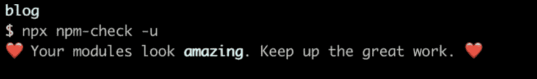
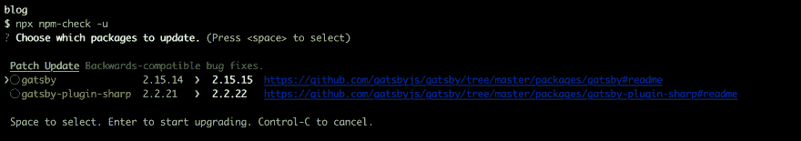

# 更新您的 JavaScript 项目依赖关系——一种为什么/如何更新的方法

> 原文：<https://dev.to/jnielson94/updating-your-javascript-project-dependencies-a-why-how-approach-4ijn>

*最初发表于[jnielson.com](https://jnielson.com/upgrading-your-javascript-project-dependencies)。*

*   为什么要更新？
*   我们应该多久更新一次？
*   最好的更新方式是什么？
*   什么时候不应该更新？
*   为什么更新很难？
*   什么使它变得更容易？

前段时间，我出发去回答上面的问题。在我的工作岗位上，我们在许多不同的项目上与许多开发人员互动。一些项目始终是最新的，而其他项目总是至少落后 6 个月。从我们所看到的来看，这两组项目之间的区别通常不在于他们如何看待更新(通常人们希望更新)，而在于他们对维护他们的项目给予了多少关注。最新的项目通常也是鼓励开发人员在应用程序的某个部分工作时花时间重构代码的项目，或者是拥有最佳文档的项目。另一方面，那些一贯过时的项目是那些鼓励开发人员尽可能快地添加新特性，并且很少回头重构或记录的项目。

## 打个草坪比方？

这和照料你的草坪是相似的，因为如果你只在你种植新的花、树或灌木的地方工作，其他地方只会不断生长，而不会被修剪或照料。

最终，你可能会收到某人的通知，说你有一棵树快要撞到电线了，你必须修剪一下，否则他们会在月底把它砍掉。此时，修剪圣诞树的工作量要比几个月前修剪圣诞树并花些时间保持圣诞树完好的工作量大得多。一些人在面临这种情况时会让公司来砍伐树木，然后支付由此产生的费用，而另一些人则认为自己修剪树木是值得的，还有一些人雇佣其他人来拯救树木。

这与更新项目依赖关系有什么关系？有时候你有一个项目，你做了很好的工作，定期更新你的依赖关系，这需要一点努力，但通常是很简单的。其他时候你有一个项目，你只是偶尔工作，所以它从来没有收到任何更新，当你决定更新它永远需要大量的工作(就像这个博客，已经有一段时间没有更新，有些 44/55 的依赖关系已经过时)。既然我已经坦白并指出我的博客网站已经有一段时间没有更新了，我将借此机会概述我对上述问题(本质上是谁、什么、何时、为什么和如何——他们在学校教我的基本生活问题)的答案的想法，并希望这能激励我更新我自己的博客。

## 为什么更新？

那么，我们为什么要更新呢？据我所知，为什么更新的典型答案包括以下内容:

*   错误修复
*   安全补丁
*   很酷的新功能
*   更容易提交错误报告
*   跟上重大变化，使未来的更新更容易

以我的经验来看，更新的首要原因是获得错误修复。在我跟踪的几乎每个库版本中，至少都有某种类型的错误被修复，即使它不会马上影响到我。与错误修复相关的是重要的安全补丁，这些补丁偶尔会被反向移植，但更多时候你只需要安装最新版本就可以获得它们。有时，它们是如此重要，以至于值得站在“前沿”或库的最新版本上，以获得修复一些实际上影响到您的 bug 或安全问题的更新，我知道，库欣赏那些愿意冒险站在“前沿”并尝试他们的 alpha 或 canary 版本，以便在推广之前获得良好测试的人。

更新的另一个原因是使将来的更新更容易。如果你花时间完成那个主要的更新点，你将能够在将来更容易地更新，因为通常库和工具以一种递增的方式发布变化，如果你在最新的版本上，给你一组容易的步骤。例如，React 最近发布了一个版本，反对一些组件生命周期方法版本，要求您将它们的使用重命名为一个`UNSAFE_`变体。但是，他们也提供了一个 codemod，你可以运行它，它会自动为你做！在这种情况下，codemod 理论上可以在任何支持该特性的库版本上工作。在 storybook.js 的例子中，在 5.2 版本中(这是一个正在发布的候选版本)，他们引入了一种叫做 CSF 的新方法来写你的故事。他们还提供了一个 codemod，允许你自动更新你的大部分故事，但是有些情况下它不起作用。在这种情况下，使用最新版本的库可以确保您获得最好的支持，因为这是他们一直在努力的目标升级途径。

从上面的案例中，您可以看到使用流行和稳定的库来尽量减少破坏性更改有一些巨大的好处。他们的动机是让人们保持最新的版本，所以他们提供工具来使升级更容易或改变不太剧烈，因为剧烈的变化会使升级更困难！

## 多久一次？

现在你已经确信你应该更新了(如果你不相信，请联系我，告诉我如何改进那个部分)，你多久更新一次？嗯，真的要看你的项目了！据我所见，你可以分成 4 类:

1.  主动开发应用程序
2.  维护(“偶尔”)应用
3.  图书馆
4.  很少接触和更少组织的项目

根据我在应用程序方面的经验，你可以根据你在项目上的工作量进入一个很好的节奏。据我所见，积极工作的项目(大多数情况下是每天)应该在临近开始的每个“冲刺”中尝试更新它们的依赖关系，以便有时间自然地测试更新，而不是需要在发布之前运行应用程序的所有测试用例。换句话说，如果你在一个周期的早期进行更新，你可以花一些时间来修复突然出现的问题，而不是试图在一个周期的后期进行更新，如果你遇到任何问题，就不得不回滚。有些人可能会觉得每次更新 sprint 都是多余的，但是我建议定期进行小规模更新，而不是等到有大量更新的时候。

在另一种情况下，当有一个主要的 bug 或一些特性需要添加/调整时，您有“经常”被处理的应用程序。在这种情况下，我发现最好是检查更新，但不要实际去做，除非它们很小并且容易验证。在像这样的项目中，我倾向于让更新建立一点点，这样一旦你有了足够的看起来有用/主要/有帮助的更新，你就可以添加一个任务来做更新，并完全验证事情仍然在工作。理想情况下，您应该已经编写了可以用来加速验证的自动化测试，但是我还没有看到很多项目能够有效地做到这一点。

对于库，我发现只要依赖项有更新，就至少值得考虑更新以使用它。在大多数情况下，更新和发布一个版本是有好处的，因为这些更新将包含您可能没有遇到但您的用户可能会遇到的错误修复。

我发现的最后一类建议是不活跃的副业项目，或者是工作如此频繁以至于甚至没有一个系统来跟踪需要做什么的事情。自从我最近更经常地写博客以来，这个项目不再属于这一类，但有一段时间我甚至没有列出我想写的东西或在博客上做的事情，因为我已经几个月没有碰它了。对于几个月都没有碰过的项目，我发现做需要做的事情然后离开，或者在尝试更新之前回到正常的工作节奏会更有用。就我的博客网站而言，我一直很享受当前的创作体验，以至于我一直在以一种更有规律的方式进行创作，这使得更新内容变得更容易。

## 如何更新？

一旦你决定了多久更新一次，你实际上是怎么做的呢？你如何按照你刚刚确定的时间表实现它？在我看来，如果您的源代码是开放和可用的，那么使用自动检查 package.json 更新的工具是最好的方法。我没有对它们做过太多的调查，但是我见过一些项目使用像`greenkeeper`或`renovate`这样的工具，看起来非常成功。在大多数情况下，每当发布新版本时，这些工具都可以向您的项目提交一个 pull 请求，如果您已经正确设置了它，就可以触发您的测试套件的运行和应用程序的测试部署。如果您已经关闭了源代码或者想要更多地手动操作，有一些很棒的工具，比如`depcheck`或`npm-check`(在我看来，最好在项目文件夹中作为`npx npm-check -u`运行)，它们可以通过编程读取您的清单文件并检查最新版本。在我看来，这两种方法都比用`npm show [package]`手动检查或者类似的逐一检查你的依赖项来检查更新版本更好。在我看来，这是自动化真正大放异彩的一个例子，所以拥抱它吧！

对于`npm-check`工具(我使用最频繁的工具)，如果您在项目中使用它和`npx npm-check -u`,如果您没有更新，输出将如下所示:

如果您有一些更新，看起来会像这样:

如果您有很多更新，它会为您提供一些不错的分页:

如果你使用的库遵循`semver`的话，它为你提供的小更新和补丁通常是相当安全的。如果他们不这样做，事情会变得更加困难，但是大多数 JavaScript 包(这篇文章的主题)确实使用 semver 并试图坚持使用它。如果您更新了一个补丁/次要更新并导致了问题，大多数库将与您合作修复它们并发布一个新的次要/补丁更新。

在更大的更新中，库或工具通常会包含一个`codemod`，或者一个可以运行的脚本，允许自动更新到新的语法、名称等。这些代码非常方便，我强烈推荐使用它们！如果你有一个没有提供的案例，写你自己的！我见过的大多数 codemods 都在幕后使用 [jscodeshift](https://github.com/facebook/jscodeshift) ，我想大多数库的维护者会感谢一些帮助来让人们更新(我知道我会的！).

在自动化工具之外，您需要确保通读所有提供的文档，如变更日志或发行说明，这些文档可以让您深入了解可能需要更新的内容。例如，如果您在安装像`gulp-sass`或`node-sass`这样的库时遇到问题，您首先要做的就是检查它们的发行说明，以确保您所在的节点版本与您试图安装的库版本兼容。在这种特定情况下，库依赖于 node 中的一些本机挂钩，因此如果它与您的 node 版本不兼容，它将根本无法工作。所以，你会去他们的发布页面，[，就像`gulp-sass`](https://github.com/dlmanning/gulp-sass/releases) 的那个，通常看起来只是说它更新到了 X 版本的 [`node-sass`，它也有一个发布页面](https://github.com/sass/node-sass/releases/)，详细说明了节点支持的版本。

## 有没有不更新的时候？

有时候，特别是当项目使用上面提到的自动化工具时，我已经看到一些更新拉取请求被搁置了很长时间。我偶尔会想这是为什么，因为这些项目有一个很好的测试套件，可以确保新版本的库仍然可以工作，但是不管出于什么原因，维护人员都选择不合并拉请求。在我看来，这有几个原因:

*   一些特性被删除而没有替换(通常会导致测试失败)
*   想让主要版本有时间“烘烤”(排除 bug，让其他人发现退化和问题)
*   想要推迟依赖项更新并对其进行批处理吗
*   较高优先级的项目或任务不会为较低优先级的项目或更新留出时间

如果你知道人们选择不更新的其他原因，让我知道，我会添加到这个列表中！我很想了解它们背后的原因，尤其是在测试(自动和手动)仍然通过的情况下。据我所见，大多数时候是允许“烘烤”更新，几周之后拉请求被合并(并使用最新的项目代码运行)。这段时间允许社区中的其他人为您找到问题，并在理想情况下为您提供更好的更新体验。有些人有足够的风险承受能力来立即更新，我欣赏他们在稳定依赖性方面所做的努力。

## 是什么让更新难？

除了你因为任何原因选择不更新的时间(如果它没有被捕获，我会感谢你与我分享它！)，有些时候更新是非常困难的。没关系。有时项目非常大和复杂，或者有太多的东西需要更新，或者您根本没有时间测试应用程序中所有可能受到更新影响的东西。在所有这些情况下，都有正当的理由不更新或推迟更新，但据我所见，人们通常会后悔这些决定——特别是在那些正在积极开发的项目中，因为它们的到期时间较晚。所以，我发现了一些使更新变得困难或更加困难的事情:

*   需要确保代码中没有任何内容被破坏
*   关于变更内容的不完整文档
*   更新非常频繁(一些图书馆几乎每天都发布新版本)
*   需要检查更新(手动或自动)
*   一些库不遵循版本控制方案(semver)

正如我前面所说的，这些都是不想更新的完全合理的理由。在大多数情况下，你可以做一些事情来使它变得更容易，但有时这很难。我不得不处理的最困难的是不遵循任何版本控制方案的库，所以你永远不知道当你更新时你会得到什么。我参与的大多数项目都遵循 [semver](https://semver.org) ，这提供了一个很好的框架让你在其中做出更新决策。但是，那些没有的(或者说他们有，但是仍然在`0.x.x`版本中)是非常难以追踪的。

## 什么让更新更容易？

除了真正困难的情况之外，尽管如此，你可以在你的应用程序中做一些事情来使它更容易更新。例如:

*   给你信心的自动化测试
*   自动化工具减少了检查更新的手动操作
*   阅读文档和变更日志(并提交更新/创建它们的请求，如果它们不存在的话！)
*   使它成为一项常规任务比每隔几个月进行一次大规模更新要容易得多

为了使更新更容易，您可以做的最好的事情之一是创建一套测试，它可以在您更新时自动运行。当你有了给你信心的测试，当一个更新破坏了一些东西(预期的或意外的)时，它更容易被发现，并且也加速了更新过程。在某种程度上，自动化测试是定期更新的一个要求，因为没有它们，您可能会陷入这样一个陷阱:无论更新的大小如何，您都需要在任何更新之后手工测试您的整个应用程序。理想情况下，你的测试是以这样一种方式编写的，如果一个依赖关系改变了，它不会失败，除非你的应用程序合法地中断，但这是一个不同的问题。

除了测试之外，使用我上面提到的自动化工具可以更容易地管理大量的依赖项。例如，`npm-check`提供了到 readme/changelog/repository 的链接，如果它能找到的话，这对于查看发生了什么变化非常有用。

重申一遍，定期更新会让你付出的努力有很大的不同！花时间去阅读 3 或 4 个库的变更日志，然后花时间去阅读 40 多个，并对其中的大部分进行重大更新，这要容易得多。在任何情况下，当一次更新 2 或 3 个依赖项时，您更有可能快速诊断出问题，即使您最终不得不更新 44 个。有时候，为了确保不会遇到更大的问题，您需要同时更新依赖关系。比如 storybook 和 next 都用了引擎盖下的巴别塔。不久前他们更新到了巴别塔 7，但他们在不同的时间更新，所以等到他们都上了巴别塔 7 之后再更新我们的项目要容易得多。另一种方法是升级一个，调整配置，把它们隔离开来，在一种情况下支持 babel 7，在另一种情况下支持 babel 6，这是可行的...但是一旦两者都在巴别塔 7 上，接下来需要完成的工作就没有了。所以，有时候推迟更新或者干脆不更新是有意义的。

使更新更容易的另一点是减少依赖性。这似乎是显而易见的，但是如果事情少了，更新就不那么痛苦了！实现这一点的一个很好的方法是使用像`gatsby`或`next`这样的工具，它们提供了许多您需要启动并运行的工具，并隐藏了大量的依赖项(并为您更新它们！)以便更容易地处理您的实际项目。我喜欢的`gatsby`的一个特点是主题，因为它们可以为你抽象出更多。自从我最初写了这篇文章，我花了大约一天的时间更新使用`@eggheadio/gatsby-theme-egghead-blog`，并从`@eggheadio/gatsby-starter-egghead-blog`中取出了我博客代码库中的大部分东西，因为它们现在存在于主题中！从开始到主题的更新实际上是一次非常有趣的经历，特别是因为我没有做太多的定制工作，可以直接把大部分内容去掉。

这就是我现在关于更新依赖关系的全部内容，如果你对这个问题有其他想法，请随时联系我，因为我很想听听他们的想法！感谢阅读！对于那些可能喜欢看一点这个过程的人，我在下面留下了这篇文章的大纲(它也为那些可能已经浏览过的人提供了一个很好的总结)。如果你喜欢这样，让我知道，我可以做得更多！

## 概述(如果有人好奇或想了解概况，可参考)

*   为什么要更新？
    *   依赖关系中的错误修复
    *   来自平台/库的安全补丁(例如节点)
    *   很酷的新功能(例如反应钩)
    *   更容易提交 bug 报告(大多数库要求您使用最新版本，以确保 bug 仍然存在)
*   我们应该多久更新一次？
    *   看情况！
    *   活跃的应用程序应该至少在每次“冲刺”时(每隔几周)检查更新，以避免累积，并且应该至少每月更新一次
    *   维护应用程序应该定期进行小的更新——大约每 2 个月(#semver ),使用标签/注释来完成大的更新和更多的测试
    *   库应该根据需要经常更新(通常它们有较少的依赖性)，确保根据需要交流永远的变化
    *   如果有时间的话，辅助项目(比如我的博客)会得到更新——取得进展比更新更重要，除非你遇到了 bug 或者需要一个特性
*   最好的更新方式是什么？
    *   使用自动化工具或脚本，如`greenkeeper`、`renovate`、`depcheck`或`npm-check`
    *   其他选项包括手动安装最新版本的软件包
    *   不过自动化在这方面很棒
*   什么时候不应该更新？
    *   移除您需要的功能，无需更换
    *   主要的版本变化有时需要一些“烘烤”时间来发现和修复主要的 bug 或退化(例如下一个 9.0.1 修复了一些动态路由问题)
*   为什么更新很难？
    *   需要确保代码中没有任何内容被破坏
    *   关于变更内容的不完整文档
    *   更新非常频繁(一些图书馆几乎每天都发布新版本)
    *   需要检查更新(手动或自动)
    *   一些库不遵循版本控制方案(semver)
*   什么使它变得更容易？

    *   给你信心的自动化测试
    *   自动化工具减少了检查更新的手动操作
    *   阅读文档和变更日志(并提交更新/创建它们的请求，如果它们不存在的话！)
    *   使它成为一项常规任务比每隔几个月进行一次大规模更新要容易得多

*横幅图片由 undraw.co 提供，草坪图片来自维基共享资源*