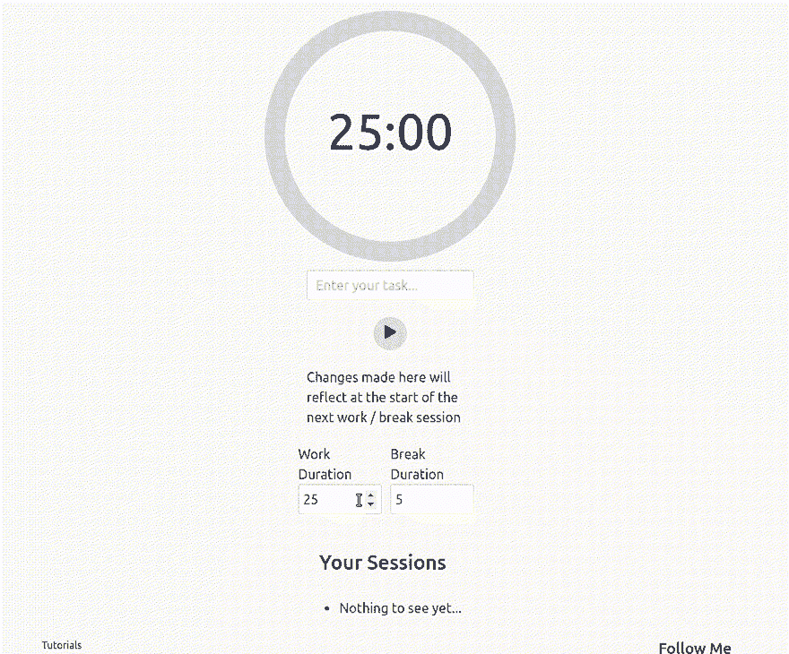
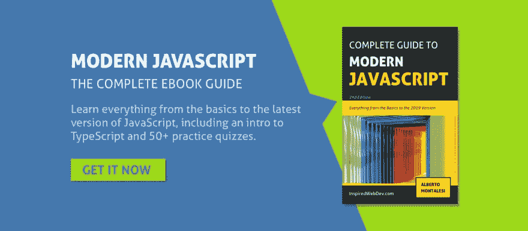

# [教程]用 JavaScript 创建一个番茄钟

> 原文：<https://dev.to/albertomontalesi/tutorial-create-a-pomodoro-clock-with-javascript-13om>

在本教程中，我们将创建一个[番茄钟](https://en.wikipedia.org/wiki/Pomodoro_Technique)来帮助你记录你在不同任务上花费的时间。

## 结果

[](https://res.cloudinary.com/practicaldev/image/fetch/s--abG0yJxC--/c_limit%2Cf_auto%2Cfl_progressive%2Cq_66%2Cw_880/https://raw.githubusercontent.com/AlbertoMontalesi/InspiredWebDev-Tutorials/master/screenshots/6_pomodoro_clock.gif)

你可以在这里看到这个项目的现场演示

## 任务

*   难度:初级/中级
*   工具:您选择的文本编辑器
*   持续时间:1-2 小时
*   github Repo:[https://github . com/Alberto montalesi/InspiredWebDev-Tutorials/pomodoro-clock](https://github.com/AlbertoMontalesi/InspiredWebDev-Tutorials/pomodoro-clock)

这是这个番茄钟的用户故事:

*   [ ]用户可以启动/暂停/停止计时器
*   [ ]用户可以编辑任务的标题
*   [ ]用户可以看到已完成的番茄工作证列表
*   [ ]用户可以自定义每个工作/休息时段的持续时间

现在我们知道了我们想要用这个番茄钟实现什么，让我们开始构建一个简单的 HTML 结构。

 [](http://a-fwd.to/5gUojI8) 
在[亚马逊](http://a-fwd.to/5gUojI8)和 [Leanpub](https://leanpub.com/thecompleteguidetomodernjavascript2019) 上获取我的电子书

### 播放和暂停定时器

我们将首先创建一个简单的 HTML 结构来显示计时器，并添加按钮来启动、暂停和停止计时器。

```
 <div id="pomodoro-container">
  <div id="pomodoro-clock">
    <div id="pomodoro-timer"></div>
    <div id="pomodoro-clock-actions">
      <button id="pomodoro-start">Start</button>
      <button id="pomodoro-pause">Pause</button>
      <button id="pomodoro-stop">Stop</button>
    </div>
  </div>
</div> 
```

现在我们有了一个基本的结构，让我们开始处理`script.js`文件中的`toggleClock`函数。

这三个按钮都会调用这个函数，它可以启动、暂停或停止计时器。

首先，让我们在按钮上附加一个事件监听器:

```
const pomodoroTimer = document.querySelector('#pomodoro-timer');

const startButton = document.querySelector('#pomodoro-start');
const pauseButton = document.querySelector('#pomodoro-pause');
const stopButton = document.querySelector('#pomodoro-stop');

// START
startButton.addEventListener('click', () => {
  toggleClock();
})

// PAUSE
pauseButton.addEventListener('click', () => {
  toggleClock();
})

// STOP
stopButton.addEventListener('click', () => {
  toggleClock(true);
}) 
```

我们将每个按钮存储在一个变量中，并为它们附加了事件侦听器。
如你所见，对于`stopButton`，我们在`toggleClock`函数中传递一个参数。你马上就会明白为什么了。

为了知道我们是需要播放还是暂停计时器，我们需要一个额外的变量，我们称之为`isClockRunning`，默认情况下它将被绑定到`false`。

```
let isClockRunning = false; 
```

我们还需要一些变量来完成我们的初始设置:

```
// in seconds = 25 mins
let workSessionDuration = 1500;
let currentTimeLeftInSession = 1500;

// in seconds = 5 mins;
let breakSessionDuration = 300; 
```

现在让我们开始编写我们的`toggleClock`函数。

```
 const toggleClock = (reset) => {
  if (reset) {
    // STOP THE TIMER
  } else {
    if (isClockRunning === true) {
      // PAUSE THE TIMER
      isClockRunning = false;
    } else {
      // START THE TIMER
      isClockRunning = true;
    }
  }
} 
```

`toggleClock`有一个参数，`reset`,只有当我们停止计时器时，这个参数才会被传递，否则我们将查看变量`isClockRunning`的值，以确定我们是否需要播放或暂停计时器。

我们将利用内置方法`setInterval`来跟踪我们的计时器。

在`else`语句中，在`isClockRunning = true`的正下方，我们可以写:

```
clockTimer = setInterval(() => {
    // decrease time left / increase time spent
    currentTimeLeftInSession--;
}, 1000) 
```

这样做的结果是，我们的会话时间每秒减少 1。

当我们点击暂停按钮时，我们希望能够暂停这个计时器，所以继续将这段代码添加到`isClockRunning = false` :
正上方的`toggleClock`函数中

```
clearInterval(clockTimer); 
```

这将清除我们单击播放按钮时设置的计时器。

### 创建一个函数来格式化和显示时间

这个初始里程碑的最后一步是在我们的页面中显示计时器。

为了做到这一点，我们将创建一个名为`displayCurrentTimeLeftInSession`的函数，这个函数将从我们的定时器中每秒调用一次。

首先，让我们在`currentTimeLeftInSession--;`下面添加这条线，这样我们的`setInterval`看起来就像这个

```
clockTimer = setInterval(() => {
  currentTimeLeftInSession--;
  displayCurrentTimeLeftInSession();
}, 1000); 
```

现在，在我们的`toggleClock`函数下，让我们创建一个新的:

```
const displayCurrentTimeLeftInSession = () => {
  const secondsLeft = currentTimeLeftInSession;
  let result = '';
  const seconds = secondsLeft % 60;
  const minutes = parseInt(secondsLeft / 60) % 60;
  let hours = parseInt(secondsLeft / 3600);
  // add leading zeroes if it's less than 10
  function addLeadingZeroes(time) {
    return time < 10 ? `0${time}` : time
  }
  if (hours > 0) result += `${hours}:`
  result += `${addLeadingZeroes(minutes)}:${addLeadingZeroes(seconds)}`
  pomodoroTimer.innerText = result.toString();
} 
```

哇，我打赌你被这个函数弄得措手不及，但是不要担心，它没有看起来那么复杂。

因为我们以秒为单位存储计时器，所以我们需要一种方法来格式化它，以便用户可以看到分和秒，而不仅仅是秒。

符号`%`被称为余数，你可以在这里读到更多关于它的信息[。](https://developer.mozilla.org/en-US/docs/Web/JavaScript/Reference/Operators/Arithmetic_Operators#Remainder)

它的作用是返回第一个和第二个操作数相除的余数。

示例:

```
const x = 70;
x % 60;
// 10 
```

现在想象一下`x`就是我们的`secondsLeft`。70 秒本质上就是 1 分 10 秒。

如你所见，通过使用`% 60`我们得到了要显示的秒数。

下一步是得到我们的计时器还剩多少分钟，我们这样做:

```
const minutes = parseInt(secondsLeft / 60) % 60; 
```

这将返回 1。

最后一步是这样计算时间:

```
let hours = parseInt(secondsLeft / 3600); 
```

3600 是一小时内的秒数。

正确的时钟应该以这种格式显示时间:“07:08”，所以我们需要有一种方法在分钟或秒钟小于 10 时添加前导零。

```
function addLeadingZeroes(time) {
  return time < 10 ? `0${time}` : time
} 
```

这种语法可能会让初学者感到困惑，但这就是所谓的三元运算符，它实际上非常简单易用。

```
return time < 10 ? `0${time}` : time 
```

每次在“？”之前被评估的是什么，在这个例子中是“时间小于 10 吗？”和“？”之间的第一部分如果答案为是，则“:”将返回，而“:”后的代码则返回否。

在纯文本中:“如果时间小于 10，返回前面带零的时间(例如:09 而不是 9)，如果时间大于 10，就返回它”。

代码的最后一部分通过将小时(如果有的话)、分钟和秒一起插入来创建一个字符串。

```
if (hours > 0) result += `${hours}:`
result += `${addLeadingZeroes(minutes)}:${addLeadingZeroes(seconds)}` 
```

如果你不知道`${}`是什么意思，你可以在这里阅读更多关于字符串插值[的内容。](https://github.com/AlbertoMontalesi/The-complete-guide-to-modern-JavaScript/blob/master/ebook/04_template_literals.md)

简而言之，它允许我们将变量和纯文本写在一起，而不必不断地用加号将字符串相加。

一旦我们有了表示计时器剩余时间的格式良好的字符串，就可以用下面这行简单的代码将它添加到我们的页面中:

```
pomodoroTimer.innerText = result; 
```

* * *

你可以在[这个链接](https://inspiredwebdev.com/create-pomodoro-clock#section_3)继续阅读这个教程

* * *