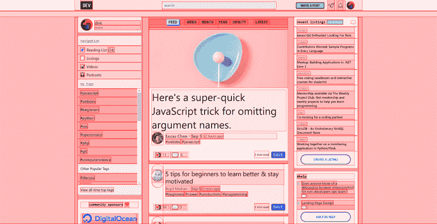

# 上周前 5 名开发者评论

> 原文:[https://dev . to/dev team/top-5-dev-comments-from-the-past-week-2f9e](https://dev.to/devteam/top-5-dev-comments-from-the-past-week-2f9e)

这是你可能已经错过的令人敬畏的开发者评论的每周综述。欢迎并鼓励你使用 **[#bestofdev](https://dev.to/t/bestofdev)** 标签来发表帖子和评论。

**[中很多很棒的答案有哪些常见的编程概念名字不对？](https://dev.to/ben/what-common-programming-concept-has-the-wrong-name-5c5j)** ，但没有人比 [@ryancmcconnell](https://dev.to/ryancmcconnell) 的贡献:
更受欢迎

[ ](/ryancmcconnell) [ Ryan McConnell ](/ryancmcconnell) • [<time datetime="2019-09-05T23:09:20Z" class="date-short-year"> Sep 5 '19 </time>](https://dev.to/ryancmcconnell/comment/f2bo) 

JavaScript 与 Java 无关。

[@dink](https://dev.to/dink) 分享一个小技巧回应 **[我最喜欢的 CSS hack](https://dev.to/gajus/my-favorite-css-hack-32g3)** 文章:

[ ](/dink) [ dink ](/dink) • [<time datetime="2019-09-05T13:48:06Z" class="date-short-year"> Sep 5 '19 </time> • Edited on <time datetime="2019-09-06T19:57:45Z" class="hidden m:inline-block date-no-year">Sep 6</time>](https://dev.to/dink/comment/f20o) 

做以下 imo 要快得多:

```
html * {
    background: rgba(255, 0, 0, .1);
    box-shadow: 0 0 0 1px red;
} 
```

<svg width="20px" height="20px" viewBox="0 0 24 24" class="highlight-action crayons-icon highlight-action--fullscreen-on"><title>Enter fullscreen mode</title></svg> <svg width="20px" height="20px" viewBox="0 0 24 24" class="highlight-action crayons-icon highlight-action--fullscreen-off"><title>Exit fullscreen mode</title></svg><svg width="20px" height="20px" viewBox="0 0 24 24" class="highlight-action crayons-icon highlight-action--fullscreen-on"><title>Enter fullscreen mode</title></svg> <svg width="20px" height="20px" viewBox="0 0 24 24" class="highlight-action crayons-icon highlight-action--fullscreen-off"><title>Exit fullscreen mode</title></svg>
<svg width="20px" height="20px" viewBox="0 0 24 24" class="highlight-action crayons-icon highlight-action--fullscreen-on"><title>Enter fullscreen mode</title></svg> <svg width="20px" height="20px" viewBox="0 0 24 24" class="highlight-action crayons-icon highlight-action--fullscreen-off"><title>Exit fullscreen mode</title></svg>

它会产生这样的东西:

[T2】](https://res.cloudinary.com/practicaldev/image/fetch/s--pZHBws1l--/c_limit%2Cf_auto%2Cfl_progressive%2Cq_auto%2Cw_880/https://thepracticaldev.s3.amazonaws.com/i/2avvjrbri1ynvlqa663u.png)

```
</div> 
```

<svg width="20px" height="20px" viewBox="0 0 24 24" class="highlight-action crayons-icon highlight-action--fullscreen-on"><title>Enter fullscreen mode</title></svg> <svg width="20px" height="20px" viewBox="0 0 24 24" class="highlight-action crayons-icon highlight-action--fullscreen-off"><title>Exit fullscreen mode</title></svg>

回复 **[Rust 还是去做 web 开发？](https://dev.to/selengora/rust-or-go-for-web-development-36gg)** ， [@oliverjumpertz](https://dev.to/oliverjumpertz) 提供了一些关于这两种语言的好想法:

[ ](/oliverjumpertz) [ Oliver Jumpertz ](/oliverjumpertz) • [<time datetime="2019-09-05T12:26:40Z" class="date-short-year"> Sep 5 '19 </time> • Edited on <time datetime="2019-09-05T21:49:10Z" class="hidden m:inline-block date-no-year">Sep 5</time>](https://dev.to/oliverjumpertz/comment/f1ol) 

你想参与 web 开发的哪些部分？你选择的语言会带来更多的工作机会吗？

围棋仍然被大肆宣传和流行，因为它很容易学习，也很容易得到结果。它的并发模型比传统的基于线程的模型更容易理解，生态系统在一段时间前爆发了，现在有这么多伟大的库和框架。默认情况下，Go 中的 I/O 是异步的，你几乎不会注意到，因为运行时会替你处理。我已经编程将近 20 年了(只有一小部分是专业的)，所以下面的内容可能对你不适用，但是我只用了一天就学会了 Go，并用它编写了我的第一个软件，而且在运行时没有出现严重故障。
我遇到的唯一问题是它对依赖项的奇特处理(GOPATH 等)。)，随着 gomodules 的引入，它变得更好，并且仍然在改进，这让我很难接受。
目前列出的求职数量相当可观(请注意:很大程度上取决于你的居住地)。

另一方面，Rust 很难学，但一旦你真正理解了它，并成功地与编译器和借检查器对抗，直到你们成为非常亲密的朋友(但这将花费你比学习围棋更多的时间)。我相信我花了两个星期才能够写出简单的程序，而编译器不会抱怨太多。但是，一旦 Rust 中的某个东西编译了，你就可以非常确定它会正常工作！Rust 和 Go 的区别在于它没有运行时(它会替你处理某些事情)。因此，你对你所做事情的实际结果有更多的控制权。
编写 Rust 代码非常类似于用其他流行语言编写代码。考虑到你必须学习很多其他的概念，比如借款，等等，这并不是什么新东西，非常方便。在使用内存管理语言时，您不必为。
Rust 自带货物，对比 go 的$GOPATH / gomodule 系统，简直就像人间天堂。它处理依赖关系、构建等。如此简单，如此有趣，不会妨碍你。
根据你居住的地方，与区块链没有直接关系的职位发布数量可能远远少于 Go，这可能会限制你的机会。

这两种语言中没有一种能实现另一种不能实现的，所以这两种语言都没有缺点。两者都可以用于几乎任何事情。你可以用两者编写 REST-API，你可以实现一个新的数据库，两者都编译成 WASM，几乎是你能想到的任何东西。

这只是冰山一角，但也许会对你的决定有所帮助。

我建议:
两者都尝试一下，写一个简单的程序，然后看看哪个更有趣。

紧扣主题， [@shushugah](https://dev.to/shushugah) 跳入**[2019 年 Ruby 值得学习吗？](https://dev.to/realtoughcandy/is-ruby-worth-learning-in-2019-38ao)** 来说说一些使用 Ruby 的大牌公司。我会将 DEV 添加到该列表中:):

[ ](/shushugah) [ shushugah ](/shushugah) • [<time datetime="2019-09-09T08:58:04Z" class="date-short-year"> Sep 9 '19 </time> • Edited on <time datetime="2019-09-12T07:06:27Z" class="hidden m:inline-block date-no-year">Sep 12</time>](https://dev.to/shushugah/comment/f54i) 

Github，Apple.com，Shopify 都用 Ruby。我目前是一名 Ruby 开发人员。对于学习者来说，它恰好是一门很棒的语言。总的来说，使用任何能给你带来快乐的语言，让你得到一份有报酬的工作，这对我来说都发生了。

个人项目很有趣，因为如果你愿意，你可以打破所有的规则。在 **[Git 工作流程中:你是否致力于掌握你的个人项目？](https://dev.to/daveskull81/git-workflow-do-you-commit-to-master-on-your-solo-projects-hi4)** ， [@gnsp](https://dev.to/gnsp) 随着他们的流程:

[ ](/gnsp) [ Ganesh Prasad ](/gnsp) • [<time datetime="2019-09-10T13:34:32Z" class="date-short-year"> Sep 10 '19 </time>](https://dev.to/gnsp/comment/f68l) 

通常在初始阶段，我在主分支上工作。一旦我用最基本的功能达到稳定状态，我就扩展。如果有不止一种方法来实现我需要尝试的东西，那么在不同的分支中实现它们对我来说更有意义。

就像你提到的，在单独工作时，一个人一次只能做一个功能——十有八九是这样的。尽管如此，我还是喜欢在一个独立的开发分支上工作。在任何情况下，切换到稳定的分支总是比找到稳定的提交并签出该提交更快更容易。

下周见，更多精彩评论，✌