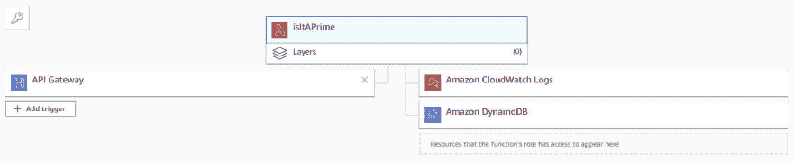

# 将一个简单的 JavaScript Node.js AWS Lambda 函数移动到 Azure

> 原文:[https://dev . to/azure/move-a-simple-JavaScript-node-js-AWS-lambda-function-to-azure-431 l](https://dev.to/azure/move-a-simple-javascript-node-js-aws-lambda-function-to-azure-431l)

> 本文是 [#ServerlessSeptember](https://dev.to/azure/serverless-september-content-collection-2fhb) 的一部分。在这个无服务器的内容集合中，您可以找到其他有用的文章、详细的教程和视频。9 月份，每天都有来自社区成员和云倡导者的新文章发布，没错，每天都有。
> 
> 在[https://docs.microsoft.com/azure/azure-functions/](https://docs.microsoft.com/azure/azure-functions/?WT.mc_id=devto-blog-jeliknes)了解更多关于微软 Azure 如何实现你的无服务器功能。

“是时候迁徙了。”

也许更换云提供商的决定是“自上而下”做出的也许这是你的决定。也许您最初的解决方案只是“踢轮胎”一种云，现在是时候尝试另一种了。正在寻找一种多云“混合”解决方案？无论你的理由是什么，如果你正在考虑将你的无服务器代码从 AWS Lambda 迁移到 Azure Functions，你正处在学习如何迁移的正确位置！

[T2】](https://res.cloudinary.com/practicaldev/image/fetch/s--HLhn-tUx--/c_limit%2Cf_auto%2Cfl_progressive%2Cq_auto%2Cw_880/https://thepracticaldev.s3.amazonaws.com/i/mykhgxk0ronssehsq58t.jpg)

“[从 Lambda 迁移到 Azure Functions](https://www.youtube.com/playlist?list=PL1VfiVM16kp8U5E7U2tfJdskXJg8DPPKL) ”是一个六集视频系列，涵盖了在云提供商之间进行过渡所需的知识。您将学习如何迁移您的应用程序，探索 Azure 中的资源如何与 Amazon AWS 相关联，在本地构建一个功能，手动部署它，并学习如何将它作为 CI/CD 管道的一部分自动推送。

# 示例 App

示例应用程序很简单，但不仅仅是回显文本或打印“Hello，world”它计算一个数字是否是质数，并使用缓存来存储结果，以便在后续调用中快速提供这些结果。AWS Lambda 实现使用 JavaScript (Node.js)和 Amazon DynamoDB。

[T2】](https://res.cloudinary.com/practicaldev/image/fetch/s--qtjfMmUO--/c_limit%2Cf_auto%2Cfl_progressive%2Cq_auto%2Cw_880/https://thepracticaldev.s3.amazonaws.com/i/j5i3fd2dfoskgri6zzw9.jpg)

您可以查看示例应用程序的源代码，并在“AWS migration”GitHub 存储库中单击一下，将迁移的代码直接部署到 Azure。

##  [耶路撒冷](https://github.com/JeremyLikness) / [移民](https://github.com/JeremyLikness/AWSMigration)

### 从 AWS Lambda 迁移到 Azure 函数

<article class="markdown-body entry-content container-lg" itemprop="text">

# 将 AWS Lambda 移至 Azure 函数

这是“从 Lambda 迁移到 Azure 函数”视频系列的源代码，演示了如何从 AWS Lambda 迁移到 Azure 函数。

<g-emoji class="g-emoji" alias="cinema" fallback-src="https://github.githubassets.cimg/icons/emoji/unicode/1f3a6.png">🎦</g-emoji> [观看视频系列](https://www.youtube.com/playlist?list=PL1VfiVM16kp8U5E7U2tfJdskXJg8DPPKL) (YouTube 播放列表)

## 快速启动

 获得你的[免费 Azure 账户](https://jlik.me/gmj)

您可以快速开始使用迁移的功能。只需点击“部署到 Azure”按钮。请确保输入唯一的前缀(例如，使用您的姓名首字母或添加一个序列)。部署完成后，您可以访问和测试该功能。

[T2】](https://azuredeploy.net/)

> 要启用缓存，请在创建后导航到存储帐户。点击`Table service`下的`Tables`，然后添加一个名为`primes`的表格。

## 代码

这个存储库包含所有相关项目的代码。

### 源(“纯”)函数

函数本身决定了传递的数是否是质数。纯功能在`src\isItAPrime.js`中可用…

</article>

[View on GitHub](https://github.com/JeremyLikness/AWSMigration)

第一个视频概述了示例应用程序，并展示了如何从门户和命令行测试和访问它。

[https://www.youtube.com/embed/iflBlF9JEIY](https://www.youtube.com/embed/iflBlF9JEIY)

在下一篇文章中，我们将探索如何从头开始创建 Azure 函数。

如果你熟悉 AWS，但不熟悉 Azure，请查看这个 [AWS 与 Azure 服务的比较](https://docs.microsoft.com/azure/architecture/aws-professional/services?WT.mc_id=devto-blog-jeliknes)。