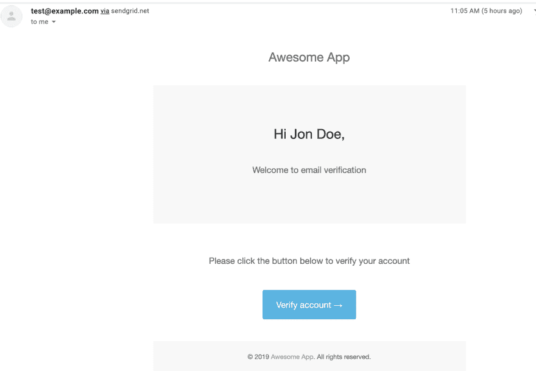

# 用 Node.js 中的 SendGrid 和 Mailgen 发送电子邮件

> 原文:[https://dev . to/nedsoft/send-email-with-send grid-and-mailgen-in-node-js-55 C4](https://dev.to/nedsoft/send-email-with-sendgrid-and-mailgen-in-node-js-55c4)

我们经常需要在 Node.js 应用程序中发送电子邮件。想到的第一个选项是 [Nodemailer](https://nodemailer.com/about/) 。Nodemailer 是一个很好的选择，只是由于谷歌的安全检查，有时很难让它与 Gmail SMTP 一起工作。*这可能只是我自己的看法和经验*。

[SendGrid](https://www.npmjs.com/package/@sendgrid/mail) 是 Node.js 中发送邮件的另一个选项，在我看来，用 SendGrid 发送邮件是非常无缝的。虽然这项服务不是完全免费的，但它允许每天免费发送多达 100 封电子邮件。

发送电子邮件的另一件重要事情是生成符合电子邮件模板标准的电子邮件模板，确保它在不同的电子邮件客户端(如 Gmail、Yahoomail 等)上正确呈现。幸运的是，有一个名为 [Mailgen](https://www.npmjs.com/package/mailgen) 的 npm 包，它基于一些开箱即用的配置生成一个漂亮的标准电子邮件模板。

### [](#requirements)要求

*   SendGrid API 密钥-要生成 SendGrid API 密钥，请执行以下步骤:
    *   访问 [SendGrid](https://sendgrid.com) 创建账户
    *   登录到创建的帐户
    *   点击左侧工具条上的[设置](https://app.sendgrid.com/settings/api_keys)
    *   点击`Create API Key`按钮上的创建来创建一个 API 密钥。
*   节点/快速应用程序。

### [](#getting-started)入门

接下来，在这里克隆本教程中使用的项目[。](https://github.com/oriechinedu/sendgrid-mailgen-email-node)

### [](#step-1-setup-express-project)步骤 1 -设置快递项目

创建一个名为`sendgrid-email`的新目录。

```
mkdir sendgrid-email && cd sendgrid-email 
```

<svg width="20px" height="20px" viewBox="0 0 24 24" class="highlight-action crayons-icon highlight-action--fullscreen-on"><title>Enter fullscreen mode</title></svg> <svg width="20px" height="20px" viewBox="0 0 24 24" class="highlight-action crayons-icon highlight-action--fullscreen-off"><title>Exit fullscreen mode</title></svg>

接下来，在您喜欢的文本编辑器中打开项目并安装以下依赖项:

```
npm i express dotenv mailgen @sendgrid/mail 
```

<svg width="20px" height="20px" viewBox="0 0 24 24" class="highlight-action crayons-icon highlight-action--fullscreen-on"><title>Enter fullscreen mode</title></svg> <svg width="20px" height="20px" viewBox="0 0 24 24" class="highlight-action crayons-icon highlight-action--fullscreen-off"><title>Exit fullscreen mode</title></svg>

接下来，在项目的根目录下创建一个名为`index.js`的文件，并将下面的代码复制到其中:

```
const express = require('express')
const sendMail = require('./mail')
const app = express()

app.use(express.json())

app.get('/', (req, res) => res.send('Hello world!!!'))

app.get('/sendMail', async (req, res) => {
  try {
    const sent = await sendMail()
    if (sent) {
      res.send({ message: 'email sent successfully' })
    }
  } catch (error) {
    throw new Error(error.message)
  }
})

app.listen(3300, () => {
  console.log('server listening at http://localhost:3300')
}) 
```

<svg width="20px" height="20px" viewBox="0 0 24 24" class="highlight-action crayons-icon highlight-action--fullscreen-on"><title>Enter fullscreen mode</title></svg> <svg width="20px" height="20px" viewBox="0 0 24 24" class="highlight-action crayons-icon highlight-action--fullscreen-off"><title>Exit fullscreen mode</title></svg>

***注意:**我们关心的是建立一个简单的服务器来演示本文中的概念，因此不关注最佳实践。🙂*

查看上面的代码片段，我们添加了一个路由`/sendMail`，它调用从`mail.js`导入的函数`sendMail()`。让我们来创建`mail.js`的内容。

### [](#step-2-generate-email-template-with-mailgen)步骤 2 -使用 Mailgen 生成电子邮件模板

创建一个名为`mail.js`的文件，并将下面的代码复制到其中:

```
const MailGen = require('mailgen')
const sgMail = require('@sendgrid/mail')

require('dotenv').config()

const mailGenerator = new MailGen({
  theme: 'salted',
  product: {
    name: 'Awesome App',
    link: 'http://example.com',
    // logo: your app logo url
  },
})

const email = {
  body: {
    name: 'Jon Doe',
    intro: 'Welcome to email verification',
    action: {
      instructions: 'Please click the button below to verify your account',
      button: {
        color: '#33b5e5',
        text: 'Verify account',
        link: 'http://example.com/verify_account',
      },
    },
  },
}

const emailTemplate = mailGenerator.generate(email)
require('fs').writeFileSync('preview.html', emailTemplate, 'utf8') 
```

<svg width="20px" height="20px" viewBox="0 0 24 24" class="highlight-action crayons-icon highlight-action--fullscreen-on"><title>Enter fullscreen mode</title></svg> <svg width="20px" height="20px" viewBox="0 0 24 24" class="highlight-action crayons-icon highlight-action--fullscreen-off"><title>Exit fullscreen mode</title></svg>

我们导入了`Mailgen`模块，然后创建了一个名为`mailGenerator`的实例。邮件生成器采用主题，有几个[主题](https://www.npmjs.com/package/mailgen#more-examples)可供选择。`product`对象接受`name`，它是你的应用程序的名字，`link`是应用程序的 URL，还有`logo`，它接受你的应用程序标志的 URL。

接下来，我们配置了电子邮件正文，然后生成了电子邮件模板。有关如何配置电子邮件正文的更多详细信息，请参见 [Mailgen 文档](https://www.npmjs.com/package/mailgen)。这一行`require('fs').writeFileSync('preview.html', emailTemplate, 'utf8')`是可选的，如果你想预览由 Mailgen 生成的 HTML 文件，你可以添加它。

### [](#step-3-send-email-using-sendgrid)步骤 3 -使用 SendGrid 发送电子邮件

将您之前创建的 API 密钥复制到`.env`中，检查`.env.example`以获得指导。
接下来，将下面的片段复制到`mail.js` :

```
const msg = {
  to: 'your-email@example.com',
  from: 'test@example.com',
  subject: 'Test verification email',
  html: emailTemplate,
}

const sendMail = async () => {
  try {
    sgMail.setApiKey(process.env.SENDGRID_API_KEY)
    return sgMail.send(msg)
  } catch (error) {
    throw new Error(error.message)
  }
}

module.exports = sendMail 
```

<svg width="20px" height="20px" viewBox="0 0 24 24" class="highlight-action crayons-icon highlight-action--fullscreen-on"><title>Enter fullscreen mode</title></svg> <svg width="20px" height="20px" viewBox="0 0 24 24" class="highlight-action crayons-icon highlight-action--fullscreen-off"><title>Exit fullscreen mode</title></svg>

正如你在上面看到的，设置 SendGrid 非常简单，你需要做的就是像上面显示的那样传递 API 键，然后构造消息并发送。我们将之前生成的`emailTemplate`传递给了 SendGrid `msg`。

查看 [@sendgrid/mail docs](https://www.npmjs.com/package/@sendgrid/mail) 了解更多关于如何配置的信息。

就是这样！现在启动服务器，前往 Postman，点击`/sendMail`路线。
如果一切正常，您会收到一封如下所示的电子邮件:

[](https://res.cloudinary.com/practicaldev/image/fetch/s--5tpaB2yY--/c_limit%2Cf_auto%2Cfl_progressive%2Cq_auto%2Cw_880/https://thepracticaldev.s3.amazonaws.com/i/4c9go3u6n49eyot4dgrn.png) 。

您也可以通过在浏览器上打开`preview.html`来预览电子邮件模板。

### [](#conclusion)结论

到目前为止，我们已经演示了如何使用 Mailgen 创建漂亮的电子邮件模板，并使用 SendGrid 发送邮件。为了保持简单，我们在`mail.js`中实现了所有东西，实际上，你可能想把它分成可重用的模块。例如，您可以创建一个基于某些参数生成电子邮件模板的函数，这样您就可以在每次想要发送电子邮件时轻松地调用它。

让我知道你是否有任何问题或贡献。我愿意讨论。随时联系我。

*[本文最初发表于我的博客](https://www.oriechinedu.com/posts/send-email-with-sendgrid-and-mailgen-in-nodejs/)*