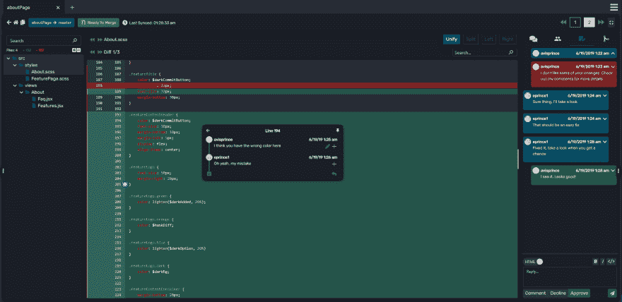
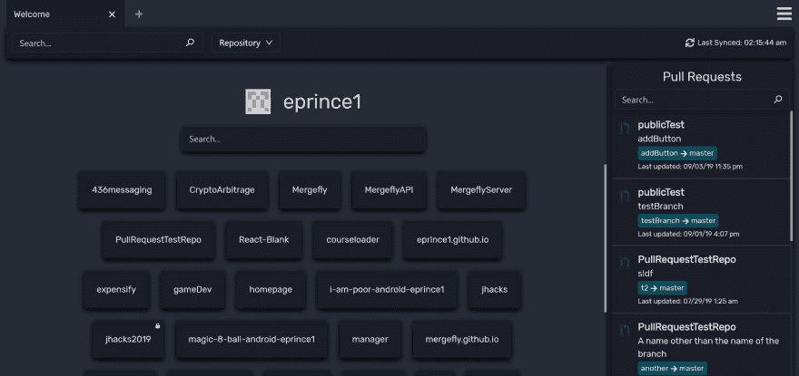
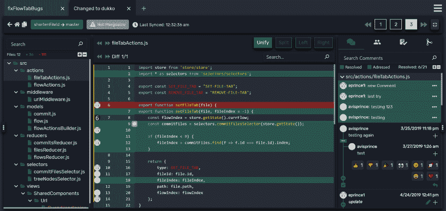
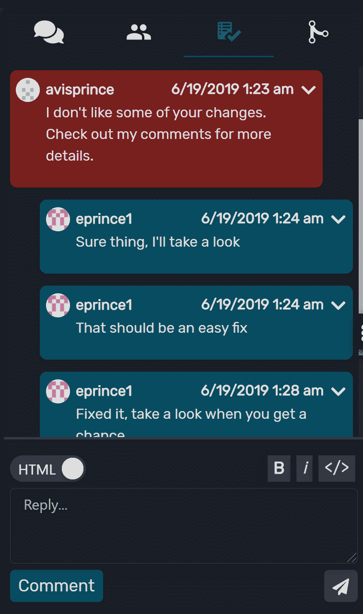

# 使用 Mergefly 管理拉取请求

> 原文:[https://dev . to/eprince 1/manage-pull-requests-with-merge fly-39oa](https://dev.to/eprince1/manage-pull-requests-with-mergefly-39oa)

### **我的坎坷与拉扯请求**

我认为拉请求是开发生命周期中最重要的部分。这是我看到和评论我的开发伙伴们写的代码的唯一机会。当设计决策被最终确定，边缘案例被发现，代码质量被你和你的团队强制执行。但是，尽管拉请求对于保持团队代码的可靠性至关重要，我经常发现自己对工具的局限性感到沮丧。

一些例子包括:

*   仅提供围绕代码更改的直接行，这通常不够上下文
*   注释打断了代码行，使得修改很难阅读
*   文件显示为一个巨大的列表，很难找到我要找的文件
*   我必须重新加载页面，以便加载评论的更新
*   总的来说，用户界面是混乱的

我听到我的队友抱怨他们“不信任代码审查，因为他们不能看到全貌。”但是，我一直认为，如果有一个好的用户界面，这不会是一个问题。

我哥哥和我承担起解决这个问题的责任。作为开发人员，我们知道痛点，并着手创建一个我们每天都乐意使用的工具。我们专注于用一个类似于 IDE 的 UI 来提供围绕代码更改的最大数量的上下文。

一年后，我们自豪地向您展示我们的解决方案:Mergefly。

[Mergefly 推广视频](https://www.youtube.com/watch?v=mI_R35AnXAk&t)

### **评论**

评论被彻底修改。在 GitHub 上，注释内置在代码的位置。这中断了阅读代码的流程，因为一旦你有了多个注释，代码就完全被分解了。评论本身也是不可搜索的，这让我很难找到我已经留下的具体评论。

我们通过从代码中提取注释来解决这个问题。现在，您可以在模式中查看评论，您可以在页面上拖动评论。您还可以直接跳到基于注释的代码，以便更快地查看拉请求。

[T2】](https://res.cloudinary.com/practicaldev/image/fetch/s--5P5-W_Js--/c_limit%2Cf_auto%2Cfl_progressive%2Cq_auto%2Cw_880/https://thepracticaldev.s3.amazonaws.com/i/10jr613cwu06ww2b9x6u.png)

##### **高光**

*   以可调整的模式或在旁边查看评论
*   从注释直接跳转到特定的代码位置
*   评论实时更新

### **导航**

**导航无缝。**很多时候，我发现自己为了完成简单的任务，搜索 GitHub 的时间比需要的时间还要长。这包括搜索文件、留下评论、打开存储库、过滤拉取请求，甚至合并。同样令我沮丧的是，当我更新页面时，GitHub 会自动滚动到顶部，我很容易就会失去位置。

我们设计 Mergefly 时考虑到了所有这些问题。我们可以在一个页面上有多个标签，这样你就可以在多个评论之间切换，而不会失去你的位置。我们有一个文件树，所以你可以更清楚地看到层次结构。最后，页面会自动更新，因此当存储库中发生变化时，您永远不必刷新页面。

[T2】](https://res.cloudinary.com/practicaldev/image/fetch/s---u9uqPDs--/c_limit%2Cf_auto%2Cfl_progressive%2Cq_auto%2Cw_880/https://thepracticaldev.s3.amazonaws.com/i/ouqclg6dwcwuhb3vb7vy.png)

[T2】](https://res.cloudinary.com/practicaldev/image/fetch/s--e2EyX8_q--/c_limit%2Cf_auto%2Cfl_progressive%2Cq_auto%2Cw_880/https://thepracticaldev.s3.amazonaws.com/i/hg3osxqaw373i33g4n59.png)

##### **高光**

*   无需重新加载页面即可访问任何存储库或请求
*   使用多个选项卡在同一页面上即时切换文件、存储库和请求
*   把你的网址发给一个朋友，他们会打开你刚才看到的那个文件和行

### **点评**

我们赋予评论更多的意义。我觉得 GitHub 评论没有被充分利用，而且有点不合时宜。他们有一个奇怪的评论状态，但你不能回复他们，所以他们会迷失在对话中。因此，我从来不知道如何正确使用它们。

我们决定把评论变成一个类似聊天的系统。这为查看拉取请求的成员创建了更好的通知和更多的上下文。它还创建了一个位置来整体讨论拉请求，而不是特定的代码行。

[T2】](https://res.cloudinary.com/practicaldev/image/fetch/s--ZB7skpWa--/c_limit%2Cf_auto%2Cfl_progressive%2Cq_auto%2Cw_880/https://thepracticaldev.s3.amazonaws.com/i/nw6vdp0siumpikgyipwn.png)

#### **高光**

*   评论保存在一个地方，而不是分散在对话历史中
*   评论速度更快，行为几乎像一个消息应用程序

### **更多特性**

这只是触及了表面。如果你想全面了解 Mergefly 的功能，请点击这里查看我们所有的精彩功能！

### **免费开放源代码社区**

我们做 Mergefly 是为了让开发者在合并代码时更有信心。我们希望减少 bug，让每个人的开发生命周期更加顺畅。

在[mergefly.com](https://mergefly.com)来看看我们吧！