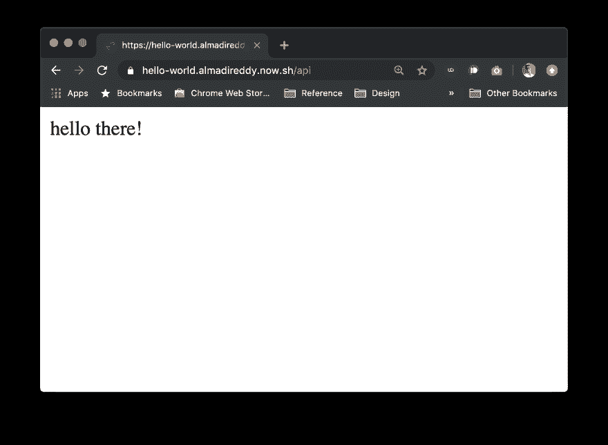

# Node.js、ZEIT Now 和部署

> 原文：<https://dev.to/almadireddy/full-stack-101-1-installing-node-zeit-now-and-deploying-5d70>

有一个很酷的应用程序想法，但不知道从哪里开始学习创建一个现代的网络或智能手机连接应用程序所需的所有知识？

两年前我也在同一个地方，大学第一次上计算机课。我感到很失落，因为我的朋友和同学们似乎在制作各种很酷的、改变游戏规则的应用程序，而我却被困在课堂上，沉迷于我花了一整夜开发的循环。

本教程是为每个想了解现代应用程序所有活动部分的人准备的。我们将介绍应用程序架构的设计，后端和前端到底是什么，如何编写它们，以及如何部署它们。

## 先决条件

您应该对 Javascript 或类似的语言(如 Java 或 C++)有一定的了解。我不会解释语法和一切，但会尝试提供有用的链接和一些我认为重要的解释。

除此之外，你没有什么需要事先知道的。如果你不知道这里提到的东西，谷歌是你的朋友。

> 旁白:我认为能够高效地搜索是软件工程师应该具备的最重要的技能之一。每当你在学习本教程的过程中出现问题时，请复制错误信息并用谷歌搜索一下！没有错误信息？用简单的英语谷歌出了什么问题！通常情况下，把问题打出来会让你从头脑中提炼出问题并找到解决方案。(如果这种情况经常发生，是时候投资一只橡皮鸭了)。

# 你将学到的技术

在这个系列中，我们将学习如何使用前端 javascript 框架 [React](https://reactjs.org) 编写前端，如何使用名为 [Express](http://expressjs.com/) 的框架使用 [Node.js](https://nodejs.org/en/) 编写后端服务，以及如何将其部署到无服务器部署平台 [ZEIT Now](https://zeit.co/) 。最后，我们将探索如何编写这个项目可以用来轻松地为后端学习新的语言。我们将使用 [Go](https://golang.org/) 来演示如何重写后端。最后，你将具备设计和编写 web 服务来支持你的应用程序或网站的基本知识和技能。在这个过程中，我们还会学到一些有用的 bash 技能。

# 谈够了，我们走吧！

首先，让我们安装 Node 和 Zeit CLI，并部署一个小的 hello world！

### 安装节点

如果已经安装了 Node 的首选版本，可以跳过这一节。

前往 [node.js 网站](https://nodejs.org/en/)并下载 LTS 版本，在撰写本文时是 10.16.3。下载并安装后，在终端中运行以下命令(或者在 windows 上运行命令行:

```
$ node -v 
```

Enter fullscreen mode Exit fullscreen mode

> 注意:在本教程中，`$`用于标识终端提示符，而不是命令的一部分。

您应该看到您的版本号打印到屏幕上，确认安装成功。如果失败，谷歌错误，调试，并修复安装。

工作之后，运行

```
$ npm -v 
```

Enter fullscreen mode Exit fullscreen mode

确认 npm 的版本。如果它提示你更新，按照它说的去做，然后运行

```
$ npm install -g npm 
```

Enter fullscreen mode Exit fullscreen mode

更新到最新版本。

#### 节点？谁死了？

Node.js 是桌面的“javascript 运行时环境”。我们来分析一下。

Javascript 是一种主要为浏览器创建的语言，完全在浏览器中运行。它被用来增加 HTML 站点的交互性和实用性，并且可以做很多很酷的事情。

继续按 F12 键打开浏览器的控制台。这是一个有用的调试工具，允许开发人员在浏览器中运行 javascript 命令。试着输入任何你知道的 Javascript，或者仅仅是一些像`1 + 2`这样的数学，你应该会看到它告诉你答案。

为了实现这一点，谷歌编写了一个内置在 Chrome 中的 Javascript 引擎，名为“V8”。这个引擎负责获取 Javascript 输入，解析并运行它。(这都是非常高的水平，所以如果你有兴趣，我会推荐你阅读关于它的更好的文章。)

这个引擎是开源的，可以在 [v8.dev](https://v8.dev/) 阅读。2009 年，一个叫 Ryan Dahl 的家伙把这个开源的 Javascript 引擎放入一个名为 Node.js 的应用程序中，这个应用程序能够接收 Javascript 文件并在浏览器之外的计算机上运行。如果你使用过 python，这和 python 用类似`$ python file.py`的东西运行文件没有太大区别。唯一的区别是您使用的是 Javascript 语言，而不是 python。

#### npm

npm 是节点的程序包管理器。显然，它并不代表“节点包管理器”，也没有任何意义，但是你可以去 npm 网站看看“npm”所代表的一切。

无论如何，npm 允许我们安装“包”,其中包含库、实用程序和应用程序，我们可以利用它们来扩展应用程序的功能。许多软件包或多或少都是行业标准，我们可以使用它们来避免浪费时间去重新发明轮子。

### 安装 ZEIT CLI

我们将通过 npm 安装的应用程序之一是 ZEIT Now CLI。

> 旁白:CLI 是一个“命令行界面”，正如您可能猜到的那样，它是一种通过命令行使用应用程序或服务的方式。这有点像 GUI(图形用户界面)是一种通过“图形”即屏幕来使用应用程序的方式。

这是一个开源应用，所以你可以在它的 [Github repo](https://github.com/zeit/now) 上查看它的代码和使用细节。这个应用程序允许我们通过命令行登录并部署到 ZEIT 无服务器服务。这是业内使用的很多实用工具和 app 都有的一个普遍现象，现在习惯就好了。另外，使用终端会让你看起来很酷，你会成为你家人的骄傲。(不完全是，但可能是)

我们现在将通过运行`npm install`命令从 npm 安装。你可以在 Github 上的 Now README 中查看这个包在 npm 注册表中的名称，令人惊讶的是它只是“Now”使用

```
$ npm install -g now 
```

Enter fullscreen mode Exit fullscreen mode

来安装它。在我们使用它之前，让我们去[zeit.co](https://zeit.co)创建一个账户。在我看来，他们的免费层是非常有用的，所以你可以在本教程后继续使用这个帐户。

一旦帐户设置完成，回到终端并运行

```
$ now login 
```

Enter fullscreen mode Exit fullscreen mode

这将允许您登录到 CLI 并使用您的帐户做事情。

### 没有魔法:分解 npm 安装命令

在我们继续之前，让我们花点时间来看看我们刚刚运行的`npm install`命令。现在，似乎有点不可思议的是，命令被键入，然后事情发生了，现在你的电脑上有了一个新的应用程序。一般来说，每当我们遇到有一点“魔力”的东西时，我们应该仔细看看到底发生了什么，以便我们对其内部有一个了解。当出现问题时，这些知识对于快速解决问题非常有帮助。然后，我们可以回到魔术。

为了从我们已经运行并将在将来运行的所有这些命令中获得魔力，让我们分解该命令正在做什么，以学习使用终端的基础知识。如果您对终端及其工作方式很熟悉，请跳过这一部分。

`npm`是您想要运行的程序的名称，它运行 node.js 安装中附带的 npm 可执行文件。

我们输入的第二个东西是`install`，这是程序中可用的一个命令。在这种情况下，`install`告诉 npm 我们想要安装一些东西，并且我们将传递我们想要安装的包的名称。

接下来我们传入的不是名字，而是`-g`。这被称为“开关”——它是命令中存在或不存在的东西，通常是可选的。这个代表“全局”，你可以用`--global`替换它来使用相应的开关的长版本。

> 旁白:请注意，长格式以两个破折号而不是一个破折号开头，并且以与短格式相同的字母开头。这是所有 unix/linux 命令行应用程序中 99%的常见做法。在终端中键入`-g`会更容易，您确实应该这样做，但是在脚本和其他只编写一次命令的情况下，您可以使用长格式的`--global`来增加可读性。
> 
> 命令中的开关允许用户指定选项和打开/关闭程序中的功能，并且允许命令行成为“界面”

开关告诉 npm 在你的计算机上全局安装软件包。这允许您从文件系统中的任何位置使用已安装的软件包，这对于这种情况是有意义的，因为您可能希望现在使用来部署存储在计算机上不同位置的应用程序。

命令的最后一部分是`now`，它是 npm 注册表上 ZEIT Now 包的名称。有时这些并不明显，您应该查看您想要安装的任何软件包的文档或 npm 页面，以获得正确的命令。(在 npm 页面的右上方查看可复制-粘贴的命令。)

## 部署一件事情！

现在，您应该已经安装了编写和部署 node.js 服务的基本必需品。为了结束这一部分，我们就这么做吧。

打开你最喜欢的代码编辑器(如果不是 [VS Code](https://code.visualstudio.com/) 你就错了)。

使用文件资源管理器(如果你有时间，可以用命令行来做这件事，这样会更酷，更快地学会做事)，在你的计算机上创建一个文件夹来保存你的教程文件。比如我的在`Documents/GreatestTutorial`。在名为`hello-world`的文件夹中创建另一个文件夹。

> 确保您的文件夹名称在整个路径中不包含任何空格。这使得使用命令行更加容易。
> 
> 将你的代码组织到文件夹中是很重要的，因为这将应用的配置、库和代码分开，并防止重叠。可以在同一个文件夹中编写三个不同的 python 应用程序、一个 Go 实用程序和一个 Node.js web 应用程序，但这听起来像是一场噩梦。

现在，在 VS Code(或者您选择的次要编辑器)中打开该文件夹，以便我们可以开始编写文件。

创建一个名为`now.json`的文件。然后，在名为`api/`的文件夹旁边创建另一个文件夹，并在名为`index.js`的`api/`文件夹中创建一个新文件。

你的文件夹结构应该是这样的

```
tutorial/
  |- hello-world/
     |- now.json
     |- api/
        |- index.js 
```

Enter fullscreen mode Exit fullscreen mode

在`index.js`中，键入以下代码:(键入，不要复制/粘贴)

```
module.exports = (req, res) => {
  res.status(200).send("hello there!");
} 
```

Enter fullscreen mode Exit fullscreen mode

我们将在下一节讨论这段代码在做什么，但是现在，让我们继续。

打开`now.json`并输入以下内容:

```
{  "version":  2  } 
```

Enter fullscreen mode Exit fullscreen mode

这只是定义了一个版本号，ZEIT 使用它来知道我们想要使用哪个版本的平台。(我们将始终使用来自 ZEIT 的最新、最棒的 v2)。

现在，回到终端，将工作目录更改到`hello-world`文件夹中，并运行

```
$ now 
```

Enter fullscreen mode Exit fullscreen mode

您应该看到它运行并输出类似如下的内容:

```
> Deploying ~/Documents/tutorial/hello-world under almadireddy
> Using project hello-world
> https://hello-world-3bonj1wv9.now.sh [v2] [951ms]
> Ready! Deployed to https://hello-world.almadireddy.now.sh [in clipboard] [3s] 
```

Enter fullscreen mode Exit fullscreen mode

最后一行写着`Ready!`很重要。复制那个 URL(我的是 live，如果你没有在你的电脑上运行它，继续尝试)，并在你最喜欢的浏览器中打开它，并附加上`/api`。例如，我会打开 https://hello-world.almadireddy.now.sh/api 的。您应该会看到类似这样的内容:

[](https://res.cloudinary.com/practicaldev/image/fetch/s--S6b3dSxb--/c_limit%2Cf_auto%2Cfl_progressive%2Cq_auto%2Cw_880/https://i.imgur.com/4P7uJoz.png)

恭喜你。您刚刚使用 Node.js 编写并部署了一个服务！

### 分解代码

让我们来分解一下我们的代码实际在做什么。第一行以`module.exports =`开头。这是 node.js 的一个特性，允许程序员定义要“导出”的代码部分。通过导入定义了`module.exports`的文件，可以在其他文件中使用导出的对象、函数和变量。我们将 module.exports 设置为等于下一部分:

```
(req, res) => {
  res.status(200).send("hello there!");
} 
```

Enter fullscreen mode Exit fullscreen mode

这是一个带有箭头语法的 Javascript 函数定义。为了说明，下面两个函数定义是等价的:

```
function add(x, y) {
  return x+y;
}

add(1, 3); // returns 4 
```

Enter fullscreen mode Exit fullscreen mode

和

```
let add = (x, y) => {
  return x+y;
}

add(1, 3); // returns 4 
```

Enter fullscreen mode Exit fullscreen mode

在第一个例子中，函数定义将函数命名为`add`，在第二个例子中，我们通过将函数赋给一个变量来给它命名。在我们的应用程序中，我们没有明确的名称，我们只是将它设置为 module.exports 变量。通过这种方式，函数被导出，这样 ZEIT 的系统就可以为我们导入并运行它。

这里有一篇关于化妆品和其他方面的差异的精彩文章(除了化妆品之外还有显著的差异)。 [ES5 功能与 ES6 粗箭头’功能](https://medium.com/@thejasonfile/es5-functions-vs-es6-fat-arrow-functions-864033baa1a)

我们的函数接受两个参数，`req`和`res`。当我们调用`now`并部署它时，ZEIT 将监听自动生成的 url 上的请求，每当有对该 URL 的请求时，调用我们的函数并传入两个参数。我们通过访问浏览器中的 url 发出请求，让 ZEIT 填充参数并运行代码。因为你正在定义函数，所以你可以随意调用`req`和`res`。我有时会使用`request`和`response`，因为我在 VS 代码中有自动完成功能，这使得代码可读性更好。它还遵循我们在这些参数中获得的信息。

Zeit 将把关于请求的信息(比如 URL 中指定的参数)传递给函数的第一个参数。这就是为什么我们把它命名为`req`或`request`。我们可以在第二个参数上添加关于响应的信息，方法是调用该参数上的函数，如`send`或`status`函数，这就是我们将其命名为`res`或`response`的原因。

在我们的函数中，我们调用了`status()`函数，并传入了`200`，这表示成功。这是一个 HTTP 响应代码，我们将在接下来的一节中简要介绍这些代码。这个功能很有用，因为如果我们的函数出错了，我们可以用一个状态代码让调用者知道出错了。作为服务器，我们控制发送什么响应，所以发送有用的信息是我们的责任。发送 200 允许我们的浏览器将其视为成功响应。

不同状态代码的一个例子是“未授权”的 401 这可以用在用户试图访问某些东西但他们没有登录的情况下。选择合适的代码取决于开发人员，您可以查阅一些约定来了解它们。

然后，我们链接一个对`send()`的调用，它是一个函数，将您传递到函数中的任何内容发送回请求者(本例中是我们的浏览器)。在我们的例子中，我们传递的是字符串`"hello there!"`。我们的响应可以是任何东西:一个 HTML 文件、一个图像、一个 JSON 文件，或者只是一个字符串。使用这些约定，我们将请求映射到响应，这是所有 web 服务器的基础。

## 即将到来

在本教程的下一部分，我们将回顾项目的设计和架构。这是制作现代软件的重要一步，并且可以通知大量的编程。我们将从高层次上了解所有移动的部分以及我们需要考虑的事项。我们将回顾“无服务器”的含义，因为我已经多次使用这个术语来描述 ZEIT，而没有解释它，并且下载并安装 [Postman](https://www.getpostman.com) ，你现在就可以开始使用它。