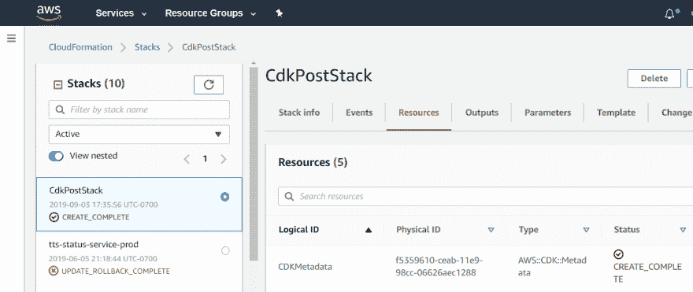

# 使用 AWS CDK 作为代码的命令式基础架构

> 原文：<https://dev.to/kylegalbraith/imperative-infrastructure-as-code-using-aws-cdk-1l8c>

当我们谈到作为代码的基础设施时，我们经常谈到声明性框架。首先想到的往往是 Terraform 或 CloudFormation 这样的框架。声明式方法允许您定义您想要创建的**和**,工具会为您提供资源。总的想法是，你声明你想要的最终状态，工具会帮你实现。

但是，这只是一种方法。

另一种通过代码创建基础设施的方法是通过命令式选项。不同于我们指定*什么*的声明式方法，命令式方法指定**如何**。命令式方法不是说*“我想要这 3 个 AWS 资源”*，而是说*“下面是如何创建这 3 个 AWS 资源”*。

两者的区别很微妙，一个侧重于获得最终状态。另一个重点是定义如何获得最终状态。

这两种方法各有利弊。

声明性方法的优势在于对结束状态进行操作。这意味着他们自然倾向于了解您的基础架构的当前状态。如果在声明性框架中，我提供了 10 个 EC2 实例，后来需要 15 个而不是 10 个，它知道我只需要 5 个。作为代码的声明性基础设施倾向于使用我们不经常使用的语言，如 HCL、YAML 或 JSON。这也意味着它们很难重用或模块化以在项目间共享。

命令式方法通常可以使用我们已经知道的语言。我们可以在我们每天使用的代码中定义我们的基础设施，比如 Python、TypeScript 甚至 Ruby。这意味着我们所有用于测试、重用和共享的工具在这里都是可用的。但是，这也意味着我们经常会失去最终状态的概念。以上面的例子为例，在命令式框架中，10 个 EC2 实例到 15 个 EC2 实例创建了 15 个新的*EC2 实例，而不是在现有的 10 个实例上再增加 5 个。这是因为命令式方法定义了如何获得我们想要的最终状态，而不是最终状态应该是什么。*

命令式方法最近有所增加。许多人希望基础设施代码使用他们日常使用的语言。

因此，在这篇文章中，我们将看看如何使用新项目 [AWS 云开发工具包](https://github.com/aws/aws-cdk)来定义我们的一些 AWS 基础设施。

### 先决条件

在开始使用 CDK 定义一些基础设施之前，我们需要完成一些先决条件。

首先，我们需要通过`npm` :
安装 AWS CDK

```
$ npm install -g aws-cdk
$ cdk --version
1.6.1 (build a09203a) 
```

Enter fullscreen mode Exit fullscreen mode

现在我们已经安装了 CDK，让我们配置一个示例项目，我们可以开始试验。在这篇文章中，我们将使用 Typescript，但是 CDK 有 Python、JavaScript、Java 和. NET 版本

```
$ mkdir cdk-post
$ cd cdk-post
$ cdk init sample-app --language=typescript
Applying project template sample-app for typescript
Initializing a new git repository...
Executing npm install...
npm notice created a lockfile as package-lock.json. You should commit this file.
npm WARN cdk-post@0.1.0 No repository field.
npm WARN cdk-post@0.1.0 No license field.

# Useful commands

 * `npm run build`   compile typescript to js
 * `npm run watch`   watch for changes and compile
 * `cdk deploy`      deploy this stack to your default AWS account/region
 * `cdk diff`        compare deployed stack with current state
 * `cdk synth`       emits the synthesized CloudFormation template 
```

Enter fullscreen mode Exit fullscreen mode

### 使用 CDK 为基础设施作为代码

如果我们看一下`cdk`创建的示例应用程序，我们应该在`lib/cdk-post-stack.ts`看到一个文件。当我们打开该文件时，我们应该看到其中有一些提供 SQS 队列和 SNS 主题的代码。

```
import sns = require('@aws-cdk/aws-sns');
import subs = require('@aws-cdk/aws-sns-subscriptions');
import sqs = require('@aws-cdk/aws-sqs');
import cdk = require('@aws-cdk/core');

export class CdkPostStack extends cdk.Stack {
  constructor(scope: cdk.App, id: string, props?: cdk.StackProps) {
    super(scope, id, props);

    const queue = new sqs.Queue(this, 'CdkPostQueue', {
      visibilityTimeout: cdk.Duration.seconds(300)
    });

    const topic = new sns.Topic(this, 'CdkPostTopic');

    topic.addSubscription(new subs.SqsSubscription(queue));
  }
} 
```

Enter fullscreen mode Exit fullscreen mode

我们这里有一个`Stack`，应该一起创建、维护和删除的 AWS 资源的集合。在 CDK 世界中，一个应用或服务可以由一个或多个栈组成。通过查看`bin/cdk-post.ts`，我们可以看到 CDK 是如何创建这个堆栈的。

```
#!/usr/bin/env node import cdk = require('@aws-cdk/core');
import { CdkPostStack } from '../lib/cdk-post-stack';

const app = new cdk.App();
new CdkPostStack(app, 'CdkPostStack'); 
```

Enter fullscreen mode Exit fullscreen mode

这里我们看到一个`App`通过`cdk`被创建，我们之前看到的`CdkPostStack`被附加到它上面。让我们通过命令行上的`cdk`来部署这个示例应用程序。

```
$ cdk deploy
IAM Statement Changes
┌───┬─────────────────────┬────────┬─────────────────┬───────────────────────────┬─────────────────────────────────────────────────────┐
│   │ Resource            │ Effect │ Action          │ Principal                 │ Condition                                           │
├───┼─────────────────────┼────────┼─────────────────┼───────────────────────────┼─────────────────────────────────────────────────────┤
│ + │ ${CdkPostQueue.Arn} │ Allow  │ sqs:SendMessage │ Service:sns.amazonaws.com │ "ArnEquals": {                                      │
│   │                     │        │                 │                           │   "aws:SourceArn": "${CdkPostTopic}"                │
│   │                     │        │                 │                           │ }                                                   │
└───┴─────────────────────┴────────┴─────────────────┴───────────────────────────┴─────────────────────────────────────────────────────┘
(NOTE: There may be security-related changes not in this list. See http://bit.ly/cdk-2EhF7Np)

Do you wish to deploy these changes (y/n)? y
CdkPostStack: deploying...
CdkPostStack: creating CloudFormation changeset...
 0/6 | 17:36:05 | CREATE_IN_PROGRESS   | AWS::CDK::Metadata     | CDKMetadata
 0/6 | 17:36:05 | CREATE_IN_PROGRESS   | AWS::SQS::Queue        | CdkPostQueue (CdkPostQueueBA7F3D07)
 0/6 | 17:36:05 | CREATE_IN_PROGRESS   | AWS::SNS::Topic        | CdkPostTopic (CdkPostTopic28394E2B)
 0/6 | 17:36:05 | CREATE_IN_PROGRESS   | AWS::SQS::Queue        | CdkPostQueue (CdkPostQueueBA7F3D07) Resource creation Initiated
 0/6 | 17:36:05 | CREATE_IN_PROGRESS   | AWS::SNS::Topic        | CdkPostTopic (CdkPostTopic28394E2B) Resource creation Initiated
 1/6 | 17:36:05 | CREATE_COMPLETE      | AWS::SQS::Queue        | CdkPostQueue (CdkPostQueueBA7F3D07)
 1/6 | 17:36:06 | CREATE_IN_PROGRESS   | AWS::CDK::Metadata     | CDKMetadata Resource creation Initiated
 2/6 | 17:36:06 | CREATE_COMPLETE      | AWS::CDK::Metadata     | CDKMetadata
 3/6 | 17:36:16 | CREATE_COMPLETE      | AWS::SNS::Topic        | CdkPostTopic (CdkPostTopic28394E2B)
 3/6 | 17:36:18 | CREATE_IN_PROGRESS   | AWS::SNS::Subscription | CdkPostQueue/CdkPostStackCdkPostTopic7A3E421F (CdkPostQueueCdkPostStackCdkPostTopic7A3E421F4679B27C)
 3/6 | 17:36:18 | CREATE_IN_PROGRESS   | AWS::SQS::QueuePolicy  | CdkPostQueue/Policy (CdkPostQueuePolicyC7FE0F0B)
 3/6 | 17:36:19 | CREATE_IN_PROGRESS   | AWS::SNS::Subscription | CdkPostQueue/CdkPostStackCdkPostTopic7A3E421F (CdkPostQueueCdkPostStackCdkPostTopic7A3E421F4679B27C) Resource creation Initiated
 3/6 | 17:36:19 | CREATE_IN_PROGRESS   | AWS::SQS::QueuePolicy  | CdkPostQueue/Policy (CdkPostQueuePolicyC7FE0F0B) Resource creation Initiated
 4/6 | 17:36:19 | CREATE_COMPLETE      | AWS::SNS::Subscription | CdkPostQueue/CdkPostStackCdkPostTopic7A3E421F (CdkPostQueueCdkPostStackCdkPostTopic7A3E421F4679B27C)
 5/6 | 17:36:19 | CREATE_COMPLETE      | AWS::SQS::QueuePolicy  | CdkPostQueue/Policy (CdkPostQueuePolicyC7FE0F0B)
 6/6 | 17:36:21 | CREATE_COMPLETE      | AWS::CloudFormation::Stack | CdkPostStack

 ✅  CdkPostStack 
```

Enter fullscreen mode Exit fullscreen mode

我们看到了什么？相当多有趣的事情。

1.  我们看到`cdk`告诉我们任何将要改变的 IAM 语句。表明他们希望在继续之前突出显示任何安全更改。
2.  `cdk`在创建资源之前要求确认。如果您想通过在命令中添加`-y`来自动批准创建，您可以绕过这一步。
3.  生成了一个`CloudFormation`变更集。从代码的声明性和命令性基础设施的角度来看，这很有趣，稍后会有更多的介绍。

如果我们登录 AWS 控制台，我们应该看到我们现在有了 SQS 队列和一个以`CdkPostStack`开头的 SNS 主题。此外，我们应该看到我们有一个包含所有资源的 CloudFormation 堆栈。

[](https://res.cloudinary.com/practicaldev/image/fetch/s--6WAikVoA--/c_limit%2Cf_auto%2Cfl_progressive%2Cq_auto%2Cw_880/https://thepracticaldev.s3.amazonaws.com/i/7rz5gnlyy3b4ebzdf3p3.PNG)

现在让我们回到我们的示例应用程序，并做一些更改，看看在 CDK 是如何处理更新的。对于我们的示例，让我们添加另一个 SQS 队列，并更改现有队列的超时。所以现在我们的`CdkPostStack`应该是这样的。

```
export class CdkPostStack extends cdk.Stack {
  constructor(scope: cdk.App, id: string, props?: cdk.StackProps) {
    super(scope, id, props);

    const queue = new sqs.Queue(this, 'CdkPostQueue', {
      visibilityTimeout: cdk.Duration.seconds(600)
    });

    const dev2Queue = new sqs.Queue(this, 'Dev2Queue', {
      visibilityTimeout: cdk.Duration.seconds(180)
    });

    const topic = new sns.Topic(this, 'CdkPostTopic');
    topic.addSubscription(new subs.SqsSubscription(queue));
  }
} 
```

Enter fullscreen mode Exit fullscreen mode

我们现在有了一个新的队列`Dev2Queue`，并且我们已经更新了我们的`CdkPostQueue`，将可见性超时从 300 秒改为 600 秒。让我们用 CDK 来更新我们的基础设施，看看会发生什么。

```
$ cdk deploy -y
CdkPostStack: deploying...
CdkPostStack: creating CloudFormation changeset...
 0/5 | 12:40:55 | CREATE_IN_PROGRESS   | AWS::SQS::Queue        | Dev2Queue (Dev2Queue5997490B)
 0/5 | 12:40:56 | UPDATE_IN_PROGRESS   | AWS::SQS::Queue        | CdkPostQueue (CdkPostQueueBA7F3D07)
 0/5 | 12:40:56 | CREATE_IN_PROGRESS   | AWS::SQS::Queue        | Dev2Queue (Dev2Queue5997490B) Resource creation Initiated
 1/5 | 12:40:56 | CREATE_COMPLETE      | AWS::SQS::Queue        | Dev2Queue (Dev2Queue5997490B)
 2/5 | 12:40:56 | UPDATE_COMPLETE      | AWS::SQS::Queue        | CdkPostQueue (CdkPostQueueBA7F3D07)
 2/5 | 12:41:00 | UPDATE_COMPLETE_CLEA | AWS::CloudFormation::Stack | CdkPostStack
 3/5 | 12:41:01 | UPDATE_COMPLETE      | AWS::CloudFormation::Stack | CdkPostStack

 ✅  CdkPostStack 
```

Enter fullscreen mode Exit fullscreen mode

厉害！在这个部署之后，我们看到的是我们的新队列被创建，并且我们现有的队列按照预期得到更新。我们能够在代码中进行更改，并通过 CloudFormation 以声明的方式看到它们得到反映。

但是等等，这是什么意思？

### AWS CDK 模糊了线条

在这一点上，有必要暂停一下，回顾一下我们之前关于命令式和声明式的讨论。自动气象站 CDK 是一个必要的工具。正如我们看到的，我们可以通过 Typescript 创建我们的基础设施。

但是，当我们运行`cdk deploy`时，我们看到云信息变更集被创建。CloudFormation 是一个作为代码工具的声明性基础设施。

[](https://i.giphy.com/media/3o6ZsTIiPJG6vcqop2/giphy.gif)

这就是这两种配置 AWS 资源的方法之间的争论变得令人困惑的地方。在幕后，CDK 仍在利用 CloudFormation 进行资源调配。在某种程度上，我们既获得了声明性方法的所有好处，也获得了命令性方法的所有好处。

当我们更新现有队列并创建一个新队列时，我们看到了进一步的证据。我们的整个堆栈没有像您在严格的命令式方法中所期望的那样被重新创建。相反，我们看到发生了一个声明性的更新，队列被就地更新，我们的新队列被创建。

CDK 为我们提供了一个命令式接口，我们可以用它来将我们的基础设施表示为代码。在底层，它仍然使用声明性框架 CloudFormation。

### CDK 还能给我们什么？

它可以给我们正常编程模式和实践所允许的一切。为什么？因为它是一个框架，我们可以在我们已经知道的语言中使用。

这意味着我们可以做一些事情，比如测试提供基础设施的代码。这个问题在声明性的世界中被证明有些棘手，比如 Terraform 或 CloudFormation。

在 AWS CDK 中，模块化和共享创建公共基础设施的代码是可能的。在 CDK 的世界里，这些被称为*构造*。其中一个构造可以由一个或多个需要一起创建的 AWS 资源组成。正如我们在示例中看到的，我们可以创建一个其他人可以重用的结构来提供队列和我们的 SNS 主题。也就是说，像 Terraform 这样的声明性框架在模块的形式上也有这个概念。

### 结论

一些人对用他们每天使用的代码来表示他们的基础设施的明确的强制性方法感到非常兴奋。其他人是声明性的铁杆粉丝，他们愿意学习另一种语言来获得有状态方法的好处。

但是正如我们在 AWS 云开发工具包(CDK)中看到的，两者之间的争论可能并不那么重要。每种方法都有优点和缺点，但是它们更倾向于特定于工具而不是特定于方法。我们在 CDK 身上看到的是，他们模糊了两者之间的界限。用你的日常语言来表达你的代码，他们将使用 CloudFormation 在幕后处理声明部分。

这里关键的一点是，用代码表示你的基础设施是一个全面的胜利。CDK 向我们展示的是，越来越多的工具被创造出来，以增加这种实践的采用。如果命令式方法不适合你，那也没关系。但是，你应该找到适合你的工具和方法，并开始使用它。任何作为代码的基础设施都比没有作为代码的基础设施要好。

### 想看看我的其他项目？

我是 DEV 社区的超级粉丝。如果你有任何问题或者想谈谈关于重构的不同想法，[联系 Twitter](https://twitter.com/kylegalbraith) 或者在下面留言。

在博客之外，我创建了一个[通过使用 It 课程](https://kylegalbraith.com/learn-aws/)学习 AWS。在本课程中，我们通过实际使用 Amazon Web Services 来托管、保护和交付静态网站，重点学习该服务。这是一个简单的问题，有许多解决方案，但它非常适合提升您对 AWS 的理解。我最近在课程中增加了两个新的额外章节，重点是代码基础设施和持续部署。

我也策划我自己的每周时事通讯。[边做边学简讯](https://kylegalbraith.com/learn-by-doing/)每周都充满了令人敬畏的云、编码和 DevOps 文章。注册即可在您的收件箱中获得它。