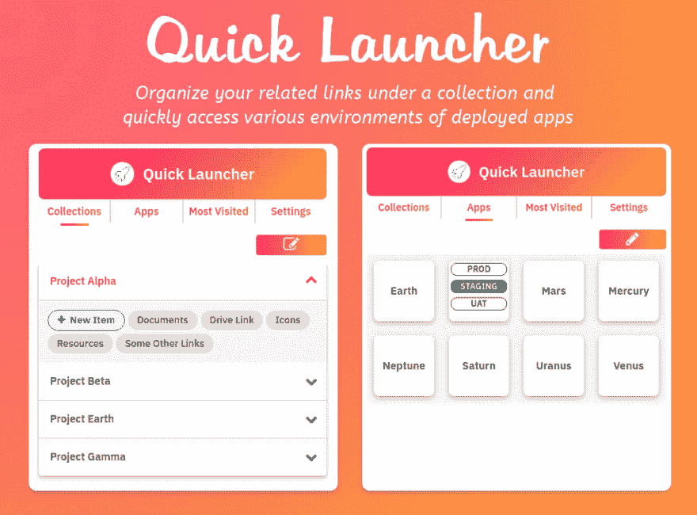
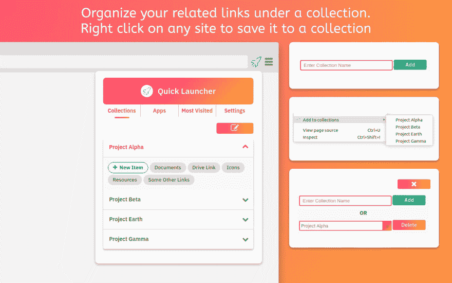
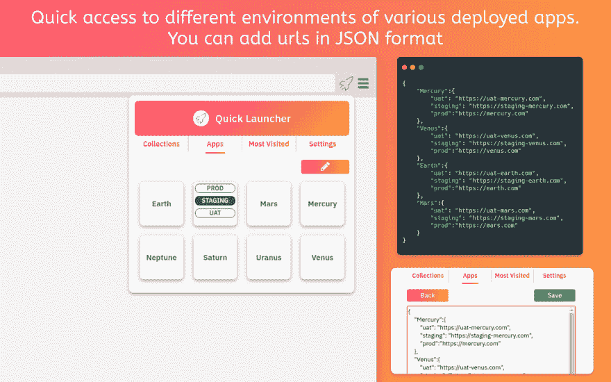
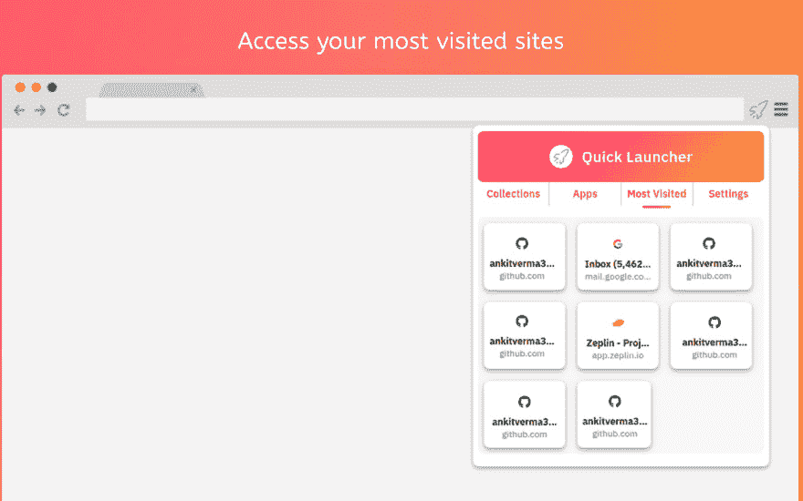

# 构建你的第一个 chrome 扩展:初学者指南

> 原文:[https://dev . to/ankitverma 31/building-your-first-chrome-extension-a-初学者指南-40a9](https://dev.to/ankitverma31/building-your-first-chrome-extension-a-beginner-s-guide-40a9)

最近我写了我的第一个 chrome 扩展。在这篇文章中，我将介绍一个 chrome 扩展的主要组件，我在构建它时的经验，以及你如何构建自己的扩展。

## 目录

*   [什么是 Chrome 扩展](#basics)
*   [快速发射器扩展](#about-quick-launcher)
*   [分机的主要部件](#main-blocks)
*   [加载你的扩展](#load-extension)
*   [调试你的扩展](#debug)
*   [Chrome 的重要 APIs】](#important-apis)
*   [发布到网络商店](#publish-extension)
*   [资源-启动](#resources)
*   [结论](#conclusion)

## 什么是 Chrome 扩展？

谷歌浏览器扩展是修改谷歌浏览器的浏览器扩展。这些扩展是使用 HTML、JavaScript 和 CSS 等 web 技术编写的。它们通过 Chrome 网上商店分发。因此，如果你是一个前端 web 开发人员，构建一个扩展对你来说会更容易。

## 【快速启动扩展(我的扩展)

 
**我怎么会有造[快速发射器](http://bit.ly/2NWtboe)的想法？**实际上，我在一家初创公司工作，大约有 10-15 个内部/外部工具或网站或项目，每个网站都有不同的 URL，用于不同的环境，如 uat、试运行、生产等。从 30-40 个 URL 访问一个站点的特定环境是一件非常痛苦的事情。当然，我将 URL 列表保存在 notes 中，但是去那里并从中获取特定的 URL 非常耗时。一个解决方案是将 URL 加入书签。但是我已经收藏了很多链接。我想将项目/工具链接从我的书签中分离出来，并想捆绑或组织与特定项目相关的链接。是的，我就是这样想到构建一个 chrome 扩展的。

### 什么是快速启动器？

快速启动程序是一个智能网址管理器。一个专为开发人员开发的 chrome 扩展(非开发人员也可以使用)，用于创建各种相关有用链接的集合。您还可以添加部署在 uat、试运行、生产等不同环境中的各种应用程序，以便快速访问。快速启动也有一个**最常访问的网站**标签来快速访问对你最重要的网站。

### **快速启动功能:**

### 收藏:

 
将你的各种相关链接组织在一个特定的收藏下。您可以添加和删除收藏。创建收藏后，您可以手动在它下面添加一个项目，或者右键单击任何网站并在菜单中选择收藏名称，系统会提示您添加标题，然后您可以将该链接保存在该收藏下。

### 部署的应用程序:

 
快速访问部署在 uat、试运行、生产等不同环境中的站点/产品/工具。您可以添加 JSON 格式的各种站点/工具的部署 URL，以便快速访问它们。目前每个站点支持 3 个环境。

### 最常访问的网站:

 
最常访问的网站选项卡快速访问您最常访问的网站。

## 分机主要部件:

扩展是由不同的、但是内聚的组件组成的。组件可以包括[后台脚本](https://developer.chrome.com/extensions/background_pages)、[内容脚本](https://developer.chrome.com/extensions/content_scripts)、一个[选项页面](https://developer.chrome.com/extensions/options)、 [UI 元素](https://developer.chrome.com/extensions/user_interface)以及各种逻辑文件。扩展组件是用 web 开发技术创建的:HTML、CSS 和 JavaScript。

### 显示:

扩展以它们的[清单](https://developer.chrome.com/extensions/manifest)开始。这是一个 JSON 文件，它提供了关于您的扩展的信息，如名称、版本、描述等。
下面是 manifest.json 文件的例子: