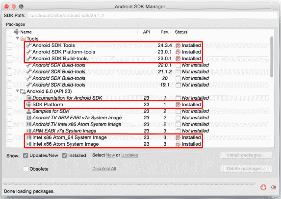

# react-原生运行-安卓失败？以下是解决方案

> 原文:[https://dev . to/rizwanjamal/react-native-run-Android-failed-here-is-the-solution-4k4f](https://dev.to/rizwanjamal/react-native-run-android-failed-here-is-the-solution-4k4f)

1.  请安装所需的 SDK，如下图所示。`Configure Required SDKs` 
2.  如果您已经安装了它，那么您必须更新以下 SDK:
    *   `Android SDK Tool`(更新至最新版本)
    *   `Android SDK Platform-tools`(更新至最新版本)
    *   `Android SDK Build-tools`(更新至最新版本)
    *   `Extra`文件夹下的`Android Support Repository`(更新到最新版本)
3.  您必须至少安装了与上图`Configure Required SDKs`所示的`Android SDK Build-tools` & `Android SDK Platform-tools`版本相同的版本`Android API`。

> **注意:**在 React-native 的官方文档中被列为 SDK 需求的本地 Maven 支持库现在在 SDK 管理器中被命名为 Android 支持库。

[T6】](https://i.giphy.com/media/3o7qDEq2bMbcbPRQ2c/giphy.gif)