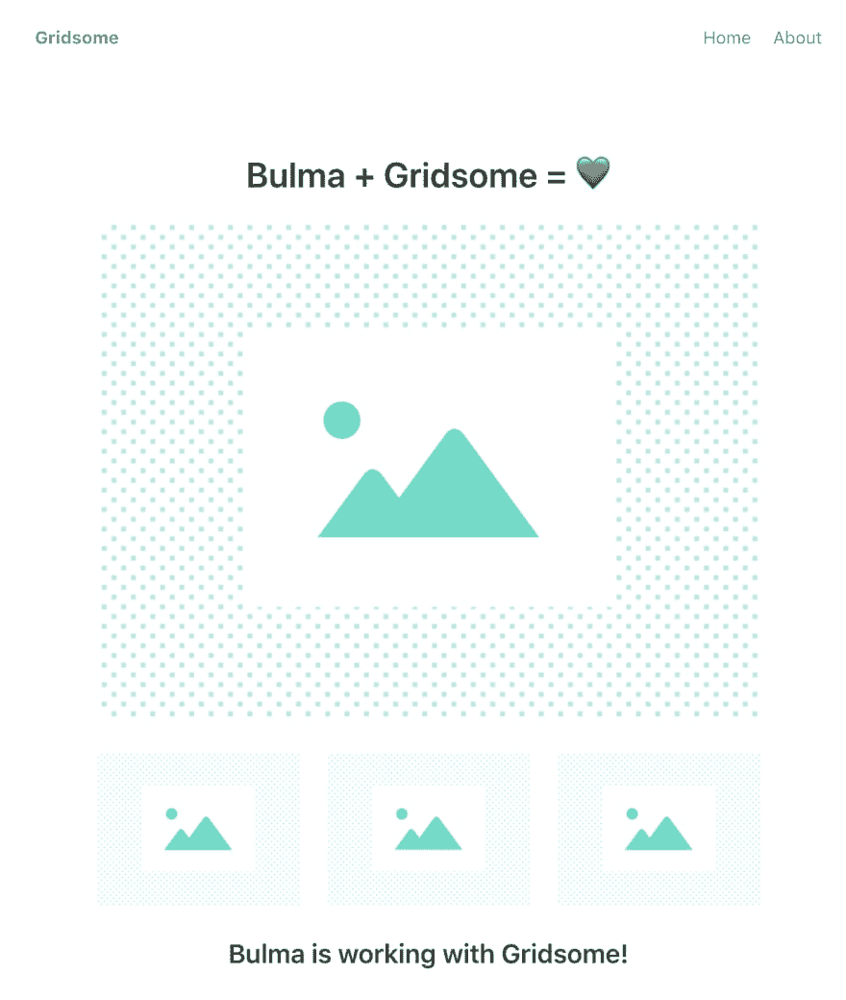

# 快速静态网站与网格和布尔玛在 5 分钟

> 原文：<https://dev.to/zooly/fast-static-site-with-gridsome-and-bulma-in-5-minutes-4md9>

Gridsome 是一个在 Vue.js 基础上开发的静态站点生成器。由于有了 T2 的 PRPL 模式和 T4 的 JAMstack，它可以快速构建静态站点。
如果 Gridsome 是 beta 版(现在是 *0.6.9* ，它已经有很多可用的插件了:

*   用于从 Headless CMS 获取数据的源插件
*   CSS 框架

目前，还没有在 Gridsome 上使用布尔玛的插件。

[](https://res.cloudinary.com/practicaldev/image/fetch/s--mC-jl9v1--/c_limit%2Cf_auto%2Cfl_progressive%2Cq_auto%2Cw_880/https://thepracticaldev.s3.amazonaws.com/i/lan72fmcwew2sqzquewg.png)

让我们看看如何将布尔玛风格添加到您的 Gridsome 项目中！

## 创建 Gridsome 项目

```
npx gridsome create gridsome-bulma 
```

<svg width="20px" height="20px" viewBox="0 0 24 24" class="highlight-action crayons-icon highlight-action--fullscreen-on"><title>Enter fullscreen mode</title></svg> <svg width="20px" height="20px" viewBox="0 0 24 24" class="highlight-action crayons-icon highlight-action--fullscreen-off"><title>Exit fullscreen mode</title></svg>

## 加布埃(bulma for vista)

将布尔玛风格添加到 Gridsome 项目的最简单的方法是安装 [Buefy](https://buefy.org) 作为一个依赖项。Buefy 是基于布尔玛的 Vue.js 项目的组件库。

```
npm install --save buefy 
```

<svg width="20px" height="20px" viewBox="0 0 24 24" class="highlight-action crayons-icon highlight-action--fullscreen-on"><title>Enter fullscreen mode</title></svg> <svg width="20px" height="20px" viewBox="0 0 24 24" class="highlight-action crayons-icon highlight-action--fullscreen-off"><title>Exit fullscreen mode</title></svg>

编辑 **src/main.js** :

```
import DefaultLayout from '~/layouts/Default.vue'

// import Buefy
import Buefy from 'buefy'
import 'buefy/dist/buefy.css' 

export default function (Vue, { router, head, isClient }) {
  // add Buefy to Vue project with use global method
  Vue.use(Buefy)
  Vue.component('Layout', DefaultLayout)
} 
```

<svg width="20px" height="20px" viewBox="0 0 24 24" class="highlight-action crayons-icon highlight-action--fullscreen-on"><title>Enter fullscreen mode</title></svg> <svg width="20px" height="20px" viewBox="0 0 24 24" class="highlight-action crayons-icon highlight-action--fullscreen-off"><title>Exit fullscreen mode</title></svg>

## 写一页

是时候自己试试了！

编辑 **src/pages/Index.vue** ，将所有内容替换为:

```
<template>
  <Layout>
    <div class="container is-fluid">
      <section class="section">
        <div class="container has-text-centered">
          <h2 class="title">Bulma + Gridsome = 💚</h2>
          <div class="block">
            <a href="#">
              
            </a>
          </div>
          <div class="columns is-mobile">
            <div class="column is-4">
              <a href="#">
                
              </a>
            </div>
            <div class="column is-4">
              <a href="#">
                
              </a>
            </div>
            <div class="column is-4">
              <a href="#">
                
              </a>
            </div>
          </div>
          <h4 class="title is-spaced is-4">Bulma is working with Gridsome!</h4>
        </div>
      </section>
    </div>
  </Layout>
</template> 
```

<svg width="20px" height="20px" viewBox="0 0 24 24" class="highlight-action crayons-icon highlight-action--fullscreen-on"><title>Enter fullscreen mode</title></svg> <svg width="20px" height="20px" viewBox="0 0 24 24" class="highlight-action crayons-icon highlight-action--fullscreen-off"><title>Exit fullscreen mode</title></svg>

## 启动开发服务器

```
npx gridsome develop 
```

<svg width="20px" height="20px" viewBox="0 0 24 24" class="highlight-action crayons-icon highlight-action--fullscreen-on"><title>Enter fullscreen mode</title></svg> <svg width="20px" height="20px" viewBox="0 0 24 24" class="highlight-action crayons-icon highlight-action--fullscreen-off"><title>Exit fullscreen mode</title></svg>

进入 [http://localhost:8080/](http://localhost:8080/) ，应该会看到这个页面:

[](https://res.cloudinary.com/practicaldev/image/fetch/s--ppE8kEOq--/c_limit%2Cf_auto%2Cfl_progressive%2Cq_auto%2Cw_880/https://thepracticaldev.s3.amazonaws.com/i/0t9yuqfm1tmgss7gnah6.png)

*这个模板已经由[布尔玛建造者](https://bulma.dev/)生成，感谢团队！*

# 很简单不是吗？

在 5 分钟内，你已经能够创建一个新的 Gridsome 项目，添加布尔玛风格，并获得第一个工作页面，太棒了！🔥

你试过 Gridsome +布尔玛吗？在评论区分享你的项目！