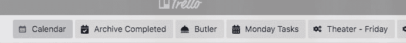
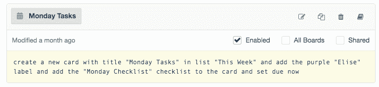
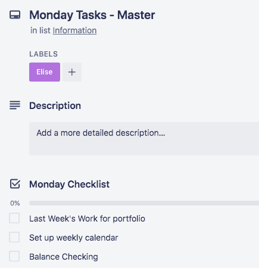
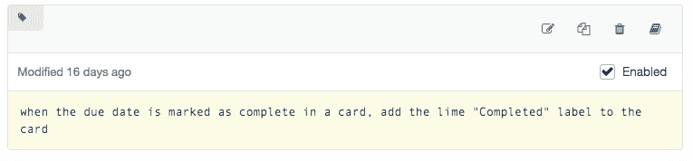
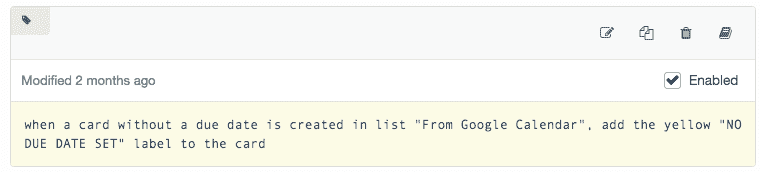
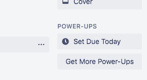
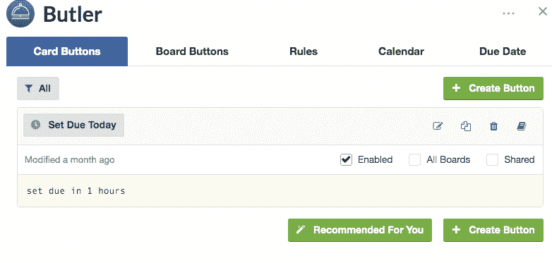

# 新的和改进的 Trello 项目符号日记帐工作流

> 原文:[https://dev . to/EGF/new-and-improved-trello-bullet-journal-workflow-1hki](https://dev.to/egf/new-and-improved-trello-bullet-journal-workflow-1hki)

前情提要"[Trello bullet journal workflow](https://dev.to/egf/trello-bullet-journal-workflow-4doh)"…

当我决定不再做纸质杂志时，我有一个使用 Trello 处理我的周刊的过程。

嗯，我已经使用这个过程一段时间了，并做了一些调整。最大的增加是自动加电。

我购买了 Trello Gold 订阅，它非常值得能够在一个板上使用多个电源。我目前在我的个人板上使用两个:日历和管家。

基于我之前的工作流程帖子，我发现我做了很多重复的动作，这些动作很乏味。巴特勒进来了。

### **板按钮**

 

<figcaption>棋盘按钮</figcaption>

电路板按钮是显示在电路板顶部的按钮，可以随时单击以完成任务。我设置的第一个是“**归档完成**”。在周一，当我设置我的一周时，我只需点击一个按钮就可以将我所有完成的卡片存档。

 

<figcaption>归档完成的卡片一键</figcaption>

我设置的其他几个按钮将创建一些不同的卡片，上面有我周一的任务和其他一些我几乎每周都要完成的任务。我为每一项任务都准备了一张“主卡”,其中包含了任务清单。在周一，我可以点击我的“**周一任务**”按钮，Butler 会复制主卡，并将其放入该周的相应列表中。我只是把这些万事达卡放在我的“信息列表”里

 

<figcaption>设置周一任务</figcaption>

 

<figcaption>主卡为【周一任务】</figcaption>

### 自动车

此外，我让 Butler 将任务标记为“完成”,并在到期日完成时应用某个标签。然后，这些卡很容易存档与我的存档按钮。

 

<figcaption>管家自动化完成任务</figcaption>

因为谷歌似乎不会导入有实际截止日期的任务，所以我会把没有截止日期的任务标上特定的标签，以便更容易找到和编辑。

 

<figcaption>对于没有截止日期的项目，添加标签</figcaption>

### 卡片按钮

另一种按钮是卡片按钮。这些按钮就出现在你的卡片上。

 

<figcaption>卡片按钮示例</figcaption>

现在我只有一个卡片按钮，它用于将卡片的到期日设置为“今天”这样，我就可以轻松地将到期日设置为“今天”，而不必通过日历选择器对话框。

 

<figcaption>卡片按钮为到期日</figcaption>

因此，仅仅这几个自动化就足以让我的周一安排变得容易得多。