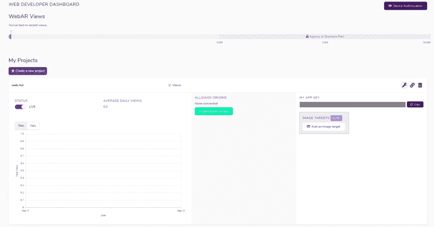
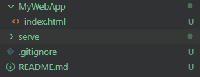
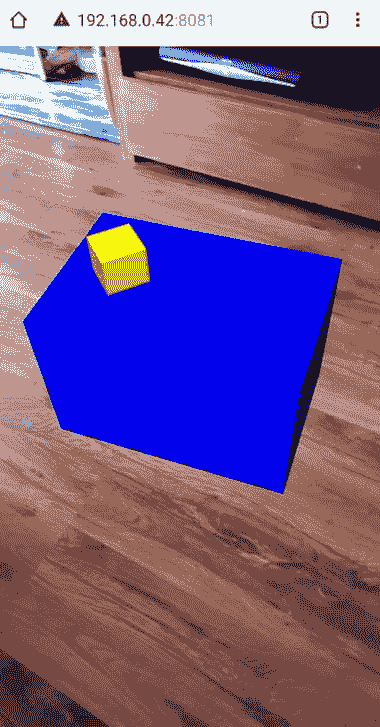

# 网络增强现实:第八墙教程

> 原文:[https://dev . to/bibby/ar-for-the-web-an-8-wall-tutorial-3be 7](https://dev.to/bibby/ar-for-the-web-an-8th-wall-tutorial-3be7)

# [](#ar-for-the-web)AR 为 Web

大家好，我是一名对 XR 技术非常感兴趣的开发人员，我认为如果用户不需要昂贵的手机或花哨的耳机来亲自体验 XR 将会很棒。在这组教程中，我将带你了解如何使用第八面墙和 A-Frame 创建你自己的增强现实应用，你可以直接在你的手机浏览器中运行！我会试着慢慢来，所以即使你没有什么经验，你也应该能跟上。

## [](#prerequisites)先决条件

*   我们需要 NPM 安装我们需要的软件包，以便运行我们的应用程序。[https://www.npmjs.com/get-npm](https://www.npmjs.com/get-npm)
*   一个文字编辑器，我个人偏好是 vs code[https://code.visualstudio.com/](https://code.visualstudio.com/)
*   第八面墙上的一个网站开发账户(对本教程来说，选择网站开发而不是 unity 很重要)[https://www.8thwall.com/](https://www.8thwall.com/)

## [](#lets-start-setting-up)让我们开始:设置

在我们开始之前，我将做一个说明，本教程将主要遵循第 8 墙快速入门文档，所以如果你需要另一个角度的头部。下面的教程将深入探讨。

首先让我们导航到我们的第 8 个墙壁控制台(【https://console.8thwall.com/web/】)并创建一个新项目。我们的控制台应该是这样的: [](https://res.cloudinary.com/practicaldev/image/fetch/s--tBoM2zDO--/c_limit%2Cf_auto%2Cfl_progressive%2Cq_auto%2Cw_880/https://i.imgur.com/oZxJ00U.png) 
接下来我们需要授权我们的手机作为开发者设备。为此，只需点击开发者控制台右上角的设备授权，并扫描二维码。

现在我们将下载一些脚本，让我们可以在本地运行未来的 AR 应用。我们可以为脚本克隆或下载以下 repo:

## [8 号墙](https://github.com/8thwall) / [网](https://github.com/8thwall/web)

### 第八墙网络项目和资源。

<article class="markdown-body entry-content container-lg" itemprop="text">

# 第八墙网

第八墙 Web:移动设备的 Web AR！

完全使用符合标准的 JavaScript 和 WebGL 构建，第八墙 Web 是第八墙同步本地化和地图绘制(SLAM)引擎的完整实现，针对移动浏览器上的实时 AR 进行了超级优化。功能包括 6 自由度跟踪，表面估计，面部效果，照明，世界点和点击测试。

* * *

# 资源

*   [入门指南](https://github.com/8thwall/web/tree/master/gettingstarted)

*   [文档](https://www.8thwall.com/docs/web/)

*   [第八墙网站](https://www.8thwall.com)

*   [本地服务项目](https://github.com/8thwall/web/tree/master/serve)—“服务”脚本将在您的开发计算机上运行本地 https 服务器。有助于第八墙网络项目的开发和测试。

# Web AR 示例

*   [A-Frame 示例](https://github.com/8thwall/web/tree/master/examples/aframe)(推荐开始)
*   [Babylon.js 示例](https://github.com/8thwall/web/tree/master/examples/babylonjs)
*   [three.js 示例](https://github.com/8thwall/web/tree/master/examples/threejs)
*   [摄像机管道示例](https://github.com/8thwall/web/tree/master/examples/camerapipeline)
*   [亚马逊苏美尔设置](https://github.com/8thwall/web/tree/master/gettingstarted/xrsumerian)

</article>

[View on GitHub](https://github.com/8thwall/web)

In this tutorial we'll just get the zip since we don't need all of the files.

Let's grab the serve folder from the zip, and set up an empty folder that we will serve our application from.

Inside our empty folder let's create a new HMTL file called index.html

下面是我的文件夹结构的样子:

[](https://res.cloudinary.com/practicaldev/image/fetch/s--DPuNu33F--/c_limit%2Cf_auto%2Cfl_progressive%2Cq_auto%2Cw_880/https://i.imgur.com/Y3G93vv.png)

在这个文件中，我们将导入脚本来启用我们的 A-Frame 和第八面墙内容。我们还将设置我们的应用程序密钥。我们的索引页面应该是这样的:

```
<!DOCTYPE html>
<html>
  <head>
    <meta charset="utf-8">
    <title>My First Web-AR App!</title>

    <!-- This is 8th Wall's version of A-Frame -->
    <script src="//cdn.8thwall.com/web/aframe/8frame-0.8.2.min.js"></script>

    <!-- This allows us some nice 8th wall AR extras such as the tap to recenter and a loading spinner -->
    <script src="//cdn.8thwall.com/web/xrextras/xrextras.js"></script>

    <!-- We need to replace the XXXXXXXX here with our AppKey -->
    <script async src="//apps.8thwall.com/xrweb?appKey=XXXXXXXX"></script>

  </head>

  <body>

  </body>

</html> 
```

我们需要导入 appkey，所以让我们回到 web 控制台。我们的应用程序密钥将位于项目面板的右侧。只需复制并粘贴这个键来替换我们的索引文件中的 x。

## [](#creating-our-content)创建我们的内容

为了包含我们的 AR 内容，我们将使用 A-Frame。这个 three.js 框架允许我们声明性地将 3d 对象添加到我们的场景中，并使用实体组件架构与它们进行交互。在我看来，使用 A-Frame 和使用 Unity 感觉很相似，并且允许快速原型化和开发。A-Frame 是由 Mozilla 创建的，文档可以在这里找到:[https://aframe.io/docs/0.9.0/introduction/](https://aframe.io/docs/0.9.0/introduction/)。

让我们从向应用程序添加第一个**实体**开始；a 场景。我们将把它插入到我们的 body 标签中，就像普通的 HTML 一样。你可能会注意到我们在这个标签上有一些属性，这些是自定义的第八面墙**组件**，它们的名称大多不言自明。

```
<body>

    <a-scene
        xrweb
        xrextras-tap-recenter
        xrextras-almost-there
        xrextras-loading
        xrextras-runtime-error>

    </a-scene>

</body> 
```

现在我们有了场景设置，我们可以在应用程序中插入更多的实体。嵌套在我们的场景中，让我们添加一个摄像机和一些灯光，这样我们就可以看到我们在做什么。

```
<body>

    <a-scene
        xrweb
        xrextras-tap-recenter
        xrextras-almost-there
        xrextras-loading
        xrextras-runtime-error>

        <a-camera position="0 8 8"></a-camera>

        <a-entity
            light="type: directional;
                castShadow: true;
                intensity: 0.8;
                shadowCameraTop: 7;
                shadowMapHeight: 1024;
                shadowMapWidth: 1024;"
            position="1 4.3 2.5">
        </a-entity>

        <a-entity
            light="type: directional; castShadow: false; intensity: 0.5;"
            position="-0.8 3 1.85">
        </a-entity>

        <a-light type="ambient" intensity="0.2"></a-light>

    </a-scene>

</body> 
```

首先我们给场景添加了`<a-camera>`，这是 A-Frame 提供的大量原始**实体**中的一个(更多信息请点击[)。我们的摄像机也有一个位置组件**我们可以向其提供参数。在使用 A-Frame 时，您将利用许多组件，它们为我们的**实体**提供许多功能，例如；位置，规模，材料等等。没有我们的组件，我们的实体将一无是处！然后我们添加了更多的实体到我们的场景中，每一个都有灯光和位置组件和一些参数。希望现在你已经有了运行 A-Frame 的**实体** **组件**系统的一般要点，这些是我们可以用来构建任何东西的构建模块！

最后我们增加了一个`<a-light>`另一个 A 帧原语，我相信你能猜到这个是做什么的！

好的。现在让我们给我们的场景添加一些我们可以看到的东西，我们从简单的开始，也许用一个盒子。插入到我们的光实体下面:**](https://aframe.io/docs/0.9.0/introduction/html-and-primitives.html#primitives) 

```
<a-box 
    color="blue" 
    depth="2" 
    height="2" 
    width="3"
    position="0 0 2">
</a-box>

<a-entity
    geometry="primitive: box; width: 1; height: 1; depth: 1"
    material="color: yellow"
    position="-0.8 1.2 2"
    rotation="0 45 0"
    scale="0.5 0.5 0.5">
</a-entity> 
```

所以我们用两种不同的方式加了两个框！

第一个使用了原始实体`<a-box>`，我们给了它一些组件来改变外观，特别是位置。A 形框架中的位置控制类似于 Unity 的 Vector3 结构。我们可以给它 3 个参数；三维空间中物体的 x，y，z 坐标。

接下来我们选择了基本实体选项，并添加了一个几何组件来显示我们的盒子。我们还在这里添加了一些其他组件，如缩放和旋转。要获得所有内置组件的列表，最好查看 [A-Frame 文档！](https://aframe.io/docs/0.9.0/core/component.html)

我们的整个索引文件应该是这样的:

```
<!DOCTYPE html>
<html>
  <head>
    <meta charset="utf-8">
    <title>My First Web-AR App!</title>

    <!-- This is 8th Wall's version of Aframe -->
    <script src="//cdn.8thwall.com/web/aframe/8frame-0.8.2.min.js"></script>

    <!-- This allows us some nice 8th wall AR extras such as the tap to recenter and a loading spinner -->
    <script src="//cdn.8thwall.com/web/xrextras/xrextras.js"></script>

    <!-- We need to replace the XXXXXXXX here with our AppKey -->
    <script async src="//apps.8thwall.com/xrweb?appKey=76ZXfqUXU4WjzcF3j3COyqxdgylAbcbSnHqyfHXo7IWmeJWSgkxOveZy93cPbQERsXsG5C"></script>

  </head>

  <body>

    <a-scene
      xrweb
      xrextras-tap-recenter
      xrextras-almost-there
      xrextras-loading
      xrextras-runtime-error>

        <a-camera position="0 8 8"></a-camera>

        <a-entity
        light="type: directional;
            castShadow: true;
            intensity: 0.8;
            shadowCameraTop: 7;
            shadowMapHeight: 1024;
            shadowMapWidth: 1024;"
        position="1 4.3 2.5">
        </a-entity>

        <a-entity
        light="type: directional; castShadow: false; intensity: 0.5;"
        position="-0.8 3 1.85">
        </a-entity>

        <a-light type="ambient" intensity="0.2"></a-light>

        <a-box 
        color="blue" 
        depth="2" 
        height="2" 
        width="3"
        position="0 0 2">
        </a-box>

        <a-entity
        geometry="primitive: box; width: 1; height: 1; depth: 1"
        material="color: yellow"
        position="-0.8 1.2 2"
        rotation="0 45 0"
        scale="0.5 0.5 0.5">
        </a-entity>

    </a-scene>

  </body>

</html> 
```

## [](#running-our-app)运行我们的应用

为了在本地运行我们的应用程序，我们将使用之前下载的 serve 脚本。

*   打开终端窗口并导航到您的项目文件夹。
*   导航到服务文件夹:

```
cd serve 
```

*   安装所需的节点模块:

```
npm install 
```

*   返回到项目文件夹:

```
cd .. 
```

*   运行服务脚本:

```
Windows : 
    serve\bin\serve.bat -d {MyProjectName}
MacOS :
    ./serve/bin/serve -d ./{MyProjectName} 
```

*   扫描手机上的二维码，越过安全警告(这是我们的应用程序，所以没问题)。您还必须将相机权限授予浏览器。

您现在应该能够看到您的应用程序启动并运行了！

[T2】](https://res.cloudinary.com/practicaldev/image/fetch/s--yGmt54GW--/c_limit%2Cf_auto%2Cfl_progressive%2Cq_auto%2Cw_880/https://i.imgur.com/uOl6GTo.png%3F1)

它可能看起来不怎么样，但我们已经创建了我们的第一个 AR Web 应用程序！所有伟大的事情都必须从某处开始！

我再一次建议看一看文档，看看我们还可以用什么样的图元在我们的场景中制作一些很酷的东西。

我希望你喜欢第八面墙和 a 字架的这个造型。如果有兴趣，我将继续这个系列，并涵盖进口定制模型(没有更多的盒子！)以及使用一些动画和交互。

最终代码在这里:

## [mattbibby 95](https://github.com/mattbibby95)/[ARWebTut](https://github.com/mattbibby95/ARWebTut)

### 第八面墙+ Aframe 教程

<article class="markdown-body entry-content container-lg" itemprop="text">

# 这是我的第八个关于开发的 wall web 应用程序教程中的代码！

</article>

[View on GitHub](https://github.com/mattbibby95/ARWebTut)