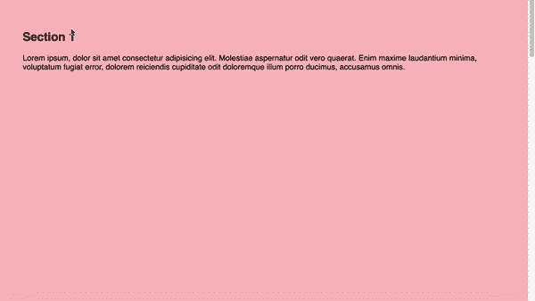

# 使用位置粘性的幻灯片堆叠效果

> 原文：<https://dev.to/vinceumo/slide-stacking-effect-using-position-sticky-91f>

[](https://res.cloudinary.com/practicaldev/image/fetch/s--LptKRPK3--/c_limit%2Cf_auto%2Cfl_progressive%2Cq_66%2Cw_880/https://vinceumo.github.io/devNotes/scroll-gif.gif)

最近，我正在寻找创造一个滚动幻灯片(卡片)堆叠效果。我能找到的关于这个效果的最接近的资源是 Sanjeev Yadav 的[卡叠:滚动效果】。我想看看我是否可以只用 CSS 重新创建一个类似的效果。](https://medium.com/@sanjeevy133/card-stack-scroll-effect-486cc3b55312)

## 基本效果同位置粘性

位置粘滞允许相对于其父元素定位类似位置固定的元素，直到它到达父元素的边界。

> 粘性定位可以被认为是相对定位和固定定位的混合。粘性定位的元素被视为相对定位的，直到它越过指定的阈值，此时它被视为固定的，直到它到达其父元素的边界。
> 
> [MDN -粘性定位](https://developer.mozilla.org/en-US/docs/Web/CSS/position#Sticky_positioning)

我们可以使用 position sticky 将每张幻灯片粘贴在父幻灯片的顶部，并有一个固定的高度。

CSS:

```
.stacking-slide {
    height: 100vh;
    width: 100%;
    position: sticky;
    top: 0;

//   Not needed if 100vh
//   &:nth-last-child(1) {
//      height: 100vh;
//   }
} 
```

HTML:

```
<section class="stacking-slide">
    <h2>Section 1</h2>
</section>
<section class="stacking-slide">
    <h2>Section 2</h2>
</section>
<section class="stacking-slide">
    <h2>Section 3</h2>
</section>
<section class="stacking-slide">
    <h2>Section 4</h2>
</section>
<section class="stacking-slide">
    <h2>Section 5</h2>
</section> 
```

[https://codepen.io/vinceumo/embed/KKPoVGL/?height=600&default-tab=result&embed-version=2](https://codepen.io/vinceumo/embed/KKPoVGL/?height=600&default-tab=result&embed-version=2)

### 支持

Position sticky 有很大的支持([我可以用](http://caniuse.com/#feat=css-sticky))，但是如果你需要支持老的浏览器你可以用 [polyfill](https://github.com/wilddeer/stickyfill/) 。

## 垂直滚动捕捉

CSS 滚动捕捉允许我们在滚动后将每张幻灯片很好地放置在视窗的顶部。

> CSS Scroll Snap 是 CSS 的一个模块，它引入了滚动对齐位置，这些位置强制滚动容器的 scrollport 在滚动操作完成后可能结束的滚动位置。
> 
> [MDN - CSS 滚动捕捉](https://developer.mozilla.org/en-US/docs/Web/CSS/CSS_Scroll_Snap)

为了使用 scroll snap，我们将把我们的部分包装成`.vertical-scroll-snap`。这个元素将有一个 100vh 和`overflow-y: scroll`的固定高度，这样用户可以在各部分之间滚动。

下一步，我们将研究滚动捕捉。首先我们要去片场`scroll-snap-type` ( [MDN](https://developer.mozilla.org/en-US/docs/Web/CSS/scroll-snap-type) )。此属性定义滚动时如何严格执行对齐点。我们将它设置为`y mandatory`。`y`表示捕捉位置仅在其垂直轴上。`mandatory`如果当前没有滚动，滚动容器将停留在部分的捕捉点上。

然后我们需要告诉我们的部分哪个部分需要与容器对齐。我们将使用值为`start`的`scroll-snap-align` ( [CSS 技巧](https://css-tricks.com/almanac/properties/s/scroll-snap-align/))。

HTML:

```
<div class="vertical-scroll-snap">
  <section class="stacking-slide">
    <h2>Section 1</h2>
  </section>
  <!-- ... -->
</div> 
```

SCSS:

```
.vertical-scroll-snap {
    overflow-y: scroll;
    scroll-snap-type: y mandatory;
    max-height: 100vh;
}

.stacking-slide {
    scroll-snap-align: start;
    // ...
} 
```

[https://codepen.io/vinceumo/embed/aboYLBW/?height=600&default-tab=result&embed-version=2](https://codepen.io/vinceumo/embed/aboYLBW/?height=600&default-tab=result&embed-version=2)

### 支持

CSS Scroll snap 有很好的支持([我能用](http://caniuse.com/#feat=css-snappoints)吗)，如果你需要支持老的浏览器你可以用 [polyfill](https://www.npmjs.com/package/css-scroll-snap-polyfill) 。

## 使用交叉点观察器 API 添加一些漂亮的过渡。

交叉点观察器 API 允许我们检测元素何时进入视口。当这个元素进入或离开视区时，我们可以触发一个回调函数。

> 交叉点观察器 API 提供了一种异步观察目标元素与祖先元素或顶级文档的视口的交叉点变化的方法。
> 
> [MDN -交叉点观察器 API](https://developer.mozilla.org/en-US/docs/Web/API/Intersection_Observer_API)

在下面的例子中，当一个`.stacking-slide`进入视口的 10%时，我们添加了类`.is-intersecting`。当幻灯片离开这个类时，我们会删除它。我们现在可以使用 CSS 添加一些漂亮的过渡。

JS:

```
const sectionEls = document.querySelectorAll(".stacking-slide");

const options = {
  rootMargin: "-10% 0% -10% 0%"
};

const observer = new IntersectionObserver(entries => {
  entries.forEach(function(entry) {
    if (entry.isIntersecting) {
      entry.target.classList.add("is-intersecting");
    } else {
      entry.target.classList.remove("is-intersecting");
    }
  });
}, options);

sectionEls.forEach(el => observer.observe(el)); 
```

[https://codepen.io/vinceumo/embed/WNeJRZo/?height=600&default-tab=result&embed-version=2](https://codepen.io/vinceumo/embed/WNeJRZo/?height=600&default-tab=result&embed-version=2)

### 支持

交叉点观察器 API 有很好的支持([我可以用](http://caniuse.com/#feat=intersectionobserver))，如果你需要支持老的浏览器你可以用一个 [polyfill](https://github.com/w3c/IntersectionObserver/tree/master/polyfill) 。

* * *

感谢阅读，希望你喜欢这篇小文章。

*   [在 twitter 上关注我](https://twitter.com/vince_umo)
*   [在 Github 上关注我](https://github.com/vinceumo)
*   [跟我一起去](https://dev.to/vinceumo)