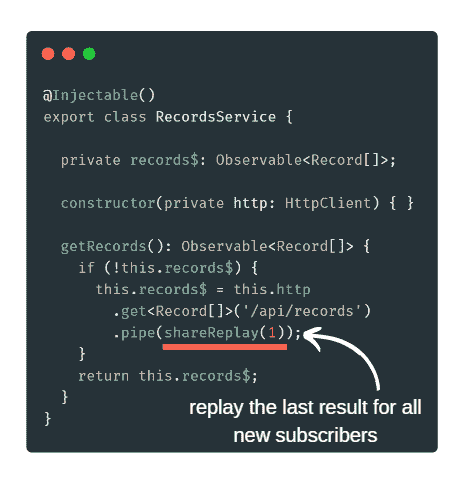

# 如何在 Angular 中缓存 HTTP 请求

> 原文:[https://dev . to/angular/how-to-cache-http-requests-in-angular-5c8i](https://dev.to/angular/how-to-cache-http-requests-in-angular-5c8i)

又到了**角识丸**的时候了！💊
只需 10 秒钟就能学会新东西🔥
比如早上服用维生素😃

下面的代码展示了如何在 Angular 中缓存 HTTP 请求！首先，我们只需要执行一个常规的 HTTP 查询(例如。get)并通过 **shareReplay** 操作符来传输流！这将初始流转换为 ReplaySubject！换句话说，新订阅不会执行其他 HTTP 请求，但会使用缓存的值😎

[T2】](https://res.cloudinary.com/practicaldev/image/fetch/s--xkTezObz--/c_limit%2Cf_auto%2Cfl_progressive%2Cq_auto%2Cw_880/https://thepracticaldev.s3.amazonaws.com/i/lt7tztkmqjcto71iwruc.png)

如果你想把这种知识药丸直接发到你的邮箱，请在[https://angular-academy.com/blog/](https://angular-academy.com/blog/)订阅。我将定期发送它们！记住，学习新东西只需要 10 秒钟！