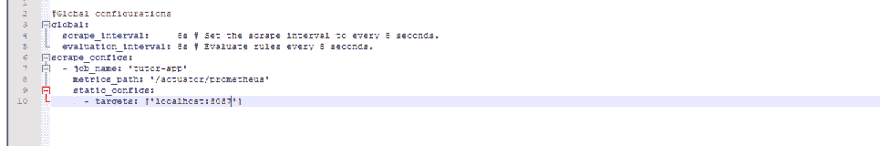
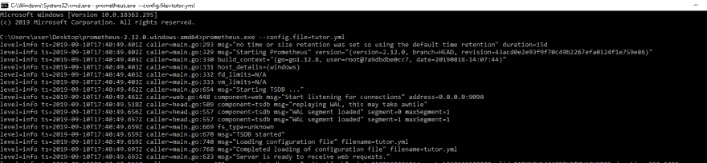
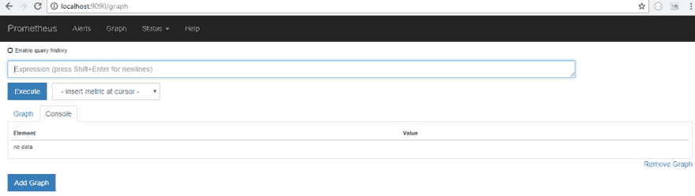
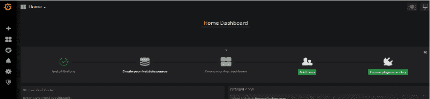
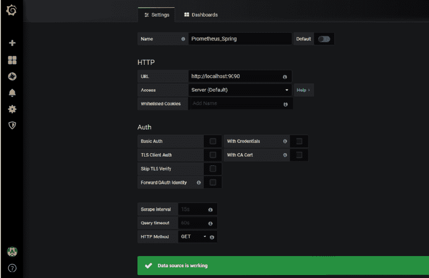
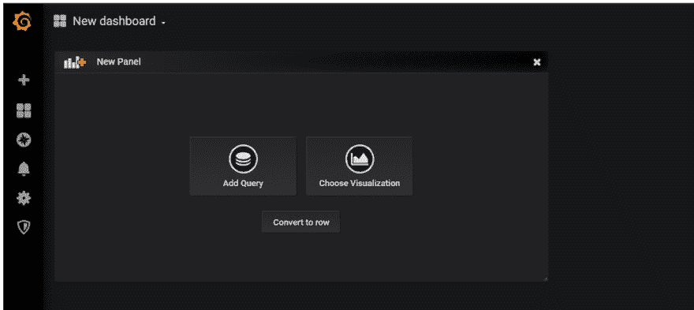
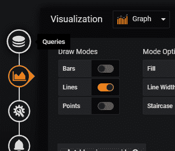
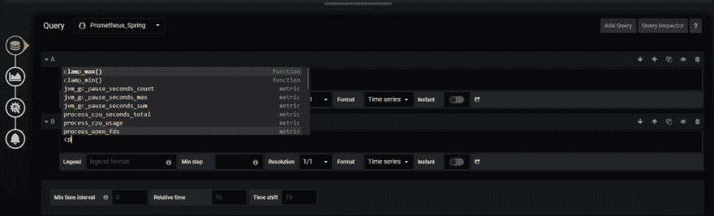
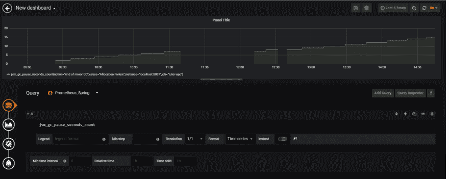

# PROMETHEUS 和 GRAFANA 使用弹簧靴致动器监控 API

> 原文：<https://dev.to/lynn/monitoring-an-api-with-prometheus-and-grafana-using-spring-boot-actuator-46hi>

本教程提供了如何使用可视化工具 Grafana 监控本地系统上的 API 的完整指南。

那时，我们将把 Spring Boot 致动器集成到普罗米修斯上，在格拉夫纳上观察和监控

Spring Boot 执行器为我们的 API 生成指标，prometheus 查询并绑定到 grafana，在 grafana 中进行可视化和监控。

**SPRING BOOT ACTUATOR** 提供生产就绪功能，如指标收集、HTTP 跟踪等。这些功能可通过 JMX 或 HTTP 端点访问，并可与 Prometheus、Graphite 等外部应用程序监控系统集成。[阅读更多](https://docs.spring.io/spring-boot/docs/current/reference/html/production-ready-endpoints.html)

将 Spring Boot 执行器集成到我们的应用中。

当 micrometer-registry-prometheus 依赖关系在类路径上可用时，prometheus 端点由 Spring Boot 公开。

点击查看如何将弹簧靴致动器集成到您的应用中

我已经将 spring boot actuator 集成到我在本地系统上创建的一个简单 Api 中。

你可以从这个 [GitHub 库](https://github.com/Lyndaar/Grafana-Monitoring)获得我们用于普罗米修斯安装的应用程序。

**-** 在本地 IDE 上运行应用程序。
**-** 然后配置 Prometheus 查询应用并得到结果。

prometheus 端点以 Prometheus 服务器可以抓取的格式公开指标数据。您可以通过导航到 prometheus 端点([http://localhost:8080/actuator/Prometheus](http://localhost:8080/actuator/prometheus))来查看公开的度量数据。

**PROMETHEUS** 是一个时序数据库，也是一个开源的监控系统。[阅读更多](https://prometheus.io/)

**下载并配置普罗米修斯**

**-** 首先下载[Prometheus](https://prometheus.io/download/)
T5】-解压到您选择的目录
-**-**要配置您要监控的应用程序，在 Prometheus 文件夹中，
您可以使用示例 prometheus.yml 文件，也可以新建。yml
文件。

```
 *Below is the configuration of a new file i have created* 
```

[](https://res.cloudinary.com/practicaldev/image/fetch/s--_o3labN1--/c_limit%2Cf_auto%2Cfl_progressive%2Cq_auto%2Cw_880/https://thepracticaldev.s3.amazonaws.com/i/z9343huujdrlv8971xhi.png)

-使用命令 prometheus.exe-配置.文件=YAML 文件路径运行普罗米修斯服务器。

**举例**:C:\ Users \ user \ Desktop \ Prometheus-2 . 12 . 0 . windowsamd 64>prometheus.exe-config . file = tutor . yml
[](https://res.cloudinary.com/practicaldev/image/fetch/s--GbueGWUW--/c_limit%2Cf_auto%2Cfl_progressive%2Cq_auto%2Cw_880/https://thepracticaldev.s3.amazonaws.com/i/61gp8mhdi5d7a3xdiuev.png)

浏览网址 [http://localhost:9090/](http://localhost:9090/) 测试普罗米修斯服务器。如果您看到下面的页面，Prometheus 服务器运行良好，并根据您在启动服务器时使用 tutor.yml 所做的配置收集指标。
T3T5】

GRAFANA 是一款用于可视化、监控和分析数据性能的开源软件。它有非常漂亮的视觉表现，并支持不同的数据流程。[阅读更多](https://grafana.com/)

**下载并配置 Grafana**

**-** 下载[Grafana](https://grafana.com/grafana/download)
T5】-解压文件到所需目录
-**-**在解压后的 Grafana 文件夹中，打开“conf”目录，在“conf”中即可进行配置。ini”文件，为了避免复杂化，我们将继续使用默认设置，将“admin/admin”配置为用户名和密码。

Grafana 文件夹的“bin”目录中的 **-** 。通过执行 grafana-server.exe 来运行服务器

**-** 现在您可以在您的
浏览器中输入 [http://localhost:3000](http://localhost:3000) 登录 Grafana。
记住用户名和密码是“admin/admin”。您可以随时使用。我们之前讨论过的 ini 文件。

[](https://res.cloudinary.com/practicaldev/image/fetch/s--Nw5RPGl---/c_limit%2Cf_auto%2Cfl_progressive%2Cq_auto%2Cw_880/https://thepracticaldev.s3.amazonaws.com/i/zlw99ekjtolidtgneaq8.png)

**-** 在首页点击“创建你的第一个数据源”。这将打开一个添加数据源的页面。

[](https://res.cloudinary.com/practicaldev/image/fetch/s--Nn3g7x-l--/c_limit%2Cf_auto%2Cfl_progressive%2Cq_auto%2Cw_880/https://thepracticaldev.s3.amazonaws.com/i/7b91p6tup2z6jti9e9jz.png)

**-** 选择普罗米修斯作为数据源
T3】-给数据源取一个合适的名字。
**-** 选择普罗米修斯作为“类型”。
**-**URL 应该是“ [http://localhost:9090](http://localhost:9090) ”，因为我们已经让 Prometheus 在端口 9090 上运行
。

**-** 点击“保存&测试”
如果 Grafana 能够用所提供的详细信息连接到 Prometheus，那么你会得到一条消息说“数据源正在工作”如果出现任何错误，请检查您的值。
[T6】](https://res.cloudinary.com/practicaldev/image/fetch/s--ibnpI_jp--/c_limit%2Cf_auto%2Cfl_progressive%2Cq_auto%2Cw_880/https://thepracticaldev.s3.amazonaws.com/i/otyzra6if1u54p7qgsvb.png)

**构建您的 Grafana 仪表盘**
**-** 您可以创建自己的仪表盘或导入仪表盘
**-** 单击主屏幕左侧菜单上的“+”选项创建或导入仪表盘。

*我正在创建一个新的仪表板*
[](https://res.cloudinary.com/practicaldev/image/fetch/s--jgytnWp_--/c_limit%2Cf_auto%2Cfl_progressive%2Cq_auto%2Cw_880/https://thepracticaldev.s3.amazonaws.com/i/19vz1fuwkkpwzc2knlwn.png)

**-** 点击选择可视化并选择
-**-**在左侧菜单选项卡中选择【查询】添加查询
[](https://res.cloudinary.com/practicaldev/image/fetch/s--nEz0wn0r--/c_limit%2Cf_auto%2Cfl_progressive%2Cq_auto%2Cw_880/https://thepracticaldev.s3.amazonaws.com/i/9etfgot2j96g103tj7yj.png)

**-** 查询
[](https://res.cloudinary.com/practicaldev/image/fetch/s--_Du_VAXF--/c_limit%2Cf_auto%2Cfl_progressive%2Cq_auto%2Cw_880/https://thepracticaldev.s3.amazonaws.com/i/xsc8471zdam5dq0eyl32.png)

**-** 我们的指标将填充到图表中

[](https://res.cloudinary.com/practicaldev/image/fetch/s--xEWjTaSR--/c_limit%2Cf_auto%2Cfl_progressive%2Cq_auto%2Cw_880/https://thepracticaldev.s3.amazonaws.com/i/7gobsvhgdfjukrwcs0ln.png) 
*牛逼！我们现在可以可视化并实时监控*" JVM _ GC _ pause _ seconds _ count "*的指标。*

现在，您可以向仪表板添加更多查询。

**结论**
API 监控对于了解性能、可用性和功能正确性非常重要。在 Grafana 上创建仪表板有助于我们快速解决错误、检查应用程序的健康状况、应用程序是否正确响应以及服务是否随时可用等。
使用 spring boot actuator 生成和定制您的指标，使用 Prometheus 查询这些指标并在 Grafana 上可视化它们，这使得监控应用程序变得非常容易。

如果你对这篇文章有任何问题或贡献，你可以发送[电子邮件](//uzosikelynda20@gmail.com)或在 Twitter [上发送**DM**@ arh _ darh](https://twitter.com/arh_darh)在下面随意评论。

**谢谢！！！**